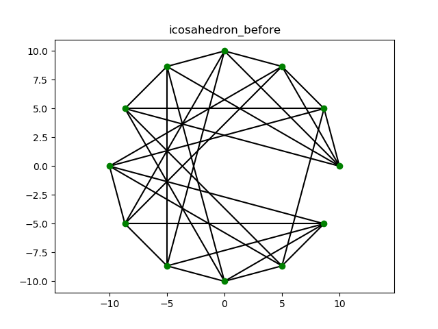
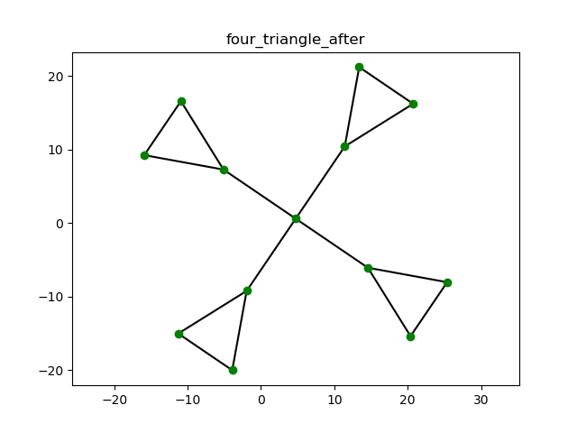
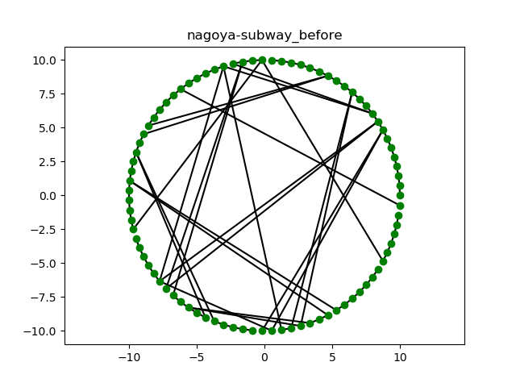
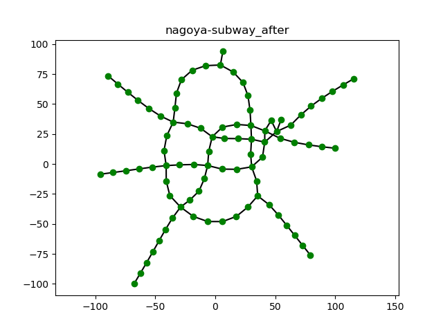

#力学モデルを用いたグラフ描画

グラフを描画する際、頂点の配置をどのようにするかということは視覚的な理解に大きな影響を及ぼす。
本記事では、グラフの頂点と辺に仮想的な力を割り当て、力学的エネルギーの低い安定状態を探して
グラフのレイアウトを求める**kamada-kawai**法を用いる。

##力学的エネルギーの定義

まず、グラフの全頂点がばねで結ばれていると仮定すると、系全体の力学的エネルギーは次で表される。
$$E = \frac{1}{2} \sum_{\substack{0 \leq i \leq n - 1\\0 \leq j \leq n - 1}} \frac{k_{i,j}}{2} \left(\sqrt{\left(P_{i,0} - P_{j,0}\right)^{2} + \left(P_{i,1} - P_{j,1}\right)^{2}} - l_{i,j}\right)^{2}$$
ただし、$P_{i,d}$はi番目の頂点の座標の第$j$成分、$k_{i,j},l_{i,j}$はそれぞれ頂点$i$と頂点$j$の間のばね定数、自然長とする。

$k_{i,j},l_{i,j}$は、$d_{i,j}$を頂点$i$と頂点$j$を結ぶ最短経路の長さとして
$$k_{i,j} = K / d_{i,j}^2 (i \neq j) \ \  0(i = j)$$
$$l_{i,j} = L \times d_{i,j}$$
で定める($K,L$は定数)。

$d_{i,j}$は**Warshall-Floyd**のアルゴリズムにより求めることができる。

##エネルギーの最小化

例として、頂点数がn,次元が2であるときを考える。
力学的エネルギーが最小になる点では、$gradE = \vec 0$が成り立つ。すなわち、変数が$2 n$個ある$2 n$本の非線型連立方程式を解けばよいのだが、これを解析的に解くのは難しい。
そこで、次のような方法で近似解を求める。

1:まず、特定の頂点1つに着目し、他の頂点の位置を固定する。

2:そして、Newton-Raphson法により選んだ頂点の座標について力学的エネルギー$E$の最小化を行う。

3:着目する頂点を変えて1,2を繰り返す。

4:$\|gradE\|$が十分小さくなったら終了、その時の座標の値を解とする。

以下で、その具体的な方法について述べる。

##近似解の導出

選んだ頂点をmとし、その座標を$P_m = \left(\begin{matrix}x_{0} & x_{1}\end{matrix}\right)$とする。つまり$\left(\begin{matrix}P_{m,0} & P_{m,1}\end{matrix}\right) = \left(\begin{matrix}x_{0} & x_{1}\end{matrix}\right)$である。

このときNewton-Raphson法による反復式は、変数を$\left(\begin{matrix}x_{0} & x_{1}\end{matrix}\right)$としたときのEの1次導関数を$J_m$、2次導関数を$H_m$として
$$H_m \left(\begin{matrix}\Delta x_{0}\\\Delta x_{1}\end{matrix}\right) = -J_m$$
により表される。
これは2元連立1次方程式となり容易に解けて変位$\Delta P_i = \left(\begin{matrix}\Delta x_{0} & \Delta x_{1}\end{matrix}\right)$が求められるので、$P_i = P_i + \Delta P_i$により座標を更新する。
以上を繰り返し、変位が十分小さくなったら操作を終了する。

例えば、$m=0$だとすると、反復式は
$$\left(\begin{matrix}\sum_{i=1}^{n} \left(1 - \frac{l_{i,0}}{\sqrt{P_{i,0}^{2} - 2 P_{i,0} x_{0} + P_{i,1}^{2} - 2 P_{i,1} x_{1} + x_{0}^{2} + x_{1}^{2}}} + \frac{P_{i,0}^{2} l_{i,0}}{\left(P_{i,0}^{2} - 2 P_{i,0} x_{0} + P_{i,1}^{2} - 2 P_{i,1} x_{1} + x_{0}^{2} + x_{1}^{2}\right)^{\frac{3}{2}}} - \frac{2 P_{i,0} l_{i,0} x_{0}}{\left(P_{i,0}^{2} - 2 P_{i,0} x_{0} + P_{i,1}^{2} - 2 P_{i,1} x_{1} + x_{0}^{2} + x_{1}^{2}\right)^{\frac{3}{2}}} + \frac{l_{i,0} x_{0}^{2}}{\left(P_{i,0}^{2} - 2 P_{i,0} x_{0} + P_{i,1}^{2} - 2 P_{i,1} x_{1} + x_{0}^{2} + x_{1}^{2}\right)^{\frac{3}{2}}}\right) k_{i,0} & \sum_{i=1}^{n} \left(\frac{P_{i,0} P_{i,1} l_{i,0}}{\left(P_{i,0}^{2} - 2 P_{i,0} x_{0} + P_{i,1}^{2} - 2 P_{i,1} x_{1} + x_{0}^{2} + x_{1}^{2}\right)^{\frac{3}{2}}} - \frac{P_{i,0} l_{i,0} x_{1}}{\left(P_{i,0}^{2} - 2 P_{i,0} x_{0} + P_{i,1}^{2} - 2 P_{i,1} x_{1} + x_{0}^{2} + x_{1}^{2}\right)^{\frac{3}{2}}} - \frac{P_{i,1} l_{i,0} x_{0}}{\left(P_{i,0}^{2} - 2 P_{i,0} x_{0} + P_{i,1}^{2} - 2 P_{i,1} x_{1} + x_{0}^{2} + x_{1}^{2}\right)^{\frac{3}{2}}} + \frac{l_{i,0} x_{0} x_{1}}{\left(P_{i,0}^{2} - 2 P_{i,0} x_{0} + P_{i,1}^{2} - 2 P_{i,1} x_{1} + x_{0}^{2} + x_{1}^{2}\right)^{\frac{3}{2}}}\right) k_{i,0}\\\sum_{i=1}^{n} \left(\frac{P_{i,0} P_{i,1} l_{i,0}}{\left(P_{i,0}^{2} - 2 P_{i,0} x_{0} + P_{i,1}^{2} - 2 P_{i,1} x_{1} + x_{0}^{2} + x_{1}^{2}\right)^{\frac{3}{2}}} - \frac{P_{i,0} l_{i,0} x_{1}}{\left(P_{i,0}^{2} - 2 P_{i,0} x_{0} + P_{i,1}^{2} - 2 P_{i,1} x_{1} + x_{0}^{2} + x_{1}^{2}\right)^{\frac{3}{2}}} - \frac{P_{i,1} l_{i,0} x_{0}}{\left(P_{i,0}^{2} - 2 P_{i,0} x_{0} + P_{i,1}^{2} - 2 P_{i,1} x_{1} + x_{0}^{2} + x_{1}^{2}\right)^{\frac{3}{2}}} + \frac{l_{i,0} x_{0} x_{1}}{\left(P_{i,0}^{2} - 2 P_{i,0} x_{0} + P_{i,1}^{2} - 2 P_{i,1} x_{1} + x_{0}^{2} + x_{1}^{2}\right)^{\frac{3}{2}}}\right) k_{i,0} & \sum_{i=1}^{n} \left(1 - \frac{l_{i,0}}{\sqrt{P_{i,0}^{2} - 2 P_{i,0} x_{0} + P_{i,1}^{2} - 2 P_{i,1} x_{1} + x_{0}^{2} + x_{1}^{2}}} + \frac{P_{i,1}^{2} l_{i,0}}{\left(P_{i,0}^{2} - 2 P_{i,0} x_{0} + P_{i,1}^{2} - 2 P_{i,1} x_{1} + x_{0}^{2} + x_{1}^{2}\right)^{\frac{3}{2}}} - \frac{2 P_{i,1} l_{i,0} x_{1}}{\left(P_{i,0}^{2} - 2 P_{i,0} x_{0} + P_{i,1}^{2} - 2 P_{i,1} x_{1} + x_{0}^{2} + x_{1}^{2}\right)^{\frac{3}{2}}} + \frac{l_{i,0} x_{1}^{2}}{\left(P_{i,0}^{2} - 2 P_{i,0} x_{0} + P_{i,1}^{2} - 2 P_{i,1} x_{1} + x_{0}^{2} + x_{1}^{2}\right)^{\frac{3}{2}}}\right) k_{i,0}\end{matrix}\right)\left(\begin{matrix}\Delta x_{0}\\\Delta x_{1}\end{matrix}\right) = -\left(\begin{matrix}\sum_{i=1}^{n} \left(- P_{i,0} + x_{0} + \frac{P_{i,0} l_{i,0}}{\sqrt{P_{i,0}^{2} - 2 P_{i,0} x_{0} + P_{i,1}^{2} - 2 P_{i,1} x_{1} + x_{0}^{2} + x_{1}^{2}}} - \frac{l_{i,0} x_{0}}{\sqrt{P_{i,0}^{2} - 2 P_{i,0} x_{0} + P_{i,1}^{2} - 2 P_{i,1} x_{1} + x_{0}^{2} + x_{1}^{2}}}\right) k_{i,0}\\\sum_{i=1}^{n} \left(- P_{i,1} + x_{1} + \frac{P_{i,1} l_{i,0}}{\sqrt{P_{i,0}^{2} - 2 P_{i,0} x_{0} + P_{i,1}^{2} - 2 P_{i,1} x_{1} + x_{0}^{2} + x_{1}^{2}}} - \frac{l_{i,0} x_{1}}{\sqrt{P_{i,0}^{2} - 2 P_{i,0} x_{0} + P_{i,1}^{2} - 2 P_{i,1} x_{1} + x_{0}^{2} + x_{1}^{2}}}\right) k_{i,0}\end{matrix}\right) $$
となる。

選んだ頂点の最適化が終わったら、別な頂点を選んで上記の最適化を繰り返す。
$max_i \sqrt{\left(\frac{d}{d P_{i,0}} E{\left (P_{i,0} \right )}\right)^{2} + \left(\frac{d}{d P_{i,1}} E{\left (P_{i,1} \right )}\right)^{2}}$が十分小さくなったら更新を終了してその時の座標を力学的エネルギー$E$が最小となる解とする。

##グラフdouble_triangleの描画

頂点を['0', '1', '2', '3', '4', '5']、隣接する点のリストを["['2', '3']", "['4', '5']", "['0', '3', '5']", "['0', '2']", "['1', '5']", "['1', '2', '4']"]とすると、最短経路行列$D$,ばね定数行列$K$,自然長行列$L$は次のようになる。
$$D = \left(\begin{matrix}0.0 & 3.0 & 1.0 & 1.0 & 3.0 & 2.0\\3.0 & 0.0 & 2.0 & 3.0 & 1.0 & 1.0\\1.0 & 2.0 & 0.0 & 1.0 & 2.0 & 1.0\\1.0 & 3.0 & 1.0 & 0.0 & 3.0 & 2.0\\3.0 & 1.0 & 2.0 & 3.0 & 0.0 & 1.0\\2.0 & 1.0 & 1.0 & 2.0 & 1.0 & 0.0\end{matrix}\right),K = \left(\begin{matrix}0.0 & 1.11111111111111 & 10.0 & 10.0 & 1.11111111111111 & 2.5\\1.11111111111111 & 0.0 & 2.5 & 1.11111111111111 & 10.0 & 10.0\\10.0 & 2.5 & 0.0 & 10.0 & 2.5 & 10.0\\10.0 & 1.11111111111111 & 10.0 & 0.0 & 1.11111111111111 & 2.5\\1.11111111111111 & 10.0 & 2.5 & 1.11111111111111 & 0.0 & 10.0\\2.5 & 10.0 & 10.0 & 2.5 & 10.0 & 0.0\end{matrix}\right),L = \left(\begin{matrix}0.0 & 30.0 & 10.0 & 10.0 & 30.0 & 20.0\\30.0 & 0.0 & 20.0 & 30.0 & 10.0 & 10.0\\10.0 & 20.0 & 0.0 & 10.0 & 20.0 & 10.0\\10.0 & 30.0 & 10.0 & 0.0 & 30.0 & 20.0\\30.0 & 10.0 & 20.0 & 30.0 & 0.0 & 10.0\\20.0 & 10.0 & 10.0 & 20.0 & 10.0 & 0.0\end{matrix}\right)$$
このとき、円周上に並べた頂点からkamada-kawai法により頂点座標の最適化を行なうと、次のようになる。
$$P = \left(\begin{matrix}-8.77220642566612 & -5.2944640666751\\12.9511373162491 & 15.3686588434154\\-2.6521669523427 & 2.89628218159966\\-12.8433589079028 & 3.72260402643165\\17.0222859654236 & 6.35158908696372\\6.83109403555376 & 7.17791629092947\end{matrix}\right)$$

プロットした画像は次のようになる。

##グラフcubeの描画

頂点を['0', '1', '2', '3', '4', '5', '6', '7']、隣接する点のリストを["['1', '3', '4']", "['0', '2', '5']", "['1', '3', '6']", "['0', '2', '7']", "['0', '5', '7']", "['1', '4', '6']", "['2', '5', '7']", "['3', '4', '6']"]とすると、最短経路行列$D$,ばね定数行列$K$,自然長行列$L$は次のようになる。
$$D = \left(\begin{matrix}0.0 & 1.0 & 2.0 & 1.0 & 1.0 & 2.0 & 3.0 & 2.0\\1.0 & 0.0 & 1.0 & 2.0 & 2.0 & 1.0 & 2.0 & 3.0\\2.0 & 1.0 & 0.0 & 1.0 & 3.0 & 2.0 & 1.0 & 2.0\\1.0 & 2.0 & 1.0 & 0.0 & 2.0 & 3.0 & 2.0 & 1.0\\1.0 & 2.0 & 3.0 & 2.0 & 0.0 & 1.0 & 2.0 & 1.0\\2.0 & 1.0 & 2.0 & 3.0 & 1.0 & 0.0 & 1.0 & 2.0\\3.0 & 2.0 & 1.0 & 2.0 & 2.0 & 1.0 & 0.0 & 1.0\\2.0 & 3.0 & 2.0 & 1.0 & 1.0 & 2.0 & 1.0 & 0.0\end{matrix}\right),K = \left(\begin{matrix}0.0 & 10.0 & 2.5 & 10.0 & 10.0 & 2.5 & 1.11111111111111 & 2.5\\10.0 & 0.0 & 10.0 & 2.5 & 2.5 & 10.0 & 2.5 & 1.11111111111111\\2.5 & 10.0 & 0.0 & 10.0 & 1.11111111111111 & 2.5 & 10.0 & 2.5\\10.0 & 2.5 & 10.0 & 0.0 & 2.5 & 1.11111111111111 & 2.5 & 10.0\\10.0 & 2.5 & 1.11111111111111 & 2.5 & 0.0 & 10.0 & 2.5 & 10.0\\2.5 & 10.0 & 2.5 & 1.11111111111111 & 10.0 & 0.0 & 10.0 & 2.5\\1.11111111111111 & 2.5 & 10.0 & 2.5 & 2.5 & 10.0 & 0.0 & 10.0\\2.5 & 1.11111111111111 & 2.5 & 10.0 & 10.0 & 2.5 & 10.0 & 0.0\end{matrix}\right),L = \left(\begin{matrix}0.0 & 10.0 & 20.0 & 10.0 & 10.0 & 20.0 & 30.0 & 20.0\\10.0 & 0.0 & 10.0 & 20.0 & 20.0 & 10.0 & 20.0 & 30.0\\20.0 & 10.0 & 0.0 & 10.0 & 30.0 & 20.0 & 10.0 & 20.0\\10.0 & 20.0 & 10.0 & 0.0 & 20.0 & 30.0 & 20.0 & 10.0\\10.0 & 20.0 & 30.0 & 20.0 & 0.0 & 10.0 & 20.0 & 10.0\\20.0 & 10.0 & 20.0 & 30.0 & 10.0 & 0.0 & 10.0 & 20.0\\30.0 & 20.0 & 10.0 & 20.0 & 20.0 & 10.0 & 0.0 & 10.0\\20.0 & 30.0 & 20.0 & 10.0 & 10.0 & 20.0 & 10.0 & 0.0\end{matrix}\right)$$
このとき、円周上に並べた頂点からkamada-kawai法により頂点座標の最適化を行なうと、次のようになる。
$$P = \left(\begin{matrix}-8.67723882786318 & 8.54094337457726\\0.615975802990518 & 0.563323846174163\\10.453385700861 & 2.56352840614907\\1.94704713155768 & 10.7011620268638\\-13.3302695495227 & -2.27239513586054\\-4.82393090329177 & -10.4100286241977\\5.80035485659924 & -8.24981001229267\\-3.49285966027146 & -0.27219053248025\end{matrix}\right)$$

プロットした画像は次のようになる。

##グラフicosahedronの描画

頂点を['0', '1', '2', '3', '4', '5', '6', '7', '8', '9', '10', '11']、隣接する点のリストを["['1', '2', '3', '4', '5']", "['0', '2', '5', '6', '10']", "['0', '3', '1', '7', '6']", "['0', '4', '2', '8', '7']", "['0', '5', '3', '9', '8']", "['0', '1', '4', '10', '9']", "['1', '2', '7', '10', '11']", "['2', '3', '8', '6', '11']", "['3', '4', '9', '7', '11']", "['4', '5', '10', '8', '11']", "['5', '1', '6', '9', '11']", "['6', '7', '8', '9', '10']"]とすると、最短経路行列$D$,ばね定数行列$K$,自然長行列$L$は次のようになる。
$$D = \left(\begin{array}{cccccccccccc}0.0 & 1.0 & 1.0 & 1.0 & 1.0 & 1.0 & 2.0 & 2.0 & 2.0 & 2.0 & 2.0 & 3.0\\1.0 & 0.0 & 1.0 & 2.0 & 2.0 & 1.0 & 1.0 & 2.0 & 3.0 & 2.0 & 1.0 & 2.0\\1.0 & 1.0 & 0.0 & 1.0 & 2.0 & 2.0 & 1.0 & 1.0 & 2.0 & 3.0 & 2.0 & 2.0\\1.0 & 2.0 & 1.0 & 0.0 & 1.0 & 2.0 & 2.0 & 1.0 & 1.0 & 2.0 & 3.0 & 2.0\\1.0 & 2.0 & 2.0 & 1.0 & 0.0 & 1.0 & 3.0 & 2.0 & 1.0 & 1.0 & 2.0 & 2.0\\1.0 & 1.0 & 2.0 & 2.0 & 1.0 & 0.0 & 2.0 & 3.0 & 2.0 & 1.0 & 1.0 & 2.0\\2.0 & 1.0 & 1.0 & 2.0 & 3.0 & 2.0 & 0.0 & 1.0 & 2.0 & 2.0 & 1.0 & 1.0\\2.0 & 2.0 & 1.0 & 1.0 & 2.0 & 3.0 & 1.0 & 0.0 & 1.0 & 2.0 & 2.0 & 1.0\\2.0 & 3.0 & 2.0 & 1.0 & 1.0 & 2.0 & 2.0 & 1.0 & 0.0 & 1.0 & 2.0 & 1.0\\2.0 & 2.0 & 3.0 & 2.0 & 1.0 & 1.0 & 2.0 & 2.0 & 1.0 & 0.0 & 1.0 & 1.0\\2.0 & 1.0 & 2.0 & 3.0 & 2.0 & 1.0 & 1.0 & 2.0 & 2.0 & 1.0 & 0.0 & 1.0\\3.0 & 2.0 & 2.0 & 2.0 & 2.0 & 2.0 & 1.0 & 1.0 & 1.0 & 1.0 & 1.0 & 0.0\end{array}\right),K = \left(\begin{array}{cccccccccccc}0.0 & 10.0 & 10.0 & 10.0 & 10.0 & 10.0 & 2.5 & 2.5 & 2.5 & 2.5 & 2.5 & 1.11111111111111\\10.0 & 0.0 & 10.0 & 2.5 & 2.5 & 10.0 & 10.0 & 2.5 & 1.11111111111111 & 2.5 & 10.0 & 2.5\\10.0 & 10.0 & 0.0 & 10.0 & 2.5 & 2.5 & 10.0 & 10.0 & 2.5 & 1.11111111111111 & 2.5 & 2.5\\10.0 & 2.5 & 10.0 & 0.0 & 10.0 & 2.5 & 2.5 & 10.0 & 10.0 & 2.5 & 1.11111111111111 & 2.5\\10.0 & 2.5 & 2.5 & 10.0 & 0.0 & 10.0 & 1.11111111111111 & 2.5 & 10.0 & 10.0 & 2.5 & 2.5\\10.0 & 10.0 & 2.5 & 2.5 & 10.0 & 0.0 & 2.5 & 1.11111111111111 & 2.5 & 10.0 & 10.0 & 2.5\\2.5 & 10.0 & 10.0 & 2.5 & 1.11111111111111 & 2.5 & 0.0 & 10.0 & 2.5 & 2.5 & 10.0 & 10.0\\2.5 & 2.5 & 10.0 & 10.0 & 2.5 & 1.11111111111111 & 10.0 & 0.0 & 10.0 & 2.5 & 2.5 & 10.0\\2.5 & 1.11111111111111 & 2.5 & 10.0 & 10.0 & 2.5 & 2.5 & 10.0 & 0.0 & 10.0 & 2.5 & 10.0\\2.5 & 2.5 & 1.11111111111111 & 2.5 & 10.0 & 10.0 & 2.5 & 2.5 & 10.0 & 0.0 & 10.0 & 10.0\\2.5 & 10.0 & 2.5 & 1.11111111111111 & 2.5 & 10.0 & 10.0 & 2.5 & 2.5 & 10.0 & 0.0 & 10.0\\1.11111111111111 & 2.5 & 2.5 & 2.5 & 2.5 & 2.5 & 10.0 & 10.0 & 10.0 & 10.0 & 10.0 & 0.0\end{array}\right),L = \left(\begin{array}{cccccccccccc}0.0 & 10.0 & 10.0 & 10.0 & 10.0 & 10.0 & 20.0 & 20.0 & 20.0 & 20.0 & 20.0 & 30.0\\10.0 & 0.0 & 10.0 & 20.0 & 20.0 & 10.0 & 10.0 & 20.0 & 30.0 & 20.0 & 10.0 & 20.0\\10.0 & 10.0 & 0.0 & 10.0 & 20.0 & 20.0 & 10.0 & 10.0 & 20.0 & 30.0 & 20.0 & 20.0\\10.0 & 20.0 & 10.0 & 0.0 & 10.0 & 20.0 & 20.0 & 10.0 & 10.0 & 20.0 & 30.0 & 20.0\\10.0 & 20.0 & 20.0 & 10.0 & 0.0 & 10.0 & 30.0 & 20.0 & 10.0 & 10.0 & 20.0 & 20.0\\10.0 & 10.0 & 20.0 & 20.0 & 10.0 & 0.0 & 20.0 & 30.0 & 20.0 & 10.0 & 10.0 & 20.0\\20.0 & 10.0 & 10.0 & 20.0 & 30.0 & 20.0 & 0.0 & 10.0 & 20.0 & 20.0 & 10.0 & 10.0\\20.0 & 20.0 & 10.0 & 10.0 & 20.0 & 30.0 & 10.0 & 0.0 & 10.0 & 20.0 & 20.0 & 10.0\\20.0 & 30.0 & 20.0 & 10.0 & 10.0 & 20.0 & 20.0 & 10.0 & 0.0 & 10.0 & 20.0 & 10.0\\20.0 & 20.0 & 30.0 & 20.0 & 10.0 & 10.0 & 20.0 & 20.0 & 10.0 & 0.0 & 10.0 & 10.0\\20.0 & 10.0 & 20.0 & 30.0 & 20.0 & 10.0 & 10.0 & 20.0 & 20.0 & 10.0 & 0.0 & 10.0\\30.0 & 20.0 & 20.0 & 20.0 & 20.0 & 20.0 & 10.0 & 10.0 & 10.0 & 10.0 & 10.0 & 0.0\end{array}\right)$$
このとき、円周上に並べた頂点からkamada-kawai法により頂点座標の最適化を行なうと、次のようになる。
$$P = \left(\begin{matrix}1.86169222354673 & 11.5567312670956\\13.2666190101054 & 6.17972925105727\\9.10582316159341 & 12.1382041967863\\-4.2113684565188 & 9.37033750911225\\-7.46423236985035 & 2.47081219520368\\3.28337865796438 & -0.211549615825716\\15.444129673065 & 0.103484836390631\\4.69651853789521 & 2.7858466489467\\-5.28672162362946 & -3.6054321989257\\-1.12592590919362 & -9.56390718857589\\12.1912656884278 & -6.79604045980513\\6.11820495734005 & -8.98243419308984\end{matrix}\right)$$

プロットした画像は次のようになる。

##グラフfour_triangleの描画

頂点を['0', '1', '2', '3', '4', '5', '6', '7', '8', '9', '10', '11', '12']、隣接する点のリストを["['1', '4', '7', '10']", "['0', '2', '3']", "['1', '3']", "['1', '2']", "['0', '5', '6']", "['4', '6']", "['4', '5']", "['0', '8', '9']", "['7', '9']", "['7', '8']", "['0', '11', '12']", "['10', '12']", "['10', '11']"]とすると、最短経路行列$D$,ばね定数行列$K$,自然長行列$L$は次のようになる。
$$D = \left(\begin{array}{ccccccccccccc}0.0 & 1.0 & 2.0 & 2.0 & 1.0 & 2.0 & 2.0 & 1.0 & 2.0 & 2.0 & 1.0 & 2.0 & 2.0\\1.0 & 0.0 & 1.0 & 1.0 & 2.0 & 3.0 & 3.0 & 2.0 & 3.0 & 3.0 & 2.0 & 3.0 & 3.0\\2.0 & 1.0 & 0.0 & 1.0 & 3.0 & 4.0 & 4.0 & 3.0 & 4.0 & 4.0 & 3.0 & 4.0 & 4.0\\2.0 & 1.0 & 1.0 & 0.0 & 3.0 & 4.0 & 4.0 & 3.0 & 4.0 & 4.0 & 3.0 & 4.0 & 4.0\\1.0 & 2.0 & 3.0 & 3.0 & 0.0 & 1.0 & 1.0 & 2.0 & 3.0 & 3.0 & 2.0 & 3.0 & 3.0\\2.0 & 3.0 & 4.0 & 4.0 & 1.0 & 0.0 & 1.0 & 3.0 & 4.0 & 4.0 & 3.0 & 4.0 & 4.0\\2.0 & 3.0 & 4.0 & 4.0 & 1.0 & 1.0 & 0.0 & 3.0 & 4.0 & 4.0 & 3.0 & 4.0 & 4.0\\1.0 & 2.0 & 3.0 & 3.0 & 2.0 & 3.0 & 3.0 & 0.0 & 1.0 & 1.0 & 2.0 & 3.0 & 3.0\\2.0 & 3.0 & 4.0 & 4.0 & 3.0 & 4.0 & 4.0 & 1.0 & 0.0 & 1.0 & 3.0 & 4.0 & 4.0\\2.0 & 3.0 & 4.0 & 4.0 & 3.0 & 4.0 & 4.0 & 1.0 & 1.0 & 0.0 & 3.0 & 4.0 & 4.0\\1.0 & 2.0 & 3.0 & 3.0 & 2.0 & 3.0 & 3.0 & 2.0 & 3.0 & 3.0 & 0.0 & 1.0 & 1.0\\2.0 & 3.0 & 4.0 & 4.0 & 3.0 & 4.0 & 4.0 & 3.0 & 4.0 & 4.0 & 1.0 & 0.0 & 1.0\\2.0 & 3.0 & 4.0 & 4.0 & 3.0 & 4.0 & 4.0 & 3.0 & 4.0 & 4.0 & 1.0 & 1.0 & 0.0\end{array}\right),K = \left(\begin{array}{ccccccccccccc}0.0 & 10.0 & 2.5 & 2.5 & 10.0 & 2.5 & 2.5 & 10.0 & 2.5 & 2.5 & 10.0 & 2.5 & 2.5\\10.0 & 0.0 & 10.0 & 10.0 & 2.5 & 1.11111111111111 & 1.11111111111111 & 2.5 & 1.11111111111111 & 1.11111111111111 & 2.5 & 1.11111111111111 & 1.11111111111111\\2.5 & 10.0 & 0.0 & 10.0 & 1.11111111111111 & 0.625 & 0.625 & 1.11111111111111 & 0.625 & 0.625 & 1.11111111111111 & 0.625 & 0.625\\2.5 & 10.0 & 10.0 & 0.0 & 1.11111111111111 & 0.625 & 0.625 & 1.11111111111111 & 0.625 & 0.625 & 1.11111111111111 & 0.625 & 0.625\\10.0 & 2.5 & 1.11111111111111 & 1.11111111111111 & 0.0 & 10.0 & 10.0 & 2.5 & 1.11111111111111 & 1.11111111111111 & 2.5 & 1.11111111111111 & 1.11111111111111\\2.5 & 1.11111111111111 & 0.625 & 0.625 & 10.0 & 0.0 & 10.0 & 1.11111111111111 & 0.625 & 0.625 & 1.11111111111111 & 0.625 & 0.625\\2.5 & 1.11111111111111 & 0.625 & 0.625 & 10.0 & 10.0 & 0.0 & 1.11111111111111 & 0.625 & 0.625 & 1.11111111111111 & 0.625 & 0.625\\10.0 & 2.5 & 1.11111111111111 & 1.11111111111111 & 2.5 & 1.11111111111111 & 1.11111111111111 & 0.0 & 10.0 & 10.0 & 2.5 & 1.11111111111111 & 1.11111111111111\\2.5 & 1.11111111111111 & 0.625 & 0.625 & 1.11111111111111 & 0.625 & 0.625 & 10.0 & 0.0 & 10.0 & 1.11111111111111 & 0.625 & 0.625\\2.5 & 1.11111111111111 & 0.625 & 0.625 & 1.11111111111111 & 0.625 & 0.625 & 10.0 & 10.0 & 0.0 & 1.11111111111111 & 0.625 & 0.625\\10.0 & 2.5 & 1.11111111111111 & 1.11111111111111 & 2.5 & 1.11111111111111 & 1.11111111111111 & 2.5 & 1.11111111111111 & 1.11111111111111 & 0.0 & 10.0 & 10.0\\2.5 & 1.11111111111111 & 0.625 & 0.625 & 1.11111111111111 & 0.625 & 0.625 & 1.11111111111111 & 0.625 & 0.625 & 10.0 & 0.0 & 10.0\\2.5 & 1.11111111111111 & 0.625 & 0.625 & 1.11111111111111 & 0.625 & 0.625 & 1.11111111111111 & 0.625 & 0.625 & 10.0 & 10.0 & 0.0\end{array}\right),L = \left(\begin{array}{ccccccccccccc}0.0 & 10.0 & 20.0 & 20.0 & 10.0 & 20.0 & 20.0 & 10.0 & 20.0 & 20.0 & 10.0 & 20.0 & 20.0\\10.0 & 0.0 & 10.0 & 10.0 & 20.0 & 30.0 & 30.0 & 20.0 & 30.0 & 30.0 & 20.0 & 30.0 & 30.0\\20.0 & 10.0 & 0.0 & 10.0 & 30.0 & 40.0 & 40.0 & 30.0 & 40.0 & 40.0 & 30.0 & 40.0 & 40.0\\20.0 & 10.0 & 10.0 & 0.0 & 30.0 & 40.0 & 40.0 & 30.0 & 40.0 & 40.0 & 30.0 & 40.0 & 40.0\\10.0 & 20.0 & 30.0 & 30.0 & 0.0 & 10.0 & 10.0 & 20.0 & 30.0 & 30.0 & 20.0 & 30.0 & 30.0\\20.0 & 30.0 & 40.0 & 40.0 & 10.0 & 0.0 & 10.0 & 30.0 & 40.0 & 40.0 & 30.0 & 40.0 & 40.0\\20.0 & 30.0 & 40.0 & 40.0 & 10.0 & 10.0 & 0.0 & 30.0 & 40.0 & 40.0 & 30.0 & 40.0 & 40.0\\10.0 & 20.0 & 30.0 & 30.0 & 20.0 & 30.0 & 30.0 & 0.0 & 10.0 & 10.0 & 20.0 & 30.0 & 30.0\\20.0 & 30.0 & 40.0 & 40.0 & 30.0 & 40.0 & 40.0 & 10.0 & 0.0 & 10.0 & 30.0 & 40.0 & 40.0\\20.0 & 30.0 & 40.0 & 40.0 & 30.0 & 40.0 & 40.0 & 10.0 & 10.0 & 0.0 & 30.0 & 40.0 & 40.0\\10.0 & 20.0 & 30.0 & 30.0 & 20.0 & 30.0 & 30.0 & 20.0 & 30.0 & 30.0 & 0.0 & 10.0 & 10.0\\20.0 & 30.0 & 40.0 & 40.0 & 30.0 & 40.0 & 40.0 & 30.0 & 40.0 & 40.0 & 10.0 & 0.0 & 10.0\\20.0 & 30.0 & 40.0 & 40.0 & 30.0 & 40.0 & 40.0 & 30.0 & 40.0 & 40.0 & 10.0 & 10.0 & 0.0\end{array}\right)$$
このとき、円周上に並べた頂点からkamada-kawai法により頂点座標の最適化を行なうと、次のようになる。
$$P = \left(\begin{matrix}4.73604169684232 & 0.595702929832066\\11.4224399958404 & 10.4364380877717\\13.3898736255407 & 21.2395358031109\\20.7415483444956 & 16.2443580511377\\-5.10469329596337 & 7.28210110853606\\-15.9077912218873 & 9.24953496996993\\-10.9126134033535 & 16.6012095078788\\-1.95035702651475 & -9.24503173792621\\-3.91779208246393 & -20.0481293213557\\-11.2694663726088 & -15.0529504222933\\14.5767764716943 & -6.09069595778146\\20.3846951195544 & -15.4098051884798\\25.3798738748221 & -8.05813069305884\end{matrix}\right)$$

プロットした画像は次のようになる。

##グラフ4d_cubeの描画

頂点を['0', '1', '2', '3', '4', '5', '6', '7', '8', '9', '10', '11', '12', '13', '14', '15']、隣接する点のリストを["['1', '2', '4', '8']", "['0', '3', '5', '9']", "['0', '3', '6', '10']", "['1', '2', '7', '11']", "['0', '5', '6', '12']", "['1', '4', '7', '13']", "['2', '4', '7', '14']", "['3', '5', '6', '15']", "['0', '9', '10', '12']", "['1', '8', '11', '13']", "['2', '8', '11', '14']", "['3', '9', '10', '15']", "['4', '8', '13', '14']", "['5', '9', '12', '15']", "['6', '10', '12', '15']", "['7', '11', '13', '14']"]とすると、最短経路行列$D$,ばね定数行列$K$,自然長行列$L$は次のようになる。
$$D = \left(\begin{array}{cccccccccccccccc}0.0 & 1.0 & 1.0 & 2.0 & 1.0 & 2.0 & 2.0 & 3.0 & 1.0 & 2.0 & 2.0 & 3.0 & 2.0 & 3.0 & 3.0 & 4.0\\1.0 & 0.0 & 2.0 & 1.0 & 2.0 & 1.0 & 3.0 & 2.0 & 2.0 & 1.0 & 3.0 & 2.0 & 3.0 & 2.0 & 4.0 & 3.0\\1.0 & 2.0 & 0.0 & 1.0 & 2.0 & 3.0 & 1.0 & 2.0 & 2.0 & 3.0 & 1.0 & 2.0 & 3.0 & 4.0 & 2.0 & 3.0\\2.0 & 1.0 & 1.0 & 0.0 & 3.0 & 2.0 & 2.0 & 1.0 & 3.0 & 2.0 & 2.0 & 1.0 & 4.0 & 3.0 & 3.0 & 2.0\\1.0 & 2.0 & 2.0 & 3.0 & 0.0 & 1.0 & 1.0 & 2.0 & 2.0 & 3.0 & 3.0 & 4.0 & 1.0 & 2.0 & 2.0 & 3.0\\2.0 & 1.0 & 3.0 & 2.0 & 1.0 & 0.0 & 2.0 & 1.0 & 3.0 & 2.0 & 4.0 & 3.0 & 2.0 & 1.0 & 3.0 & 2.0\\2.0 & 3.0 & 1.0 & 2.0 & 1.0 & 2.0 & 0.0 & 1.0 & 3.0 & 4.0 & 2.0 & 3.0 & 2.0 & 3.0 & 1.0 & 2.0\\3.0 & 2.0 & 2.0 & 1.0 & 2.0 & 1.0 & 1.0 & 0.0 & 4.0 & 3.0 & 3.0 & 2.0 & 3.0 & 2.0 & 2.0 & 1.0\\1.0 & 2.0 & 2.0 & 3.0 & 2.0 & 3.0 & 3.0 & 4.0 & 0.0 & 1.0 & 1.0 & 2.0 & 1.0 & 2.0 & 2.0 & 3.0\\2.0 & 1.0 & 3.0 & 2.0 & 3.0 & 2.0 & 4.0 & 3.0 & 1.0 & 0.0 & 2.0 & 1.0 & 2.0 & 1.0 & 3.0 & 2.0\\2.0 & 3.0 & 1.0 & 2.0 & 3.0 & 4.0 & 2.0 & 3.0 & 1.0 & 2.0 & 0.0 & 1.0 & 2.0 & 3.0 & 1.0 & 2.0\\3.0 & 2.0 & 2.0 & 1.0 & 4.0 & 3.0 & 3.0 & 2.0 & 2.0 & 1.0 & 1.0 & 0.0 & 3.0 & 2.0 & 2.0 & 1.0\\2.0 & 3.0 & 3.0 & 4.0 & 1.0 & 2.0 & 2.0 & 3.0 & 1.0 & 2.0 & 2.0 & 3.0 & 0.0 & 1.0 & 1.0 & 2.0\\3.0 & 2.0 & 4.0 & 3.0 & 2.0 & 1.0 & 3.0 & 2.0 & 2.0 & 1.0 & 3.0 & 2.0 & 1.0 & 0.0 & 2.0 & 1.0\\3.0 & 4.0 & 2.0 & 3.0 & 2.0 & 3.0 & 1.0 & 2.0 & 2.0 & 3.0 & 1.0 & 2.0 & 1.0 & 2.0 & 0.0 & 1.0\\4.0 & 3.0 & 3.0 & 2.0 & 3.0 & 2.0 & 2.0 & 1.0 & 3.0 & 2.0 & 2.0 & 1.0 & 2.0 & 1.0 & 1.0 & 0.0\end{array}\right),K = \left(\begin{array}{cccccccccccccccc}0.0 & 10.0 & 10.0 & 2.5 & 10.0 & 2.5 & 2.5 & 1.11111111111111 & 10.0 & 2.5 & 2.5 & 1.11111111111111 & 2.5 & 1.11111111111111 & 1.11111111111111 & 0.625\\10.0 & 0.0 & 2.5 & 10.0 & 2.5 & 10.0 & 1.11111111111111 & 2.5 & 2.5 & 10.0 & 1.11111111111111 & 2.5 & 1.11111111111111 & 2.5 & 0.625 & 1.11111111111111\\10.0 & 2.5 & 0.0 & 10.0 & 2.5 & 1.11111111111111 & 10.0 & 2.5 & 2.5 & 1.11111111111111 & 10.0 & 2.5 & 1.11111111111111 & 0.625 & 2.5 & 1.11111111111111\\2.5 & 10.0 & 10.0 & 0.0 & 1.11111111111111 & 2.5 & 2.5 & 10.0 & 1.11111111111111 & 2.5 & 2.5 & 10.0 & 0.625 & 1.11111111111111 & 1.11111111111111 & 2.5\\10.0 & 2.5 & 2.5 & 1.11111111111111 & 0.0 & 10.0 & 10.0 & 2.5 & 2.5 & 1.11111111111111 & 1.11111111111111 & 0.625 & 10.0 & 2.5 & 2.5 & 1.11111111111111\\2.5 & 10.0 & 1.11111111111111 & 2.5 & 10.0 & 0.0 & 2.5 & 10.0 & 1.11111111111111 & 2.5 & 0.625 & 1.11111111111111 & 2.5 & 10.0 & 1.11111111111111 & 2.5\\2.5 & 1.11111111111111 & 10.0 & 2.5 & 10.0 & 2.5 & 0.0 & 10.0 & 1.11111111111111 & 0.625 & 2.5 & 1.11111111111111 & 2.5 & 1.11111111111111 & 10.0 & 2.5\\1.11111111111111 & 2.5 & 2.5 & 10.0 & 2.5 & 10.0 & 10.0 & 0.0 & 0.625 & 1.11111111111111 & 1.11111111111111 & 2.5 & 1.11111111111111 & 2.5 & 2.5 & 10.0\\10.0 & 2.5 & 2.5 & 1.11111111111111 & 2.5 & 1.11111111111111 & 1.11111111111111 & 0.625 & 0.0 & 10.0 & 10.0 & 2.5 & 10.0 & 2.5 & 2.5 & 1.11111111111111\\2.5 & 10.0 & 1.11111111111111 & 2.5 & 1.11111111111111 & 2.5 & 0.625 & 1.11111111111111 & 10.0 & 0.0 & 2.5 & 10.0 & 2.5 & 10.0 & 1.11111111111111 & 2.5\\2.5 & 1.11111111111111 & 10.0 & 2.5 & 1.11111111111111 & 0.625 & 2.5 & 1.11111111111111 & 10.0 & 2.5 & 0.0 & 10.0 & 2.5 & 1.11111111111111 & 10.0 & 2.5\\1.11111111111111 & 2.5 & 2.5 & 10.0 & 0.625 & 1.11111111111111 & 1.11111111111111 & 2.5 & 2.5 & 10.0 & 10.0 & 0.0 & 1.11111111111111 & 2.5 & 2.5 & 10.0\\2.5 & 1.11111111111111 & 1.11111111111111 & 0.625 & 10.0 & 2.5 & 2.5 & 1.11111111111111 & 10.0 & 2.5 & 2.5 & 1.11111111111111 & 0.0 & 10.0 & 10.0 & 2.5\\1.11111111111111 & 2.5 & 0.625 & 1.11111111111111 & 2.5 & 10.0 & 1.11111111111111 & 2.5 & 2.5 & 10.0 & 1.11111111111111 & 2.5 & 10.0 & 0.0 & 2.5 & 10.0\\1.11111111111111 & 0.625 & 2.5 & 1.11111111111111 & 2.5 & 1.11111111111111 & 10.0 & 2.5 & 2.5 & 1.11111111111111 & 10.0 & 2.5 & 10.0 & 2.5 & 0.0 & 10.0\\0.625 & 1.11111111111111 & 1.11111111111111 & 2.5 & 1.11111111111111 & 2.5 & 2.5 & 10.0 & 1.11111111111111 & 2.5 & 2.5 & 10.0 & 2.5 & 10.0 & 10.0 & 0.0\end{array}\right),L = \left(\begin{array}{cccccccccccccccc}0.0 & 10.0 & 10.0 & 20.0 & 10.0 & 20.0 & 20.0 & 30.0 & 10.0 & 20.0 & 20.0 & 30.0 & 20.0 & 30.0 & 30.0 & 40.0\\10.0 & 0.0 & 20.0 & 10.0 & 20.0 & 10.0 & 30.0 & 20.0 & 20.0 & 10.0 & 30.0 & 20.0 & 30.0 & 20.0 & 40.0 & 30.0\\10.0 & 20.0 & 0.0 & 10.0 & 20.0 & 30.0 & 10.0 & 20.0 & 20.0 & 30.0 & 10.0 & 20.0 & 30.0 & 40.0 & 20.0 & 30.0\\20.0 & 10.0 & 10.0 & 0.0 & 30.0 & 20.0 & 20.0 & 10.0 & 30.0 & 20.0 & 20.0 & 10.0 & 40.0 & 30.0 & 30.0 & 20.0\\10.0 & 20.0 & 20.0 & 30.0 & 0.0 & 10.0 & 10.0 & 20.0 & 20.0 & 30.0 & 30.0 & 40.0 & 10.0 & 20.0 & 20.0 & 30.0\\20.0 & 10.0 & 30.0 & 20.0 & 10.0 & 0.0 & 20.0 & 10.0 & 30.0 & 20.0 & 40.0 & 30.0 & 20.0 & 10.0 & 30.0 & 20.0\\20.0 & 30.0 & 10.0 & 20.0 & 10.0 & 20.0 & 0.0 & 10.0 & 30.0 & 40.0 & 20.0 & 30.0 & 20.0 & 30.0 & 10.0 & 20.0\\30.0 & 20.0 & 20.0 & 10.0 & 20.0 & 10.0 & 10.0 & 0.0 & 40.0 & 30.0 & 30.0 & 20.0 & 30.0 & 20.0 & 20.0 & 10.0\\10.0 & 20.0 & 20.0 & 30.0 & 20.0 & 30.0 & 30.0 & 40.0 & 0.0 & 10.0 & 10.0 & 20.0 & 10.0 & 20.0 & 20.0 & 30.0\\20.0 & 10.0 & 30.0 & 20.0 & 30.0 & 20.0 & 40.0 & 30.0 & 10.0 & 0.0 & 20.0 & 10.0 & 20.0 & 10.0 & 30.0 & 20.0\\20.0 & 30.0 & 10.0 & 20.0 & 30.0 & 40.0 & 20.0 & 30.0 & 10.0 & 20.0 & 0.0 & 10.0 & 20.0 & 30.0 & 10.0 & 20.0\\30.0 & 20.0 & 20.0 & 10.0 & 40.0 & 30.0 & 30.0 & 20.0 & 20.0 & 10.0 & 10.0 & 0.0 & 30.0 & 20.0 & 20.0 & 10.0\\20.0 & 30.0 & 30.0 & 40.0 & 10.0 & 20.0 & 20.0 & 30.0 & 10.0 & 20.0 & 20.0 & 30.0 & 0.0 & 10.0 & 10.0 & 20.0\\30.0 & 20.0 & 40.0 & 30.0 & 20.0 & 10.0 & 30.0 & 20.0 & 20.0 & 10.0 & 30.0 & 20.0 & 10.0 & 0.0 & 20.0 & 10.0\\30.0 & 40.0 & 20.0 & 30.0 & 20.0 & 30.0 & 10.0 & 20.0 & 20.0 & 30.0 & 10.0 & 20.0 & 10.0 & 20.0 & 0.0 & 10.0\\40.0 & 30.0 & 30.0 & 20.0 & 30.0 & 20.0 & 20.0 & 10.0 & 30.0 & 20.0 & 20.0 & 10.0 & 20.0 & 10.0 & 10.0 & 0.0\end{array}\right)$$
このとき、円周上に並べた頂点からkamada-kawai法により頂点座標の最適化を行なうと、次のようになる。
$$P = \left(\begin{matrix}14.9886055341799 & -1.58382842271019\\4.23764747275502 & -6.50082416779692\\4.51997872612102 & 3.90869362917002\\-8.18659015050251 & -0.955261110653147\\10.6599297387084 & 9.72437895211101\\-0.626307359770685 & 6.20574489426112\\-0.397016967250857 & 14.6596518372593\\-11.7052244268235 & 10.3309760401955\\10.0533327577022 & -12.6407751538348\\-1.25487464434577 & -16.9694509075025\\-1.02558425599353 & -8.51554400585199\\-12.3118213424117 & -12.0341781299847\\6.53469849247733 & -1.35453801693379\\-6.17187050501923 & -6.21849289026667\\-5.88953911800732 & 4.19102504989851\\-16.6404972086513 & -0.725970714905212\end{matrix}\right)$$

プロットした画像は次のようになる。

##グラフnagoya-subwayの描画

頂点をrange(0, 87)、隣接する点のリストを["['1']", "['0', '2']", "['1', '3']", "['2', '4']", "['3', '5']", "['4', '6']", "['5', '7']", "['6', '8', '65', '66']", "['7', '9', '53', '54']", "['8', '10', '25', '26']", "['9', '11']", "['10', '12']", "['11', '13', '68', '69']", "['12', '14']", "['13', '15']", "['14', '16', '36', '37']", "['15', '17']", "['16', '18']", "['17', '19']", "['18', '20']", "['19', '21']", "['20']", "['23', '47', '80']", "['22', '24']", "['23', '25', '54', '55']", "['24', '9']", "['9', '27', '53', '67']", "['26', '28']", "['27', '29']", "['28', '30']", "['29', '31']", "['30', '32', '86']", "['31', '33']", "['32', '34']", "['33', '35']", "['34', '36']", "['35', '15']", "['15', '38']", "['37', '39']", "['38', '40', '59', '60']", "['39', '41']", "['40', '42']", "['41', '43', '72', '73']", "['42', '44']", "['43', '45']", "['44', '46']", "['45', '47']", "['46', '22']", "['49']", "['48', '50']", "['49', '51']", "['50', '52']", "['51', '53']", "['52', '8', '66', '26']", "['8', '24']", "['24', '56']", "['55', '57']", "['56', '58', '69', '70']", "['57', '59']", "['58', '39']", "['39', '61']", "['60', '62']", "['61', '63']", "['62', '64']", "['63']", "['7']", "['7', '53']", "['26', '68']", "['67', '12']", "['12', '57']", "['57', '71']", "['70', '72']", "['71', '42']", "['42', '74']", "['73', '75']", "['74', '76']", "['75', '77']", "['76', '78']", "['77', '79']", "['78']", "['22', '81']", "['80', '82']", "['81', '83']", "['82', '84']", "['83', '85']", "['84']", "['31']"]とすると、最短経路行列$D$,ばね定数行列$K$,自然長行列$L$は次のようになる。
$$D = \left(\begin{array}{ccccccccccccccccccccccccccccccccccccccccccccccccccccccccccccccccccccccccccccccccccccccc}0.0 & 1.0 & 2.0 & 3.0 & 4.0 & 5.0 & 6.0 & 7.0 & 8.0 & 9.0 & 10.0 & 11.0 & 12.0 & 13.0 & 14.0 & 15.0 & 16.0 & 17.0 & 18.0 & 19.0 & 20.0 & 21.0 & 12.0 & 11.0 & 10.0 & 10.0 & 10.0 & 11.0 & 12.0 & 13.0 & 14.0 & 15.0 & 16.0 & 17.0 & 18.0 & 17.0 & 16.0 & 16.0 & 17.0 & 16.0 & 17.0 & 18.0 & 17.0 & 17.0 & 16.0 & 15.0 & 14.0 & 13.0 & 14.0 & 13.0 & 12.0 & 11.0 & 10.0 & 9.0 & 9.0 & 11.0 & 12.0 & 13.0 & 14.0 & 15.0 & 17.0 & 18.0 & 19.0 & 20.0 & 21.0 & 8.0 & 8.0 & 11.0 & 12.0 & 13.0 & 14.0 & 15.0 & 16.0 & 18.0 & 19.0 & 20.0 & 21.0 & 22.0 & 23.0 & 24.0 & 13.0 & 14.0 & 15.0 & 16.0 & 17.0 & 18.0 & 16.0\\1.0 & 0.0 & 1.0 & 2.0 & 3.0 & 4.0 & 5.0 & 6.0 & 7.0 & 8.0 & 9.0 & 10.0 & 11.0 & 12.0 & 13.0 & 14.0 & 15.0 & 16.0 & 17.0 & 18.0 & 19.0 & 20.0 & 11.0 & 10.0 & 9.0 & 9.0 & 9.0 & 10.0 & 11.0 & 12.0 & 13.0 & 14.0 & 15.0 & 16.0 & 17.0 & 16.0 & 15.0 & 15.0 & 16.0 & 15.0 & 16.0 & 17.0 & 16.0 & 16.0 & 15.0 & 14.0 & 13.0 & 12.0 & 13.0 & 12.0 & 11.0 & 10.0 & 9.0 & 8.0 & 8.0 & 10.0 & 11.0 & 12.0 & 13.0 & 14.0 & 16.0 & 17.0 & 18.0 & 19.0 & 20.0 & 7.0 & 7.0 & 10.0 & 11.0 & 12.0 & 13.0 & 14.0 & 15.0 & 17.0 & 18.0 & 19.0 & 20.0 & 21.0 & 22.0 & 23.0 & 12.0 & 13.0 & 14.0 & 15.0 & 16.0 & 17.0 & 15.0\\2.0 & 1.0 & 0.0 & 1.0 & 2.0 & 3.0 & 4.0 & 5.0 & 6.0 & 7.0 & 8.0 & 9.0 & 10.0 & 11.0 & 12.0 & 13.0 & 14.0 & 15.0 & 16.0 & 17.0 & 18.0 & 19.0 & 10.0 & 9.0 & 8.0 & 8.0 & 8.0 & 9.0 & 10.0 & 11.0 & 12.0 & 13.0 & 14.0 & 15.0 & 16.0 & 15.0 & 14.0 & 14.0 & 15.0 & 14.0 & 15.0 & 16.0 & 15.0 & 15.0 & 14.0 & 13.0 & 12.0 & 11.0 & 12.0 & 11.0 & 10.0 & 9.0 & 8.0 & 7.0 & 7.0 & 9.0 & 10.0 & 11.0 & 12.0 & 13.0 & 15.0 & 16.0 & 17.0 & 18.0 & 19.0 & 6.0 & 6.0 & 9.0 & 10.0 & 11.0 & 12.0 & 13.0 & 14.0 & 16.0 & 17.0 & 18.0 & 19.0 & 20.0 & 21.0 & 22.0 & 11.0 & 12.0 & 13.0 & 14.0 & 15.0 & 16.0 & 14.0\\3.0 & 2.0 & 1.0 & 0.0 & 1.0 & 2.0 & 3.0 & 4.0 & 5.0 & 6.0 & 7.0 & 8.0 & 9.0 & 10.0 & 11.0 & 12.0 & 13.0 & 14.0 & 15.0 & 16.0 & 17.0 & 18.0 & 9.0 & 8.0 & 7.0 & 7.0 & 7.0 & 8.0 & 9.0 & 10.0 & 11.0 & 12.0 & 13.0 & 14.0 & 15.0 & 14.0 & 13.0 & 13.0 & 14.0 & 13.0 & 14.0 & 15.0 & 14.0 & 14.0 & 13.0 & 12.0 & 11.0 & 10.0 & 11.0 & 10.0 & 9.0 & 8.0 & 7.0 & 6.0 & 6.0 & 8.0 & 9.0 & 10.0 & 11.0 & 12.0 & 14.0 & 15.0 & 16.0 & 17.0 & 18.0 & 5.0 & 5.0 & 8.0 & 9.0 & 10.0 & 11.0 & 12.0 & 13.0 & 15.0 & 16.0 & 17.0 & 18.0 & 19.0 & 20.0 & 21.0 & 10.0 & 11.0 & 12.0 & 13.0 & 14.0 & 15.0 & 13.0\\4.0 & 3.0 & 2.0 & 1.0 & 0.0 & 1.0 & 2.0 & 3.0 & 4.0 & 5.0 & 6.0 & 7.0 & 8.0 & 9.0 & 10.0 & 11.0 & 12.0 & 13.0 & 14.0 & 15.0 & 16.0 & 17.0 & 8.0 & 7.0 & 6.0 & 6.0 & 6.0 & 7.0 & 8.0 & 9.0 & 10.0 & 11.0 & 12.0 & 13.0 & 14.0 & 13.0 & 12.0 & 12.0 & 13.0 & 12.0 & 13.0 & 14.0 & 13.0 & 13.0 & 12.0 & 11.0 & 10.0 & 9.0 & 10.0 & 9.0 & 8.0 & 7.0 & 6.0 & 5.0 & 5.0 & 7.0 & 8.0 & 9.0 & 10.0 & 11.0 & 13.0 & 14.0 & 15.0 & 16.0 & 17.0 & 4.0 & 4.0 & 7.0 & 8.0 & 9.0 & 10.0 & 11.0 & 12.0 & 14.0 & 15.0 & 16.0 & 17.0 & 18.0 & 19.0 & 20.0 & 9.0 & 10.0 & 11.0 & 12.0 & 13.0 & 14.0 & 12.0\\5.0 & 4.0 & 3.0 & 2.0 & 1.0 & 0.0 & 1.0 & 2.0 & 3.0 & 4.0 & 5.0 & 6.0 & 7.0 & 8.0 & 9.0 & 10.0 & 11.0 & 12.0 & 13.0 & 14.0 & 15.0 & 16.0 & 7.0 & 6.0 & 5.0 & 5.0 & 5.0 & 6.0 & 7.0 & 8.0 & 9.0 & 10.0 & 11.0 & 12.0 & 13.0 & 12.0 & 11.0 & 11.0 & 12.0 & 11.0 & 12.0 & 13.0 & 12.0 & 12.0 & 11.0 & 10.0 & 9.0 & 8.0 & 9.0 & 8.0 & 7.0 & 6.0 & 5.0 & 4.0 & 4.0 & 6.0 & 7.0 & 8.0 & 9.0 & 10.0 & 12.0 & 13.0 & 14.0 & 15.0 & 16.0 & 3.0 & 3.0 & 6.0 & 7.0 & 8.0 & 9.0 & 10.0 & 11.0 & 13.0 & 14.0 & 15.0 & 16.0 & 17.0 & 18.0 & 19.0 & 8.0 & 9.0 & 10.0 & 11.0 & 12.0 & 13.0 & 11.0\\6.0 & 5.0 & 4.0 & 3.0 & 2.0 & 1.0 & 0.0 & 1.0 & 2.0 & 3.0 & 4.0 & 5.0 & 6.0 & 7.0 & 8.0 & 9.0 & 10.0 & 11.0 & 12.0 & 13.0 & 14.0 & 15.0 & 6.0 & 5.0 & 4.0 & 4.0 & 4.0 & 5.0 & 6.0 & 7.0 & 8.0 & 9.0 & 10.0 & 11.0 & 12.0 & 11.0 & 10.0 & 10.0 & 11.0 & 10.0 & 11.0 & 12.0 & 11.0 & 11.0 & 10.0 & 9.0 & 8.0 & 7.0 & 8.0 & 7.0 & 6.0 & 5.0 & 4.0 & 3.0 & 3.0 & 5.0 & 6.0 & 7.0 & 8.0 & 9.0 & 11.0 & 12.0 & 13.0 & 14.0 & 15.0 & 2.0 & 2.0 & 5.0 & 6.0 & 7.0 & 8.0 & 9.0 & 10.0 & 12.0 & 13.0 & 14.0 & 15.0 & 16.0 & 17.0 & 18.0 & 7.0 & 8.0 & 9.0 & 10.0 & 11.0 & 12.0 & 10.0\\7.0 & 6.0 & 5.0 & 4.0 & 3.0 & 2.0 & 1.0 & 0.0 & 1.0 & 2.0 & 3.0 & 4.0 & 5.0 & 6.0 & 7.0 & 8.0 & 9.0 & 10.0 & 11.0 & 12.0 & 13.0 & 14.0 & 5.0 & 4.0 & 3.0 & 3.0 & 3.0 & 4.0 & 5.0 & 6.0 & 7.0 & 8.0 & 9.0 & 10.0 & 11.0 & 10.0 & 9.0 & 9.0 & 10.0 & 9.0 & 10.0 & 11.0 & 10.0 & 10.0 & 9.0 & 8.0 & 7.0 & 6.0 & 7.0 & 6.0 & 5.0 & 4.0 & 3.0 & 2.0 & 2.0 & 4.0 & 5.0 & 6.0 & 7.0 & 8.0 & 10.0 & 11.0 & 12.0 & 13.0 & 14.0 & 1.0 & 1.0 & 4.0 & 5.0 & 6.0 & 7.0 & 8.0 & 9.0 & 11.0 & 12.0 & 13.0 & 14.0 & 15.0 & 16.0 & 17.0 & 6.0 & 7.0 & 8.0 & 9.0 & 10.0 & 11.0 & 9.0\\8.0 & 7.0 & 6.0 & 5.0 & 4.0 & 3.0 & 2.0 & 1.0 & 0.0 & 1.0 & 2.0 & 3.0 & 4.0 & 5.0 & 6.0 & 7.0 & 8.0 & 9.0 & 10.0 & 11.0 & 12.0 & 13.0 & 4.0 & 3.0 & 2.0 & 2.0 & 2.0 & 3.0 & 4.0 & 5.0 & 6.0 & 7.0 & 8.0 & 9.0 & 10.0 & 9.0 & 8.0 & 8.0 & 9.0 & 8.0 & 9.0 & 10.0 & 9.0 & 9.0 & 8.0 & 7.0 & 6.0 & 5.0 & 6.0 & 5.0 & 4.0 & 3.0 & 2.0 & 1.0 & 1.0 & 3.0 & 4.0 & 5.0 & 6.0 & 7.0 & 9.0 & 10.0 & 11.0 & 12.0 & 13.0 & 2.0 & 2.0 & 3.0 & 4.0 & 5.0 & 6.0 & 7.0 & 8.0 & 10.0 & 11.0 & 12.0 & 13.0 & 14.0 & 15.0 & 16.0 & 5.0 & 6.0 & 7.0 & 8.0 & 9.0 & 10.0 & 8.0\\9.0 & 8.0 & 7.0 & 6.0 & 5.0 & 4.0 & 3.0 & 2.0 & 1.0 & 0.0 & 1.0 & 2.0 & 3.0 & 4.0 & 5.0 & 6.0 & 7.0 & 8.0 & 9.0 & 10.0 & 11.0 & 12.0 & 4.0 & 3.0 & 2.0 & 1.0 & 1.0 & 2.0 & 3.0 & 4.0 & 5.0 & 6.0 & 7.0 & 8.0 & 9.0 & 8.0 & 7.0 & 7.0 & 8.0 & 8.0 & 9.0 & 10.0 & 9.0 & 9.0 & 8.0 & 7.0 & 6.0 & 5.0 & 7.0 & 6.0 & 5.0 & 4.0 & 3.0 & 2.0 & 2.0 & 3.0 & 4.0 & 5.0 & 6.0 & 7.0 & 9.0 & 10.0 & 11.0 & 12.0 & 13.0 & 3.0 & 3.0 & 2.0 & 3.0 & 4.0 & 6.0 & 7.0 & 8.0 & 10.0 & 11.0 & 12.0 & 13.0 & 14.0 & 15.0 & 16.0 & 5.0 & 6.0 & 7.0 & 8.0 & 9.0 & 10.0 & 7.0\\10.0 & 9.0 & 8.0 & 7.0 & 6.0 & 5.0 & 4.0 & 3.0 & 2.0 & 1.0 & 0.0 & 1.0 & 2.0 & 3.0 & 4.0 & 5.0 & 6.0 & 7.0 & 8.0 & 9.0 & 10.0 & 11.0 & 5.0 & 4.0 & 3.0 & 2.0 & 2.0 & 3.0 & 4.0 & 5.0 & 6.0 & 7.0 & 8.0 & 9.0 & 8.0 & 7.0 & 6.0 & 6.0 & 7.0 & 7.0 & 8.0 & 9.0 & 8.0 & 9.0 & 9.0 & 8.0 & 7.0 & 6.0 & 8.0 & 7.0 & 6.0 & 5.0 & 4.0 & 3.0 & 3.0 & 4.0 & 5.0 & 4.0 & 5.0 & 6.0 & 8.0 & 9.0 & 10.0 & 11.0 & 12.0 & 4.0 & 4.0 & 3.0 & 3.0 & 3.0 & 5.0 & 6.0 & 7.0 & 9.0 & 10.0 & 11.0 & 12.0 & 13.0 & 14.0 & 15.0 & 6.0 & 7.0 & 8.0 & 9.0 & 10.0 & 11.0 & 8.0\\11.0 & 10.0 & 9.0 & 8.0 & 7.0 & 6.0 & 5.0 & 4.0 & 3.0 & 2.0 & 1.0 & 0.0 & 1.0 & 2.0 & 3.0 & 4.0 & 5.0 & 6.0 & 7.0 & 8.0 & 9.0 & 10.0 & 6.0 & 5.0 & 4.0 & 3.0 & 3.0 & 4.0 & 5.0 & 6.0 & 7.0 & 8.0 & 9.0 & 8.0 & 7.0 & 6.0 & 5.0 & 5.0 & 6.0 & 6.0 & 7.0 & 8.0 & 7.0 & 8.0 & 9.0 & 9.0 & 8.0 & 7.0 & 9.0 & 8.0 & 7.0 & 6.0 & 5.0 & 4.0 & 4.0 & 5.0 & 4.0 & 3.0 & 4.0 & 5.0 & 7.0 & 8.0 & 9.0 & 10.0 & 11.0 & 5.0 & 5.0 & 3.0 & 2.0 & 2.0 & 4.0 & 5.0 & 6.0 & 8.0 & 9.0 & 10.0 & 11.0 & 12.0 & 13.0 & 14.0 & 7.0 & 8.0 & 9.0 & 10.0 & 11.0 & 12.0 & 9.0\\12.0 & 11.0 & 10.0 & 9.0 & 8.0 & 7.0 & 6.0 & 5.0 & 4.0 & 3.0 & 2.0 & 1.0 & 0.0 & 1.0 & 2.0 & 3.0 & 4.0 & 5.0 & 6.0 & 7.0 & 8.0 & 9.0 & 7.0 & 6.0 & 5.0 & 4.0 & 3.0 & 4.0 & 5.0 & 6.0 & 7.0 & 8.0 & 8.0 & 7.0 & 6.0 & 5.0 & 4.0 & 4.0 & 5.0 & 5.0 & 6.0 & 7.0 & 6.0 & 7.0 & 8.0 & 9.0 & 9.0 & 8.0 & 9.0 & 8.0 & 7.0 & 6.0 & 5.0 & 4.0 & 5.0 & 4.0 & 3.0 & 2.0 & 3.0 & 4.0 & 6.0 & 7.0 & 8.0 & 9.0 & 10.0 & 6.0 & 5.0 & 2.0 & 1.0 & 1.0 & 3.0 & 4.0 & 5.0 & 7.0 & 8.0 & 9.0 & 10.0 & 11.0 & 12.0 & 13.0 & 8.0 & 9.0 & 10.0 & 11.0 & 12.0 & 13.0 & 9.0\\13.0 & 12.0 & 11.0 & 10.0 & 9.0 & 8.0 & 7.0 & 6.0 & 5.0 & 4.0 & 3.0 & 2.0 & 1.0 & 0.0 & 1.0 & 2.0 & 3.0 & 4.0 & 5.0 & 6.0 & 7.0 & 8.0 & 8.0 & 7.0 & 6.0 & 5.0 & 4.0 & 5.0 & 6.0 & 7.0 & 8.0 & 8.0 & 7.0 & 6.0 & 5.0 & 4.0 & 3.0 & 3.0 & 4.0 & 5.0 & 6.0 & 7.0 & 7.0 & 8.0 & 9.0 & 10.0 & 10.0 & 9.0 & 10.0 & 9.0 & 8.0 & 7.0 & 6.0 & 5.0 & 6.0 & 5.0 & 4.0 & 3.0 & 4.0 & 5.0 & 6.0 & 7.0 & 8.0 & 9.0 & 10.0 & 7.0 & 6.0 & 3.0 & 2.0 & 2.0 & 4.0 & 5.0 & 6.0 & 8.0 & 9.0 & 10.0 & 11.0 & 12.0 & 13.0 & 14.0 & 9.0 & 10.0 & 11.0 & 12.0 & 13.0 & 14.0 & 9.0\\14.0 & 13.0 & 12.0 & 11.0 & 10.0 & 9.0 & 8.0 & 7.0 & 6.0 & 5.0 & 4.0 & 3.0 & 2.0 & 1.0 & 0.0 & 1.0 & 2.0 & 3.0 & 4.0 & 5.0 & 6.0 & 7.0 & 9.0 & 8.0 & 7.0 & 6.0 & 5.0 & 6.0 & 7.0 & 8.0 & 8.0 & 7.0 & 6.0 & 5.0 & 4.0 & 3.0 & 2.0 & 2.0 & 3.0 & 4.0 & 5.0 & 6.0 & 7.0 & 8.0 & 9.0 & 10.0 & 11.0 & 10.0 & 11.0 & 10.0 & 9.0 & 8.0 & 7.0 & 6.0 & 7.0 & 6.0 & 5.0 & 4.0 & 5.0 & 5.0 & 5.0 & 6.0 & 7.0 & 8.0 & 9.0 & 8.0 & 7.0 & 4.0 & 3.0 & 3.0 & 5.0 & 6.0 & 7.0 & 8.0 & 9.0 & 10.0 & 11.0 & 12.0 & 13.0 & 14.0 & 10.0 & 11.0 & 12.0 & 13.0 & 14.0 & 15.0 & 8.0\\15.0 & 14.0 & 13.0 & 12.0 & 11.0 & 10.0 & 9.0 & 8.0 & 7.0 & 6.0 & 5.0 & 4.0 & 3.0 & 2.0 & 1.0 & 0.0 & 1.0 & 2.0 & 3.0 & 4.0 & 5.0 & 6.0 & 10.0 & 9.0 & 8.0 & 7.0 & 6.0 & 7.0 & 8.0 & 8.0 & 7.0 & 6.0 & 5.0 & 4.0 & 3.0 & 2.0 & 1.0 & 1.0 & 2.0 & 3.0 & 4.0 & 5.0 & 6.0 & 7.0 & 8.0 & 9.0 & 10.0 & 11.0 & 12.0 & 11.0 & 10.0 & 9.0 & 8.0 & 7.0 & 8.0 & 7.0 & 6.0 & 5.0 & 5.0 & 4.0 & 4.0 & 5.0 & 6.0 & 7.0 & 8.0 & 9.0 & 8.0 & 5.0 & 4.0 & 4.0 & 6.0 & 7.0 & 7.0 & 7.0 & 8.0 & 9.0 & 10.0 & 11.0 & 12.0 & 13.0 & 11.0 & 12.0 & 13.0 & 14.0 & 15.0 & 16.0 & 7.0\\16.0 & 15.0 & 14.0 & 13.0 & 12.0 & 11.0 & 10.0 & 9.0 & 8.0 & 7.0 & 6.0 & 5.0 & 4.0 & 3.0 & 2.0 & 1.0 & 0.0 & 1.0 & 2.0 & 3.0 & 4.0 & 5.0 & 11.0 & 10.0 & 9.0 & 8.0 & 7.0 & 8.0 & 9.0 & 9.0 & 8.0 & 7.0 & 6.0 & 5.0 & 4.0 & 3.0 & 2.0 & 2.0 & 3.0 & 4.0 & 5.0 & 6.0 & 7.0 & 8.0 & 9.0 & 10.0 & 11.0 & 12.0 & 13.0 & 12.0 & 11.0 & 10.0 & 9.0 & 8.0 & 9.0 & 8.0 & 7.0 & 6.0 & 6.0 & 5.0 & 5.0 & 6.0 & 7.0 & 8.0 & 9.0 & 10.0 & 9.0 & 6.0 & 5.0 & 5.0 & 7.0 & 8.0 & 8.0 & 8.0 & 9.0 & 10.0 & 11.0 & 12.0 & 13.0 & 14.0 & 12.0 & 13.0 & 14.0 & 15.0 & 16.0 & 17.0 & 8.0\\17.0 & 16.0 & 15.0 & 14.0 & 13.0 & 12.0 & 11.0 & 10.0 & 9.0 & 8.0 & 7.0 & 6.0 & 5.0 & 4.0 & 3.0 & 2.0 & 1.0 & 0.0 & 1.0 & 2.0 & 3.0 & 4.0 & 12.0 & 11.0 & 10.0 & 9.0 & 8.0 & 9.0 & 10.0 & 10.0 & 9.0 & 8.0 & 7.0 & 6.0 & 5.0 & 4.0 & 3.0 & 3.0 & 4.0 & 5.0 & 6.0 & 7.0 & 8.0 & 9.0 & 10.0 & 11.0 & 12.0 & 13.0 & 14.0 & 13.0 & 12.0 & 11.0 & 10.0 & 9.0 & 10.0 & 9.0 & 8.0 & 7.0 & 7.0 & 6.0 & 6.0 & 7.0 & 8.0 & 9.0 & 10.0 & 11.0 & 10.0 & 7.0 & 6.0 & 6.0 & 8.0 & 9.0 & 9.0 & 9.0 & 10.0 & 11.0 & 12.0 & 13.0 & 14.0 & 15.0 & 13.0 & 14.0 & 15.0 & 16.0 & 17.0 & 18.0 & 9.0\\18.0 & 17.0 & 16.0 & 15.0 & 14.0 & 13.0 & 12.0 & 11.0 & 10.0 & 9.0 & 8.0 & 7.0 & 6.0 & 5.0 & 4.0 & 3.0 & 2.0 & 1.0 & 0.0 & 1.0 & 2.0 & 3.0 & 13.0 & 12.0 & 11.0 & 10.0 & 9.0 & 10.0 & 11.0 & 11.0 & 10.0 & 9.0 & 8.0 & 7.0 & 6.0 & 5.0 & 4.0 & 4.0 & 5.0 & 6.0 & 7.0 & 8.0 & 9.0 & 10.0 & 11.0 & 12.0 & 13.0 & 14.0 & 15.0 & 14.0 & 13.0 & 12.0 & 11.0 & 10.0 & 11.0 & 10.0 & 9.0 & 8.0 & 8.0 & 7.0 & 7.0 & 8.0 & 9.0 & 10.0 & 11.0 & 12.0 & 11.0 & 8.0 & 7.0 & 7.0 & 9.0 & 10.0 & 10.0 & 10.0 & 11.0 & 12.0 & 13.0 & 14.0 & 15.0 & 16.0 & 14.0 & 15.0 & 16.0 & 17.0 & 18.0 & 19.0 & 10.0\\19.0 & 18.0 & 17.0 & 16.0 & 15.0 & 14.0 & 13.0 & 12.0 & 11.0 & 10.0 & 9.0 & 8.0 & 7.0 & 6.0 & 5.0 & 4.0 & 3.0 & 2.0 & 1.0 & 0.0 & 1.0 & 2.0 & 14.0 & 13.0 & 12.0 & 11.0 & 10.0 & 11.0 & 12.0 & 12.0 & 11.0 & 10.0 & 9.0 & 8.0 & 7.0 & 6.0 & 5.0 & 5.0 & 6.0 & 7.0 & 8.0 & 9.0 & 10.0 & 11.0 & 12.0 & 13.0 & 14.0 & 15.0 & 16.0 & 15.0 & 14.0 & 13.0 & 12.0 & 11.0 & 12.0 & 11.0 & 10.0 & 9.0 & 9.0 & 8.0 & 8.0 & 9.0 & 10.0 & 11.0 & 12.0 & 13.0 & 12.0 & 9.0 & 8.0 & 8.0 & 10.0 & 11.0 & 11.0 & 11.0 & 12.0 & 13.0 & 14.0 & 15.0 & 16.0 & 17.0 & 15.0 & 16.0 & 17.0 & 18.0 & 19.0 & 20.0 & 11.0\\20.0 & 19.0 & 18.0 & 17.0 & 16.0 & 15.0 & 14.0 & 13.0 & 12.0 & 11.0 & 10.0 & 9.0 & 8.0 & 7.0 & 6.0 & 5.0 & 4.0 & 3.0 & 2.0 & 1.0 & 0.0 & 1.0 & 15.0 & 14.0 & 13.0 & 12.0 & 11.0 & 12.0 & 13.0 & 13.0 & 12.0 & 11.0 & 10.0 & 9.0 & 8.0 & 7.0 & 6.0 & 6.0 & 7.0 & 8.0 & 9.0 & 10.0 & 11.0 & 12.0 & 13.0 & 14.0 & 15.0 & 16.0 & 17.0 & 16.0 & 15.0 & 14.0 & 13.0 & 12.0 & 13.0 & 12.0 & 11.0 & 10.0 & 10.0 & 9.0 & 9.0 & 10.0 & 11.0 & 12.0 & 13.0 & 14.0 & 13.0 & 10.0 & 9.0 & 9.0 & 11.0 & 12.0 & 12.0 & 12.0 & 13.0 & 14.0 & 15.0 & 16.0 & 17.0 & 18.0 & 16.0 & 17.0 & 18.0 & 19.0 & 20.0 & 21.0 & 12.0\\21.0 & 20.0 & 19.0 & 18.0 & 17.0 & 16.0 & 15.0 & 14.0 & 13.0 & 12.0 & 11.0 & 10.0 & 9.0 & 8.0 & 7.0 & 6.0 & 5.0 & 4.0 & 3.0 & 2.0 & 1.0 & 0.0 & 16.0 & 15.0 & 14.0 & 13.0 & 12.0 & 13.0 & 14.0 & 14.0 & 13.0 & 12.0 & 11.0 & 10.0 & 9.0 & 8.0 & 7.0 & 7.0 & 8.0 & 9.0 & 10.0 & 11.0 & 12.0 & 13.0 & 14.0 & 15.0 & 16.0 & 17.0 & 18.0 & 17.0 & 16.0 & 15.0 & 14.0 & 13.0 & 14.0 & 13.0 & 12.0 & 11.0 & 11.0 & 10.0 & 10.0 & 11.0 & 12.0 & 13.0 & 14.0 & 15.0 & 14.0 & 11.0 & 10.0 & 10.0 & 12.0 & 13.0 & 13.0 & 13.0 & 14.0 & 15.0 & 16.0 & 17.0 & 18.0 & 19.0 & 17.0 & 18.0 & 19.0 & 20.0 & 21.0 & 22.0 & 13.0\\12.0 & 11.0 & 10.0 & 9.0 & 8.0 & 7.0 & 6.0 & 5.0 & 4.0 & 4.0 & 5.0 & 6.0 & 7.0 & 8.0 & 9.0 & 10.0 & 11.0 & 12.0 & 13.0 & 14.0 & 15.0 & 16.0 & 0.0 & 1.0 & 2.0 & 3.0 & 5.0 & 6.0 & 7.0 & 8.0 & 9.0 & 10.0 & 11.0 & 12.0 & 13.0 & 12.0 & 11.0 & 10.0 & 9.0 & 8.0 & 8.0 & 7.0 & 6.0 & 5.0 & 4.0 & 3.0 & 2.0 & 1.0 & 10.0 & 9.0 & 8.0 & 7.0 & 6.0 & 5.0 & 3.0 & 3.0 & 4.0 & 5.0 & 6.0 & 7.0 & 9.0 & 10.0 & 11.0 & 12.0 & 13.0 & 6.0 & 6.0 & 6.0 & 7.0 & 6.0 & 6.0 & 7.0 & 7.0 & 7.0 & 8.0 & 9.0 & 10.0 & 11.0 & 12.0 & 13.0 & 1.0 & 2.0 & 3.0 & 4.0 & 5.0 & 6.0 & 11.0\\11.0 & 10.0 & 9.0 & 8.0 & 7.0 & 6.0 & 5.0 & 4.0 & 3.0 & 3.0 & 4.0 & 5.0 & 6.0 & 7.0 & 8.0 & 9.0 & 10.0 & 11.0 & 12.0 & 13.0 & 14.0 & 15.0 & 1.0 & 0.0 & 1.0 & 2.0 & 4.0 & 5.0 & 6.0 & 7.0 & 8.0 & 9.0 & 10.0 & 11.0 & 12.0 & 11.0 & 10.0 & 9.0 & 8.0 & 7.0 & 8.0 & 8.0 & 7.0 & 6.0 & 5.0 & 4.0 & 3.0 & 2.0 & 9.0 & 8.0 & 7.0 & 6.0 & 5.0 & 4.0 & 2.0 & 2.0 & 3.0 & 4.0 & 5.0 & 6.0 & 8.0 & 9.0 & 10.0 & 11.0 & 12.0 & 5.0 & 5.0 & 5.0 & 6.0 & 5.0 & 5.0 & 6.0 & 7.0 & 8.0 & 9.0 & 10.0 & 11.0 & 12.0 & 13.0 & 14.0 & 2.0 & 3.0 & 4.0 & 5.0 & 6.0 & 7.0 & 10.0\\10.0 & 9.0 & 8.0 & 7.0 & 6.0 & 5.0 & 4.0 & 3.0 & 2.0 & 2.0 & 3.0 & 4.0 & 5.0 & 6.0 & 7.0 & 8.0 & 9.0 & 10.0 & 11.0 & 12.0 & 13.0 & 14.0 & 2.0 & 1.0 & 0.0 & 1.0 & 3.0 & 4.0 & 5.0 & 6.0 & 7.0 & 8.0 & 9.0 & 10.0 & 11.0 & 10.0 & 9.0 & 8.0 & 7.0 & 6.0 & 7.0 & 8.0 & 7.0 & 7.0 & 6.0 & 5.0 & 4.0 & 3.0 & 8.0 & 7.0 & 6.0 & 5.0 & 4.0 & 3.0 & 1.0 & 1.0 & 2.0 & 3.0 & 4.0 & 5.0 & 7.0 & 8.0 & 9.0 & 10.0 & 11.0 & 4.0 & 4.0 & 4.0 & 5.0 & 4.0 & 4.0 & 5.0 & 6.0 & 8.0 & 9.0 & 10.0 & 11.0 & 12.0 & 13.0 & 14.0 & 3.0 & 4.0 & 5.0 & 6.0 & 7.0 & 8.0 & 9.0\\10.0 & 9.0 & 8.0 & 7.0 & 6.0 & 5.0 & 4.0 & 3.0 & 2.0 & 1.0 & 2.0 & 3.0 & 4.0 & 5.0 & 6.0 & 7.0 & 8.0 & 9.0 & 10.0 & 11.0 & 12.0 & 13.0 & 3.0 & 2.0 & 1.0 & 0.0 & 2.0 & 3.0 & 4.0 & 5.0 & 6.0 & 7.0 & 8.0 & 9.0 & 10.0 & 9.0 & 8.0 & 8.0 & 8.0 & 7.0 & 8.0 & 9.0 & 8.0 & 8.0 & 7.0 & 6.0 & 5.0 & 4.0 & 8.0 & 7.0 & 6.0 & 5.0 & 4.0 & 3.0 & 2.0 & 2.0 & 3.0 & 4.0 & 5.0 & 6.0 & 8.0 & 9.0 & 10.0 & 11.0 & 12.0 & 4.0 & 4.0 & 3.0 & 4.0 & 5.0 & 5.0 & 6.0 & 7.0 & 9.0 & 10.0 & 11.0 & 12.0 & 13.0 & 14.0 & 15.0 & 4.0 & 5.0 & 6.0 & 7.0 & 8.0 & 9.0 & 8.0\\10.0 & 9.0 & 8.0 & 7.0 & 6.0 & 5.0 & 4.0 & 3.0 & 2.0 & 1.0 & 2.0 & 3.0 & 3.0 & 4.0 & 5.0 & 6.0 & 7.0 & 8.0 & 9.0 & 10.0 & 11.0 & 12.0 & 5.0 & 4.0 & 3.0 & 2.0 & 0.0 & 1.0 & 2.0 & 3.0 & 4.0 & 5.0 & 6.0 & 7.0 & 8.0 & 8.0 & 7.0 & 7.0 & 8.0 & 8.0 & 9.0 & 10.0 & 9.0 & 10.0 & 9.0 & 8.0 & 7.0 & 6.0 & 6.0 & 5.0 & 4.0 & 3.0 & 2.0 & 1.0 & 3.0 & 4.0 & 5.0 & 5.0 & 6.0 & 7.0 & 9.0 & 10.0 & 11.0 & 12.0 & 13.0 & 4.0 & 2.0 & 1.0 & 2.0 & 4.0 & 6.0 & 7.0 & 8.0 & 10.0 & 11.0 & 12.0 & 13.0 & 14.0 & 15.0 & 16.0 & 6.0 & 7.0 & 8.0 & 9.0 & 10.0 & 11.0 & 6.0\\11.0 & 10.0 & 9.0 & 8.0 & 7.0 & 6.0 & 5.0 & 4.0 & 3.0 & 2.0 & 3.0 & 4.0 & 4.0 & 5.0 & 6.0 & 7.0 & 8.0 & 9.0 & 10.0 & 11.0 & 12.0 & 13.0 & 6.0 & 5.0 & 4.0 & 3.0 & 1.0 & 0.0 & 1.0 & 2.0 & 3.0 & 4.0 & 5.0 & 6.0 & 7.0 & 8.0 & 8.0 & 8.0 & 9.0 & 9.0 & 10.0 & 11.0 & 10.0 & 11.0 & 10.0 & 9.0 & 8.0 & 7.0 & 7.0 & 6.0 & 5.0 & 4.0 & 3.0 & 2.0 & 4.0 & 5.0 & 6.0 & 6.0 & 7.0 & 8.0 & 10.0 & 11.0 & 12.0 & 13.0 & 14.0 & 5.0 & 3.0 & 2.0 & 3.0 & 5.0 & 7.0 & 8.0 & 9.0 & 11.0 & 12.0 & 13.0 & 14.0 & 15.0 & 16.0 & 17.0 & 7.0 & 8.0 & 9.0 & 10.0 & 11.0 & 12.0 & 5.0\\12.0 & 11.0 & 10.0 & 9.0 & 8.0 & 7.0 & 6.0 & 5.0 & 4.0 & 3.0 & 4.0 & 5.0 & 5.0 & 6.0 & 7.0 & 8.0 & 9.0 & 10.0 & 11.0 & 12.0 & 13.0 & 14.0 & 7.0 & 6.0 & 5.0 & 4.0 & 2.0 & 1.0 & 0.0 & 1.0 & 2.0 & 3.0 & 4.0 & 5.0 & 6.0 & 7.0 & 8.0 & 9.0 & 10.0 & 10.0 & 11.0 & 12.0 & 11.0 & 12.0 & 11.0 & 10.0 & 9.0 & 8.0 & 8.0 & 7.0 & 6.0 & 5.0 & 4.0 & 3.0 & 5.0 & 6.0 & 7.0 & 7.0 & 8.0 & 9.0 & 11.0 & 12.0 & 13.0 & 14.0 & 15.0 & 6.0 & 4.0 & 3.0 & 4.0 & 6.0 & 8.0 & 9.0 & 10.0 & 12.0 & 13.0 & 14.0 & 15.0 & 16.0 & 17.0 & 18.0 & 8.0 & 9.0 & 10.0 & 11.0 & 12.0 & 13.0 & 4.0\\13.0 & 12.0 & 11.0 & 10.0 & 9.0 & 8.0 & 7.0 & 6.0 & 5.0 & 4.0 & 5.0 & 6.0 & 6.0 & 7.0 & 8.0 & 8.0 & 9.0 & 10.0 & 11.0 & 12.0 & 13.0 & 14.0 & 8.0 & 7.0 & 6.0 & 5.0 & 3.0 & 2.0 & 1.0 & 0.0 & 1.0 & 2.0 & 3.0 & 4.0 & 5.0 & 6.0 & 7.0 & 9.0 & 10.0 & 11.0 & 12.0 & 13.0 & 12.0 & 13.0 & 12.0 & 11.0 & 10.0 & 9.0 & 9.0 & 8.0 & 7.0 & 6.0 & 5.0 & 4.0 & 6.0 & 7.0 & 8.0 & 8.0 & 9.0 & 10.0 & 12.0 & 13.0 & 14.0 & 15.0 & 16.0 & 7.0 & 5.0 & 4.0 & 5.0 & 7.0 & 9.0 & 10.0 & 11.0 & 13.0 & 14.0 & 15.0 & 16.0 & 17.0 & 18.0 & 19.0 & 9.0 & 10.0 & 11.0 & 12.0 & 13.0 & 14.0 & 3.0\\14.0 & 13.0 & 12.0 & 11.0 & 10.0 & 9.0 & 8.0 & 7.0 & 6.0 & 5.0 & 6.0 & 7.0 & 7.0 & 8.0 & 8.0 & 7.0 & 8.0 & 9.0 & 10.0 & 11.0 & 12.0 & 13.0 & 9.0 & 8.0 & 7.0 & 6.0 & 4.0 & 3.0 & 2.0 & 1.0 & 0.0 & 1.0 & 2.0 & 3.0 & 4.0 & 5.0 & 6.0 & 8.0 & 9.0 & 10.0 & 11.0 & 12.0 & 13.0 & 14.0 & 13.0 & 12.0 & 11.0 & 10.0 & 10.0 & 9.0 & 8.0 & 7.0 & 6.0 & 5.0 & 7.0 & 8.0 & 9.0 & 9.0 & 10.0 & 11.0 & 11.0 & 12.0 & 13.0 & 14.0 & 15.0 & 8.0 & 6.0 & 5.0 & 6.0 & 8.0 & 10.0 & 11.0 & 12.0 & 14.0 & 15.0 & 16.0 & 17.0 & 18.0 & 19.0 & 20.0 & 10.0 & 11.0 & 12.0 & 13.0 & 14.0 & 15.0 & 2.0\\15.0 & 14.0 & 13.0 & 12.0 & 11.0 & 10.0 & 9.0 & 8.0 & 7.0 & 6.0 & 7.0 & 8.0 & 8.0 & 8.0 & 7.0 & 6.0 & 7.0 & 8.0 & 9.0 & 10.0 & 11.0 & 12.0 & 10.0 & 9.0 & 8.0 & 7.0 & 5.0 & 4.0 & 3.0 & 2.0 & 1.0 & 0.0 & 1.0 & 2.0 & 3.0 & 4.0 & 5.0 & 7.0 & 8.0 & 9.0 & 10.0 & 11.0 & 12.0 & 13.0 & 14.0 & 13.0 & 12.0 & 11.0 & 11.0 & 10.0 & 9.0 & 8.0 & 7.0 & 6.0 & 8.0 & 9.0 & 10.0 & 10.0 & 11.0 & 10.0 & 10.0 & 11.0 & 12.0 & 13.0 & 14.0 & 9.0 & 7.0 & 6.0 & 7.0 & 9.0 & 11.0 & 12.0 & 13.0 & 13.0 & 14.0 & 15.0 & 16.0 & 17.0 & 18.0 & 19.0 & 11.0 & 12.0 & 13.0 & 14.0 & 15.0 & 16.0 & 1.0\\16.0 & 15.0 & 14.0 & 13.0 & 12.0 & 11.0 & 10.0 & 9.0 & 8.0 & 7.0 & 8.0 & 9.0 & 8.0 & 7.0 & 6.0 & 5.0 & 6.0 & 7.0 & 8.0 & 9.0 & 10.0 & 11.0 & 11.0 & 10.0 & 9.0 & 8.0 & 6.0 & 5.0 & 4.0 & 3.0 & 2.0 & 1.0 & 0.0 & 1.0 & 2.0 & 3.0 & 4.0 & 6.0 & 7.0 & 8.0 & 9.0 & 10.0 & 11.0 & 12.0 & 13.0 & 14.0 & 13.0 & 12.0 & 12.0 & 11.0 & 10.0 & 9.0 & 8.0 & 7.0 & 9.0 & 10.0 & 11.0 & 10.0 & 10.0 & 9.0 & 9.0 & 10.0 & 11.0 & 12.0 & 13.0 & 10.0 & 8.0 & 7.0 & 8.0 & 9.0 & 11.0 & 12.0 & 12.0 & 12.0 & 13.0 & 14.0 & 15.0 & 16.0 & 17.0 & 18.0 & 12.0 & 13.0 & 14.0 & 15.0 & 16.0 & 17.0 & 2.0\\17.0 & 16.0 & 15.0 & 14.0 & 13.0 & 12.0 & 11.0 & 10.0 & 9.0 & 8.0 & 9.0 & 8.0 & 7.0 & 6.0 & 5.0 & 4.0 & 5.0 & 6.0 & 7.0 & 8.0 & 9.0 & 10.0 & 12.0 & 11.0 & 10.0 & 9.0 & 7.0 & 6.0 & 5.0 & 4.0 & 3.0 & 2.0 & 1.0 & 0.0 & 1.0 & 2.0 & 3.0 & 5.0 & 6.0 & 7.0 & 8.0 & 9.0 & 10.0 & 11.0 & 12.0 & 13.0 & 14.0 & 13.0 & 13.0 & 12.0 & 11.0 & 10.0 & 9.0 & 8.0 & 10.0 & 11.0 & 10.0 & 9.0 & 9.0 & 8.0 & 8.0 & 9.0 & 10.0 & 11.0 & 12.0 & 11.0 & 9.0 & 8.0 & 8.0 & 8.0 & 10.0 & 11.0 & 11.0 & 11.0 & 12.0 & 13.0 & 14.0 & 15.0 & 16.0 & 17.0 & 13.0 & 14.0 & 15.0 & 16.0 & 17.0 & 18.0 & 3.0\\18.0 & 17.0 & 16.0 & 15.0 & 14.0 & 13.0 & 12.0 & 11.0 & 10.0 & 9.0 & 8.0 & 7.0 & 6.0 & 5.0 & 4.0 & 3.0 & 4.0 & 5.0 & 6.0 & 7.0 & 8.0 & 9.0 & 13.0 & 12.0 & 11.0 & 10.0 & 8.0 & 7.0 & 6.0 & 5.0 & 4.0 & 3.0 & 2.0 & 1.0 & 0.0 & 1.0 & 2.0 & 4.0 & 5.0 & 6.0 & 7.0 & 8.0 & 9.0 & 10.0 & 11.0 & 12.0 & 13.0 & 14.0 & 14.0 & 13.0 & 12.0 & 11.0 & 10.0 & 9.0 & 11.0 & 10.0 & 9.0 & 8.0 & 8.0 & 7.0 & 7.0 & 8.0 & 9.0 & 10.0 & 11.0 & 12.0 & 10.0 & 8.0 & 7.0 & 7.0 & 9.0 & 10.0 & 10.0 & 10.0 & 11.0 & 12.0 & 13.0 & 14.0 & 15.0 & 16.0 & 14.0 & 15.0 & 16.0 & 17.0 & 18.0 & 19.0 & 4.0\\17.0 & 16.0 & 15.0 & 14.0 & 13.0 & 12.0 & 11.0 & 10.0 & 9.0 & 8.0 & 7.0 & 6.0 & 5.0 & 4.0 & 3.0 & 2.0 & 3.0 & 4.0 & 5.0 & 6.0 & 7.0 & 8.0 & 12.0 & 11.0 & 10.0 & 9.0 & 8.0 & 8.0 & 7.0 & 6.0 & 5.0 & 4.0 & 3.0 & 2.0 & 1.0 & 0.0 & 1.0 & 3.0 & 4.0 & 5.0 & 6.0 & 7.0 & 8.0 & 9.0 & 10.0 & 11.0 & 12.0 & 13.0 & 14.0 & 13.0 & 12.0 & 11.0 & 10.0 & 9.0 & 10.0 & 9.0 & 8.0 & 7.0 & 7.0 & 6.0 & 6.0 & 7.0 & 8.0 & 9.0 & 10.0 & 11.0 & 10.0 & 7.0 & 6.0 & 6.0 & 8.0 & 9.0 & 9.0 & 9.0 & 10.0 & 11.0 & 12.0 & 13.0 & 14.0 & 15.0 & 13.0 & 14.0 & 15.0 & 16.0 & 17.0 & 18.0 & 5.0\\16.0 & 15.0 & 14.0 & 13.0 & 12.0 & 11.0 & 10.0 & 9.0 & 8.0 & 7.0 & 6.0 & 5.0 & 4.0 & 3.0 & 2.0 & 1.0 & 2.0 & 3.0 & 4.0 & 5.0 & 6.0 & 7.0 & 11.0 & 10.0 & 9.0 & 8.0 & 7.0 & 8.0 & 8.0 & 7.0 & 6.0 & 5.0 & 4.0 & 3.0 & 2.0 & 1.0 & 0.0 & 2.0 & 3.0 & 4.0 & 5.0 & 6.0 & 7.0 & 8.0 & 9.0 & 10.0 & 11.0 & 12.0 & 13.0 & 12.0 & 11.0 & 10.0 & 9.0 & 8.0 & 9.0 & 8.0 & 7.0 & 6.0 & 6.0 & 5.0 & 5.0 & 6.0 & 7.0 & 8.0 & 9.0 & 10.0 & 9.0 & 6.0 & 5.0 & 5.0 & 7.0 & 8.0 & 8.0 & 8.0 & 9.0 & 10.0 & 11.0 & 12.0 & 13.0 & 14.0 & 12.0 & 13.0 & 14.0 & 15.0 & 16.0 & 17.0 & 6.0\\16.0 & 15.0 & 14.0 & 13.0 & 12.0 & 11.0 & 10.0 & 9.0 & 8.0 & 7.0 & 6.0 & 5.0 & 4.0 & 3.0 & 2.0 & 1.0 & 2.0 & 3.0 & 4.0 & 5.0 & 6.0 & 7.0 & 10.0 & 9.0 & 8.0 & 8.0 & 7.0 & 8.0 & 9.0 & 9.0 & 8.0 & 7.0 & 6.0 & 5.0 & 4.0 & 3.0 & 2.0 & 0.0 & 1.0 & 2.0 & 3.0 & 4.0 & 5.0 & 6.0 & 7.0 & 8.0 & 9.0 & 10.0 & 13.0 & 12.0 & 11.0 & 10.0 & 9.0 & 8.0 & 9.0 & 7.0 & 6.0 & 5.0 & 4.0 & 3.0 & 3.0 & 4.0 & 5.0 & 6.0 & 7.0 & 10.0 & 9.0 & 6.0 & 5.0 & 5.0 & 6.0 & 7.0 & 6.0 & 6.0 & 7.0 & 8.0 & 9.0 & 10.0 & 11.0 & 12.0 & 11.0 & 12.0 & 13.0 & 14.0 & 15.0 & 16.0 & 8.0\\17.0 & 16.0 & 15.0 & 14.0 & 13.0 & 12.0 & 11.0 & 10.0 & 9.0 & 8.0 & 7.0 & 6.0 & 5.0 & 4.0 & 3.0 & 2.0 & 3.0 & 4.0 & 5.0 & 6.0 & 7.0 & 8.0 & 9.0 & 8.0 & 7.0 & 8.0 & 8.0 & 9.0 & 10.0 & 10.0 & 9.0 & 8.0 & 7.0 & 6.0 & 5.0 & 4.0 & 3.0 & 1.0 & 0.0 & 1.0 & 2.0 & 3.0 & 4.0 & 5.0 & 6.0 & 7.0 & 8.0 & 9.0 & 14.0 & 13.0 & 12.0 & 11.0 & 10.0 & 9.0 & 8.0 & 6.0 & 5.0 & 4.0 & 3.0 & 2.0 & 2.0 & 3.0 & 4.0 & 5.0 & 6.0 & 11.0 & 10.0 & 7.0 & 6.0 & 5.0 & 5.0 & 6.0 & 5.0 & 5.0 & 6.0 & 7.0 & 8.0 & 9.0 & 10.0 & 11.0 & 10.0 & 11.0 & 12.0 & 13.0 & 14.0 & 15.0 & 9.0\\16.0 & 15.0 & 14.0 & 13.0 & 12.0 & 11.0 & 10.0 & 9.0 & 8.0 & 8.0 & 7.0 & 6.0 & 5.0 & 5.0 & 4.0 & 3.0 & 4.0 & 5.0 & 6.0 & 7.0 & 8.0 & 9.0 & 8.0 & 7.0 & 6.0 & 7.0 & 8.0 & 9.0 & 10.0 & 11.0 & 10.0 & 9.0 & 8.0 & 7.0 & 6.0 & 5.0 & 4.0 & 2.0 & 1.0 & 0.0 & 1.0 & 2.0 & 3.0 & 4.0 & 5.0 & 6.0 & 7.0 & 8.0 & 14.0 & 13.0 & 12.0 & 11.0 & 10.0 & 9.0 & 7.0 & 5.0 & 4.0 & 3.0 & 2.0 & 1.0 & 1.0 & 2.0 & 3.0 & 4.0 & 5.0 & 10.0 & 10.0 & 7.0 & 6.0 & 4.0 & 4.0 & 5.0 & 4.0 & 4.0 & 5.0 & 6.0 & 7.0 & 8.0 & 9.0 & 10.0 & 9.0 & 10.0 & 11.0 & 12.0 & 13.0 & 14.0 & 10.0\\17.0 & 16.0 & 15.0 & 14.0 & 13.0 & 12.0 & 11.0 & 10.0 & 9.0 & 9.0 & 8.0 & 7.0 & 6.0 & 6.0 & 5.0 & 4.0 & 5.0 & 6.0 & 7.0 & 8.0 & 9.0 & 10.0 & 8.0 & 8.0 & 7.0 & 8.0 & 9.0 & 10.0 & 11.0 & 12.0 & 11.0 & 10.0 & 9.0 & 8.0 & 7.0 & 6.0 & 5.0 & 3.0 & 2.0 & 1.0 & 0.0 & 1.0 & 2.0 & 3.0 & 4.0 & 5.0 & 6.0 & 7.0 & 15.0 & 14.0 & 13.0 & 12.0 & 11.0 & 10.0 & 8.0 & 6.0 & 5.0 & 4.0 & 3.0 & 2.0 & 2.0 & 3.0 & 4.0 & 5.0 & 6.0 & 11.0 & 11.0 & 8.0 & 7.0 & 5.0 & 5.0 & 4.0 & 3.0 & 3.0 & 4.0 & 5.0 & 6.0 & 7.0 & 8.0 & 9.0 & 9.0 & 10.0 & 11.0 & 12.0 & 13.0 & 14.0 & 11.0\\18.0 & 17.0 & 16.0 & 15.0 & 14.0 & 13.0 & 12.0 & 11.0 & 10.0 & 10.0 & 9.0 & 8.0 & 7.0 & 7.0 & 6.0 & 5.0 & 6.0 & 7.0 & 8.0 & 9.0 & 10.0 & 11.0 & 7.0 & 8.0 & 8.0 & 9.0 & 10.0 & 11.0 & 12.0 & 13.0 & 12.0 & 11.0 & 10.0 & 9.0 & 8.0 & 7.0 & 6.0 & 4.0 & 3.0 & 2.0 & 1.0 & 0.0 & 1.0 & 2.0 & 3.0 & 4.0 & 5.0 & 6.0 & 16.0 & 15.0 & 14.0 & 13.0 & 12.0 & 11.0 & 9.0 & 7.0 & 6.0 & 5.0 & 4.0 & 3.0 & 3.0 & 4.0 & 5.0 & 6.0 & 7.0 & 12.0 & 12.0 & 9.0 & 8.0 & 6.0 & 4.0 & 3.0 & 2.0 & 2.0 & 3.0 & 4.0 & 5.0 & 6.0 & 7.0 & 8.0 & 8.0 & 9.0 & 10.0 & 11.0 & 12.0 & 13.0 & 12.0\\17.0 & 16.0 & 15.0 & 14.0 & 13.0 & 12.0 & 11.0 & 10.0 & 9.0 & 9.0 & 8.0 & 7.0 & 6.0 & 7.0 & 7.0 & 6.0 & 7.0 & 8.0 & 9.0 & 10.0 & 11.0 & 12.0 & 6.0 & 7.0 & 7.0 & 8.0 & 9.0 & 10.0 & 11.0 & 12.0 & 13.0 & 12.0 & 11.0 & 10.0 & 9.0 & 8.0 & 7.0 & 5.0 & 4.0 & 3.0 & 2.0 & 1.0 & 0.0 & 1.0 & 2.0 & 3.0 & 4.0 & 5.0 & 15.0 & 14.0 & 13.0 & 12.0 & 11.0 & 10.0 & 8.0 & 6.0 & 5.0 & 4.0 & 5.0 & 4.0 & 4.0 & 5.0 & 6.0 & 7.0 & 8.0 & 11.0 & 11.0 & 8.0 & 7.0 & 5.0 & 3.0 & 2.0 & 1.0 & 1.0 & 2.0 & 3.0 & 4.0 & 5.0 & 6.0 & 7.0 & 7.0 & 8.0 & 9.0 & 10.0 & 11.0 & 12.0 & 13.0\\17.0 & 16.0 & 15.0 & 14.0 & 13.0 & 12.0 & 11.0 & 10.0 & 9.0 & 9.0 & 9.0 & 8.0 & 7.0 & 8.0 & 8.0 & 7.0 & 8.0 & 9.0 & 10.0 & 11.0 & 12.0 & 13.0 & 5.0 & 6.0 & 7.0 & 8.0 & 10.0 & 11.0 & 12.0 & 13.0 & 14.0 & 13.0 & 12.0 & 11.0 & 10.0 & 9.0 & 8.0 & 6.0 & 5.0 & 4.0 & 3.0 & 2.0 & 1.0 & 0.0 & 1.0 & 2.0 & 3.0 & 4.0 & 15.0 & 14.0 & 13.0 & 12.0 & 11.0 & 10.0 & 8.0 & 7.0 & 6.0 & 5.0 & 6.0 & 5.0 & 5.0 & 6.0 & 7.0 & 8.0 & 9.0 & 11.0 & 11.0 & 9.0 & 8.0 & 6.0 & 4.0 & 3.0 & 2.0 & 2.0 & 3.0 & 4.0 & 5.0 & 6.0 & 7.0 & 8.0 & 6.0 & 7.0 & 8.0 & 9.0 & 10.0 & 11.0 & 14.0\\16.0 & 15.0 & 14.0 & 13.0 & 12.0 & 11.0 & 10.0 & 9.0 & 8.0 & 8.0 & 9.0 & 9.0 & 8.0 & 9.0 & 9.0 & 8.0 & 9.0 & 10.0 & 11.0 & 12.0 & 13.0 & 14.0 & 4.0 & 5.0 & 6.0 & 7.0 & 9.0 & 10.0 & 11.0 & 12.0 & 13.0 & 14.0 & 13.0 & 12.0 & 11.0 & 10.0 & 9.0 & 7.0 & 6.0 & 5.0 & 4.0 & 3.0 & 2.0 & 1.0 & 0.0 & 1.0 & 2.0 & 3.0 & 14.0 & 13.0 & 12.0 & 11.0 & 10.0 & 9.0 & 7.0 & 7.0 & 7.0 & 6.0 & 7.0 & 6.0 & 6.0 & 7.0 & 8.0 & 9.0 & 10.0 & 10.0 & 10.0 & 10.0 & 9.0 & 7.0 & 5.0 & 4.0 & 3.0 & 3.0 & 4.0 & 5.0 & 6.0 & 7.0 & 8.0 & 9.0 & 5.0 & 6.0 & 7.0 & 8.0 & 9.0 & 10.0 & 15.0\\15.0 & 14.0 & 13.0 & 12.0 & 11.0 & 10.0 & 9.0 & 8.0 & 7.0 & 7.0 & 8.0 & 9.0 & 9.0 & 10.0 & 10.0 & 9.0 & 10.0 & 11.0 & 12.0 & 13.0 & 14.0 & 15.0 & 3.0 & 4.0 & 5.0 & 6.0 & 8.0 & 9.0 & 10.0 & 11.0 & 12.0 & 13.0 & 14.0 & 13.0 & 12.0 & 11.0 & 10.0 & 8.0 & 7.0 & 6.0 & 5.0 & 4.0 & 3.0 & 2.0 & 1.0 & 0.0 & 1.0 & 2.0 & 13.0 & 12.0 & 11.0 & 10.0 & 9.0 & 8.0 & 6.0 & 6.0 & 7.0 & 7.0 & 8.0 & 7.0 & 7.0 & 8.0 & 9.0 & 10.0 & 11.0 & 9.0 & 9.0 & 9.0 & 10.0 & 8.0 & 6.0 & 5.0 & 4.0 & 4.0 & 5.0 & 6.0 & 7.0 & 8.0 & 9.0 & 10.0 & 4.0 & 5.0 & 6.0 & 7.0 & 8.0 & 9.0 & 14.0\\14.0 & 13.0 & 12.0 & 11.0 & 10.0 & 9.0 & 8.0 & 7.0 & 6.0 & 6.0 & 7.0 & 8.0 & 9.0 & 10.0 & 11.0 & 10.0 & 11.0 & 12.0 & 13.0 & 14.0 & 15.0 & 16.0 & 2.0 & 3.0 & 4.0 & 5.0 & 7.0 & 8.0 & 9.0 & 10.0 & 11.0 & 12.0 & 13.0 & 14.0 & 13.0 & 12.0 & 11.0 & 9.0 & 8.0 & 7.0 & 6.0 & 5.0 & 4.0 & 3.0 & 2.0 & 1.0 & 0.0 & 1.0 & 12.0 & 11.0 & 10.0 & 9.0 & 8.0 & 7.0 & 5.0 & 5.0 & 6.0 & 7.0 & 8.0 & 8.0 & 8.0 & 9.0 & 10.0 & 11.0 & 12.0 & 8.0 & 8.0 & 8.0 & 9.0 & 8.0 & 7.0 & 6.0 & 5.0 & 5.0 & 6.0 & 7.0 & 8.0 & 9.0 & 10.0 & 11.0 & 3.0 & 4.0 & 5.0 & 6.0 & 7.0 & 8.0 & 13.0\\13.0 & 12.0 & 11.0 & 10.0 & 9.0 & 8.0 & 7.0 & 6.0 & 5.0 & 5.0 & 6.0 & 7.0 & 8.0 & 9.0 & 10.0 & 11.0 & 12.0 & 13.0 & 14.0 & 15.0 & 16.0 & 17.0 & 1.0 & 2.0 & 3.0 & 4.0 & 6.0 & 7.0 & 8.0 & 9.0 & 10.0 & 11.0 & 12.0 & 13.0 & 14.0 & 13.0 & 12.0 & 10.0 & 9.0 & 8.0 & 7.0 & 6.0 & 5.0 & 4.0 & 3.0 & 2.0 & 1.0 & 0.0 & 11.0 & 10.0 & 9.0 & 8.0 & 7.0 & 6.0 & 4.0 & 4.0 & 5.0 & 6.0 & 7.0 & 8.0 & 9.0 & 10.0 & 11.0 & 12.0 & 13.0 & 7.0 & 7.0 & 7.0 & 8.0 & 7.0 & 7.0 & 7.0 & 6.0 & 6.0 & 7.0 & 8.0 & 9.0 & 10.0 & 11.0 & 12.0 & 2.0 & 3.0 & 4.0 & 5.0 & 6.0 & 7.0 & 12.0\\14.0 & 13.0 & 12.0 & 11.0 & 10.0 & 9.0 & 8.0 & 7.0 & 6.0 & 7.0 & 8.0 & 9.0 & 9.0 & 10.0 & 11.0 & 12.0 & 13.0 & 14.0 & 15.0 & 16.0 & 17.0 & 18.0 & 10.0 & 9.0 & 8.0 & 8.0 & 6.0 & 7.0 & 8.0 & 9.0 & 10.0 & 11.0 & 12.0 & 13.0 & 14.0 & 14.0 & 13.0 & 13.0 & 14.0 & 14.0 & 15.0 & 16.0 & 15.0 & 15.0 & 14.0 & 13.0 & 12.0 & 11.0 & 0.0 & 1.0 & 2.0 & 3.0 & 4.0 & 5.0 & 7.0 & 9.0 & 10.0 & 11.0 & 12.0 & 13.0 & 15.0 & 16.0 & 17.0 & 18.0 & 19.0 & 8.0 & 6.0 & 7.0 & 8.0 & 10.0 & 12.0 & 13.0 & 14.0 & 16.0 & 17.0 & 18.0 & 19.0 & 20.0 & 21.0 & 22.0 & 11.0 & 12.0 & 13.0 & 14.0 & 15.0 & 16.0 & 12.0\\13.0 & 12.0 & 11.0 & 10.0 & 9.0 & 8.0 & 7.0 & 6.0 & 5.0 & 6.0 & 7.0 & 8.0 & 8.0 & 9.0 & 10.0 & 11.0 & 12.0 & 13.0 & 14.0 & 15.0 & 16.0 & 17.0 & 9.0 & 8.0 & 7.0 & 7.0 & 5.0 & 6.0 & 7.0 & 8.0 & 9.0 & 10.0 & 11.0 & 12.0 & 13.0 & 13.0 & 12.0 & 12.0 & 13.0 & 13.0 & 14.0 & 15.0 & 14.0 & 14.0 & 13.0 & 12.0 & 11.0 & 10.0 & 1.0 & 0.0 & 1.0 & 2.0 & 3.0 & 4.0 & 6.0 & 8.0 & 9.0 & 10.0 & 11.0 & 12.0 & 14.0 & 15.0 & 16.0 & 17.0 & 18.0 & 7.0 & 5.0 & 6.0 & 7.0 & 9.0 & 11.0 & 12.0 & 13.0 & 15.0 & 16.0 & 17.0 & 18.0 & 19.0 & 20.0 & 21.0 & 10.0 & 11.0 & 12.0 & 13.0 & 14.0 & 15.0 & 11.0\\12.0 & 11.0 & 10.0 & 9.0 & 8.0 & 7.0 & 6.0 & 5.0 & 4.0 & 5.0 & 6.0 & 7.0 & 7.0 & 8.0 & 9.0 & 10.0 & 11.0 & 12.0 & 13.0 & 14.0 & 15.0 & 16.0 & 8.0 & 7.0 & 6.0 & 6.0 & 4.0 & 5.0 & 6.0 & 7.0 & 8.0 & 9.0 & 10.0 & 11.0 & 12.0 & 12.0 & 11.0 & 11.0 & 12.0 & 12.0 & 13.0 & 14.0 & 13.0 & 13.0 & 12.0 & 11.0 & 10.0 & 9.0 & 2.0 & 1.0 & 0.0 & 1.0 & 2.0 & 3.0 & 5.0 & 7.0 & 8.0 & 9.0 & 10.0 & 11.0 & 13.0 & 14.0 & 15.0 & 16.0 & 17.0 & 6.0 & 4.0 & 5.0 & 6.0 & 8.0 & 10.0 & 11.0 & 12.0 & 14.0 & 15.0 & 16.0 & 17.0 & 18.0 & 19.0 & 20.0 & 9.0 & 10.0 & 11.0 & 12.0 & 13.0 & 14.0 & 10.0\\11.0 & 10.0 & 9.0 & 8.0 & 7.0 & 6.0 & 5.0 & 4.0 & 3.0 & 4.0 & 5.0 & 6.0 & 6.0 & 7.0 & 8.0 & 9.0 & 10.0 & 11.0 & 12.0 & 13.0 & 14.0 & 15.0 & 7.0 & 6.0 & 5.0 & 5.0 & 3.0 & 4.0 & 5.0 & 6.0 & 7.0 & 8.0 & 9.0 & 10.0 & 11.0 & 11.0 & 10.0 & 10.0 & 11.0 & 11.0 & 12.0 & 13.0 & 12.0 & 12.0 & 11.0 & 10.0 & 9.0 & 8.0 & 3.0 & 2.0 & 1.0 & 0.0 & 1.0 & 2.0 & 4.0 & 6.0 & 7.0 & 8.0 & 9.0 & 10.0 & 12.0 & 13.0 & 14.0 & 15.0 & 16.0 & 5.0 & 3.0 & 4.0 & 5.0 & 7.0 & 9.0 & 10.0 & 11.0 & 13.0 & 14.0 & 15.0 & 16.0 & 17.0 & 18.0 & 19.0 & 8.0 & 9.0 & 10.0 & 11.0 & 12.0 & 13.0 & 9.0\\10.0 & 9.0 & 8.0 & 7.0 & 6.0 & 5.0 & 4.0 & 3.0 & 2.0 & 3.0 & 4.0 & 5.0 & 5.0 & 6.0 & 7.0 & 8.0 & 9.0 & 10.0 & 11.0 & 12.0 & 13.0 & 14.0 & 6.0 & 5.0 & 4.0 & 4.0 & 2.0 & 3.0 & 4.0 & 5.0 & 6.0 & 7.0 & 8.0 & 9.0 & 10.0 & 10.0 & 9.0 & 9.0 & 10.0 & 10.0 & 11.0 & 12.0 & 11.0 & 11.0 & 10.0 & 9.0 & 8.0 & 7.0 & 4.0 & 3.0 & 2.0 & 1.0 & 0.0 & 1.0 & 3.0 & 5.0 & 6.0 & 7.0 & 8.0 & 9.0 & 11.0 & 12.0 & 13.0 & 14.0 & 15.0 & 4.0 & 2.0 & 3.0 & 4.0 & 6.0 & 8.0 & 9.0 & 10.0 & 12.0 & 13.0 & 14.0 & 15.0 & 16.0 & 17.0 & 18.0 & 7.0 & 8.0 & 9.0 & 10.0 & 11.0 & 12.0 & 8.0\\9.0 & 8.0 & 7.0 & 6.0 & 5.0 & 4.0 & 3.0 & 2.0 & 1.0 & 2.0 & 3.0 & 4.0 & 4.0 & 5.0 & 6.0 & 7.0 & 8.0 & 9.0 & 10.0 & 11.0 & 12.0 & 13.0 & 5.0 & 4.0 & 3.0 & 3.0 & 1.0 & 2.0 & 3.0 & 4.0 & 5.0 & 6.0 & 7.0 & 8.0 & 9.0 & 9.0 & 8.0 & 8.0 & 9.0 & 9.0 & 10.0 & 11.0 & 10.0 & 10.0 & 9.0 & 8.0 & 7.0 & 6.0 & 5.0 & 4.0 & 3.0 & 2.0 & 1.0 & 0.0 & 2.0 & 4.0 & 5.0 & 6.0 & 7.0 & 8.0 & 10.0 & 11.0 & 12.0 & 13.0 & 14.0 & 3.0 & 1.0 & 2.0 & 3.0 & 5.0 & 7.0 & 8.0 & 9.0 & 11.0 & 12.0 & 13.0 & 14.0 & 15.0 & 16.0 & 17.0 & 6.0 & 7.0 & 8.0 & 9.0 & 10.0 & 11.0 & 7.0\\9.0 & 8.0 & 7.0 & 6.0 & 5.0 & 4.0 & 3.0 & 2.0 & 1.0 & 2.0 & 3.0 & 4.0 & 5.0 & 6.0 & 7.0 & 8.0 & 9.0 & 10.0 & 11.0 & 12.0 & 13.0 & 14.0 & 3.0 & 2.0 & 1.0 & 2.0 & 3.0 & 4.0 & 5.0 & 6.0 & 7.0 & 8.0 & 9.0 & 10.0 & 11.0 & 10.0 & 9.0 & 9.0 & 8.0 & 7.0 & 8.0 & 9.0 & 8.0 & 8.0 & 7.0 & 6.0 & 5.0 & 4.0 & 7.0 & 6.0 & 5.0 & 4.0 & 3.0 & 2.0 & 0.0 & 2.0 & 3.0 & 4.0 & 5.0 & 6.0 & 8.0 & 9.0 & 10.0 & 11.0 & 12.0 & 3.0 & 3.0 & 4.0 & 5.0 & 5.0 & 5.0 & 6.0 & 7.0 & 9.0 & 10.0 & 11.0 & 12.0 & 13.0 & 14.0 & 15.0 & 4.0 & 5.0 & 6.0 & 7.0 & 8.0 & 9.0 & 9.0\\11.0 & 10.0 & 9.0 & 8.0 & 7.0 & 6.0 & 5.0 & 4.0 & 3.0 & 3.0 & 4.0 & 5.0 & 4.0 & 5.0 & 6.0 & 7.0 & 8.0 & 9.0 & 10.0 & 11.0 & 12.0 & 13.0 & 3.0 & 2.0 & 1.0 & 2.0 & 4.0 & 5.0 & 6.0 & 7.0 & 8.0 & 9.0 & 10.0 & 11.0 & 10.0 & 9.0 & 8.0 & 7.0 & 6.0 & 5.0 & 6.0 & 7.0 & 6.0 & 7.0 & 7.0 & 6.0 & 5.0 & 4.0 & 9.0 & 8.0 & 7.0 & 6.0 & 5.0 & 4.0 & 2.0 & 0.0 & 1.0 & 2.0 & 3.0 & 4.0 & 6.0 & 7.0 & 8.0 & 9.0 & 10.0 & 5.0 & 5.0 & 5.0 & 5.0 & 3.0 & 3.0 & 4.0 & 5.0 & 7.0 & 8.0 & 9.0 & 10.0 & 11.0 & 12.0 & 13.0 & 4.0 & 5.0 & 6.0 & 7.0 & 8.0 & 9.0 & 10.0\\12.0 & 11.0 & 10.0 & 9.0 & 8.0 & 7.0 & 6.0 & 5.0 & 4.0 & 4.0 & 5.0 & 4.0 & 3.0 & 4.0 & 5.0 & 6.0 & 7.0 & 8.0 & 9.0 & 10.0 & 11.0 & 12.0 & 4.0 & 3.0 & 2.0 & 3.0 & 5.0 & 6.0 & 7.0 & 8.0 & 9.0 & 10.0 & 11.0 & 10.0 & 9.0 & 8.0 & 7.0 & 6.0 & 5.0 & 4.0 & 5.0 & 6.0 & 5.0 & 6.0 & 7.0 & 7.0 & 6.0 & 5.0 & 10.0 & 9.0 & 8.0 & 7.0 & 6.0 & 5.0 & 3.0 & 1.0 & 0.0 & 1.0 & 2.0 & 3.0 & 5.0 & 6.0 & 7.0 & 8.0 & 9.0 & 6.0 & 6.0 & 5.0 & 4.0 & 2.0 & 2.0 & 3.0 & 4.0 & 6.0 & 7.0 & 8.0 & 9.0 & 10.0 & 11.0 & 12.0 & 5.0 & 6.0 & 7.0 & 8.0 & 9.0 & 10.0 & 11.0\\13.0 & 12.0 & 11.0 & 10.0 & 9.0 & 8.0 & 7.0 & 6.0 & 5.0 & 5.0 & 4.0 & 3.0 & 2.0 & 3.0 & 4.0 & 5.0 & 6.0 & 7.0 & 8.0 & 9.0 & 10.0 & 11.0 & 5.0 & 4.0 & 3.0 & 4.0 & 5.0 & 6.0 & 7.0 & 8.0 & 9.0 & 10.0 & 10.0 & 9.0 & 8.0 & 7.0 & 6.0 & 5.0 & 4.0 & 3.0 & 4.0 & 5.0 & 4.0 & 5.0 & 6.0 & 7.0 & 7.0 & 6.0 & 11.0 & 10.0 & 9.0 & 8.0 & 7.0 & 6.0 & 4.0 & 2.0 & 1.0 & 0.0 & 1.0 & 2.0 & 4.0 & 5.0 & 6.0 & 7.0 & 8.0 & 7.0 & 7.0 & 4.0 & 3.0 & 1.0 & 1.0 & 2.0 & 3.0 & 5.0 & 6.0 & 7.0 & 8.0 & 9.0 & 10.0 & 11.0 & 6.0 & 7.0 & 8.0 & 9.0 & 10.0 & 11.0 & 11.0\\14.0 & 13.0 & 12.0 & 11.0 & 10.0 & 9.0 & 8.0 & 7.0 & 6.0 & 6.0 & 5.0 & 4.0 & 3.0 & 4.0 & 5.0 & 5.0 & 6.0 & 7.0 & 8.0 & 9.0 & 10.0 & 11.0 & 6.0 & 5.0 & 4.0 & 5.0 & 6.0 & 7.0 & 8.0 & 9.0 & 10.0 & 11.0 & 10.0 & 9.0 & 8.0 & 7.0 & 6.0 & 4.0 & 3.0 & 2.0 & 3.0 & 4.0 & 5.0 & 6.0 & 7.0 & 8.0 & 8.0 & 7.0 & 12.0 & 11.0 & 10.0 & 9.0 & 8.0 & 7.0 & 5.0 & 3.0 & 2.0 & 1.0 & 0.0 & 1.0 & 3.0 & 4.0 & 5.0 & 6.0 & 7.0 & 8.0 & 8.0 & 5.0 & 4.0 & 2.0 & 2.0 & 3.0 & 4.0 & 6.0 & 7.0 & 8.0 & 9.0 & 10.0 & 11.0 & 12.0 & 7.0 & 8.0 & 9.0 & 10.0 & 11.0 & 12.0 & 12.0\\15.0 & 14.0 & 13.0 & 12.0 & 11.0 & 10.0 & 9.0 & 8.0 & 7.0 & 7.0 & 6.0 & 5.0 & 4.0 & 5.0 & 5.0 & 4.0 & 5.0 & 6.0 & 7.0 & 8.0 & 9.0 & 10.0 & 7.0 & 6.0 & 5.0 & 6.0 & 7.0 & 8.0 & 9.0 & 10.0 & 11.0 & 10.0 & 9.0 & 8.0 & 7.0 & 6.0 & 5.0 & 3.0 & 2.0 & 1.0 & 2.0 & 3.0 & 4.0 & 5.0 & 6.0 & 7.0 & 8.0 & 8.0 & 13.0 & 12.0 & 11.0 & 10.0 & 9.0 & 8.0 & 6.0 & 4.0 & 3.0 & 2.0 & 1.0 & 0.0 & 2.0 & 3.0 & 4.0 & 5.0 & 6.0 & 9.0 & 9.0 & 6.0 & 5.0 & 3.0 & 3.0 & 4.0 & 5.0 & 5.0 & 6.0 & 7.0 & 8.0 & 9.0 & 10.0 & 11.0 & 8.0 & 9.0 & 10.0 & 11.0 & 12.0 & 13.0 & 11.0\\17.0 & 16.0 & 15.0 & 14.0 & 13.0 & 12.0 & 11.0 & 10.0 & 9.0 & 9.0 & 8.0 & 7.0 & 6.0 & 6.0 & 5.0 & 4.0 & 5.0 & 6.0 & 7.0 & 8.0 & 9.0 & 10.0 & 9.0 & 8.0 & 7.0 & 8.0 & 9.0 & 10.0 & 11.0 & 12.0 & 11.0 & 10.0 & 9.0 & 8.0 & 7.0 & 6.0 & 5.0 & 3.0 & 2.0 & 1.0 & 2.0 & 3.0 & 4.0 & 5.0 & 6.0 & 7.0 & 8.0 & 9.0 & 15.0 & 14.0 & 13.0 & 12.0 & 11.0 & 10.0 & 8.0 & 6.0 & 5.0 & 4.0 & 3.0 & 2.0 & 0.0 & 1.0 & 2.0 & 3.0 & 4.0 & 11.0 & 11.0 & 8.0 & 7.0 & 5.0 & 5.0 & 6.0 & 5.0 & 5.0 & 6.0 & 7.0 & 8.0 & 9.0 & 10.0 & 11.0 & 10.0 & 11.0 & 12.0 & 13.0 & 14.0 & 15.0 & 11.0\\18.0 & 17.0 & 16.0 & 15.0 & 14.0 & 13.0 & 12.0 & 11.0 & 10.0 & 10.0 & 9.0 & 8.0 & 7.0 & 7.0 & 6.0 & 5.0 & 6.0 & 7.0 & 8.0 & 9.0 & 10.0 & 11.0 & 10.0 & 9.0 & 8.0 & 9.0 & 10.0 & 11.0 & 12.0 & 13.0 & 12.0 & 11.0 & 10.0 & 9.0 & 8.0 & 7.0 & 6.0 & 4.0 & 3.0 & 2.0 & 3.0 & 4.0 & 5.0 & 6.0 & 7.0 & 8.0 & 9.0 & 10.0 & 16.0 & 15.0 & 14.0 & 13.0 & 12.0 & 11.0 & 9.0 & 7.0 & 6.0 & 5.0 & 4.0 & 3.0 & 1.0 & 0.0 & 1.0 & 2.0 & 3.0 & 12.0 & 12.0 & 9.0 & 8.0 & 6.0 & 6.0 & 7.0 & 6.0 & 6.0 & 7.0 & 8.0 & 9.0 & 10.0 & 11.0 & 12.0 & 11.0 & 12.0 & 13.0 & 14.0 & 15.0 & 16.0 & 12.0\\19.0 & 18.0 & 17.0 & 16.0 & 15.0 & 14.0 & 13.0 & 12.0 & 11.0 & 11.0 & 10.0 & 9.0 & 8.0 & 8.0 & 7.0 & 6.0 & 7.0 & 8.0 & 9.0 & 10.0 & 11.0 & 12.0 & 11.0 & 10.0 & 9.0 & 10.0 & 11.0 & 12.0 & 13.0 & 14.0 & 13.0 & 12.0 & 11.0 & 10.0 & 9.0 & 8.0 & 7.0 & 5.0 & 4.0 & 3.0 & 4.0 & 5.0 & 6.0 & 7.0 & 8.0 & 9.0 & 10.0 & 11.0 & 17.0 & 16.0 & 15.0 & 14.0 & 13.0 & 12.0 & 10.0 & 8.0 & 7.0 & 6.0 & 5.0 & 4.0 & 2.0 & 1.0 & 0.0 & 1.0 & 2.0 & 13.0 & 13.0 & 10.0 & 9.0 & 7.0 & 7.0 & 8.0 & 7.0 & 7.0 & 8.0 & 9.0 & 10.0 & 11.0 & 12.0 & 13.0 & 12.0 & 13.0 & 14.0 & 15.0 & 16.0 & 17.0 & 13.0\\20.0 & 19.0 & 18.0 & 17.0 & 16.0 & 15.0 & 14.0 & 13.0 & 12.0 & 12.0 & 11.0 & 10.0 & 9.0 & 9.0 & 8.0 & 7.0 & 8.0 & 9.0 & 10.0 & 11.0 & 12.0 & 13.0 & 12.0 & 11.0 & 10.0 & 11.0 & 12.0 & 13.0 & 14.0 & 15.0 & 14.0 & 13.0 & 12.0 & 11.0 & 10.0 & 9.0 & 8.0 & 6.0 & 5.0 & 4.0 & 5.0 & 6.0 & 7.0 & 8.0 & 9.0 & 10.0 & 11.0 & 12.0 & 18.0 & 17.0 & 16.0 & 15.0 & 14.0 & 13.0 & 11.0 & 9.0 & 8.0 & 7.0 & 6.0 & 5.0 & 3.0 & 2.0 & 1.0 & 0.0 & 1.0 & 14.0 & 14.0 & 11.0 & 10.0 & 8.0 & 8.0 & 9.0 & 8.0 & 8.0 & 9.0 & 10.0 & 11.0 & 12.0 & 13.0 & 14.0 & 13.0 & 14.0 & 15.0 & 16.0 & 17.0 & 18.0 & 14.0\\21.0 & 20.0 & 19.0 & 18.0 & 17.0 & 16.0 & 15.0 & 14.0 & 13.0 & 13.0 & 12.0 & 11.0 & 10.0 & 10.0 & 9.0 & 8.0 & 9.0 & 10.0 & 11.0 & 12.0 & 13.0 & 14.0 & 13.0 & 12.0 & 11.0 & 12.0 & 13.0 & 14.0 & 15.0 & 16.0 & 15.0 & 14.0 & 13.0 & 12.0 & 11.0 & 10.0 & 9.0 & 7.0 & 6.0 & 5.0 & 6.0 & 7.0 & 8.0 & 9.0 & 10.0 & 11.0 & 12.0 & 13.0 & 19.0 & 18.0 & 17.0 & 16.0 & 15.0 & 14.0 & 12.0 & 10.0 & 9.0 & 8.0 & 7.0 & 6.0 & 4.0 & 3.0 & 2.0 & 1.0 & 0.0 & 15.0 & 15.0 & 12.0 & 11.0 & 9.0 & 9.0 & 10.0 & 9.0 & 9.0 & 10.0 & 11.0 & 12.0 & 13.0 & 14.0 & 15.0 & 14.0 & 15.0 & 16.0 & 17.0 & 18.0 & 19.0 & 15.0\\8.0 & 7.0 & 6.0 & 5.0 & 4.0 & 3.0 & 2.0 & 1.0 & 2.0 & 3.0 & 4.0 & 5.0 & 6.0 & 7.0 & 8.0 & 9.0 & 10.0 & 11.0 & 12.0 & 13.0 & 14.0 & 15.0 & 6.0 & 5.0 & 4.0 & 4.0 & 4.0 & 5.0 & 6.0 & 7.0 & 8.0 & 9.0 & 10.0 & 11.0 & 12.0 & 11.0 & 10.0 & 10.0 & 11.0 & 10.0 & 11.0 & 12.0 & 11.0 & 11.0 & 10.0 & 9.0 & 8.0 & 7.0 & 8.0 & 7.0 & 6.0 & 5.0 & 4.0 & 3.0 & 3.0 & 5.0 & 6.0 & 7.0 & 8.0 & 9.0 & 11.0 & 12.0 & 13.0 & 14.0 & 15.0 & 0.0 & 2.0 & 5.0 & 6.0 & 7.0 & 8.0 & 9.0 & 10.0 & 12.0 & 13.0 & 14.0 & 15.0 & 16.0 & 17.0 & 18.0 & 7.0 & 8.0 & 9.0 & 10.0 & 11.0 & 12.0 & 10.0\\8.0 & 7.0 & 6.0 & 5.0 & 4.0 & 3.0 & 2.0 & 1.0 & 2.0 & 3.0 & 4.0 & 5.0 & 5.0 & 6.0 & 7.0 & 8.0 & 9.0 & 10.0 & 11.0 & 12.0 & 13.0 & 14.0 & 6.0 & 5.0 & 4.0 & 4.0 & 2.0 & 3.0 & 4.0 & 5.0 & 6.0 & 7.0 & 8.0 & 9.0 & 10.0 & 10.0 & 9.0 & 9.0 & 10.0 & 10.0 & 11.0 & 12.0 & 11.0 & 11.0 & 10.0 & 9.0 & 8.0 & 7.0 & 6.0 & 5.0 & 4.0 & 3.0 & 2.0 & 1.0 & 3.0 & 5.0 & 6.0 & 7.0 & 8.0 & 9.0 & 11.0 & 12.0 & 13.0 & 14.0 & 15.0 & 2.0 & 0.0 & 3.0 & 4.0 & 6.0 & 8.0 & 9.0 & 10.0 & 12.0 & 13.0 & 14.0 & 15.0 & 16.0 & 17.0 & 18.0 & 7.0 & 8.0 & 9.0 & 10.0 & 11.0 & 12.0 & 8.0\\11.0 & 10.0 & 9.0 & 8.0 & 7.0 & 6.0 & 5.0 & 4.0 & 3.0 & 2.0 & 3.0 & 3.0 & 2.0 & 3.0 & 4.0 & 5.0 & 6.0 & 7.0 & 8.0 & 9.0 & 10.0 & 11.0 & 6.0 & 5.0 & 4.0 & 3.0 & 1.0 & 2.0 & 3.0 & 4.0 & 5.0 & 6.0 & 7.0 & 8.0 & 8.0 & 7.0 & 6.0 & 6.0 & 7.0 & 7.0 & 8.0 & 9.0 & 8.0 & 9.0 & 10.0 & 9.0 & 8.0 & 7.0 & 7.0 & 6.0 & 5.0 & 4.0 & 3.0 & 2.0 & 4.0 & 5.0 & 5.0 & 4.0 & 5.0 & 6.0 & 8.0 & 9.0 & 10.0 & 11.0 & 12.0 & 5.0 & 3.0 & 0.0 & 1.0 & 3.0 & 5.0 & 6.0 & 7.0 & 9.0 & 10.0 & 11.0 & 12.0 & 13.0 & 14.0 & 15.0 & 7.0 & 8.0 & 9.0 & 10.0 & 11.0 & 12.0 & 7.0\\12.0 & 11.0 & 10.0 & 9.0 & 8.0 & 7.0 & 6.0 & 5.0 & 4.0 & 3.0 & 3.0 & 2.0 & 1.0 & 2.0 & 3.0 & 4.0 & 5.0 & 6.0 & 7.0 & 8.0 & 9.0 & 10.0 & 7.0 & 6.0 & 5.0 & 4.0 & 2.0 & 3.0 & 4.0 & 5.0 & 6.0 & 7.0 & 8.0 & 8.0 & 7.0 & 6.0 & 5.0 & 5.0 & 6.0 & 6.0 & 7.0 & 8.0 & 7.0 & 8.0 & 9.0 & 10.0 & 9.0 & 8.0 & 8.0 & 7.0 & 6.0 & 5.0 & 4.0 & 3.0 & 5.0 & 5.0 & 4.0 & 3.0 & 4.0 & 5.0 & 7.0 & 8.0 & 9.0 & 10.0 & 11.0 & 6.0 & 4.0 & 1.0 & 0.0 & 2.0 & 4.0 & 5.0 & 6.0 & 8.0 & 9.0 & 10.0 & 11.0 & 12.0 & 13.0 & 14.0 & 8.0 & 9.0 & 10.0 & 11.0 & 12.0 & 13.0 & 8.0\\13.0 & 12.0 & 11.0 & 10.0 & 9.0 & 8.0 & 7.0 & 6.0 & 5.0 & 4.0 & 3.0 & 2.0 & 1.0 & 2.0 & 3.0 & 4.0 & 5.0 & 6.0 & 7.0 & 8.0 & 9.0 & 10.0 & 6.0 & 5.0 & 4.0 & 5.0 & 4.0 & 5.0 & 6.0 & 7.0 & 8.0 & 9.0 & 9.0 & 8.0 & 7.0 & 6.0 & 5.0 & 5.0 & 5.0 & 4.0 & 5.0 & 6.0 & 5.0 & 6.0 & 7.0 & 8.0 & 8.0 & 7.0 & 10.0 & 9.0 & 8.0 & 7.0 & 6.0 & 5.0 & 5.0 & 3.0 & 2.0 & 1.0 & 2.0 & 3.0 & 5.0 & 6.0 & 7.0 & 8.0 & 9.0 & 7.0 & 6.0 & 3.0 & 2.0 & 0.0 & 2.0 & 3.0 & 4.0 & 6.0 & 7.0 & 8.0 & 9.0 & 10.0 & 11.0 & 12.0 & 7.0 & 8.0 & 9.0 & 10.0 & 11.0 & 12.0 & 10.0\\14.0 & 13.0 & 12.0 & 11.0 & 10.0 & 9.0 & 8.0 & 7.0 & 6.0 & 6.0 & 5.0 & 4.0 & 3.0 & 4.0 & 5.0 & 6.0 & 7.0 & 8.0 & 9.0 & 10.0 & 11.0 & 12.0 & 6.0 & 5.0 & 4.0 & 5.0 & 6.0 & 7.0 & 8.0 & 9.0 & 10.0 & 11.0 & 11.0 & 10.0 & 9.0 & 8.0 & 7.0 & 6.0 & 5.0 & 4.0 & 5.0 & 4.0 & 3.0 & 4.0 & 5.0 & 6.0 & 7.0 & 7.0 & 12.0 & 11.0 & 10.0 & 9.0 & 8.0 & 7.0 & 5.0 & 3.0 & 2.0 & 1.0 & 2.0 & 3.0 & 5.0 & 6.0 & 7.0 & 8.0 & 9.0 & 8.0 & 8.0 & 5.0 & 4.0 & 2.0 & 0.0 & 1.0 & 2.0 & 4.0 & 5.0 & 6.0 & 7.0 & 8.0 & 9.0 & 10.0 & 7.0 & 8.0 & 9.0 & 10.0 & 11.0 & 12.0 & 12.0\\15.0 & 14.0 & 13.0 & 12.0 & 11.0 & 10.0 & 9.0 & 8.0 & 7.0 & 7.0 & 6.0 & 5.0 & 4.0 & 5.0 & 6.0 & 7.0 & 8.0 & 9.0 & 10.0 & 11.0 & 12.0 & 13.0 & 7.0 & 6.0 & 5.0 & 6.0 & 7.0 & 8.0 & 9.0 & 10.0 & 11.0 & 12.0 & 12.0 & 11.0 & 10.0 & 9.0 & 8.0 & 7.0 & 6.0 & 5.0 & 4.0 & 3.0 & 2.0 & 3.0 & 4.0 & 5.0 & 6.0 & 7.0 & 13.0 & 12.0 & 11.0 & 10.0 & 9.0 & 8.0 & 6.0 & 4.0 & 3.0 & 2.0 & 3.0 & 4.0 & 6.0 & 7.0 & 8.0 & 9.0 & 10.0 & 9.0 & 9.0 & 6.0 & 5.0 & 3.0 & 1.0 & 0.0 & 1.0 & 3.0 & 4.0 & 5.0 & 6.0 & 7.0 & 8.0 & 9.0 & 8.0 & 9.0 & 10.0 & 11.0 & 12.0 & 13.0 & 13.0\\16.0 & 15.0 & 14.0 & 13.0 & 12.0 & 11.0 & 10.0 & 9.0 & 8.0 & 8.0 & 7.0 & 6.0 & 5.0 & 6.0 & 7.0 & 7.0 & 8.0 & 9.0 & 10.0 & 11.0 & 12.0 & 13.0 & 7.0 & 7.0 & 6.0 & 7.0 & 8.0 & 9.0 & 10.0 & 11.0 & 12.0 & 13.0 & 12.0 & 11.0 & 10.0 & 9.0 & 8.0 & 6.0 & 5.0 & 4.0 & 3.0 & 2.0 & 1.0 & 2.0 & 3.0 & 4.0 & 5.0 & 6.0 & 14.0 & 13.0 & 12.0 & 11.0 & 10.0 & 9.0 & 7.0 & 5.0 & 4.0 & 3.0 & 4.0 & 5.0 & 5.0 & 6.0 & 7.0 & 8.0 & 9.0 & 10.0 & 10.0 & 7.0 & 6.0 & 4.0 & 2.0 & 1.0 & 0.0 & 2.0 & 3.0 & 4.0 & 5.0 & 6.0 & 7.0 & 8.0 & 8.0 & 9.0 & 10.0 & 11.0 & 12.0 & 13.0 & 14.0\\18.0 & 17.0 & 16.0 & 15.0 & 14.0 & 13.0 & 12.0 & 11.0 & 10.0 & 10.0 & 9.0 & 8.0 & 7.0 & 8.0 & 8.0 & 7.0 & 8.0 & 9.0 & 10.0 & 11.0 & 12.0 & 13.0 & 7.0 & 8.0 & 8.0 & 9.0 & 10.0 & 11.0 & 12.0 & 13.0 & 14.0 & 13.0 & 12.0 & 11.0 & 10.0 & 9.0 & 8.0 & 6.0 & 5.0 & 4.0 & 3.0 & 2.0 & 1.0 & 2.0 & 3.0 & 4.0 & 5.0 & 6.0 & 16.0 & 15.0 & 14.0 & 13.0 & 12.0 & 11.0 & 9.0 & 7.0 & 6.0 & 5.0 & 6.0 & 5.0 & 5.0 & 6.0 & 7.0 & 8.0 & 9.0 & 12.0 & 12.0 & 9.0 & 8.0 & 6.0 & 4.0 & 3.0 & 2.0 & 0.0 & 1.0 & 2.0 & 3.0 & 4.0 & 5.0 & 6.0 & 8.0 & 9.0 & 10.0 & 11.0 & 12.0 & 13.0 & 14.0\\19.0 & 18.0 & 17.0 & 16.0 & 15.0 & 14.0 & 13.0 & 12.0 & 11.0 & 11.0 & 10.0 & 9.0 & 8.0 & 9.0 & 9.0 & 8.0 & 9.0 & 10.0 & 11.0 & 12.0 & 13.0 & 14.0 & 8.0 & 9.0 & 9.0 & 10.0 & 11.0 & 12.0 & 13.0 & 14.0 & 15.0 & 14.0 & 13.0 & 12.0 & 11.0 & 10.0 & 9.0 & 7.0 & 6.0 & 5.0 & 4.0 & 3.0 & 2.0 & 3.0 & 4.0 & 5.0 & 6.0 & 7.0 & 17.0 & 16.0 & 15.0 & 14.0 & 13.0 & 12.0 & 10.0 & 8.0 & 7.0 & 6.0 & 7.0 & 6.0 & 6.0 & 7.0 & 8.0 & 9.0 & 10.0 & 13.0 & 13.0 & 10.0 & 9.0 & 7.0 & 5.0 & 4.0 & 3.0 & 1.0 & 0.0 & 1.0 & 2.0 & 3.0 & 4.0 & 5.0 & 9.0 & 10.0 & 11.0 & 12.0 & 13.0 & 14.0 & 15.0\\20.0 & 19.0 & 18.0 & 17.0 & 16.0 & 15.0 & 14.0 & 13.0 & 12.0 & 12.0 & 11.0 & 10.0 & 9.0 & 10.0 & 10.0 & 9.0 & 10.0 & 11.0 & 12.0 & 13.0 & 14.0 & 15.0 & 9.0 & 10.0 & 10.0 & 11.0 & 12.0 & 13.0 & 14.0 & 15.0 & 16.0 & 15.0 & 14.0 & 13.0 & 12.0 & 11.0 & 10.0 & 8.0 & 7.0 & 6.0 & 5.0 & 4.0 & 3.0 & 4.0 & 5.0 & 6.0 & 7.0 & 8.0 & 18.0 & 17.0 & 16.0 & 15.0 & 14.0 & 13.0 & 11.0 & 9.0 & 8.0 & 7.0 & 8.0 & 7.0 & 7.0 & 8.0 & 9.0 & 10.0 & 11.0 & 14.0 & 14.0 & 11.0 & 10.0 & 8.0 & 6.0 & 5.0 & 4.0 & 2.0 & 1.0 & 0.0 & 1.0 & 2.0 & 3.0 & 4.0 & 10.0 & 11.0 & 12.0 & 13.0 & 14.0 & 15.0 & 16.0\\21.0 & 20.0 & 19.0 & 18.0 & 17.0 & 16.0 & 15.0 & 14.0 & 13.0 & 13.0 & 12.0 & 11.0 & 10.0 & 11.0 & 11.0 & 10.0 & 11.0 & 12.0 & 13.0 & 14.0 & 15.0 & 16.0 & 10.0 & 11.0 & 11.0 & 12.0 & 13.0 & 14.0 & 15.0 & 16.0 & 17.0 & 16.0 & 15.0 & 14.0 & 13.0 & 12.0 & 11.0 & 9.0 & 8.0 & 7.0 & 6.0 & 5.0 & 4.0 & 5.0 & 6.0 & 7.0 & 8.0 & 9.0 & 19.0 & 18.0 & 17.0 & 16.0 & 15.0 & 14.0 & 12.0 & 10.0 & 9.0 & 8.0 & 9.0 & 8.0 & 8.0 & 9.0 & 10.0 & 11.0 & 12.0 & 15.0 & 15.0 & 12.0 & 11.0 & 9.0 & 7.0 & 6.0 & 5.0 & 3.0 & 2.0 & 1.0 & 0.0 & 1.0 & 2.0 & 3.0 & 11.0 & 12.0 & 13.0 & 14.0 & 15.0 & 16.0 & 17.0\\22.0 & 21.0 & 20.0 & 19.0 & 18.0 & 17.0 & 16.0 & 15.0 & 14.0 & 14.0 & 13.0 & 12.0 & 11.0 & 12.0 & 12.0 & 11.0 & 12.0 & 13.0 & 14.0 & 15.0 & 16.0 & 17.0 & 11.0 & 12.0 & 12.0 & 13.0 & 14.0 & 15.0 & 16.0 & 17.0 & 18.0 & 17.0 & 16.0 & 15.0 & 14.0 & 13.0 & 12.0 & 10.0 & 9.0 & 8.0 & 7.0 & 6.0 & 5.0 & 6.0 & 7.0 & 8.0 & 9.0 & 10.0 & 20.0 & 19.0 & 18.0 & 17.0 & 16.0 & 15.0 & 13.0 & 11.0 & 10.0 & 9.0 & 10.0 & 9.0 & 9.0 & 10.0 & 11.0 & 12.0 & 13.0 & 16.0 & 16.0 & 13.0 & 12.0 & 10.0 & 8.0 & 7.0 & 6.0 & 4.0 & 3.0 & 2.0 & 1.0 & 0.0 & 1.0 & 2.0 & 12.0 & 13.0 & 14.0 & 15.0 & 16.0 & 17.0 & 18.0\\23.0 & 22.0 & 21.0 & 20.0 & 19.0 & 18.0 & 17.0 & 16.0 & 15.0 & 15.0 & 14.0 & 13.0 & 12.0 & 13.0 & 13.0 & 12.0 & 13.0 & 14.0 & 15.0 & 16.0 & 17.0 & 18.0 & 12.0 & 13.0 & 13.0 & 14.0 & 15.0 & 16.0 & 17.0 & 18.0 & 19.0 & 18.0 & 17.0 & 16.0 & 15.0 & 14.0 & 13.0 & 11.0 & 10.0 & 9.0 & 8.0 & 7.0 & 6.0 & 7.0 & 8.0 & 9.0 & 10.0 & 11.0 & 21.0 & 20.0 & 19.0 & 18.0 & 17.0 & 16.0 & 14.0 & 12.0 & 11.0 & 10.0 & 11.0 & 10.0 & 10.0 & 11.0 & 12.0 & 13.0 & 14.0 & 17.0 & 17.0 & 14.0 & 13.0 & 11.0 & 9.0 & 8.0 & 7.0 & 5.0 & 4.0 & 3.0 & 2.0 & 1.0 & 0.0 & 1.0 & 13.0 & 14.0 & 15.0 & 16.0 & 17.0 & 18.0 & 19.0\\24.0 & 23.0 & 22.0 & 21.0 & 20.0 & 19.0 & 18.0 & 17.0 & 16.0 & 16.0 & 15.0 & 14.0 & 13.0 & 14.0 & 14.0 & 13.0 & 14.0 & 15.0 & 16.0 & 17.0 & 18.0 & 19.0 & 13.0 & 14.0 & 14.0 & 15.0 & 16.0 & 17.0 & 18.0 & 19.0 & 20.0 & 19.0 & 18.0 & 17.0 & 16.0 & 15.0 & 14.0 & 12.0 & 11.0 & 10.0 & 9.0 & 8.0 & 7.0 & 8.0 & 9.0 & 10.0 & 11.0 & 12.0 & 22.0 & 21.0 & 20.0 & 19.0 & 18.0 & 17.0 & 15.0 & 13.0 & 12.0 & 11.0 & 12.0 & 11.0 & 11.0 & 12.0 & 13.0 & 14.0 & 15.0 & 18.0 & 18.0 & 15.0 & 14.0 & 12.0 & 10.0 & 9.0 & 8.0 & 6.0 & 5.0 & 4.0 & 3.0 & 2.0 & 1.0 & 0.0 & 14.0 & 15.0 & 16.0 & 17.0 & 18.0 & 19.0 & 20.0\\13.0 & 12.0 & 11.0 & 10.0 & 9.0 & 8.0 & 7.0 & 6.0 & 5.0 & 5.0 & 6.0 & 7.0 & 8.0 & 9.0 & 10.0 & 11.0 & 12.0 & 13.0 & 14.0 & 15.0 & 16.0 & 17.0 & 1.0 & 2.0 & 3.0 & 4.0 & 6.0 & 7.0 & 8.0 & 9.0 & 10.0 & 11.0 & 12.0 & 13.0 & 14.0 & 13.0 & 12.0 & 11.0 & 10.0 & 9.0 & 9.0 & 8.0 & 7.0 & 6.0 & 5.0 & 4.0 & 3.0 & 2.0 & 11.0 & 10.0 & 9.0 & 8.0 & 7.0 & 6.0 & 4.0 & 4.0 & 5.0 & 6.0 & 7.0 & 8.0 & 10.0 & 11.0 & 12.0 & 13.0 & 14.0 & 7.0 & 7.0 & 7.0 & 8.0 & 7.0 & 7.0 & 8.0 & 8.0 & 8.0 & 9.0 & 10.0 & 11.0 & 12.0 & 13.0 & 14.0 & 0.0 & 1.0 & 2.0 & 3.0 & 4.0 & 5.0 & 12.0\\14.0 & 13.0 & 12.0 & 11.0 & 10.0 & 9.0 & 8.0 & 7.0 & 6.0 & 6.0 & 7.0 & 8.0 & 9.0 & 10.0 & 11.0 & 12.0 & 13.0 & 14.0 & 15.0 & 16.0 & 17.0 & 18.0 & 2.0 & 3.0 & 4.0 & 5.0 & 7.0 & 8.0 & 9.0 & 10.0 & 11.0 & 12.0 & 13.0 & 14.0 & 15.0 & 14.0 & 13.0 & 12.0 & 11.0 & 10.0 & 10.0 & 9.0 & 8.0 & 7.0 & 6.0 & 5.0 & 4.0 & 3.0 & 12.0 & 11.0 & 10.0 & 9.0 & 8.0 & 7.0 & 5.0 & 5.0 & 6.0 & 7.0 & 8.0 & 9.0 & 11.0 & 12.0 & 13.0 & 14.0 & 15.0 & 8.0 & 8.0 & 8.0 & 9.0 & 8.0 & 8.0 & 9.0 & 9.0 & 9.0 & 10.0 & 11.0 & 12.0 & 13.0 & 14.0 & 15.0 & 1.0 & 0.0 & 1.0 & 2.0 & 3.0 & 4.0 & 13.0\\15.0 & 14.0 & 13.0 & 12.0 & 11.0 & 10.0 & 9.0 & 8.0 & 7.0 & 7.0 & 8.0 & 9.0 & 10.0 & 11.0 & 12.0 & 13.0 & 14.0 & 15.0 & 16.0 & 17.0 & 18.0 & 19.0 & 3.0 & 4.0 & 5.0 & 6.0 & 8.0 & 9.0 & 10.0 & 11.0 & 12.0 & 13.0 & 14.0 & 15.0 & 16.0 & 15.0 & 14.0 & 13.0 & 12.0 & 11.0 & 11.0 & 10.0 & 9.0 & 8.0 & 7.0 & 6.0 & 5.0 & 4.0 & 13.0 & 12.0 & 11.0 & 10.0 & 9.0 & 8.0 & 6.0 & 6.0 & 7.0 & 8.0 & 9.0 & 10.0 & 12.0 & 13.0 & 14.0 & 15.0 & 16.0 & 9.0 & 9.0 & 9.0 & 10.0 & 9.0 & 9.0 & 10.0 & 10.0 & 10.0 & 11.0 & 12.0 & 13.0 & 14.0 & 15.0 & 16.0 & 2.0 & 1.0 & 0.0 & 1.0 & 2.0 & 3.0 & 14.0\\16.0 & 15.0 & 14.0 & 13.0 & 12.0 & 11.0 & 10.0 & 9.0 & 8.0 & 8.0 & 9.0 & 10.0 & 11.0 & 12.0 & 13.0 & 14.0 & 15.0 & 16.0 & 17.0 & 18.0 & 19.0 & 20.0 & 4.0 & 5.0 & 6.0 & 7.0 & 9.0 & 10.0 & 11.0 & 12.0 & 13.0 & 14.0 & 15.0 & 16.0 & 17.0 & 16.0 & 15.0 & 14.0 & 13.0 & 12.0 & 12.0 & 11.0 & 10.0 & 9.0 & 8.0 & 7.0 & 6.0 & 5.0 & 14.0 & 13.0 & 12.0 & 11.0 & 10.0 & 9.0 & 7.0 & 7.0 & 8.0 & 9.0 & 10.0 & 11.0 & 13.0 & 14.0 & 15.0 & 16.0 & 17.0 & 10.0 & 10.0 & 10.0 & 11.0 & 10.0 & 10.0 & 11.0 & 11.0 & 11.0 & 12.0 & 13.0 & 14.0 & 15.0 & 16.0 & 17.0 & 3.0 & 2.0 & 1.0 & 0.0 & 1.0 & 2.0 & 15.0\\17.0 & 16.0 & 15.0 & 14.0 & 13.0 & 12.0 & 11.0 & 10.0 & 9.0 & 9.0 & 10.0 & 11.0 & 12.0 & 13.0 & 14.0 & 15.0 & 16.0 & 17.0 & 18.0 & 19.0 & 20.0 & 21.0 & 5.0 & 6.0 & 7.0 & 8.0 & 10.0 & 11.0 & 12.0 & 13.0 & 14.0 & 15.0 & 16.0 & 17.0 & 18.0 & 17.0 & 16.0 & 15.0 & 14.0 & 13.0 & 13.0 & 12.0 & 11.0 & 10.0 & 9.0 & 8.0 & 7.0 & 6.0 & 15.0 & 14.0 & 13.0 & 12.0 & 11.0 & 10.0 & 8.0 & 8.0 & 9.0 & 10.0 & 11.0 & 12.0 & 14.0 & 15.0 & 16.0 & 17.0 & 18.0 & 11.0 & 11.0 & 11.0 & 12.0 & 11.0 & 11.0 & 12.0 & 12.0 & 12.0 & 13.0 & 14.0 & 15.0 & 16.0 & 17.0 & 18.0 & 4.0 & 3.0 & 2.0 & 1.0 & 0.0 & 1.0 & 16.0\\18.0 & 17.0 & 16.0 & 15.0 & 14.0 & 13.0 & 12.0 & 11.0 & 10.0 & 10.0 & 11.0 & 12.0 & 13.0 & 14.0 & 15.0 & 16.0 & 17.0 & 18.0 & 19.0 & 20.0 & 21.0 & 22.0 & 6.0 & 7.0 & 8.0 & 9.0 & 11.0 & 12.0 & 13.0 & 14.0 & 15.0 & 16.0 & 17.0 & 18.0 & 19.0 & 18.0 & 17.0 & 16.0 & 15.0 & 14.0 & 14.0 & 13.0 & 12.0 & 11.0 & 10.0 & 9.0 & 8.0 & 7.0 & 16.0 & 15.0 & 14.0 & 13.0 & 12.0 & 11.0 & 9.0 & 9.0 & 10.0 & 11.0 & 12.0 & 13.0 & 15.0 & 16.0 & 17.0 & 18.0 & 19.0 & 12.0 & 12.0 & 12.0 & 13.0 & 12.0 & 12.0 & 13.0 & 13.0 & 13.0 & 14.0 & 15.0 & 16.0 & 17.0 & 18.0 & 19.0 & 5.0 & 4.0 & 3.0 & 2.0 & 1.0 & 0.0 & 17.0\\16.0 & 15.0 & 14.0 & 13.0 & 12.0 & 11.0 & 10.0 & 9.0 & 8.0 & 7.0 & 8.0 & 9.0 & 9.0 & 9.0 & 8.0 & 7.0 & 8.0 & 9.0 & 10.0 & 11.0 & 12.0 & 13.0 & 11.0 & 10.0 & 9.0 & 8.0 & 6.0 & 5.0 & 4.0 & 3.0 & 2.0 & 1.0 & 2.0 & 3.0 & 4.0 & 5.0 & 6.0 & 8.0 & 9.0 & 10.0 & 11.0 & 12.0 & 13.0 & 14.0 & 15.0 & 14.0 & 13.0 & 12.0 & 12.0 & 11.0 & 10.0 & 9.0 & 8.0 & 7.0 & 9.0 & 10.0 & 11.0 & 11.0 & 12.0 & 11.0 & 11.0 & 12.0 & 13.0 & 14.0 & 15.0 & 10.0 & 8.0 & 7.0 & 8.0 & 10.0 & 12.0 & 13.0 & 14.0 & 14.0 & 15.0 & 16.0 & 17.0 & 18.0 & 19.0 & 20.0 & 12.0 & 13.0 & 14.0 & 15.0 & 16.0 & 17.0 & 0.0\end{array}\right),K = \left(\begin{array}{ccccccccccccccccccccccccccccccccccccccccccccccccccccccccccccccccccccccccccccccccccccccc}0.0 & 10.0 & 2.5 & 1.11111111111111 & 0.625 & 0.4 & 0.277777777777778 & 0.204081632653061 & 0.15625 & 0.123456790123457 & 0.1 & 0.0826446280991736 & 0.0694444444444444 & 0.0591715976331361 & 0.0510204081632653 & 0.0444444444444444 & 0.0390625 & 0.0346020761245675 & 0.0308641975308642 & 0.0277008310249307 & 0.025 & 0.0226757369614512 & 0.0694444444444444 & 0.0826446280991736 & 0.1 & 0.1 & 0.1 & 0.0826446280991736 & 0.0694444444444444 & 0.0591715976331361 & 0.0510204081632653 & 0.0444444444444444 & 0.0390625 & 0.0346020761245675 & 0.0308641975308642 & 0.0346020761245675 & 0.0390625 & 0.0390625 & 0.0346020761245675 & 0.0390625 & 0.0346020761245675 & 0.0308641975308642 & 0.0346020761245675 & 0.0346020761245675 & 0.0390625 & 0.0444444444444444 & 0.0510204081632653 & 0.0591715976331361 & 0.0510204081632653 & 0.0591715976331361 & 0.0694444444444444 & 0.0826446280991736 & 0.1 & 0.123456790123457 & 0.123456790123457 & 0.0826446280991736 & 0.0694444444444444 & 0.0591715976331361 & 0.0510204081632653 & 0.0444444444444444 & 0.0346020761245675 & 0.0308641975308642 & 0.0277008310249307 & 0.025 & 0.0226757369614512 & 0.15625 & 0.15625 & 0.0826446280991736 & 0.0694444444444444 & 0.0591715976331361 & 0.0510204081632653 & 0.0444444444444444 & 0.0390625 & 0.0308641975308642 & 0.0277008310249307 & 0.025 & 0.0226757369614512 & 0.0206611570247934 & 0.0189035916824197 & 0.0173611111111111 & 0.0591715976331361 & 0.0510204081632653 & 0.0444444444444444 & 0.0390625 & 0.0346020761245675 & 0.0308641975308642 & 0.0390625\\10.0 & 0.0 & 10.0 & 2.5 & 1.11111111111111 & 0.625 & 0.4 & 0.277777777777778 & 0.204081632653061 & 0.15625 & 0.123456790123457 & 0.1 & 0.0826446280991736 & 0.0694444444444444 & 0.0591715976331361 & 0.0510204081632653 & 0.0444444444444444 & 0.0390625 & 0.0346020761245675 & 0.0308641975308642 & 0.0277008310249307 & 0.025 & 0.0826446280991736 & 0.1 & 0.123456790123457 & 0.123456790123457 & 0.123456790123457 & 0.1 & 0.0826446280991736 & 0.0694444444444444 & 0.0591715976331361 & 0.0510204081632653 & 0.0444444444444444 & 0.0390625 & 0.0346020761245675 & 0.0390625 & 0.0444444444444444 & 0.0444444444444444 & 0.0390625 & 0.0444444444444444 & 0.0390625 & 0.0346020761245675 & 0.0390625 & 0.0390625 & 0.0444444444444444 & 0.0510204081632653 & 0.0591715976331361 & 0.0694444444444444 & 0.0591715976331361 & 0.0694444444444444 & 0.0826446280991736 & 0.1 & 0.123456790123457 & 0.15625 & 0.15625 & 0.1 & 0.0826446280991736 & 0.0694444444444444 & 0.0591715976331361 & 0.0510204081632653 & 0.0390625 & 0.0346020761245675 & 0.0308641975308642 & 0.0277008310249307 & 0.025 & 0.204081632653061 & 0.204081632653061 & 0.1 & 0.0826446280991736 & 0.0694444444444444 & 0.0591715976331361 & 0.0510204081632653 & 0.0444444444444444 & 0.0346020761245675 & 0.0308641975308642 & 0.0277008310249307 & 0.025 & 0.0226757369614512 & 0.0206611570247934 & 0.0189035916824197 & 0.0694444444444444 & 0.0591715976331361 & 0.0510204081632653 & 0.0444444444444444 & 0.0390625 & 0.0346020761245675 & 0.0444444444444444\\2.5 & 10.0 & 0.0 & 10.0 & 2.5 & 1.11111111111111 & 0.625 & 0.4 & 0.277777777777778 & 0.204081632653061 & 0.15625 & 0.123456790123457 & 0.1 & 0.0826446280991736 & 0.0694444444444444 & 0.0591715976331361 & 0.0510204081632653 & 0.0444444444444444 & 0.0390625 & 0.0346020761245675 & 0.0308641975308642 & 0.0277008310249307 & 0.1 & 0.123456790123457 & 0.15625 & 0.15625 & 0.15625 & 0.123456790123457 & 0.1 & 0.0826446280991736 & 0.0694444444444444 & 0.0591715976331361 & 0.0510204081632653 & 0.0444444444444444 & 0.0390625 & 0.0444444444444444 & 0.0510204081632653 & 0.0510204081632653 & 0.0444444444444444 & 0.0510204081632653 & 0.0444444444444444 & 0.0390625 & 0.0444444444444444 & 0.0444444444444444 & 0.0510204081632653 & 0.0591715976331361 & 0.0694444444444444 & 0.0826446280991736 & 0.0694444444444444 & 0.0826446280991736 & 0.1 & 0.123456790123457 & 0.15625 & 0.204081632653061 & 0.204081632653061 & 0.123456790123457 & 0.1 & 0.0826446280991736 & 0.0694444444444444 & 0.0591715976331361 & 0.0444444444444444 & 0.0390625 & 0.0346020761245675 & 0.0308641975308642 & 0.0277008310249307 & 0.277777777777778 & 0.277777777777778 & 0.123456790123457 & 0.1 & 0.0826446280991736 & 0.0694444444444444 & 0.0591715976331361 & 0.0510204081632653 & 0.0390625 & 0.0346020761245675 & 0.0308641975308642 & 0.0277008310249307 & 0.025 & 0.0226757369614512 & 0.0206611570247934 & 0.0826446280991736 & 0.0694444444444444 & 0.0591715976331361 & 0.0510204081632653 & 0.0444444444444444 & 0.0390625 & 0.0510204081632653\\1.11111111111111 & 2.5 & 10.0 & 0.0 & 10.0 & 2.5 & 1.11111111111111 & 0.625 & 0.4 & 0.277777777777778 & 0.204081632653061 & 0.15625 & 0.123456790123457 & 0.1 & 0.0826446280991736 & 0.0694444444444444 & 0.0591715976331361 & 0.0510204081632653 & 0.0444444444444444 & 0.0390625 & 0.0346020761245675 & 0.0308641975308642 & 0.123456790123457 & 0.15625 & 0.204081632653061 & 0.204081632653061 & 0.204081632653061 & 0.15625 & 0.123456790123457 & 0.1 & 0.0826446280991736 & 0.0694444444444444 & 0.0591715976331361 & 0.0510204081632653 & 0.0444444444444444 & 0.0510204081632653 & 0.0591715976331361 & 0.0591715976331361 & 0.0510204081632653 & 0.0591715976331361 & 0.0510204081632653 & 0.0444444444444444 & 0.0510204081632653 & 0.0510204081632653 & 0.0591715976331361 & 0.0694444444444444 & 0.0826446280991736 & 0.1 & 0.0826446280991736 & 0.1 & 0.123456790123457 & 0.15625 & 0.204081632653061 & 0.277777777777778 & 0.277777777777778 & 0.15625 & 0.123456790123457 & 0.1 & 0.0826446280991736 & 0.0694444444444444 & 0.0510204081632653 & 0.0444444444444444 & 0.0390625 & 0.0346020761245675 & 0.0308641975308642 & 0.4 & 0.4 & 0.15625 & 0.123456790123457 & 0.1 & 0.0826446280991736 & 0.0694444444444444 & 0.0591715976331361 & 0.0444444444444444 & 0.0390625 & 0.0346020761245675 & 0.0308641975308642 & 0.0277008310249307 & 0.025 & 0.0226757369614512 & 0.1 & 0.0826446280991736 & 0.0694444444444444 & 0.0591715976331361 & 0.0510204081632653 & 0.0444444444444444 & 0.0591715976331361\\0.625 & 1.11111111111111 & 2.5 & 10.0 & 0.0 & 10.0 & 2.5 & 1.11111111111111 & 0.625 & 0.4 & 0.277777777777778 & 0.204081632653061 & 0.15625 & 0.123456790123457 & 0.1 & 0.0826446280991736 & 0.0694444444444444 & 0.0591715976331361 & 0.0510204081632653 & 0.0444444444444444 & 0.0390625 & 0.0346020761245675 & 0.15625 & 0.204081632653061 & 0.277777777777778 & 0.277777777777778 & 0.277777777777778 & 0.204081632653061 & 0.15625 & 0.123456790123457 & 0.1 & 0.0826446280991736 & 0.0694444444444444 & 0.0591715976331361 & 0.0510204081632653 & 0.0591715976331361 & 0.0694444444444444 & 0.0694444444444444 & 0.0591715976331361 & 0.0694444444444444 & 0.0591715976331361 & 0.0510204081632653 & 0.0591715976331361 & 0.0591715976331361 & 0.0694444444444444 & 0.0826446280991736 & 0.1 & 0.123456790123457 & 0.1 & 0.123456790123457 & 0.15625 & 0.204081632653061 & 0.277777777777778 & 0.4 & 0.4 & 0.204081632653061 & 0.15625 & 0.123456790123457 & 0.1 & 0.0826446280991736 & 0.0591715976331361 & 0.0510204081632653 & 0.0444444444444444 & 0.0390625 & 0.0346020761245675 & 0.625 & 0.625 & 0.204081632653061 & 0.15625 & 0.123456790123457 & 0.1 & 0.0826446280991736 & 0.0694444444444444 & 0.0510204081632653 & 0.0444444444444444 & 0.0390625 & 0.0346020761245675 & 0.0308641975308642 & 0.0277008310249307 & 0.025 & 0.123456790123457 & 0.1 & 0.0826446280991736 & 0.0694444444444444 & 0.0591715976331361 & 0.0510204081632653 & 0.0694444444444444\\0.4 & 0.625 & 1.11111111111111 & 2.5 & 10.0 & 0.0 & 10.0 & 2.5 & 1.11111111111111 & 0.625 & 0.4 & 0.277777777777778 & 0.204081632653061 & 0.15625 & 0.123456790123457 & 0.1 & 0.0826446280991736 & 0.0694444444444444 & 0.0591715976331361 & 0.0510204081632653 & 0.0444444444444444 & 0.0390625 & 0.204081632653061 & 0.277777777777778 & 0.4 & 0.4 & 0.4 & 0.277777777777778 & 0.204081632653061 & 0.15625 & 0.123456790123457 & 0.1 & 0.0826446280991736 & 0.0694444444444444 & 0.0591715976331361 & 0.0694444444444444 & 0.0826446280991736 & 0.0826446280991736 & 0.0694444444444444 & 0.0826446280991736 & 0.0694444444444444 & 0.0591715976331361 & 0.0694444444444444 & 0.0694444444444444 & 0.0826446280991736 & 0.1 & 0.123456790123457 & 0.15625 & 0.123456790123457 & 0.15625 & 0.204081632653061 & 0.277777777777778 & 0.4 & 0.625 & 0.625 & 0.277777777777778 & 0.204081632653061 & 0.15625 & 0.123456790123457 & 0.1 & 0.0694444444444444 & 0.0591715976331361 & 0.0510204081632653 & 0.0444444444444444 & 0.0390625 & 1.11111111111111 & 1.11111111111111 & 0.277777777777778 & 0.204081632653061 & 0.15625 & 0.123456790123457 & 0.1 & 0.0826446280991736 & 0.0591715976331361 & 0.0510204081632653 & 0.0444444444444444 & 0.0390625 & 0.0346020761245675 & 0.0308641975308642 & 0.0277008310249307 & 0.15625 & 0.123456790123457 & 0.1 & 0.0826446280991736 & 0.0694444444444444 & 0.0591715976331361 & 0.0826446280991736\\0.277777777777778 & 0.4 & 0.625 & 1.11111111111111 & 2.5 & 10.0 & 0.0 & 10.0 & 2.5 & 1.11111111111111 & 0.625 & 0.4 & 0.277777777777778 & 0.204081632653061 & 0.15625 & 0.123456790123457 & 0.1 & 0.0826446280991736 & 0.0694444444444444 & 0.0591715976331361 & 0.0510204081632653 & 0.0444444444444444 & 0.277777777777778 & 0.4 & 0.625 & 0.625 & 0.625 & 0.4 & 0.277777777777778 & 0.204081632653061 & 0.15625 & 0.123456790123457 & 0.1 & 0.0826446280991736 & 0.0694444444444444 & 0.0826446280991736 & 0.1 & 0.1 & 0.0826446280991736 & 0.1 & 0.0826446280991736 & 0.0694444444444444 & 0.0826446280991736 & 0.0826446280991736 & 0.1 & 0.123456790123457 & 0.15625 & 0.204081632653061 & 0.15625 & 0.204081632653061 & 0.277777777777778 & 0.4 & 0.625 & 1.11111111111111 & 1.11111111111111 & 0.4 & 0.277777777777778 & 0.204081632653061 & 0.15625 & 0.123456790123457 & 0.0826446280991736 & 0.0694444444444444 & 0.0591715976331361 & 0.0510204081632653 & 0.0444444444444444 & 2.5 & 2.5 & 0.4 & 0.277777777777778 & 0.204081632653061 & 0.15625 & 0.123456790123457 & 0.1 & 0.0694444444444444 & 0.0591715976331361 & 0.0510204081632653 & 0.0444444444444444 & 0.0390625 & 0.0346020761245675 & 0.0308641975308642 & 0.204081632653061 & 0.15625 & 0.123456790123457 & 0.1 & 0.0826446280991736 & 0.0694444444444444 & 0.1\\0.204081632653061 & 0.277777777777778 & 0.4 & 0.625 & 1.11111111111111 & 2.5 & 10.0 & 0.0 & 10.0 & 2.5 & 1.11111111111111 & 0.625 & 0.4 & 0.277777777777778 & 0.204081632653061 & 0.15625 & 0.123456790123457 & 0.1 & 0.0826446280991736 & 0.0694444444444444 & 0.0591715976331361 & 0.0510204081632653 & 0.4 & 0.625 & 1.11111111111111 & 1.11111111111111 & 1.11111111111111 & 0.625 & 0.4 & 0.277777777777778 & 0.204081632653061 & 0.15625 & 0.123456790123457 & 0.1 & 0.0826446280991736 & 0.1 & 0.123456790123457 & 0.123456790123457 & 0.1 & 0.123456790123457 & 0.1 & 0.0826446280991736 & 0.1 & 0.1 & 0.123456790123457 & 0.15625 & 0.204081632653061 & 0.277777777777778 & 0.204081632653061 & 0.277777777777778 & 0.4 & 0.625 & 1.11111111111111 & 2.5 & 2.5 & 0.625 & 0.4 & 0.277777777777778 & 0.204081632653061 & 0.15625 & 0.1 & 0.0826446280991736 & 0.0694444444444444 & 0.0591715976331361 & 0.0510204081632653 & 10.0 & 10.0 & 0.625 & 0.4 & 0.277777777777778 & 0.204081632653061 & 0.15625 & 0.123456790123457 & 0.0826446280991736 & 0.0694444444444444 & 0.0591715976331361 & 0.0510204081632653 & 0.0444444444444444 & 0.0390625 & 0.0346020761245675 & 0.277777777777778 & 0.204081632653061 & 0.15625 & 0.123456790123457 & 0.1 & 0.0826446280991736 & 0.123456790123457\\0.15625 & 0.204081632653061 & 0.277777777777778 & 0.4 & 0.625 & 1.11111111111111 & 2.5 & 10.0 & 0.0 & 10.0 & 2.5 & 1.11111111111111 & 0.625 & 0.4 & 0.277777777777778 & 0.204081632653061 & 0.15625 & 0.123456790123457 & 0.1 & 0.0826446280991736 & 0.0694444444444444 & 0.0591715976331361 & 0.625 & 1.11111111111111 & 2.5 & 2.5 & 2.5 & 1.11111111111111 & 0.625 & 0.4 & 0.277777777777778 & 0.204081632653061 & 0.15625 & 0.123456790123457 & 0.1 & 0.123456790123457 & 0.15625 & 0.15625 & 0.123456790123457 & 0.15625 & 0.123456790123457 & 0.1 & 0.123456790123457 & 0.123456790123457 & 0.15625 & 0.204081632653061 & 0.277777777777778 & 0.4 & 0.277777777777778 & 0.4 & 0.625 & 1.11111111111111 & 2.5 & 10.0 & 10.0 & 1.11111111111111 & 0.625 & 0.4 & 0.277777777777778 & 0.204081632653061 & 0.123456790123457 & 0.1 & 0.0826446280991736 & 0.0694444444444444 & 0.0591715976331361 & 2.5 & 2.5 & 1.11111111111111 & 0.625 & 0.4 & 0.277777777777778 & 0.204081632653061 & 0.15625 & 0.1 & 0.0826446280991736 & 0.0694444444444444 & 0.0591715976331361 & 0.0510204081632653 & 0.0444444444444444 & 0.0390625 & 0.4 & 0.277777777777778 & 0.204081632653061 & 0.15625 & 0.123456790123457 & 0.1 & 0.15625\\0.123456790123457 & 0.15625 & 0.204081632653061 & 0.277777777777778 & 0.4 & 0.625 & 1.11111111111111 & 2.5 & 10.0 & 0.0 & 10.0 & 2.5 & 1.11111111111111 & 0.625 & 0.4 & 0.277777777777778 & 0.204081632653061 & 0.15625 & 0.123456790123457 & 0.1 & 0.0826446280991736 & 0.0694444444444444 & 0.625 & 1.11111111111111 & 2.5 & 10.0 & 10.0 & 2.5 & 1.11111111111111 & 0.625 & 0.4 & 0.277777777777778 & 0.204081632653061 & 0.15625 & 0.123456790123457 & 0.15625 & 0.204081632653061 & 0.204081632653061 & 0.15625 & 0.15625 & 0.123456790123457 & 0.1 & 0.123456790123457 & 0.123456790123457 & 0.15625 & 0.204081632653061 & 0.277777777777778 & 0.4 & 0.204081632653061 & 0.277777777777778 & 0.4 & 0.625 & 1.11111111111111 & 2.5 & 2.5 & 1.11111111111111 & 0.625 & 0.4 & 0.277777777777778 & 0.204081632653061 & 0.123456790123457 & 0.1 & 0.0826446280991736 & 0.0694444444444444 & 0.0591715976331361 & 1.11111111111111 & 1.11111111111111 & 2.5 & 1.11111111111111 & 0.625 & 0.277777777777778 & 0.204081632653061 & 0.15625 & 0.1 & 0.0826446280991736 & 0.0694444444444444 & 0.0591715976331361 & 0.0510204081632653 & 0.0444444444444444 & 0.0390625 & 0.4 & 0.277777777777778 & 0.204081632653061 & 0.15625 & 0.123456790123457 & 0.1 & 0.204081632653061\\0.1 & 0.123456790123457 & 0.15625 & 0.204081632653061 & 0.277777777777778 & 0.4 & 0.625 & 1.11111111111111 & 2.5 & 10.0 & 0.0 & 10.0 & 2.5 & 1.11111111111111 & 0.625 & 0.4 & 0.277777777777778 & 0.204081632653061 & 0.15625 & 0.123456790123457 & 0.1 & 0.0826446280991736 & 0.4 & 0.625 & 1.11111111111111 & 2.5 & 2.5 & 1.11111111111111 & 0.625 & 0.4 & 0.277777777777778 & 0.204081632653061 & 0.15625 & 0.123456790123457 & 0.15625 & 0.204081632653061 & 0.277777777777778 & 0.277777777777778 & 0.204081632653061 & 0.204081632653061 & 0.15625 & 0.123456790123457 & 0.15625 & 0.123456790123457 & 0.123456790123457 & 0.15625 & 0.204081632653061 & 0.277777777777778 & 0.15625 & 0.204081632653061 & 0.277777777777778 & 0.4 & 0.625 & 1.11111111111111 & 1.11111111111111 & 0.625 & 0.4 & 0.625 & 0.4 & 0.277777777777778 & 0.15625 & 0.123456790123457 & 0.1 & 0.0826446280991736 & 0.0694444444444444 & 0.625 & 0.625 & 1.11111111111111 & 1.11111111111111 & 1.11111111111111 & 0.4 & 0.277777777777778 & 0.204081632653061 & 0.123456790123457 & 0.1 & 0.0826446280991736 & 0.0694444444444444 & 0.0591715976331361 & 0.0510204081632653 & 0.0444444444444444 & 0.277777777777778 & 0.204081632653061 & 0.15625 & 0.123456790123457 & 0.1 & 0.0826446280991736 & 0.15625\\0.0826446280991736 & 0.1 & 0.123456790123457 & 0.15625 & 0.204081632653061 & 0.277777777777778 & 0.4 & 0.625 & 1.11111111111111 & 2.5 & 10.0 & 0.0 & 10.0 & 2.5 & 1.11111111111111 & 0.625 & 0.4 & 0.277777777777778 & 0.204081632653061 & 0.15625 & 0.123456790123457 & 0.1 & 0.277777777777778 & 0.4 & 0.625 & 1.11111111111111 & 1.11111111111111 & 0.625 & 0.4 & 0.277777777777778 & 0.204081632653061 & 0.15625 & 0.123456790123457 & 0.15625 & 0.204081632653061 & 0.277777777777778 & 0.4 & 0.4 & 0.277777777777778 & 0.277777777777778 & 0.204081632653061 & 0.15625 & 0.204081632653061 & 0.15625 & 0.123456790123457 & 0.123456790123457 & 0.15625 & 0.204081632653061 & 0.123456790123457 & 0.15625 & 0.204081632653061 & 0.277777777777778 & 0.4 & 0.625 & 0.625 & 0.4 & 0.625 & 1.11111111111111 & 0.625 & 0.4 & 0.204081632653061 & 0.15625 & 0.123456790123457 & 0.1 & 0.0826446280991736 & 0.4 & 0.4 & 1.11111111111111 & 2.5 & 2.5 & 0.625 & 0.4 & 0.277777777777778 & 0.15625 & 0.123456790123457 & 0.1 & 0.0826446280991736 & 0.0694444444444444 & 0.0591715976331361 & 0.0510204081632653 & 0.204081632653061 & 0.15625 & 0.123456790123457 & 0.1 & 0.0826446280991736 & 0.0694444444444444 & 0.123456790123457\\0.0694444444444444 & 0.0826446280991736 & 0.1 & 0.123456790123457 & 0.15625 & 0.204081632653061 & 0.277777777777778 & 0.4 & 0.625 & 1.11111111111111 & 2.5 & 10.0 & 0.0 & 10.0 & 2.5 & 1.11111111111111 & 0.625 & 0.4 & 0.277777777777778 & 0.204081632653061 & 0.15625 & 0.123456790123457 & 0.204081632653061 & 0.277777777777778 & 0.4 & 0.625 & 1.11111111111111 & 0.625 & 0.4 & 0.277777777777778 & 0.204081632653061 & 0.15625 & 0.15625 & 0.204081632653061 & 0.277777777777778 & 0.4 & 0.625 & 0.625 & 0.4 & 0.4 & 0.277777777777778 & 0.204081632653061 & 0.277777777777778 & 0.204081632653061 & 0.15625 & 0.123456790123457 & 0.123456790123457 & 0.15625 & 0.123456790123457 & 0.15625 & 0.204081632653061 & 0.277777777777778 & 0.4 & 0.625 & 0.4 & 0.625 & 1.11111111111111 & 2.5 & 1.11111111111111 & 0.625 & 0.277777777777778 & 0.204081632653061 & 0.15625 & 0.123456790123457 & 0.1 & 0.277777777777778 & 0.4 & 2.5 & 10.0 & 10.0 & 1.11111111111111 & 0.625 & 0.4 & 0.204081632653061 & 0.15625 & 0.123456790123457 & 0.1 & 0.0826446280991736 & 0.0694444444444444 & 0.0591715976331361 & 0.15625 & 0.123456790123457 & 0.1 & 0.0826446280991736 & 0.0694444444444444 & 0.0591715976331361 & 0.123456790123457\\0.0591715976331361 & 0.0694444444444444 & 0.0826446280991736 & 0.1 & 0.123456790123457 & 0.15625 & 0.204081632653061 & 0.277777777777778 & 0.4 & 0.625 & 1.11111111111111 & 2.5 & 10.0 & 0.0 & 10.0 & 2.5 & 1.11111111111111 & 0.625 & 0.4 & 0.277777777777778 & 0.204081632653061 & 0.15625 & 0.15625 & 0.204081632653061 & 0.277777777777778 & 0.4 & 0.625 & 0.4 & 0.277777777777778 & 0.204081632653061 & 0.15625 & 0.15625 & 0.204081632653061 & 0.277777777777778 & 0.4 & 0.625 & 1.11111111111111 & 1.11111111111111 & 0.625 & 0.4 & 0.277777777777778 & 0.204081632653061 & 0.204081632653061 & 0.15625 & 0.123456790123457 & 0.1 & 0.1 & 0.123456790123457 & 0.1 & 0.123456790123457 & 0.15625 & 0.204081632653061 & 0.277777777777778 & 0.4 & 0.277777777777778 & 0.4 & 0.625 & 1.11111111111111 & 0.625 & 0.4 & 0.277777777777778 & 0.204081632653061 & 0.15625 & 0.123456790123457 & 0.1 & 0.204081632653061 & 0.277777777777778 & 1.11111111111111 & 2.5 & 2.5 & 0.625 & 0.4 & 0.277777777777778 & 0.15625 & 0.123456790123457 & 0.1 & 0.0826446280991736 & 0.0694444444444444 & 0.0591715976331361 & 0.0510204081632653 & 0.123456790123457 & 0.1 & 0.0826446280991736 & 0.0694444444444444 & 0.0591715976331361 & 0.0510204081632653 & 0.123456790123457\\0.0510204081632653 & 0.0591715976331361 & 0.0694444444444444 & 0.0826446280991736 & 0.1 & 0.123456790123457 & 0.15625 & 0.204081632653061 & 0.277777777777778 & 0.4 & 0.625 & 1.11111111111111 & 2.5 & 10.0 & 0.0 & 10.0 & 2.5 & 1.11111111111111 & 0.625 & 0.4 & 0.277777777777778 & 0.204081632653061 & 0.123456790123457 & 0.15625 & 0.204081632653061 & 0.277777777777778 & 0.4 & 0.277777777777778 & 0.204081632653061 & 0.15625 & 0.15625 & 0.204081632653061 & 0.277777777777778 & 0.4 & 0.625 & 1.11111111111111 & 2.5 & 2.5 & 1.11111111111111 & 0.625 & 0.4 & 0.277777777777778 & 0.204081632653061 & 0.15625 & 0.123456790123457 & 0.1 & 0.0826446280991736 & 0.1 & 0.0826446280991736 & 0.1 & 0.123456790123457 & 0.15625 & 0.204081632653061 & 0.277777777777778 & 0.204081632653061 & 0.277777777777778 & 0.4 & 0.625 & 0.4 & 0.4 & 0.4 & 0.277777777777778 & 0.204081632653061 & 0.15625 & 0.123456790123457 & 0.15625 & 0.204081632653061 & 0.625 & 1.11111111111111 & 1.11111111111111 & 0.4 & 0.277777777777778 & 0.204081632653061 & 0.15625 & 0.123456790123457 & 0.1 & 0.0826446280991736 & 0.0694444444444444 & 0.0591715976331361 & 0.0510204081632653 & 0.1 & 0.0826446280991736 & 0.0694444444444444 & 0.0591715976331361 & 0.0510204081632653 & 0.0444444444444444 & 0.15625\\0.0444444444444444 & 0.0510204081632653 & 0.0591715976331361 & 0.0694444444444444 & 0.0826446280991736 & 0.1 & 0.123456790123457 & 0.15625 & 0.204081632653061 & 0.277777777777778 & 0.4 & 0.625 & 1.11111111111111 & 2.5 & 10.0 & 0.0 & 10.0 & 2.5 & 1.11111111111111 & 0.625 & 0.4 & 0.277777777777778 & 0.1 & 0.123456790123457 & 0.15625 & 0.204081632653061 & 0.277777777777778 & 0.204081632653061 & 0.15625 & 0.15625 & 0.204081632653061 & 0.277777777777778 & 0.4 & 0.625 & 1.11111111111111 & 2.5 & 10.0 & 10.0 & 2.5 & 1.11111111111111 & 0.625 & 0.4 & 0.277777777777778 & 0.204081632653061 & 0.15625 & 0.123456790123457 & 0.1 & 0.0826446280991736 & 0.0694444444444444 & 0.0826446280991736 & 0.1 & 0.123456790123457 & 0.15625 & 0.204081632653061 & 0.15625 & 0.204081632653061 & 0.277777777777778 & 0.4 & 0.4 & 0.625 & 0.625 & 0.4 & 0.277777777777778 & 0.204081632653061 & 0.15625 & 0.123456790123457 & 0.15625 & 0.4 & 0.625 & 0.625 & 0.277777777777778 & 0.204081632653061 & 0.204081632653061 & 0.204081632653061 & 0.15625 & 0.123456790123457 & 0.1 & 0.0826446280991736 & 0.0694444444444444 & 0.0591715976331361 & 0.0826446280991736 & 0.0694444444444444 & 0.0591715976331361 & 0.0510204081632653 & 0.0444444444444444 & 0.0390625 & 0.204081632653061\\0.0390625 & 0.0444444444444444 & 0.0510204081632653 & 0.0591715976331361 & 0.0694444444444444 & 0.0826446280991736 & 0.1 & 0.123456790123457 & 0.15625 & 0.204081632653061 & 0.277777777777778 & 0.4 & 0.625 & 1.11111111111111 & 2.5 & 10.0 & 0.0 & 10.0 & 2.5 & 1.11111111111111 & 0.625 & 0.4 & 0.0826446280991736 & 0.1 & 0.123456790123457 & 0.15625 & 0.204081632653061 & 0.15625 & 0.123456790123457 & 0.123456790123457 & 0.15625 & 0.204081632653061 & 0.277777777777778 & 0.4 & 0.625 & 1.11111111111111 & 2.5 & 2.5 & 1.11111111111111 & 0.625 & 0.4 & 0.277777777777778 & 0.204081632653061 & 0.15625 & 0.123456790123457 & 0.1 & 0.0826446280991736 & 0.0694444444444444 & 0.0591715976331361 & 0.0694444444444444 & 0.0826446280991736 & 0.1 & 0.123456790123457 & 0.15625 & 0.123456790123457 & 0.15625 & 0.204081632653061 & 0.277777777777778 & 0.277777777777778 & 0.4 & 0.4 & 0.277777777777778 & 0.204081632653061 & 0.15625 & 0.123456790123457 & 0.1 & 0.123456790123457 & 0.277777777777778 & 0.4 & 0.4 & 0.204081632653061 & 0.15625 & 0.15625 & 0.15625 & 0.123456790123457 & 0.1 & 0.0826446280991736 & 0.0694444444444444 & 0.0591715976331361 & 0.0510204081632653 & 0.0694444444444444 & 0.0591715976331361 & 0.0510204081632653 & 0.0444444444444444 & 0.0390625 & 0.0346020761245675 & 0.15625\\0.0346020761245675 & 0.0390625 & 0.0444444444444444 & 0.0510204081632653 & 0.0591715976331361 & 0.0694444444444444 & 0.0826446280991736 & 0.1 & 0.123456790123457 & 0.15625 & 0.204081632653061 & 0.277777777777778 & 0.4 & 0.625 & 1.11111111111111 & 2.5 & 10.0 & 0.0 & 10.0 & 2.5 & 1.11111111111111 & 0.625 & 0.0694444444444444 & 0.0826446280991736 & 0.1 & 0.123456790123457 & 0.15625 & 0.123456790123457 & 0.1 & 0.1 & 0.123456790123457 & 0.15625 & 0.204081632653061 & 0.277777777777778 & 0.4 & 0.625 & 1.11111111111111 & 1.11111111111111 & 0.625 & 0.4 & 0.277777777777778 & 0.204081632653061 & 0.15625 & 0.123456790123457 & 0.1 & 0.0826446280991736 & 0.0694444444444444 & 0.0591715976331361 & 0.0510204081632653 & 0.0591715976331361 & 0.0694444444444444 & 0.0826446280991736 & 0.1 & 0.123456790123457 & 0.1 & 0.123456790123457 & 0.15625 & 0.204081632653061 & 0.204081632653061 & 0.277777777777778 & 0.277777777777778 & 0.204081632653061 & 0.15625 & 0.123456790123457 & 0.1 & 0.0826446280991736 & 0.1 & 0.204081632653061 & 0.277777777777778 & 0.277777777777778 & 0.15625 & 0.123456790123457 & 0.123456790123457 & 0.123456790123457 & 0.1 & 0.0826446280991736 & 0.0694444444444444 & 0.0591715976331361 & 0.0510204081632653 & 0.0444444444444444 & 0.0591715976331361 & 0.0510204081632653 & 0.0444444444444444 & 0.0390625 & 0.0346020761245675 & 0.0308641975308642 & 0.123456790123457\\0.0308641975308642 & 0.0346020761245675 & 0.0390625 & 0.0444444444444444 & 0.0510204081632653 & 0.0591715976331361 & 0.0694444444444444 & 0.0826446280991736 & 0.1 & 0.123456790123457 & 0.15625 & 0.204081632653061 & 0.277777777777778 & 0.4 & 0.625 & 1.11111111111111 & 2.5 & 10.0 & 0.0 & 10.0 & 2.5 & 1.11111111111111 & 0.0591715976331361 & 0.0694444444444444 & 0.0826446280991736 & 0.1 & 0.123456790123457 & 0.1 & 0.0826446280991736 & 0.0826446280991736 & 0.1 & 0.123456790123457 & 0.15625 & 0.204081632653061 & 0.277777777777778 & 0.4 & 0.625 & 0.625 & 0.4 & 0.277777777777778 & 0.204081632653061 & 0.15625 & 0.123456790123457 & 0.1 & 0.0826446280991736 & 0.0694444444444444 & 0.0591715976331361 & 0.0510204081632653 & 0.0444444444444444 & 0.0510204081632653 & 0.0591715976331361 & 0.0694444444444444 & 0.0826446280991736 & 0.1 & 0.0826446280991736 & 0.1 & 0.123456790123457 & 0.15625 & 0.15625 & 0.204081632653061 & 0.204081632653061 & 0.15625 & 0.123456790123457 & 0.1 & 0.0826446280991736 & 0.0694444444444444 & 0.0826446280991736 & 0.15625 & 0.204081632653061 & 0.204081632653061 & 0.123456790123457 & 0.1 & 0.1 & 0.1 & 0.0826446280991736 & 0.0694444444444444 & 0.0591715976331361 & 0.0510204081632653 & 0.0444444444444444 & 0.0390625 & 0.0510204081632653 & 0.0444444444444444 & 0.0390625 & 0.0346020761245675 & 0.0308641975308642 & 0.0277008310249307 & 0.1\\0.0277008310249307 & 0.0308641975308642 & 0.0346020761245675 & 0.0390625 & 0.0444444444444444 & 0.0510204081632653 & 0.0591715976331361 & 0.0694444444444444 & 0.0826446280991736 & 0.1 & 0.123456790123457 & 0.15625 & 0.204081632653061 & 0.277777777777778 & 0.4 & 0.625 & 1.11111111111111 & 2.5 & 10.0 & 0.0 & 10.0 & 2.5 & 0.0510204081632653 & 0.0591715976331361 & 0.0694444444444444 & 0.0826446280991736 & 0.1 & 0.0826446280991736 & 0.0694444444444444 & 0.0694444444444444 & 0.0826446280991736 & 0.1 & 0.123456790123457 & 0.15625 & 0.204081632653061 & 0.277777777777778 & 0.4 & 0.4 & 0.277777777777778 & 0.204081632653061 & 0.15625 & 0.123456790123457 & 0.1 & 0.0826446280991736 & 0.0694444444444444 & 0.0591715976331361 & 0.0510204081632653 & 0.0444444444444444 & 0.0390625 & 0.0444444444444444 & 0.0510204081632653 & 0.0591715976331361 & 0.0694444444444444 & 0.0826446280991736 & 0.0694444444444444 & 0.0826446280991736 & 0.1 & 0.123456790123457 & 0.123456790123457 & 0.15625 & 0.15625 & 0.123456790123457 & 0.1 & 0.0826446280991736 & 0.0694444444444444 & 0.0591715976331361 & 0.0694444444444444 & 0.123456790123457 & 0.15625 & 0.15625 & 0.1 & 0.0826446280991736 & 0.0826446280991736 & 0.0826446280991736 & 0.0694444444444444 & 0.0591715976331361 & 0.0510204081632653 & 0.0444444444444444 & 0.0390625 & 0.0346020761245675 & 0.0444444444444444 & 0.0390625 & 0.0346020761245675 & 0.0308641975308642 & 0.0277008310249307 & 0.025 & 0.0826446280991736\\0.025 & 0.0277008310249307 & 0.0308641975308642 & 0.0346020761245675 & 0.0390625 & 0.0444444444444444 & 0.0510204081632653 & 0.0591715976331361 & 0.0694444444444444 & 0.0826446280991736 & 0.1 & 0.123456790123457 & 0.15625 & 0.204081632653061 & 0.277777777777778 & 0.4 & 0.625 & 1.11111111111111 & 2.5 & 10.0 & 0.0 & 10.0 & 0.0444444444444444 & 0.0510204081632653 & 0.0591715976331361 & 0.0694444444444444 & 0.0826446280991736 & 0.0694444444444444 & 0.0591715976331361 & 0.0591715976331361 & 0.0694444444444444 & 0.0826446280991736 & 0.1 & 0.123456790123457 & 0.15625 & 0.204081632653061 & 0.277777777777778 & 0.277777777777778 & 0.204081632653061 & 0.15625 & 0.123456790123457 & 0.1 & 0.0826446280991736 & 0.0694444444444444 & 0.0591715976331361 & 0.0510204081632653 & 0.0444444444444444 & 0.0390625 & 0.0346020761245675 & 0.0390625 & 0.0444444444444444 & 0.0510204081632653 & 0.0591715976331361 & 0.0694444444444444 & 0.0591715976331361 & 0.0694444444444444 & 0.0826446280991736 & 0.1 & 0.1 & 0.123456790123457 & 0.123456790123457 & 0.1 & 0.0826446280991736 & 0.0694444444444444 & 0.0591715976331361 & 0.0510204081632653 & 0.0591715976331361 & 0.1 & 0.123456790123457 & 0.123456790123457 & 0.0826446280991736 & 0.0694444444444444 & 0.0694444444444444 & 0.0694444444444444 & 0.0591715976331361 & 0.0510204081632653 & 0.0444444444444444 & 0.0390625 & 0.0346020761245675 & 0.0308641975308642 & 0.0390625 & 0.0346020761245675 & 0.0308641975308642 & 0.0277008310249307 & 0.025 & 0.0226757369614512 & 0.0694444444444444\\0.0226757369614512 & 0.025 & 0.0277008310249307 & 0.0308641975308642 & 0.0346020761245675 & 0.0390625 & 0.0444444444444444 & 0.0510204081632653 & 0.0591715976331361 & 0.0694444444444444 & 0.0826446280991736 & 0.1 & 0.123456790123457 & 0.15625 & 0.204081632653061 & 0.277777777777778 & 0.4 & 0.625 & 1.11111111111111 & 2.5 & 10.0 & 0.0 & 0.0390625 & 0.0444444444444444 & 0.0510204081632653 & 0.0591715976331361 & 0.0694444444444444 & 0.0591715976331361 & 0.0510204081632653 & 0.0510204081632653 & 0.0591715976331361 & 0.0694444444444444 & 0.0826446280991736 & 0.1 & 0.123456790123457 & 0.15625 & 0.204081632653061 & 0.204081632653061 & 0.15625 & 0.123456790123457 & 0.1 & 0.0826446280991736 & 0.0694444444444444 & 0.0591715976331361 & 0.0510204081632653 & 0.0444444444444444 & 0.0390625 & 0.0346020761245675 & 0.0308641975308642 & 0.0346020761245675 & 0.0390625 & 0.0444444444444444 & 0.0510204081632653 & 0.0591715976331361 & 0.0510204081632653 & 0.0591715976331361 & 0.0694444444444444 & 0.0826446280991736 & 0.0826446280991736 & 0.1 & 0.1 & 0.0826446280991736 & 0.0694444444444444 & 0.0591715976331361 & 0.0510204081632653 & 0.0444444444444444 & 0.0510204081632653 & 0.0826446280991736 & 0.1 & 0.1 & 0.0694444444444444 & 0.0591715976331361 & 0.0591715976331361 & 0.0591715976331361 & 0.0510204081632653 & 0.0444444444444444 & 0.0390625 & 0.0346020761245675 & 0.0308641975308642 & 0.0277008310249307 & 0.0346020761245675 & 0.0308641975308642 & 0.0277008310249307 & 0.025 & 0.0226757369614512 & 0.0206611570247934 & 0.0591715976331361\\0.0694444444444444 & 0.0826446280991736 & 0.1 & 0.123456790123457 & 0.15625 & 0.204081632653061 & 0.277777777777778 & 0.4 & 0.625 & 0.625 & 0.4 & 0.277777777777778 & 0.204081632653061 & 0.15625 & 0.123456790123457 & 0.1 & 0.0826446280991736 & 0.0694444444444444 & 0.0591715976331361 & 0.0510204081632653 & 0.0444444444444444 & 0.0390625 & 0.0 & 10.0 & 2.5 & 1.11111111111111 & 0.4 & 0.277777777777778 & 0.204081632653061 & 0.15625 & 0.123456790123457 & 0.1 & 0.0826446280991736 & 0.0694444444444444 & 0.0591715976331361 & 0.0694444444444444 & 0.0826446280991736 & 0.1 & 0.123456790123457 & 0.15625 & 0.15625 & 0.204081632653061 & 0.277777777777778 & 0.4 & 0.625 & 1.11111111111111 & 2.5 & 10.0 & 0.1 & 0.123456790123457 & 0.15625 & 0.204081632653061 & 0.277777777777778 & 0.4 & 1.11111111111111 & 1.11111111111111 & 0.625 & 0.4 & 0.277777777777778 & 0.204081632653061 & 0.123456790123457 & 0.1 & 0.0826446280991736 & 0.0694444444444444 & 0.0591715976331361 & 0.277777777777778 & 0.277777777777778 & 0.277777777777778 & 0.204081632653061 & 0.277777777777778 & 0.277777777777778 & 0.204081632653061 & 0.204081632653061 & 0.204081632653061 & 0.15625 & 0.123456790123457 & 0.1 & 0.0826446280991736 & 0.0694444444444444 & 0.0591715976331361 & 10.0 & 2.5 & 1.11111111111111 & 0.625 & 0.4 & 0.277777777777778 & 0.0826446280991736\\0.0826446280991736 & 0.1 & 0.123456790123457 & 0.15625 & 0.204081632653061 & 0.277777777777778 & 0.4 & 0.625 & 1.11111111111111 & 1.11111111111111 & 0.625 & 0.4 & 0.277777777777778 & 0.204081632653061 & 0.15625 & 0.123456790123457 & 0.1 & 0.0826446280991736 & 0.0694444444444444 & 0.0591715976331361 & 0.0510204081632653 & 0.0444444444444444 & 10.0 & 0.0 & 10.0 & 2.5 & 0.625 & 0.4 & 0.277777777777778 & 0.204081632653061 & 0.15625 & 0.123456790123457 & 0.1 & 0.0826446280991736 & 0.0694444444444444 & 0.0826446280991736 & 0.1 & 0.123456790123457 & 0.15625 & 0.204081632653061 & 0.15625 & 0.15625 & 0.204081632653061 & 0.277777777777778 & 0.4 & 0.625 & 1.11111111111111 & 2.5 & 0.123456790123457 & 0.15625 & 0.204081632653061 & 0.277777777777778 & 0.4 & 0.625 & 2.5 & 2.5 & 1.11111111111111 & 0.625 & 0.4 & 0.277777777777778 & 0.15625 & 0.123456790123457 & 0.1 & 0.0826446280991736 & 0.0694444444444444 & 0.4 & 0.4 & 0.4 & 0.277777777777778 & 0.4 & 0.4 & 0.277777777777778 & 0.204081632653061 & 0.15625 & 0.123456790123457 & 0.1 & 0.0826446280991736 & 0.0694444444444444 & 0.0591715976331361 & 0.0510204081632653 & 2.5 & 1.11111111111111 & 0.625 & 0.4 & 0.277777777777778 & 0.204081632653061 & 0.1\\0.1 & 0.123456790123457 & 0.15625 & 0.204081632653061 & 0.277777777777778 & 0.4 & 0.625 & 1.11111111111111 & 2.5 & 2.5 & 1.11111111111111 & 0.625 & 0.4 & 0.277777777777778 & 0.204081632653061 & 0.15625 & 0.123456790123457 & 0.1 & 0.0826446280991736 & 0.0694444444444444 & 0.0591715976331361 & 0.0510204081632653 & 2.5 & 10.0 & 0.0 & 10.0 & 1.11111111111111 & 0.625 & 0.4 & 0.277777777777778 & 0.204081632653061 & 0.15625 & 0.123456790123457 & 0.1 & 0.0826446280991736 & 0.1 & 0.123456790123457 & 0.15625 & 0.204081632653061 & 0.277777777777778 & 0.204081632653061 & 0.15625 & 0.204081632653061 & 0.204081632653061 & 0.277777777777778 & 0.4 & 0.625 & 1.11111111111111 & 0.15625 & 0.204081632653061 & 0.277777777777778 & 0.4 & 0.625 & 1.11111111111111 & 10.0 & 10.0 & 2.5 & 1.11111111111111 & 0.625 & 0.4 & 0.204081632653061 & 0.15625 & 0.123456790123457 & 0.1 & 0.0826446280991736 & 0.625 & 0.625 & 0.625 & 0.4 & 0.625 & 0.625 & 0.4 & 0.277777777777778 & 0.15625 & 0.123456790123457 & 0.1 & 0.0826446280991736 & 0.0694444444444444 & 0.0591715976331361 & 0.0510204081632653 & 1.11111111111111 & 0.625 & 0.4 & 0.277777777777778 & 0.204081632653061 & 0.15625 & 0.123456790123457\\0.1 & 0.123456790123457 & 0.15625 & 0.204081632653061 & 0.277777777777778 & 0.4 & 0.625 & 1.11111111111111 & 2.5 & 10.0 & 2.5 & 1.11111111111111 & 0.625 & 0.4 & 0.277777777777778 & 0.204081632653061 & 0.15625 & 0.123456790123457 & 0.1 & 0.0826446280991736 & 0.0694444444444444 & 0.0591715976331361 & 1.11111111111111 & 2.5 & 10.0 & 0.0 & 2.5 & 1.11111111111111 & 0.625 & 0.4 & 0.277777777777778 & 0.204081632653061 & 0.15625 & 0.123456790123457 & 0.1 & 0.123456790123457 & 0.15625 & 0.15625 & 0.15625 & 0.204081632653061 & 0.15625 & 0.123456790123457 & 0.15625 & 0.15625 & 0.204081632653061 & 0.277777777777778 & 0.4 & 0.625 & 0.15625 & 0.204081632653061 & 0.277777777777778 & 0.4 & 0.625 & 1.11111111111111 & 2.5 & 2.5 & 1.11111111111111 & 0.625 & 0.4 & 0.277777777777778 & 0.15625 & 0.123456790123457 & 0.1 & 0.0826446280991736 & 0.0694444444444444 & 0.625 & 0.625 & 1.11111111111111 & 0.625 & 0.4 & 0.4 & 0.277777777777778 & 0.204081632653061 & 0.123456790123457 & 0.1 & 0.0826446280991736 & 0.0694444444444444 & 0.0591715976331361 & 0.0510204081632653 & 0.0444444444444444 & 0.625 & 0.4 & 0.277777777777778 & 0.204081632653061 & 0.15625 & 0.123456790123457 & 0.15625\\0.1 & 0.123456790123457 & 0.15625 & 0.204081632653061 & 0.277777777777778 & 0.4 & 0.625 & 1.11111111111111 & 2.5 & 10.0 & 2.5 & 1.11111111111111 & 1.11111111111111 & 0.625 & 0.4 & 0.277777777777778 & 0.204081632653061 & 0.15625 & 0.123456790123457 & 0.1 & 0.0826446280991736 & 0.0694444444444444 & 0.4 & 0.625 & 1.11111111111111 & 2.5 & 0.0 & 10.0 & 2.5 & 1.11111111111111 & 0.625 & 0.4 & 0.277777777777778 & 0.204081632653061 & 0.15625 & 0.15625 & 0.204081632653061 & 0.204081632653061 & 0.15625 & 0.15625 & 0.123456790123457 & 0.1 & 0.123456790123457 & 0.1 & 0.123456790123457 & 0.15625 & 0.204081632653061 & 0.277777777777778 & 0.277777777777778 & 0.4 & 0.625 & 1.11111111111111 & 2.5 & 10.0 & 1.11111111111111 & 0.625 & 0.4 & 0.4 & 0.277777777777778 & 0.204081632653061 & 0.123456790123457 & 0.1 & 0.0826446280991736 & 0.0694444444444444 & 0.0591715976331361 & 0.625 & 2.5 & 10.0 & 2.5 & 0.625 & 0.277777777777778 & 0.204081632653061 & 0.15625 & 0.1 & 0.0826446280991736 & 0.0694444444444444 & 0.0591715976331361 & 0.0510204081632653 & 0.0444444444444444 & 0.0390625 & 0.277777777777778 & 0.204081632653061 & 0.15625 & 0.123456790123457 & 0.1 & 0.0826446280991736 & 0.277777777777778\\0.0826446280991736 & 0.1 & 0.123456790123457 & 0.15625 & 0.204081632653061 & 0.277777777777778 & 0.4 & 0.625 & 1.11111111111111 & 2.5 & 1.11111111111111 & 0.625 & 0.625 & 0.4 & 0.277777777777778 & 0.204081632653061 & 0.15625 & 0.123456790123457 & 0.1 & 0.0826446280991736 & 0.0694444444444444 & 0.0591715976331361 & 0.277777777777778 & 0.4 & 0.625 & 1.11111111111111 & 10.0 & 0.0 & 10.0 & 2.5 & 1.11111111111111 & 0.625 & 0.4 & 0.277777777777778 & 0.204081632653061 & 0.15625 & 0.15625 & 0.15625 & 0.123456790123457 & 0.123456790123457 & 0.1 & 0.0826446280991736 & 0.1 & 0.0826446280991736 & 0.1 & 0.123456790123457 & 0.15625 & 0.204081632653061 & 0.204081632653061 & 0.277777777777778 & 0.4 & 0.625 & 1.11111111111111 & 2.5 & 0.625 & 0.4 & 0.277777777777778 & 0.277777777777778 & 0.204081632653061 & 0.15625 & 0.1 & 0.0826446280991736 & 0.0694444444444444 & 0.0591715976331361 & 0.0510204081632653 & 0.4 & 1.11111111111111 & 2.5 & 1.11111111111111 & 0.4 & 0.204081632653061 & 0.15625 & 0.123456790123457 & 0.0826446280991736 & 0.0694444444444444 & 0.0591715976331361 & 0.0510204081632653 & 0.0444444444444444 & 0.0390625 & 0.0346020761245675 & 0.204081632653061 & 0.15625 & 0.123456790123457 & 0.1 & 0.0826446280991736 & 0.0694444444444444 & 0.4\\0.0694444444444444 & 0.0826446280991736 & 0.1 & 0.123456790123457 & 0.15625 & 0.204081632653061 & 0.277777777777778 & 0.4 & 0.625 & 1.11111111111111 & 0.625 & 0.4 & 0.4 & 0.277777777777778 & 0.204081632653061 & 0.15625 & 0.123456790123457 & 0.1 & 0.0826446280991736 & 0.0694444444444444 & 0.0591715976331361 & 0.0510204081632653 & 0.204081632653061 & 0.277777777777778 & 0.4 & 0.625 & 2.5 & 10.0 & 0.0 & 10.0 & 2.5 & 1.11111111111111 & 0.625 & 0.4 & 0.277777777777778 & 0.204081632653061 & 0.15625 & 0.123456790123457 & 0.1 & 0.1 & 0.0826446280991736 & 0.0694444444444444 & 0.0826446280991736 & 0.0694444444444444 & 0.0826446280991736 & 0.1 & 0.123456790123457 & 0.15625 & 0.15625 & 0.204081632653061 & 0.277777777777778 & 0.4 & 0.625 & 1.11111111111111 & 0.4 & 0.277777777777778 & 0.204081632653061 & 0.204081632653061 & 0.15625 & 0.123456790123457 & 0.0826446280991736 & 0.0694444444444444 & 0.0591715976331361 & 0.0510204081632653 & 0.0444444444444444 & 0.277777777777778 & 0.625 & 1.11111111111111 & 0.625 & 0.277777777777778 & 0.15625 & 0.123456790123457 & 0.1 & 0.0694444444444444 & 0.0591715976331361 & 0.0510204081632653 & 0.0444444444444444 & 0.0390625 & 0.0346020761245675 & 0.0308641975308642 & 0.15625 & 0.123456790123457 & 0.1 & 0.0826446280991736 & 0.0694444444444444 & 0.0591715976331361 & 0.625\\0.0591715976331361 & 0.0694444444444444 & 0.0826446280991736 & 0.1 & 0.123456790123457 & 0.15625 & 0.204081632653061 & 0.277777777777778 & 0.4 & 0.625 & 0.4 & 0.277777777777778 & 0.277777777777778 & 0.204081632653061 & 0.15625 & 0.15625 & 0.123456790123457 & 0.1 & 0.0826446280991736 & 0.0694444444444444 & 0.0591715976331361 & 0.0510204081632653 & 0.15625 & 0.204081632653061 & 0.277777777777778 & 0.4 & 1.11111111111111 & 2.5 & 10.0 & 0.0 & 10.0 & 2.5 & 1.11111111111111 & 0.625 & 0.4 & 0.277777777777778 & 0.204081632653061 & 0.123456790123457 & 0.1 & 0.0826446280991736 & 0.0694444444444444 & 0.0591715976331361 & 0.0694444444444444 & 0.0591715976331361 & 0.0694444444444444 & 0.0826446280991736 & 0.1 & 0.123456790123457 & 0.123456790123457 & 0.15625 & 0.204081632653061 & 0.277777777777778 & 0.4 & 0.625 & 0.277777777777778 & 0.204081632653061 & 0.15625 & 0.15625 & 0.123456790123457 & 0.1 & 0.0694444444444444 & 0.0591715976331361 & 0.0510204081632653 & 0.0444444444444444 & 0.0390625 & 0.204081632653061 & 0.4 & 0.625 & 0.4 & 0.204081632653061 & 0.123456790123457 & 0.1 & 0.0826446280991736 & 0.0591715976331361 & 0.0510204081632653 & 0.0444444444444444 & 0.0390625 & 0.0346020761245675 & 0.0308641975308642 & 0.0277008310249307 & 0.123456790123457 & 0.1 & 0.0826446280991736 & 0.0694444444444444 & 0.0591715976331361 & 0.0510204081632653 & 1.11111111111111\\0.0510204081632653 & 0.0591715976331361 & 0.0694444444444444 & 0.0826446280991736 & 0.1 & 0.123456790123457 & 0.15625 & 0.204081632653061 & 0.277777777777778 & 0.4 & 0.277777777777778 & 0.204081632653061 & 0.204081632653061 & 0.15625 & 0.15625 & 0.204081632653061 & 0.15625 & 0.123456790123457 & 0.1 & 0.0826446280991736 & 0.0694444444444444 & 0.0591715976331361 & 0.123456790123457 & 0.15625 & 0.204081632653061 & 0.277777777777778 & 0.625 & 1.11111111111111 & 2.5 & 10.0 & 0.0 & 10.0 & 2.5 & 1.11111111111111 & 0.625 & 0.4 & 0.277777777777778 & 0.15625 & 0.123456790123457 & 0.1 & 0.0826446280991736 & 0.0694444444444444 & 0.0591715976331361 & 0.0510204081632653 & 0.0591715976331361 & 0.0694444444444444 & 0.0826446280991736 & 0.1 & 0.1 & 0.123456790123457 & 0.15625 & 0.204081632653061 & 0.277777777777778 & 0.4 & 0.204081632653061 & 0.15625 & 0.123456790123457 & 0.123456790123457 & 0.1 & 0.0826446280991736 & 0.0826446280991736 & 0.0694444444444444 & 0.0591715976331361 & 0.0510204081632653 & 0.0444444444444444 & 0.15625 & 0.277777777777778 & 0.4 & 0.277777777777778 & 0.15625 & 0.1 & 0.0826446280991736 & 0.0694444444444444 & 0.0510204081632653 & 0.0444444444444444 & 0.0390625 & 0.0346020761245675 & 0.0308641975308642 & 0.0277008310249307 & 0.025 & 0.1 & 0.0826446280991736 & 0.0694444444444444 & 0.0591715976331361 & 0.0510204081632653 & 0.0444444444444444 & 2.5\\0.0444444444444444 & 0.0510204081632653 & 0.0591715976331361 & 0.0694444444444444 & 0.0826446280991736 & 0.1 & 0.123456790123457 & 0.15625 & 0.204081632653061 & 0.277777777777778 & 0.204081632653061 & 0.15625 & 0.15625 & 0.15625 & 0.204081632653061 & 0.277777777777778 & 0.204081632653061 & 0.15625 & 0.123456790123457 & 0.1 & 0.0826446280991736 & 0.0694444444444444 & 0.1 & 0.123456790123457 & 0.15625 & 0.204081632653061 & 0.4 & 0.625 & 1.11111111111111 & 2.5 & 10.0 & 0.0 & 10.0 & 2.5 & 1.11111111111111 & 0.625 & 0.4 & 0.204081632653061 & 0.15625 & 0.123456790123457 & 0.1 & 0.0826446280991736 & 0.0694444444444444 & 0.0591715976331361 & 0.0510204081632653 & 0.0591715976331361 & 0.0694444444444444 & 0.0826446280991736 & 0.0826446280991736 & 0.1 & 0.123456790123457 & 0.15625 & 0.204081632653061 & 0.277777777777778 & 0.15625 & 0.123456790123457 & 0.1 & 0.1 & 0.0826446280991736 & 0.1 & 0.1 & 0.0826446280991736 & 0.0694444444444444 & 0.0591715976331361 & 0.0510204081632653 & 0.123456790123457 & 0.204081632653061 & 0.277777777777778 & 0.204081632653061 & 0.123456790123457 & 0.0826446280991736 & 0.0694444444444444 & 0.0591715976331361 & 0.0591715976331361 & 0.0510204081632653 & 0.0444444444444444 & 0.0390625 & 0.0346020761245675 & 0.0308641975308642 & 0.0277008310249307 & 0.0826446280991736 & 0.0694444444444444 & 0.0591715976331361 & 0.0510204081632653 & 0.0444444444444444 & 0.0390625 & 10.0\\0.0390625 & 0.0444444444444444 & 0.0510204081632653 & 0.0591715976331361 & 0.0694444444444444 & 0.0826446280991736 & 0.1 & 0.123456790123457 & 0.15625 & 0.204081632653061 & 0.15625 & 0.123456790123457 & 0.15625 & 0.204081632653061 & 0.277777777777778 & 0.4 & 0.277777777777778 & 0.204081632653061 & 0.15625 & 0.123456790123457 & 0.1 & 0.0826446280991736 & 0.0826446280991736 & 0.1 & 0.123456790123457 & 0.15625 & 0.277777777777778 & 0.4 & 0.625 & 1.11111111111111 & 2.5 & 10.0 & 0.0 & 10.0 & 2.5 & 1.11111111111111 & 0.625 & 0.277777777777778 & 0.204081632653061 & 0.15625 & 0.123456790123457 & 0.1 & 0.0826446280991736 & 0.0694444444444444 & 0.0591715976331361 & 0.0510204081632653 & 0.0591715976331361 & 0.0694444444444444 & 0.0694444444444444 & 0.0826446280991736 & 0.1 & 0.123456790123457 & 0.15625 & 0.204081632653061 & 0.123456790123457 & 0.1 & 0.0826446280991736 & 0.1 & 0.1 & 0.123456790123457 & 0.123456790123457 & 0.1 & 0.0826446280991736 & 0.0694444444444444 & 0.0591715976331361 & 0.1 & 0.15625 & 0.204081632653061 & 0.15625 & 0.123456790123457 & 0.0826446280991736 & 0.0694444444444444 & 0.0694444444444444 & 0.0694444444444444 & 0.0591715976331361 & 0.0510204081632653 & 0.0444444444444444 & 0.0390625 & 0.0346020761245675 & 0.0308641975308642 & 0.0694444444444444 & 0.0591715976331361 & 0.0510204081632653 & 0.0444444444444444 & 0.0390625 & 0.0346020761245675 & 2.5\\0.0346020761245675 & 0.0390625 & 0.0444444444444444 & 0.0510204081632653 & 0.0591715976331361 & 0.0694444444444444 & 0.0826446280991736 & 0.1 & 0.123456790123457 & 0.15625 & 0.123456790123457 & 0.15625 & 0.204081632653061 & 0.277777777777778 & 0.4 & 0.625 & 0.4 & 0.277777777777778 & 0.204081632653061 & 0.15625 & 0.123456790123457 & 0.1 & 0.0694444444444444 & 0.0826446280991736 & 0.1 & 0.123456790123457 & 0.204081632653061 & 0.277777777777778 & 0.4 & 0.625 & 1.11111111111111 & 2.5 & 10.0 & 0.0 & 10.0 & 2.5 & 1.11111111111111 & 0.4 & 0.277777777777778 & 0.204081632653061 & 0.15625 & 0.123456790123457 & 0.1 & 0.0826446280991736 & 0.0694444444444444 & 0.0591715976331361 & 0.0510204081632653 & 0.0591715976331361 & 0.0591715976331361 & 0.0694444444444444 & 0.0826446280991736 & 0.1 & 0.123456790123457 & 0.15625 & 0.1 & 0.0826446280991736 & 0.1 & 0.123456790123457 & 0.123456790123457 & 0.15625 & 0.15625 & 0.123456790123457 & 0.1 & 0.0826446280991736 & 0.0694444444444444 & 0.0826446280991736 & 0.123456790123457 & 0.15625 & 0.15625 & 0.15625 & 0.1 & 0.0826446280991736 & 0.0826446280991736 & 0.0826446280991736 & 0.0694444444444444 & 0.0591715976331361 & 0.0510204081632653 & 0.0444444444444444 & 0.0390625 & 0.0346020761245675 & 0.0591715976331361 & 0.0510204081632653 & 0.0444444444444444 & 0.0390625 & 0.0346020761245675 & 0.0308641975308642 & 1.11111111111111\\0.0308641975308642 & 0.0346020761245675 & 0.0390625 & 0.0444444444444444 & 0.0510204081632653 & 0.0591715976331361 & 0.0694444444444444 & 0.0826446280991736 & 0.1 & 0.123456790123457 & 0.15625 & 0.204081632653061 & 0.277777777777778 & 0.4 & 0.625 & 1.11111111111111 & 0.625 & 0.4 & 0.277777777777778 & 0.204081632653061 & 0.15625 & 0.123456790123457 & 0.0591715976331361 & 0.0694444444444444 & 0.0826446280991736 & 0.1 & 0.15625 & 0.204081632653061 & 0.277777777777778 & 0.4 & 0.625 & 1.11111111111111 & 2.5 & 10.0 & 0.0 & 10.0 & 2.5 & 0.625 & 0.4 & 0.277777777777778 & 0.204081632653061 & 0.15625 & 0.123456790123457 & 0.1 & 0.0826446280991736 & 0.0694444444444444 & 0.0591715976331361 & 0.0510204081632653 & 0.0510204081632653 & 0.0591715976331361 & 0.0694444444444444 & 0.0826446280991736 & 0.1 & 0.123456790123457 & 0.0826446280991736 & 0.1 & 0.123456790123457 & 0.15625 & 0.15625 & 0.204081632653061 & 0.204081632653061 & 0.15625 & 0.123456790123457 & 0.1 & 0.0826446280991736 & 0.0694444444444444 & 0.1 & 0.15625 & 0.204081632653061 & 0.204081632653061 & 0.123456790123457 & 0.1 & 0.1 & 0.1 & 0.0826446280991736 & 0.0694444444444444 & 0.0591715976331361 & 0.0510204081632653 & 0.0444444444444444 & 0.0390625 & 0.0510204081632653 & 0.0444444444444444 & 0.0390625 & 0.0346020761245675 & 0.0308641975308642 & 0.0277008310249307 & 0.625\\0.0346020761245675 & 0.0390625 & 0.0444444444444444 & 0.0510204081632653 & 0.0591715976331361 & 0.0694444444444444 & 0.0826446280991736 & 0.1 & 0.123456790123457 & 0.15625 & 0.204081632653061 & 0.277777777777778 & 0.4 & 0.625 & 1.11111111111111 & 2.5 & 1.11111111111111 & 0.625 & 0.4 & 0.277777777777778 & 0.204081632653061 & 0.15625 & 0.0694444444444444 & 0.0826446280991736 & 0.1 & 0.123456790123457 & 0.15625 & 0.15625 & 0.204081632653061 & 0.277777777777778 & 0.4 & 0.625 & 1.11111111111111 & 2.5 & 10.0 & 0.0 & 10.0 & 1.11111111111111 & 0.625 & 0.4 & 0.277777777777778 & 0.204081632653061 & 0.15625 & 0.123456790123457 & 0.1 & 0.0826446280991736 & 0.0694444444444444 & 0.0591715976331361 & 0.0510204081632653 & 0.0591715976331361 & 0.0694444444444444 & 0.0826446280991736 & 0.1 & 0.123456790123457 & 0.1 & 0.123456790123457 & 0.15625 & 0.204081632653061 & 0.204081632653061 & 0.277777777777778 & 0.277777777777778 & 0.204081632653061 & 0.15625 & 0.123456790123457 & 0.1 & 0.0826446280991736 & 0.1 & 0.204081632653061 & 0.277777777777778 & 0.277777777777778 & 0.15625 & 0.123456790123457 & 0.123456790123457 & 0.123456790123457 & 0.1 & 0.0826446280991736 & 0.0694444444444444 & 0.0591715976331361 & 0.0510204081632653 & 0.0444444444444444 & 0.0591715976331361 & 0.0510204081632653 & 0.0444444444444444 & 0.0390625 & 0.0346020761245675 & 0.0308641975308642 & 0.4\\0.0390625 & 0.0444444444444444 & 0.0510204081632653 & 0.0591715976331361 & 0.0694444444444444 & 0.0826446280991736 & 0.1 & 0.123456790123457 & 0.15625 & 0.204081632653061 & 0.277777777777778 & 0.4 & 0.625 & 1.11111111111111 & 2.5 & 10.0 & 2.5 & 1.11111111111111 & 0.625 & 0.4 & 0.277777777777778 & 0.204081632653061 & 0.0826446280991736 & 0.1 & 0.123456790123457 & 0.15625 & 0.204081632653061 & 0.15625 & 0.15625 & 0.204081632653061 & 0.277777777777778 & 0.4 & 0.625 & 1.11111111111111 & 2.5 & 10.0 & 0.0 & 2.5 & 1.11111111111111 & 0.625 & 0.4 & 0.277777777777778 & 0.204081632653061 & 0.15625 & 0.123456790123457 & 0.1 & 0.0826446280991736 & 0.0694444444444444 & 0.0591715976331361 & 0.0694444444444444 & 0.0826446280991736 & 0.1 & 0.123456790123457 & 0.15625 & 0.123456790123457 & 0.15625 & 0.204081632653061 & 0.277777777777778 & 0.277777777777778 & 0.4 & 0.4 & 0.277777777777778 & 0.204081632653061 & 0.15625 & 0.123456790123457 & 0.1 & 0.123456790123457 & 0.277777777777778 & 0.4 & 0.4 & 0.204081632653061 & 0.15625 & 0.15625 & 0.15625 & 0.123456790123457 & 0.1 & 0.0826446280991736 & 0.0694444444444444 & 0.0591715976331361 & 0.0510204081632653 & 0.0694444444444444 & 0.0591715976331361 & 0.0510204081632653 & 0.0444444444444444 & 0.0390625 & 0.0346020761245675 & 0.277777777777778\\0.0390625 & 0.0444444444444444 & 0.0510204081632653 & 0.0591715976331361 & 0.0694444444444444 & 0.0826446280991736 & 0.1 & 0.123456790123457 & 0.15625 & 0.204081632653061 & 0.277777777777778 & 0.4 & 0.625 & 1.11111111111111 & 2.5 & 10.0 & 2.5 & 1.11111111111111 & 0.625 & 0.4 & 0.277777777777778 & 0.204081632653061 & 0.1 & 0.123456790123457 & 0.15625 & 0.15625 & 0.204081632653061 & 0.15625 & 0.123456790123457 & 0.123456790123457 & 0.15625 & 0.204081632653061 & 0.277777777777778 & 0.4 & 0.625 & 1.11111111111111 & 2.5 & 0.0 & 10.0 & 2.5 & 1.11111111111111 & 0.625 & 0.4 & 0.277777777777778 & 0.204081632653061 & 0.15625 & 0.123456790123457 & 0.1 & 0.0591715976331361 & 0.0694444444444444 & 0.0826446280991736 & 0.1 & 0.123456790123457 & 0.15625 & 0.123456790123457 & 0.204081632653061 & 0.277777777777778 & 0.4 & 0.625 & 1.11111111111111 & 1.11111111111111 & 0.625 & 0.4 & 0.277777777777778 & 0.204081632653061 & 0.1 & 0.123456790123457 & 0.277777777777778 & 0.4 & 0.4 & 0.277777777777778 & 0.204081632653061 & 0.277777777777778 & 0.277777777777778 & 0.204081632653061 & 0.15625 & 0.123456790123457 & 0.1 & 0.0826446280991736 & 0.0694444444444444 & 0.0826446280991736 & 0.0694444444444444 & 0.0591715976331361 & 0.0510204081632653 & 0.0444444444444444 & 0.0390625 & 0.15625\\0.0346020761245675 & 0.0390625 & 0.0444444444444444 & 0.0510204081632653 & 0.0591715976331361 & 0.0694444444444444 & 0.0826446280991736 & 0.1 & 0.123456790123457 & 0.15625 & 0.204081632653061 & 0.277777777777778 & 0.4 & 0.625 & 1.11111111111111 & 2.5 & 1.11111111111111 & 0.625 & 0.4 & 0.277777777777778 & 0.204081632653061 & 0.15625 & 0.123456790123457 & 0.15625 & 0.204081632653061 & 0.15625 & 0.15625 & 0.123456790123457 & 0.1 & 0.1 & 0.123456790123457 & 0.15625 & 0.204081632653061 & 0.277777777777778 & 0.4 & 0.625 & 1.11111111111111 & 10.0 & 0.0 & 10.0 & 2.5 & 1.11111111111111 & 0.625 & 0.4 & 0.277777777777778 & 0.204081632653061 & 0.15625 & 0.123456790123457 & 0.0510204081632653 & 0.0591715976331361 & 0.0694444444444444 & 0.0826446280991736 & 0.1 & 0.123456790123457 & 0.15625 & 0.277777777777778 & 0.4 & 0.625 & 1.11111111111111 & 2.5 & 2.5 & 1.11111111111111 & 0.625 & 0.4 & 0.277777777777778 & 0.0826446280991736 & 0.1 & 0.204081632653061 & 0.277777777777778 & 0.4 & 0.4 & 0.277777777777778 & 0.4 & 0.4 & 0.277777777777778 & 0.204081632653061 & 0.15625 & 0.123456790123457 & 0.1 & 0.0826446280991736 & 0.1 & 0.0826446280991736 & 0.0694444444444444 & 0.0591715976331361 & 0.0510204081632653 & 0.0444444444444444 & 0.123456790123457\\0.0390625 & 0.0444444444444444 & 0.0510204081632653 & 0.0591715976331361 & 0.0694444444444444 & 0.0826446280991736 & 0.1 & 0.123456790123457 & 0.15625 & 0.15625 & 0.204081632653061 & 0.277777777777778 & 0.4 & 0.4 & 0.625 & 1.11111111111111 & 0.625 & 0.4 & 0.277777777777778 & 0.204081632653061 & 0.15625 & 0.123456790123457 & 0.15625 & 0.204081632653061 & 0.277777777777778 & 0.204081632653061 & 0.15625 & 0.123456790123457 & 0.1 & 0.0826446280991736 & 0.1 & 0.123456790123457 & 0.15625 & 0.204081632653061 & 0.277777777777778 & 0.4 & 0.625 & 2.5 & 10.0 & 0.0 & 10.0 & 2.5 & 1.11111111111111 & 0.625 & 0.4 & 0.277777777777778 & 0.204081632653061 & 0.15625 & 0.0510204081632653 & 0.0591715976331361 & 0.0694444444444444 & 0.0826446280991736 & 0.1 & 0.123456790123457 & 0.204081632653061 & 0.4 & 0.625 & 1.11111111111111 & 2.5 & 10.0 & 10.0 & 2.5 & 1.11111111111111 & 0.625 & 0.4 & 0.1 & 0.1 & 0.204081632653061 & 0.277777777777778 & 0.625 & 0.625 & 0.4 & 0.625 & 0.625 & 0.4 & 0.277777777777778 & 0.204081632653061 & 0.15625 & 0.123456790123457 & 0.1 & 0.123456790123457 & 0.1 & 0.0826446280991736 & 0.0694444444444444 & 0.0591715976331361 & 0.0510204081632653 & 0.1\\0.0346020761245675 & 0.0390625 & 0.0444444444444444 & 0.0510204081632653 & 0.0591715976331361 & 0.0694444444444444 & 0.0826446280991736 & 0.1 & 0.123456790123457 & 0.123456790123457 & 0.15625 & 0.204081632653061 & 0.277777777777778 & 0.277777777777778 & 0.4 & 0.625 & 0.4 & 0.277777777777778 & 0.204081632653061 & 0.15625 & 0.123456790123457 & 0.1 & 0.15625 & 0.15625 & 0.204081632653061 & 0.15625 & 0.123456790123457 & 0.1 & 0.0826446280991736 & 0.0694444444444444 & 0.0826446280991736 & 0.1 & 0.123456790123457 & 0.15625 & 0.204081632653061 & 0.277777777777778 & 0.4 & 1.11111111111111 & 2.5 & 10.0 & 0.0 & 10.0 & 2.5 & 1.11111111111111 & 0.625 & 0.4 & 0.277777777777778 & 0.204081632653061 & 0.0444444444444444 & 0.0510204081632653 & 0.0591715976331361 & 0.0694444444444444 & 0.0826446280991736 & 0.1 & 0.15625 & 0.277777777777778 & 0.4 & 0.625 & 1.11111111111111 & 2.5 & 2.5 & 1.11111111111111 & 0.625 & 0.4 & 0.277777777777778 & 0.0826446280991736 & 0.0826446280991736 & 0.15625 & 0.204081632653061 & 0.4 & 0.4 & 0.625 & 1.11111111111111 & 1.11111111111111 & 0.625 & 0.4 & 0.277777777777778 & 0.204081632653061 & 0.15625 & 0.123456790123457 & 0.123456790123457 & 0.1 & 0.0826446280991736 & 0.0694444444444444 & 0.0591715976331361 & 0.0510204081632653 & 0.0826446280991736\\0.0308641975308642 & 0.0346020761245675 & 0.0390625 & 0.0444444444444444 & 0.0510204081632653 & 0.0591715976331361 & 0.0694444444444444 & 0.0826446280991736 & 0.1 & 0.1 & 0.123456790123457 & 0.15625 & 0.204081632653061 & 0.204081632653061 & 0.277777777777778 & 0.4 & 0.277777777777778 & 0.204081632653061 & 0.15625 & 0.123456790123457 & 0.1 & 0.0826446280991736 & 0.204081632653061 & 0.15625 & 0.15625 & 0.123456790123457 & 0.1 & 0.0826446280991736 & 0.0694444444444444 & 0.0591715976331361 & 0.0694444444444444 & 0.0826446280991736 & 0.1 & 0.123456790123457 & 0.15625 & 0.204081632653061 & 0.277777777777778 & 0.625 & 1.11111111111111 & 2.5 & 10.0 & 0.0 & 10.0 & 2.5 & 1.11111111111111 & 0.625 & 0.4 & 0.277777777777778 & 0.0390625 & 0.0444444444444444 & 0.0510204081632653 & 0.0591715976331361 & 0.0694444444444444 & 0.0826446280991736 & 0.123456790123457 & 0.204081632653061 & 0.277777777777778 & 0.4 & 0.625 & 1.11111111111111 & 1.11111111111111 & 0.625 & 0.4 & 0.277777777777778 & 0.204081632653061 & 0.0694444444444444 & 0.0694444444444444 & 0.123456790123457 & 0.15625 & 0.277777777777778 & 0.625 & 1.11111111111111 & 2.5 & 2.5 & 1.11111111111111 & 0.625 & 0.4 & 0.277777777777778 & 0.204081632653061 & 0.15625 & 0.15625 & 0.123456790123457 & 0.1 & 0.0826446280991736 & 0.0694444444444444 & 0.0591715976331361 & 0.0694444444444444\\0.0346020761245675 & 0.0390625 & 0.0444444444444444 & 0.0510204081632653 & 0.0591715976331361 & 0.0694444444444444 & 0.0826446280991736 & 0.1 & 0.123456790123457 & 0.123456790123457 & 0.15625 & 0.204081632653061 & 0.277777777777778 & 0.204081632653061 & 0.204081632653061 & 0.277777777777778 & 0.204081632653061 & 0.15625 & 0.123456790123457 & 0.1 & 0.0826446280991736 & 0.0694444444444444 & 0.277777777777778 & 0.204081632653061 & 0.204081632653061 & 0.15625 & 0.123456790123457 & 0.1 & 0.0826446280991736 & 0.0694444444444444 & 0.0591715976331361 & 0.0694444444444444 & 0.0826446280991736 & 0.1 & 0.123456790123457 & 0.15625 & 0.204081632653061 & 0.4 & 0.625 & 1.11111111111111 & 2.5 & 10.0 & 0.0 & 10.0 & 2.5 & 1.11111111111111 & 0.625 & 0.4 & 0.0444444444444444 & 0.0510204081632653 & 0.0591715976331361 & 0.0694444444444444 & 0.0826446280991736 & 0.1 & 0.15625 & 0.277777777777778 & 0.4 & 0.625 & 0.4 & 0.625 & 0.625 & 0.4 & 0.277777777777778 & 0.204081632653061 & 0.15625 & 0.0826446280991736 & 0.0826446280991736 & 0.15625 & 0.204081632653061 & 0.4 & 1.11111111111111 & 2.5 & 10.0 & 10.0 & 2.5 & 1.11111111111111 & 0.625 & 0.4 & 0.277777777777778 & 0.204081632653061 & 0.204081632653061 & 0.15625 & 0.123456790123457 & 0.1 & 0.0826446280991736 & 0.0694444444444444 & 0.0591715976331361\\0.0346020761245675 & 0.0390625 & 0.0444444444444444 & 0.0510204081632653 & 0.0591715976331361 & 0.0694444444444444 & 0.0826446280991736 & 0.1 & 0.123456790123457 & 0.123456790123457 & 0.123456790123457 & 0.15625 & 0.204081632653061 & 0.15625 & 0.15625 & 0.204081632653061 & 0.15625 & 0.123456790123457 & 0.1 & 0.0826446280991736 & 0.0694444444444444 & 0.0591715976331361 & 0.4 & 0.277777777777778 & 0.204081632653061 & 0.15625 & 0.1 & 0.0826446280991736 & 0.0694444444444444 & 0.0591715976331361 & 0.0510204081632653 & 0.0591715976331361 & 0.0694444444444444 & 0.0826446280991736 & 0.1 & 0.123456790123457 & 0.15625 & 0.277777777777778 & 0.4 & 0.625 & 1.11111111111111 & 2.5 & 10.0 & 0.0 & 10.0 & 2.5 & 1.11111111111111 & 0.625 & 0.0444444444444444 & 0.0510204081632653 & 0.0591715976331361 & 0.0694444444444444 & 0.0826446280991736 & 0.1 & 0.15625 & 0.204081632653061 & 0.277777777777778 & 0.4 & 0.277777777777778 & 0.4 & 0.4 & 0.277777777777778 & 0.204081632653061 & 0.15625 & 0.123456790123457 & 0.0826446280991736 & 0.0826446280991736 & 0.123456790123457 & 0.15625 & 0.277777777777778 & 0.625 & 1.11111111111111 & 2.5 & 2.5 & 1.11111111111111 & 0.625 & 0.4 & 0.277777777777778 & 0.204081632653061 & 0.15625 & 0.277777777777778 & 0.204081632653061 & 0.15625 & 0.123456790123457 & 0.1 & 0.0826446280991736 & 0.0510204081632653\\0.0390625 & 0.0444444444444444 & 0.0510204081632653 & 0.0591715976331361 & 0.0694444444444444 & 0.0826446280991736 & 0.1 & 0.123456790123457 & 0.15625 & 0.15625 & 0.123456790123457 & 0.123456790123457 & 0.15625 & 0.123456790123457 & 0.123456790123457 & 0.15625 & 0.123456790123457 & 0.1 & 0.0826446280991736 & 0.0694444444444444 & 0.0591715976331361 & 0.0510204081632653 & 0.625 & 0.4 & 0.277777777777778 & 0.204081632653061 & 0.123456790123457 & 0.1 & 0.0826446280991736 & 0.0694444444444444 & 0.0591715976331361 & 0.0510204081632653 & 0.0591715976331361 & 0.0694444444444444 & 0.0826446280991736 & 0.1 & 0.123456790123457 & 0.204081632653061 & 0.277777777777778 & 0.4 & 0.625 & 1.11111111111111 & 2.5 & 10.0 & 0.0 & 10.0 & 2.5 & 1.11111111111111 & 0.0510204081632653 & 0.0591715976331361 & 0.0694444444444444 & 0.0826446280991736 & 0.1 & 0.123456790123457 & 0.204081632653061 & 0.204081632653061 & 0.204081632653061 & 0.277777777777778 & 0.204081632653061 & 0.277777777777778 & 0.277777777777778 & 0.204081632653061 & 0.15625 & 0.123456790123457 & 0.1 & 0.1 & 0.1 & 0.1 & 0.123456790123457 & 0.204081632653061 & 0.4 & 0.625 & 1.11111111111111 & 1.11111111111111 & 0.625 & 0.4 & 0.277777777777778 & 0.204081632653061 & 0.15625 & 0.123456790123457 & 0.4 & 0.277777777777778 & 0.204081632653061 & 0.15625 & 0.123456790123457 & 0.1 & 0.0444444444444444\\0.0444444444444444 & 0.0510204081632653 & 0.0591715976331361 & 0.0694444444444444 & 0.0826446280991736 & 0.1 & 0.123456790123457 & 0.15625 & 0.204081632653061 & 0.204081632653061 & 0.15625 & 0.123456790123457 & 0.123456790123457 & 0.1 & 0.1 & 0.123456790123457 & 0.1 & 0.0826446280991736 & 0.0694444444444444 & 0.0591715976331361 & 0.0510204081632653 & 0.0444444444444444 & 1.11111111111111 & 0.625 & 0.4 & 0.277777777777778 & 0.15625 & 0.123456790123457 & 0.1 & 0.0826446280991736 & 0.0694444444444444 & 0.0591715976331361 & 0.0510204081632653 & 0.0591715976331361 & 0.0694444444444444 & 0.0826446280991736 & 0.1 & 0.15625 & 0.204081632653061 & 0.277777777777778 & 0.4 & 0.625 & 1.11111111111111 & 2.5 & 10.0 & 0.0 & 10.0 & 2.5 & 0.0591715976331361 & 0.0694444444444444 & 0.0826446280991736 & 0.1 & 0.123456790123457 & 0.15625 & 0.277777777777778 & 0.277777777777778 & 0.204081632653061 & 0.204081632653061 & 0.15625 & 0.204081632653061 & 0.204081632653061 & 0.15625 & 0.123456790123457 & 0.1 & 0.0826446280991736 & 0.123456790123457 & 0.123456790123457 & 0.123456790123457 & 0.1 & 0.15625 & 0.277777777777778 & 0.4 & 0.625 & 0.625 & 0.4 & 0.277777777777778 & 0.204081632653061 & 0.15625 & 0.123456790123457 & 0.1 & 0.625 & 0.4 & 0.277777777777778 & 0.204081632653061 & 0.15625 & 0.123456790123457 & 0.0510204081632653\\0.0510204081632653 & 0.0591715976331361 & 0.0694444444444444 & 0.0826446280991736 & 0.1 & 0.123456790123457 & 0.15625 & 0.204081632653061 & 0.277777777777778 & 0.277777777777778 & 0.204081632653061 & 0.15625 & 0.123456790123457 & 0.1 & 0.0826446280991736 & 0.1 & 0.0826446280991736 & 0.0694444444444444 & 0.0591715976331361 & 0.0510204081632653 & 0.0444444444444444 & 0.0390625 & 2.5 & 1.11111111111111 & 0.625 & 0.4 & 0.204081632653061 & 0.15625 & 0.123456790123457 & 0.1 & 0.0826446280991736 & 0.0694444444444444 & 0.0591715976331361 & 0.0510204081632653 & 0.0591715976331361 & 0.0694444444444444 & 0.0826446280991736 & 0.123456790123457 & 0.15625 & 0.204081632653061 & 0.277777777777778 & 0.4 & 0.625 & 1.11111111111111 & 2.5 & 10.0 & 0.0 & 10.0 & 0.0694444444444444 & 0.0826446280991736 & 0.1 & 0.123456790123457 & 0.15625 & 0.204081632653061 & 0.4 & 0.4 & 0.277777777777778 & 0.204081632653061 & 0.15625 & 0.15625 & 0.15625 & 0.123456790123457 & 0.1 & 0.0826446280991736 & 0.0694444444444444 & 0.15625 & 0.15625 & 0.15625 & 0.123456790123457 & 0.15625 & 0.204081632653061 & 0.277777777777778 & 0.4 & 0.4 & 0.277777777777778 & 0.204081632653061 & 0.15625 & 0.123456790123457 & 0.1 & 0.0826446280991736 & 1.11111111111111 & 0.625 & 0.4 & 0.277777777777778 & 0.204081632653061 & 0.15625 & 0.0591715976331361\\0.0591715976331361 & 0.0694444444444444 & 0.0826446280991736 & 0.1 & 0.123456790123457 & 0.15625 & 0.204081632653061 & 0.277777777777778 & 0.4 & 0.4 & 0.277777777777778 & 0.204081632653061 & 0.15625 & 0.123456790123457 & 0.1 & 0.0826446280991736 & 0.0694444444444444 & 0.0591715976331361 & 0.0510204081632653 & 0.0444444444444444 & 0.0390625 & 0.0346020761245675 & 10.0 & 2.5 & 1.11111111111111 & 0.625 & 0.277777777777778 & 0.204081632653061 & 0.15625 & 0.123456790123457 & 0.1 & 0.0826446280991736 & 0.0694444444444444 & 0.0591715976331361 & 0.0510204081632653 & 0.0591715976331361 & 0.0694444444444444 & 0.1 & 0.123456790123457 & 0.15625 & 0.204081632653061 & 0.277777777777778 & 0.4 & 0.625 & 1.11111111111111 & 2.5 & 10.0 & 0.0 & 0.0826446280991736 & 0.1 & 0.123456790123457 & 0.15625 & 0.204081632653061 & 0.277777777777778 & 0.625 & 0.625 & 0.4 & 0.277777777777778 & 0.204081632653061 & 0.15625 & 0.123456790123457 & 0.1 & 0.0826446280991736 & 0.0694444444444444 & 0.0591715976331361 & 0.204081632653061 & 0.204081632653061 & 0.204081632653061 & 0.15625 & 0.204081632653061 & 0.204081632653061 & 0.204081632653061 & 0.277777777777778 & 0.277777777777778 & 0.204081632653061 & 0.15625 & 0.123456790123457 & 0.1 & 0.0826446280991736 & 0.0694444444444444 & 2.5 & 1.11111111111111 & 0.625 & 0.4 & 0.277777777777778 & 0.204081632653061 & 0.0694444444444444\\0.0510204081632653 & 0.0591715976331361 & 0.0694444444444444 & 0.0826446280991736 & 0.1 & 0.123456790123457 & 0.15625 & 0.204081632653061 & 0.277777777777778 & 0.204081632653061 & 0.15625 & 0.123456790123457 & 0.123456790123457 & 0.1 & 0.0826446280991736 & 0.0694444444444444 & 0.0591715976331361 & 0.0510204081632653 & 0.0444444444444444 & 0.0390625 & 0.0346020761245675 & 0.0308641975308642 & 0.1 & 0.123456790123457 & 0.15625 & 0.15625 & 0.277777777777778 & 0.204081632653061 & 0.15625 & 0.123456790123457 & 0.1 & 0.0826446280991736 & 0.0694444444444444 & 0.0591715976331361 & 0.0510204081632653 & 0.0510204081632653 & 0.0591715976331361 & 0.0591715976331361 & 0.0510204081632653 & 0.0510204081632653 & 0.0444444444444444 & 0.0390625 & 0.0444444444444444 & 0.0444444444444444 & 0.0510204081632653 & 0.0591715976331361 & 0.0694444444444444 & 0.0826446280991736 & 0.0 & 10.0 & 2.5 & 1.11111111111111 & 0.625 & 0.4 & 0.204081632653061 & 0.123456790123457 & 0.1 & 0.0826446280991736 & 0.0694444444444444 & 0.0591715976331361 & 0.0444444444444444 & 0.0390625 & 0.0346020761245675 & 0.0308641975308642 & 0.0277008310249307 & 0.15625 & 0.277777777777778 & 0.204081632653061 & 0.15625 & 0.1 & 0.0694444444444444 & 0.0591715976331361 & 0.0510204081632653 & 0.0390625 & 0.0346020761245675 & 0.0308641975308642 & 0.0277008310249307 & 0.025 & 0.0226757369614512 & 0.0206611570247934 & 0.0826446280991736 & 0.0694444444444444 & 0.0591715976331361 & 0.0510204081632653 & 0.0444444444444444 & 0.0390625 & 0.0694444444444444\\0.0591715976331361 & 0.0694444444444444 & 0.0826446280991736 & 0.1 & 0.123456790123457 & 0.15625 & 0.204081632653061 & 0.277777777777778 & 0.4 & 0.277777777777778 & 0.204081632653061 & 0.15625 & 0.15625 & 0.123456790123457 & 0.1 & 0.0826446280991736 & 0.0694444444444444 & 0.0591715976331361 & 0.0510204081632653 & 0.0444444444444444 & 0.0390625 & 0.0346020761245675 & 0.123456790123457 & 0.15625 & 0.204081632653061 & 0.204081632653061 & 0.4 & 0.277777777777778 & 0.204081632653061 & 0.15625 & 0.123456790123457 & 0.1 & 0.0826446280991736 & 0.0694444444444444 & 0.0591715976331361 & 0.0591715976331361 & 0.0694444444444444 & 0.0694444444444444 & 0.0591715976331361 & 0.0591715976331361 & 0.0510204081632653 & 0.0444444444444444 & 0.0510204081632653 & 0.0510204081632653 & 0.0591715976331361 & 0.0694444444444444 & 0.0826446280991736 & 0.1 & 10.0 & 0.0 & 10.0 & 2.5 & 1.11111111111111 & 0.625 & 0.277777777777778 & 0.15625 & 0.123456790123457 & 0.1 & 0.0826446280991736 & 0.0694444444444444 & 0.0510204081632653 & 0.0444444444444444 & 0.0390625 & 0.0346020761245675 & 0.0308641975308642 & 0.204081632653061 & 0.4 & 0.277777777777778 & 0.204081632653061 & 0.123456790123457 & 0.0826446280991736 & 0.0694444444444444 & 0.0591715976331361 & 0.0444444444444444 & 0.0390625 & 0.0346020761245675 & 0.0308641975308642 & 0.0277008310249307 & 0.025 & 0.0226757369614512 & 0.1 & 0.0826446280991736 & 0.0694444444444444 & 0.0591715976331361 & 0.0510204081632653 & 0.0444444444444444 & 0.0826446280991736\\0.0694444444444444 & 0.0826446280991736 & 0.1 & 0.123456790123457 & 0.15625 & 0.204081632653061 & 0.277777777777778 & 0.4 & 0.625 & 0.4 & 0.277777777777778 & 0.204081632653061 & 0.204081632653061 & 0.15625 & 0.123456790123457 & 0.1 & 0.0826446280991736 & 0.0694444444444444 & 0.0591715976331361 & 0.0510204081632653 & 0.0444444444444444 & 0.0390625 & 0.15625 & 0.204081632653061 & 0.277777777777778 & 0.277777777777778 & 0.625 & 0.4 & 0.277777777777778 & 0.204081632653061 & 0.15625 & 0.123456790123457 & 0.1 & 0.0826446280991736 & 0.0694444444444444 & 0.0694444444444444 & 0.0826446280991736 & 0.0826446280991736 & 0.0694444444444444 & 0.0694444444444444 & 0.0591715976331361 & 0.0510204081632653 & 0.0591715976331361 & 0.0591715976331361 & 0.0694444444444444 & 0.0826446280991736 & 0.1 & 0.123456790123457 & 2.5 & 10.0 & 0.0 & 10.0 & 2.5 & 1.11111111111111 & 0.4 & 0.204081632653061 & 0.15625 & 0.123456790123457 & 0.1 & 0.0826446280991736 & 0.0591715976331361 & 0.0510204081632653 & 0.0444444444444444 & 0.0390625 & 0.0346020761245675 & 0.277777777777778 & 0.625 & 0.4 & 0.277777777777778 & 0.15625 & 0.1 & 0.0826446280991736 & 0.0694444444444444 & 0.0510204081632653 & 0.0444444444444444 & 0.0390625 & 0.0346020761245675 & 0.0308641975308642 & 0.0277008310249307 & 0.025 & 0.123456790123457 & 0.1 & 0.0826446280991736 & 0.0694444444444444 & 0.0591715976331361 & 0.0510204081632653 & 0.1\\0.0826446280991736 & 0.1 & 0.123456790123457 & 0.15625 & 0.204081632653061 & 0.277777777777778 & 0.4 & 0.625 & 1.11111111111111 & 0.625 & 0.4 & 0.277777777777778 & 0.277777777777778 & 0.204081632653061 & 0.15625 & 0.123456790123457 & 0.1 & 0.0826446280991736 & 0.0694444444444444 & 0.0591715976331361 & 0.0510204081632653 & 0.0444444444444444 & 0.204081632653061 & 0.277777777777778 & 0.4 & 0.4 & 1.11111111111111 & 0.625 & 0.4 & 0.277777777777778 & 0.204081632653061 & 0.15625 & 0.123456790123457 & 0.1 & 0.0826446280991736 & 0.0826446280991736 & 0.1 & 0.1 & 0.0826446280991736 & 0.0826446280991736 & 0.0694444444444444 & 0.0591715976331361 & 0.0694444444444444 & 0.0694444444444444 & 0.0826446280991736 & 0.1 & 0.123456790123457 & 0.15625 & 1.11111111111111 & 2.5 & 10.0 & 0.0 & 10.0 & 2.5 & 0.625 & 0.277777777777778 & 0.204081632653061 & 0.15625 & 0.123456790123457 & 0.1 & 0.0694444444444444 & 0.0591715976331361 & 0.0510204081632653 & 0.0444444444444444 & 0.0390625 & 0.4 & 1.11111111111111 & 0.625 & 0.4 & 0.204081632653061 & 0.123456790123457 & 0.1 & 0.0826446280991736 & 0.0591715976331361 & 0.0510204081632653 & 0.0444444444444444 & 0.0390625 & 0.0346020761245675 & 0.0308641975308642 & 0.0277008310249307 & 0.15625 & 0.123456790123457 & 0.1 & 0.0826446280991736 & 0.0694444444444444 & 0.0591715976331361 & 0.123456790123457\\0.1 & 0.123456790123457 & 0.15625 & 0.204081632653061 & 0.277777777777778 & 0.4 & 0.625 & 1.11111111111111 & 2.5 & 1.11111111111111 & 0.625 & 0.4 & 0.4 & 0.277777777777778 & 0.204081632653061 & 0.15625 & 0.123456790123457 & 0.1 & 0.0826446280991736 & 0.0694444444444444 & 0.0591715976331361 & 0.0510204081632653 & 0.277777777777778 & 0.4 & 0.625 & 0.625 & 2.5 & 1.11111111111111 & 0.625 & 0.4 & 0.277777777777778 & 0.204081632653061 & 0.15625 & 0.123456790123457 & 0.1 & 0.1 & 0.123456790123457 & 0.123456790123457 & 0.1 & 0.1 & 0.0826446280991736 & 0.0694444444444444 & 0.0826446280991736 & 0.0826446280991736 & 0.1 & 0.123456790123457 & 0.15625 & 0.204081632653061 & 0.625 & 1.11111111111111 & 2.5 & 10.0 & 0.0 & 10.0 & 1.11111111111111 & 0.4 & 0.277777777777778 & 0.204081632653061 & 0.15625 & 0.123456790123457 & 0.0826446280991736 & 0.0694444444444444 & 0.0591715976331361 & 0.0510204081632653 & 0.0444444444444444 & 0.625 & 2.5 & 1.11111111111111 & 0.625 & 0.277777777777778 & 0.15625 & 0.123456790123457 & 0.1 & 0.0694444444444444 & 0.0591715976331361 & 0.0510204081632653 & 0.0444444444444444 & 0.0390625 & 0.0346020761245675 & 0.0308641975308642 & 0.204081632653061 & 0.15625 & 0.123456790123457 & 0.1 & 0.0826446280991736 & 0.0694444444444444 & 0.15625\\0.123456790123457 & 0.15625 & 0.204081632653061 & 0.277777777777778 & 0.4 & 0.625 & 1.11111111111111 & 2.5 & 10.0 & 2.5 & 1.11111111111111 & 0.625 & 0.625 & 0.4 & 0.277777777777778 & 0.204081632653061 & 0.15625 & 0.123456790123457 & 0.1 & 0.0826446280991736 & 0.0694444444444444 & 0.0591715976331361 & 0.4 & 0.625 & 1.11111111111111 & 1.11111111111111 & 10.0 & 2.5 & 1.11111111111111 & 0.625 & 0.4 & 0.277777777777778 & 0.204081632653061 & 0.15625 & 0.123456790123457 & 0.123456790123457 & 0.15625 & 0.15625 & 0.123456790123457 & 0.123456790123457 & 0.1 & 0.0826446280991736 & 0.1 & 0.1 & 0.123456790123457 & 0.15625 & 0.204081632653061 & 0.277777777777778 & 0.4 & 0.625 & 1.11111111111111 & 2.5 & 10.0 & 0.0 & 2.5 & 0.625 & 0.4 & 0.277777777777778 & 0.204081632653061 & 0.15625 & 0.1 & 0.0826446280991736 & 0.0694444444444444 & 0.0591715976331361 & 0.0510204081632653 & 1.11111111111111 & 10.0 & 2.5 & 1.11111111111111 & 0.4 & 0.204081632653061 & 0.15625 & 0.123456790123457 & 0.0826446280991736 & 0.0694444444444444 & 0.0591715976331361 & 0.0510204081632653 & 0.0444444444444444 & 0.0390625 & 0.0346020761245675 & 0.277777777777778 & 0.204081632653061 & 0.15625 & 0.123456790123457 & 0.1 & 0.0826446280991736 & 0.204081632653061\\0.123456790123457 & 0.15625 & 0.204081632653061 & 0.277777777777778 & 0.4 & 0.625 & 1.11111111111111 & 2.5 & 10.0 & 2.5 & 1.11111111111111 & 0.625 & 0.4 & 0.277777777777778 & 0.204081632653061 & 0.15625 & 0.123456790123457 & 0.1 & 0.0826446280991736 & 0.0694444444444444 & 0.0591715976331361 & 0.0510204081632653 & 1.11111111111111 & 2.5 & 10.0 & 2.5 & 1.11111111111111 & 0.625 & 0.4 & 0.277777777777778 & 0.204081632653061 & 0.15625 & 0.123456790123457 & 0.1 & 0.0826446280991736 & 0.1 & 0.123456790123457 & 0.123456790123457 & 0.15625 & 0.204081632653061 & 0.15625 & 0.123456790123457 & 0.15625 & 0.15625 & 0.204081632653061 & 0.277777777777778 & 0.4 & 0.625 & 0.204081632653061 & 0.277777777777778 & 0.4 & 0.625 & 1.11111111111111 & 2.5 & 0.0 & 2.5 & 1.11111111111111 & 0.625 & 0.4 & 0.277777777777778 & 0.15625 & 0.123456790123457 & 0.1 & 0.0826446280991736 & 0.0694444444444444 & 1.11111111111111 & 1.11111111111111 & 0.625 & 0.4 & 0.4 & 0.4 & 0.277777777777778 & 0.204081632653061 & 0.123456790123457 & 0.1 & 0.0826446280991736 & 0.0694444444444444 & 0.0591715976331361 & 0.0510204081632653 & 0.0444444444444444 & 0.625 & 0.4 & 0.277777777777778 & 0.204081632653061 & 0.15625 & 0.123456790123457 & 0.123456790123457\\0.0826446280991736 & 0.1 & 0.123456790123457 & 0.15625 & 0.204081632653061 & 0.277777777777778 & 0.4 & 0.625 & 1.11111111111111 & 1.11111111111111 & 0.625 & 0.4 & 0.625 & 0.4 & 0.277777777777778 & 0.204081632653061 & 0.15625 & 0.123456790123457 & 0.1 & 0.0826446280991736 & 0.0694444444444444 & 0.0591715976331361 & 1.11111111111111 & 2.5 & 10.0 & 2.5 & 0.625 & 0.4 & 0.277777777777778 & 0.204081632653061 & 0.15625 & 0.123456790123457 & 0.1 & 0.0826446280991736 & 0.1 & 0.123456790123457 & 0.15625 & 0.204081632653061 & 0.277777777777778 & 0.4 & 0.277777777777778 & 0.204081632653061 & 0.277777777777778 & 0.204081632653061 & 0.204081632653061 & 0.277777777777778 & 0.4 & 0.625 & 0.123456790123457 & 0.15625 & 0.204081632653061 & 0.277777777777778 & 0.4 & 0.625 & 2.5 & 0.0 & 10.0 & 2.5 & 1.11111111111111 & 0.625 & 0.277777777777778 & 0.204081632653061 & 0.15625 & 0.123456790123457 & 0.1 & 0.4 & 0.4 & 0.4 & 0.4 & 1.11111111111111 & 1.11111111111111 & 0.625 & 0.4 & 0.204081632653061 & 0.15625 & 0.123456790123457 & 0.1 & 0.0826446280991736 & 0.0694444444444444 & 0.0591715976331361 & 0.625 & 0.4 & 0.277777777777778 & 0.204081632653061 & 0.15625 & 0.123456790123457 & 0.1\\0.0694444444444444 & 0.0826446280991736 & 0.1 & 0.123456790123457 & 0.15625 & 0.204081632653061 & 0.277777777777778 & 0.4 & 0.625 & 0.625 & 0.4 & 0.625 & 1.11111111111111 & 0.625 & 0.4 & 0.277777777777778 & 0.204081632653061 & 0.15625 & 0.123456790123457 & 0.1 & 0.0826446280991736 & 0.0694444444444444 & 0.625 & 1.11111111111111 & 2.5 & 1.11111111111111 & 0.4 & 0.277777777777778 & 0.204081632653061 & 0.15625 & 0.123456790123457 & 0.1 & 0.0826446280991736 & 0.1 & 0.123456790123457 & 0.15625 & 0.204081632653061 & 0.277777777777778 & 0.4 & 0.625 & 0.4 & 0.277777777777778 & 0.4 & 0.277777777777778 & 0.204081632653061 & 0.204081632653061 & 0.277777777777778 & 0.4 & 0.1 & 0.123456790123457 & 0.15625 & 0.204081632653061 & 0.277777777777778 & 0.4 & 1.11111111111111 & 10.0 & 0.0 & 10.0 & 2.5 & 1.11111111111111 & 0.4 & 0.277777777777778 & 0.204081632653061 & 0.15625 & 0.123456790123457 & 0.277777777777778 & 0.277777777777778 & 0.4 & 0.625 & 2.5 & 2.5 & 1.11111111111111 & 0.625 & 0.277777777777778 & 0.204081632653061 & 0.15625 & 0.123456790123457 & 0.1 & 0.0826446280991736 & 0.0694444444444444 & 0.4 & 0.277777777777778 & 0.204081632653061 & 0.15625 & 0.123456790123457 & 0.1 & 0.0826446280991736\\0.0591715976331361 & 0.0694444444444444 & 0.0826446280991736 & 0.1 & 0.123456790123457 & 0.15625 & 0.204081632653061 & 0.277777777777778 & 0.4 & 0.4 & 0.625 & 1.11111111111111 & 2.5 & 1.11111111111111 & 0.625 & 0.4 & 0.277777777777778 & 0.204081632653061 & 0.15625 & 0.123456790123457 & 0.1 & 0.0826446280991736 & 0.4 & 0.625 & 1.11111111111111 & 0.625 & 0.4 & 0.277777777777778 & 0.204081632653061 & 0.15625 & 0.123456790123457 & 0.1 & 0.1 & 0.123456790123457 & 0.15625 & 0.204081632653061 & 0.277777777777778 & 0.4 & 0.625 & 1.11111111111111 & 0.625 & 0.4 & 0.625 & 0.4 & 0.277777777777778 & 0.204081632653061 & 0.204081632653061 & 0.277777777777778 & 0.0826446280991736 & 0.1 & 0.123456790123457 & 0.15625 & 0.204081632653061 & 0.277777777777778 & 0.625 & 2.5 & 10.0 & 0.0 & 10.0 & 2.5 & 0.625 & 0.4 & 0.277777777777778 & 0.204081632653061 & 0.15625 & 0.204081632653061 & 0.204081632653061 & 0.625 & 1.11111111111111 & 10.0 & 10.0 & 2.5 & 1.11111111111111 & 0.4 & 0.277777777777778 & 0.204081632653061 & 0.15625 & 0.123456790123457 & 0.1 & 0.0826446280991736 & 0.277777777777778 & 0.204081632653061 & 0.15625 & 0.123456790123457 & 0.1 & 0.0826446280991736 & 0.0826446280991736\\0.0510204081632653 & 0.0591715976331361 & 0.0694444444444444 & 0.0826446280991736 & 0.1 & 0.123456790123457 & 0.15625 & 0.204081632653061 & 0.277777777777778 & 0.277777777777778 & 0.4 & 0.625 & 1.11111111111111 & 0.625 & 0.4 & 0.4 & 0.277777777777778 & 0.204081632653061 & 0.15625 & 0.123456790123457 & 0.1 & 0.0826446280991736 & 0.277777777777778 & 0.4 & 0.625 & 0.4 & 0.277777777777778 & 0.204081632653061 & 0.15625 & 0.123456790123457 & 0.1 & 0.0826446280991736 & 0.1 & 0.123456790123457 & 0.15625 & 0.204081632653061 & 0.277777777777778 & 0.625 & 1.11111111111111 & 2.5 & 1.11111111111111 & 0.625 & 0.4 & 0.277777777777778 & 0.204081632653061 & 0.15625 & 0.15625 & 0.204081632653061 & 0.0694444444444444 & 0.0826446280991736 & 0.1 & 0.123456790123457 & 0.15625 & 0.204081632653061 & 0.4 & 1.11111111111111 & 2.5 & 10.0 & 0.0 & 10.0 & 1.11111111111111 & 0.625 & 0.4 & 0.277777777777778 & 0.204081632653061 & 0.15625 & 0.15625 & 0.4 & 0.625 & 2.5 & 2.5 & 1.11111111111111 & 0.625 & 0.277777777777778 & 0.204081632653061 & 0.15625 & 0.123456790123457 & 0.1 & 0.0826446280991736 & 0.0694444444444444 & 0.204081632653061 & 0.15625 & 0.123456790123457 & 0.1 & 0.0826446280991736 & 0.0694444444444444 & 0.0694444444444444\\0.0444444444444444 & 0.0510204081632653 & 0.0591715976331361 & 0.0694444444444444 & 0.0826446280991736 & 0.1 & 0.123456790123457 & 0.15625 & 0.204081632653061 & 0.204081632653061 & 0.277777777777778 & 0.4 & 0.625 & 0.4 & 0.4 & 0.625 & 0.4 & 0.277777777777778 & 0.204081632653061 & 0.15625 & 0.123456790123457 & 0.1 & 0.204081632653061 & 0.277777777777778 & 0.4 & 0.277777777777778 & 0.204081632653061 & 0.15625 & 0.123456790123457 & 0.1 & 0.0826446280991736 & 0.1 & 0.123456790123457 & 0.15625 & 0.204081632653061 & 0.277777777777778 & 0.4 & 1.11111111111111 & 2.5 & 10.0 & 2.5 & 1.11111111111111 & 0.625 & 0.4 & 0.277777777777778 & 0.204081632653061 & 0.15625 & 0.15625 & 0.0591715976331361 & 0.0694444444444444 & 0.0826446280991736 & 0.1 & 0.123456790123457 & 0.15625 & 0.277777777777778 & 0.625 & 1.11111111111111 & 2.5 & 10.0 & 0.0 & 2.5 & 1.11111111111111 & 0.625 & 0.4 & 0.277777777777778 & 0.123456790123457 & 0.123456790123457 & 0.277777777777778 & 0.4 & 1.11111111111111 & 1.11111111111111 & 0.625 & 0.4 & 0.4 & 0.277777777777778 & 0.204081632653061 & 0.15625 & 0.123456790123457 & 0.1 & 0.0826446280991736 & 0.15625 & 0.123456790123457 & 0.1 & 0.0826446280991736 & 0.0694444444444444 & 0.0591715976331361 & 0.0826446280991736\\0.0346020761245675 & 0.0390625 & 0.0444444444444444 & 0.0510204081632653 & 0.0591715976331361 & 0.0694444444444444 & 0.0826446280991736 & 0.1 & 0.123456790123457 & 0.123456790123457 & 0.15625 & 0.204081632653061 & 0.277777777777778 & 0.277777777777778 & 0.4 & 0.625 & 0.4 & 0.277777777777778 & 0.204081632653061 & 0.15625 & 0.123456790123457 & 0.1 & 0.123456790123457 & 0.15625 & 0.204081632653061 & 0.15625 & 0.123456790123457 & 0.1 & 0.0826446280991736 & 0.0694444444444444 & 0.0826446280991736 & 0.1 & 0.123456790123457 & 0.15625 & 0.204081632653061 & 0.277777777777778 & 0.4 & 1.11111111111111 & 2.5 & 10.0 & 2.5 & 1.11111111111111 & 0.625 & 0.4 & 0.277777777777778 & 0.204081632653061 & 0.15625 & 0.123456790123457 & 0.0444444444444444 & 0.0510204081632653 & 0.0591715976331361 & 0.0694444444444444 & 0.0826446280991736 & 0.1 & 0.15625 & 0.277777777777778 & 0.4 & 0.625 & 1.11111111111111 & 2.5 & 0.0 & 10.0 & 2.5 & 1.11111111111111 & 0.625 & 0.0826446280991736 & 0.0826446280991736 & 0.15625 & 0.204081632653061 & 0.4 & 0.4 & 0.277777777777778 & 0.4 & 0.4 & 0.277777777777778 & 0.204081632653061 & 0.15625 & 0.123456790123457 & 0.1 & 0.0826446280991736 & 0.1 & 0.0826446280991736 & 0.0694444444444444 & 0.0591715976331361 & 0.0510204081632653 & 0.0444444444444444 & 0.0826446280991736\\0.0308641975308642 & 0.0346020761245675 & 0.0390625 & 0.0444444444444444 & 0.0510204081632653 & 0.0591715976331361 & 0.0694444444444444 & 0.0826446280991736 & 0.1 & 0.1 & 0.123456790123457 & 0.15625 & 0.204081632653061 & 0.204081632653061 & 0.277777777777778 & 0.4 & 0.277777777777778 & 0.204081632653061 & 0.15625 & 0.123456790123457 & 0.1 & 0.0826446280991736 & 0.1 & 0.123456790123457 & 0.15625 & 0.123456790123457 & 0.1 & 0.0826446280991736 & 0.0694444444444444 & 0.0591715976331361 & 0.0694444444444444 & 0.0826446280991736 & 0.1 & 0.123456790123457 & 0.15625 & 0.204081632653061 & 0.277777777777778 & 0.625 & 1.11111111111111 & 2.5 & 1.11111111111111 & 0.625 & 0.4 & 0.277777777777778 & 0.204081632653061 & 0.15625 & 0.123456790123457 & 0.1 & 0.0390625 & 0.0444444444444444 & 0.0510204081632653 & 0.0591715976331361 & 0.0694444444444444 & 0.0826446280991736 & 0.123456790123457 & 0.204081632653061 & 0.277777777777778 & 0.4 & 0.625 & 1.11111111111111 & 10.0 & 0.0 & 10.0 & 2.5 & 1.11111111111111 & 0.0694444444444444 & 0.0694444444444444 & 0.123456790123457 & 0.15625 & 0.277777777777778 & 0.277777777777778 & 0.204081632653061 & 0.277777777777778 & 0.277777777777778 & 0.204081632653061 & 0.15625 & 0.123456790123457 & 0.1 & 0.0826446280991736 & 0.0694444444444444 & 0.0826446280991736 & 0.0694444444444444 & 0.0591715976331361 & 0.0510204081632653 & 0.0444444444444444 & 0.0390625 & 0.0694444444444444\\0.0277008310249307 & 0.0308641975308642 & 0.0346020761245675 & 0.0390625 & 0.0444444444444444 & 0.0510204081632653 & 0.0591715976331361 & 0.0694444444444444 & 0.0826446280991736 & 0.0826446280991736 & 0.1 & 0.123456790123457 & 0.15625 & 0.15625 & 0.204081632653061 & 0.277777777777778 & 0.204081632653061 & 0.15625 & 0.123456790123457 & 0.1 & 0.0826446280991736 & 0.0694444444444444 & 0.0826446280991736 & 0.1 & 0.123456790123457 & 0.1 & 0.0826446280991736 & 0.0694444444444444 & 0.0591715976331361 & 0.0510204081632653 & 0.0591715976331361 & 0.0694444444444444 & 0.0826446280991736 & 0.1 & 0.123456790123457 & 0.15625 & 0.204081632653061 & 0.4 & 0.625 & 1.11111111111111 & 0.625 & 0.4 & 0.277777777777778 & 0.204081632653061 & 0.15625 & 0.123456790123457 & 0.1 & 0.0826446280991736 & 0.0346020761245675 & 0.0390625 & 0.0444444444444444 & 0.0510204081632653 & 0.0591715976331361 & 0.0694444444444444 & 0.1 & 0.15625 & 0.204081632653061 & 0.277777777777778 & 0.4 & 0.625 & 2.5 & 10.0 & 0.0 & 10.0 & 2.5 & 0.0591715976331361 & 0.0591715976331361 & 0.1 & 0.123456790123457 & 0.204081632653061 & 0.204081632653061 & 0.15625 & 0.204081632653061 & 0.204081632653061 & 0.15625 & 0.123456790123457 & 0.1 & 0.0826446280991736 & 0.0694444444444444 & 0.0591715976331361 & 0.0694444444444444 & 0.0591715976331361 & 0.0510204081632653 & 0.0444444444444444 & 0.0390625 & 0.0346020761245675 & 0.0591715976331361\\0.025 & 0.0277008310249307 & 0.0308641975308642 & 0.0346020761245675 & 0.0390625 & 0.0444444444444444 & 0.0510204081632653 & 0.0591715976331361 & 0.0694444444444444 & 0.0694444444444444 & 0.0826446280991736 & 0.1 & 0.123456790123457 & 0.123456790123457 & 0.15625 & 0.204081632653061 & 0.15625 & 0.123456790123457 & 0.1 & 0.0826446280991736 & 0.0694444444444444 & 0.0591715976331361 & 0.0694444444444444 & 0.0826446280991736 & 0.1 & 0.0826446280991736 & 0.0694444444444444 & 0.0591715976331361 & 0.0510204081632653 & 0.0444444444444444 & 0.0510204081632653 & 0.0591715976331361 & 0.0694444444444444 & 0.0826446280991736 & 0.1 & 0.123456790123457 & 0.15625 & 0.277777777777778 & 0.4 & 0.625 & 0.4 & 0.277777777777778 & 0.204081632653061 & 0.15625 & 0.123456790123457 & 0.1 & 0.0826446280991736 & 0.0694444444444444 & 0.0308641975308642 & 0.0346020761245675 & 0.0390625 & 0.0444444444444444 & 0.0510204081632653 & 0.0591715976331361 & 0.0826446280991736 & 0.123456790123457 & 0.15625 & 0.204081632653061 & 0.277777777777778 & 0.4 & 1.11111111111111 & 2.5 & 10.0 & 0.0 & 10.0 & 0.0510204081632653 & 0.0510204081632653 & 0.0826446280991736 & 0.1 & 0.15625 & 0.15625 & 0.123456790123457 & 0.15625 & 0.15625 & 0.123456790123457 & 0.1 & 0.0826446280991736 & 0.0694444444444444 & 0.0591715976331361 & 0.0510204081632653 & 0.0591715976331361 & 0.0510204081632653 & 0.0444444444444444 & 0.0390625 & 0.0346020761245675 & 0.0308641975308642 & 0.0510204081632653\\0.0226757369614512 & 0.025 & 0.0277008310249307 & 0.0308641975308642 & 0.0346020761245675 & 0.0390625 & 0.0444444444444444 & 0.0510204081632653 & 0.0591715976331361 & 0.0591715976331361 & 0.0694444444444444 & 0.0826446280991736 & 0.1 & 0.1 & 0.123456790123457 & 0.15625 & 0.123456790123457 & 0.1 & 0.0826446280991736 & 0.0694444444444444 & 0.0591715976331361 & 0.0510204081632653 & 0.0591715976331361 & 0.0694444444444444 & 0.0826446280991736 & 0.0694444444444444 & 0.0591715976331361 & 0.0510204081632653 & 0.0444444444444444 & 0.0390625 & 0.0444444444444444 & 0.0510204081632653 & 0.0591715976331361 & 0.0694444444444444 & 0.0826446280991736 & 0.1 & 0.123456790123457 & 0.204081632653061 & 0.277777777777778 & 0.4 & 0.277777777777778 & 0.204081632653061 & 0.15625 & 0.123456790123457 & 0.1 & 0.0826446280991736 & 0.0694444444444444 & 0.0591715976331361 & 0.0277008310249307 & 0.0308641975308642 & 0.0346020761245675 & 0.0390625 & 0.0444444444444444 & 0.0510204081632653 & 0.0694444444444444 & 0.1 & 0.123456790123457 & 0.15625 & 0.204081632653061 & 0.277777777777778 & 0.625 & 1.11111111111111 & 2.5 & 10.0 & 0.0 & 0.0444444444444444 & 0.0444444444444444 & 0.0694444444444444 & 0.0826446280991736 & 0.123456790123457 & 0.123456790123457 & 0.1 & 0.123456790123457 & 0.123456790123457 & 0.1 & 0.0826446280991736 & 0.0694444444444444 & 0.0591715976331361 & 0.0510204081632653 & 0.0444444444444444 & 0.0510204081632653 & 0.0444444444444444 & 0.0390625 & 0.0346020761245675 & 0.0308641975308642 & 0.0277008310249307 & 0.0444444444444444\\0.15625 & 0.204081632653061 & 0.277777777777778 & 0.4 & 0.625 & 1.11111111111111 & 2.5 & 10.0 & 2.5 & 1.11111111111111 & 0.625 & 0.4 & 0.277777777777778 & 0.204081632653061 & 0.15625 & 0.123456790123457 & 0.1 & 0.0826446280991736 & 0.0694444444444444 & 0.0591715976331361 & 0.0510204081632653 & 0.0444444444444444 & 0.277777777777778 & 0.4 & 0.625 & 0.625 & 0.625 & 0.4 & 0.277777777777778 & 0.204081632653061 & 0.15625 & 0.123456790123457 & 0.1 & 0.0826446280991736 & 0.0694444444444444 & 0.0826446280991736 & 0.1 & 0.1 & 0.0826446280991736 & 0.1 & 0.0826446280991736 & 0.0694444444444444 & 0.0826446280991736 & 0.0826446280991736 & 0.1 & 0.123456790123457 & 0.15625 & 0.204081632653061 & 0.15625 & 0.204081632653061 & 0.277777777777778 & 0.4 & 0.625 & 1.11111111111111 & 1.11111111111111 & 0.4 & 0.277777777777778 & 0.204081632653061 & 0.15625 & 0.123456790123457 & 0.0826446280991736 & 0.0694444444444444 & 0.0591715976331361 & 0.0510204081632653 & 0.0444444444444444 & 0.0 & 2.5 & 0.4 & 0.277777777777778 & 0.204081632653061 & 0.15625 & 0.123456790123457 & 0.1 & 0.0694444444444444 & 0.0591715976331361 & 0.0510204081632653 & 0.0444444444444444 & 0.0390625 & 0.0346020761245675 & 0.0308641975308642 & 0.204081632653061 & 0.15625 & 0.123456790123457 & 0.1 & 0.0826446280991736 & 0.0694444444444444 & 0.1\\0.15625 & 0.204081632653061 & 0.277777777777778 & 0.4 & 0.625 & 1.11111111111111 & 2.5 & 10.0 & 2.5 & 1.11111111111111 & 0.625 & 0.4 & 0.4 & 0.277777777777778 & 0.204081632653061 & 0.15625 & 0.123456790123457 & 0.1 & 0.0826446280991736 & 0.0694444444444444 & 0.0591715976331361 & 0.0510204081632653 & 0.277777777777778 & 0.4 & 0.625 & 0.625 & 2.5 & 1.11111111111111 & 0.625 & 0.4 & 0.277777777777778 & 0.204081632653061 & 0.15625 & 0.123456790123457 & 0.1 & 0.1 & 0.123456790123457 & 0.123456790123457 & 0.1 & 0.1 & 0.0826446280991736 & 0.0694444444444444 & 0.0826446280991736 & 0.0826446280991736 & 0.1 & 0.123456790123457 & 0.15625 & 0.204081632653061 & 0.277777777777778 & 0.4 & 0.625 & 1.11111111111111 & 2.5 & 10.0 & 1.11111111111111 & 0.4 & 0.277777777777778 & 0.204081632653061 & 0.15625 & 0.123456790123457 & 0.0826446280991736 & 0.0694444444444444 & 0.0591715976331361 & 0.0510204081632653 & 0.0444444444444444 & 2.5 & 0.0 & 1.11111111111111 & 0.625 & 0.277777777777778 & 0.15625 & 0.123456790123457 & 0.1 & 0.0694444444444444 & 0.0591715976331361 & 0.0510204081632653 & 0.0444444444444444 & 0.0390625 & 0.0346020761245675 & 0.0308641975308642 & 0.204081632653061 & 0.15625 & 0.123456790123457 & 0.1 & 0.0826446280991736 & 0.0694444444444444 & 0.15625\\0.0826446280991736 & 0.1 & 0.123456790123457 & 0.15625 & 0.204081632653061 & 0.277777777777778 & 0.4 & 0.625 & 1.11111111111111 & 2.5 & 1.11111111111111 & 1.11111111111111 & 2.5 & 1.11111111111111 & 0.625 & 0.4 & 0.277777777777778 & 0.204081632653061 & 0.15625 & 0.123456790123457 & 0.1 & 0.0826446280991736 & 0.277777777777778 & 0.4 & 0.625 & 1.11111111111111 & 10.0 & 2.5 & 1.11111111111111 & 0.625 & 0.4 & 0.277777777777778 & 0.204081632653061 & 0.15625 & 0.15625 & 0.204081632653061 & 0.277777777777778 & 0.277777777777778 & 0.204081632653061 & 0.204081632653061 & 0.15625 & 0.123456790123457 & 0.15625 & 0.123456790123457 & 0.1 & 0.123456790123457 & 0.15625 & 0.204081632653061 & 0.204081632653061 & 0.277777777777778 & 0.4 & 0.625 & 1.11111111111111 & 2.5 & 0.625 & 0.4 & 0.4 & 0.625 & 0.4 & 0.277777777777778 & 0.15625 & 0.123456790123457 & 0.1 & 0.0826446280991736 & 0.0694444444444444 & 0.4 & 1.11111111111111 & 0.0 & 10.0 & 1.11111111111111 & 0.4 & 0.277777777777778 & 0.204081632653061 & 0.123456790123457 & 0.1 & 0.0826446280991736 & 0.0694444444444444 & 0.0591715976331361 & 0.0510204081632653 & 0.0444444444444444 & 0.204081632653061 & 0.15625 & 0.123456790123457 & 0.1 & 0.0826446280991736 & 0.0694444444444444 & 0.204081632653061\\0.0694444444444444 & 0.0826446280991736 & 0.1 & 0.123456790123457 & 0.15625 & 0.204081632653061 & 0.277777777777778 & 0.4 & 0.625 & 1.11111111111111 & 1.11111111111111 & 2.5 & 10.0 & 2.5 & 1.11111111111111 & 0.625 & 0.4 & 0.277777777777778 & 0.204081632653061 & 0.15625 & 0.123456790123457 & 0.1 & 0.204081632653061 & 0.277777777777778 & 0.4 & 0.625 & 2.5 & 1.11111111111111 & 0.625 & 0.4 & 0.277777777777778 & 0.204081632653061 & 0.15625 & 0.15625 & 0.204081632653061 & 0.277777777777778 & 0.4 & 0.4 & 0.277777777777778 & 0.277777777777778 & 0.204081632653061 & 0.15625 & 0.204081632653061 & 0.15625 & 0.123456790123457 & 0.1 & 0.123456790123457 & 0.15625 & 0.15625 & 0.204081632653061 & 0.277777777777778 & 0.4 & 0.625 & 1.11111111111111 & 0.4 & 0.4 & 0.625 & 1.11111111111111 & 0.625 & 0.4 & 0.204081632653061 & 0.15625 & 0.123456790123457 & 0.1 & 0.0826446280991736 & 0.277777777777778 & 0.625 & 10.0 & 0.0 & 2.5 & 0.625 & 0.4 & 0.277777777777778 & 0.15625 & 0.123456790123457 & 0.1 & 0.0826446280991736 & 0.0694444444444444 & 0.0591715976331361 & 0.0510204081632653 & 0.15625 & 0.123456790123457 & 0.1 & 0.0826446280991736 & 0.0694444444444444 & 0.0591715976331361 & 0.15625\\0.0591715976331361 & 0.0694444444444444 & 0.0826446280991736 & 0.1 & 0.123456790123457 & 0.15625 & 0.204081632653061 & 0.277777777777778 & 0.4 & 0.625 & 1.11111111111111 & 2.5 & 10.0 & 2.5 & 1.11111111111111 & 0.625 & 0.4 & 0.277777777777778 & 0.204081632653061 & 0.15625 & 0.123456790123457 & 0.1 & 0.277777777777778 & 0.4 & 0.625 & 0.4 & 0.625 & 0.4 & 0.277777777777778 & 0.204081632653061 & 0.15625 & 0.123456790123457 & 0.123456790123457 & 0.15625 & 0.204081632653061 & 0.277777777777778 & 0.4 & 0.4 & 0.4 & 0.625 & 0.4 & 0.277777777777778 & 0.4 & 0.277777777777778 & 0.204081632653061 & 0.15625 & 0.15625 & 0.204081632653061 & 0.1 & 0.123456790123457 & 0.15625 & 0.204081632653061 & 0.277777777777778 & 0.4 & 0.4 & 1.11111111111111 & 2.5 & 10.0 & 2.5 & 1.11111111111111 & 0.4 & 0.277777777777778 & 0.204081632653061 & 0.15625 & 0.123456790123457 & 0.204081632653061 & 0.277777777777778 & 1.11111111111111 & 2.5 & 0.0 & 2.5 & 1.11111111111111 & 0.625 & 0.277777777777778 & 0.204081632653061 & 0.15625 & 0.123456790123457 & 0.1 & 0.0826446280991736 & 0.0694444444444444 & 0.204081632653061 & 0.15625 & 0.123456790123457 & 0.1 & 0.0826446280991736 & 0.0694444444444444 & 0.1\\0.0510204081632653 & 0.0591715976331361 & 0.0694444444444444 & 0.0826446280991736 & 0.1 & 0.123456790123457 & 0.15625 & 0.204081632653061 & 0.277777777777778 & 0.277777777777778 & 0.4 & 0.625 & 1.11111111111111 & 0.625 & 0.4 & 0.277777777777778 & 0.204081632653061 & 0.15625 & 0.123456790123457 & 0.1 & 0.0826446280991736 & 0.0694444444444444 & 0.277777777777778 & 0.4 & 0.625 & 0.4 & 0.277777777777778 & 0.204081632653061 & 0.15625 & 0.123456790123457 & 0.1 & 0.0826446280991736 & 0.0826446280991736 & 0.1 & 0.123456790123457 & 0.15625 & 0.204081632653061 & 0.277777777777778 & 0.4 & 0.625 & 0.4 & 0.625 & 1.11111111111111 & 0.625 & 0.4 & 0.277777777777778 & 0.204081632653061 & 0.204081632653061 & 0.0694444444444444 & 0.0826446280991736 & 0.1 & 0.123456790123457 & 0.15625 & 0.204081632653061 & 0.4 & 1.11111111111111 & 2.5 & 10.0 & 2.5 & 1.11111111111111 & 0.4 & 0.277777777777778 & 0.204081632653061 & 0.15625 & 0.123456790123457 & 0.15625 & 0.15625 & 0.4 & 0.625 & 2.5 & 0.0 & 10.0 & 2.5 & 0.625 & 0.4 & 0.277777777777778 & 0.204081632653061 & 0.15625 & 0.123456790123457 & 0.1 & 0.204081632653061 & 0.15625 & 0.123456790123457 & 0.1 & 0.0826446280991736 & 0.0694444444444444 & 0.0694444444444444\\0.0444444444444444 & 0.0510204081632653 & 0.0591715976331361 & 0.0694444444444444 & 0.0826446280991736 & 0.1 & 0.123456790123457 & 0.15625 & 0.204081632653061 & 0.204081632653061 & 0.277777777777778 & 0.4 & 0.625 & 0.4 & 0.277777777777778 & 0.204081632653061 & 0.15625 & 0.123456790123457 & 0.1 & 0.0826446280991736 & 0.0694444444444444 & 0.0591715976331361 & 0.204081632653061 & 0.277777777777778 & 0.4 & 0.277777777777778 & 0.204081632653061 & 0.15625 & 0.123456790123457 & 0.1 & 0.0826446280991736 & 0.0694444444444444 & 0.0694444444444444 & 0.0826446280991736 & 0.1 & 0.123456790123457 & 0.15625 & 0.204081632653061 & 0.277777777777778 & 0.4 & 0.625 & 1.11111111111111 & 2.5 & 1.11111111111111 & 0.625 & 0.4 & 0.277777777777778 & 0.204081632653061 & 0.0591715976331361 & 0.0694444444444444 & 0.0826446280991736 & 0.1 & 0.123456790123457 & 0.15625 & 0.277777777777778 & 0.625 & 1.11111111111111 & 2.5 & 1.11111111111111 & 0.625 & 0.277777777777778 & 0.204081632653061 & 0.15625 & 0.123456790123457 & 0.1 & 0.123456790123457 & 0.123456790123457 & 0.277777777777778 & 0.4 & 1.11111111111111 & 10.0 & 0.0 & 10.0 & 1.11111111111111 & 0.625 & 0.4 & 0.277777777777778 & 0.204081632653061 & 0.15625 & 0.123456790123457 & 0.15625 & 0.123456790123457 & 0.1 & 0.0826446280991736 & 0.0694444444444444 & 0.0591715976331361 & 0.0591715976331361\\0.0390625 & 0.0444444444444444 & 0.0510204081632653 & 0.0591715976331361 & 0.0694444444444444 & 0.0826446280991736 & 0.1 & 0.123456790123457 & 0.15625 & 0.15625 & 0.204081632653061 & 0.277777777777778 & 0.4 & 0.277777777777778 & 0.204081632653061 & 0.204081632653061 & 0.15625 & 0.123456790123457 & 0.1 & 0.0826446280991736 & 0.0694444444444444 & 0.0591715976331361 & 0.204081632653061 & 0.204081632653061 & 0.277777777777778 & 0.204081632653061 & 0.15625 & 0.123456790123457 & 0.1 & 0.0826446280991736 & 0.0694444444444444 & 0.0591715976331361 & 0.0694444444444444 & 0.0826446280991736 & 0.1 & 0.123456790123457 & 0.15625 & 0.277777777777778 & 0.4 & 0.625 & 1.11111111111111 & 2.5 & 10.0 & 2.5 & 1.11111111111111 & 0.625 & 0.4 & 0.277777777777778 & 0.0510204081632653 & 0.0591715976331361 & 0.0694444444444444 & 0.0826446280991736 & 0.1 & 0.123456790123457 & 0.204081632653061 & 0.4 & 0.625 & 1.11111111111111 & 0.625 & 0.4 & 0.4 & 0.277777777777778 & 0.204081632653061 & 0.15625 & 0.123456790123457 & 0.1 & 0.1 & 0.204081632653061 & 0.277777777777778 & 0.625 & 2.5 & 10.0 & 0.0 & 2.5 & 1.11111111111111 & 0.625 & 0.4 & 0.277777777777778 & 0.204081632653061 & 0.15625 & 0.15625 & 0.123456790123457 & 0.1 & 0.0826446280991736 & 0.0694444444444444 & 0.0591715976331361 & 0.0510204081632653\\0.0308641975308642 & 0.0346020761245675 & 0.0390625 & 0.0444444444444444 & 0.0510204081632653 & 0.0591715976331361 & 0.0694444444444444 & 0.0826446280991736 & 0.1 & 0.1 & 0.123456790123457 & 0.15625 & 0.204081632653061 & 0.15625 & 0.15625 & 0.204081632653061 & 0.15625 & 0.123456790123457 & 0.1 & 0.0826446280991736 & 0.0694444444444444 & 0.0591715976331361 & 0.204081632653061 & 0.15625 & 0.15625 & 0.123456790123457 & 0.1 & 0.0826446280991736 & 0.0694444444444444 & 0.0591715976331361 & 0.0510204081632653 & 0.0591715976331361 & 0.0694444444444444 & 0.0826446280991736 & 0.1 & 0.123456790123457 & 0.15625 & 0.277777777777778 & 0.4 & 0.625 & 1.11111111111111 & 2.5 & 10.0 & 2.5 & 1.11111111111111 & 0.625 & 0.4 & 0.277777777777778 & 0.0390625 & 0.0444444444444444 & 0.0510204081632653 & 0.0591715976331361 & 0.0694444444444444 & 0.0826446280991736 & 0.123456790123457 & 0.204081632653061 & 0.277777777777778 & 0.4 & 0.277777777777778 & 0.4 & 0.4 & 0.277777777777778 & 0.204081632653061 & 0.15625 & 0.123456790123457 & 0.0694444444444444 & 0.0694444444444444 & 0.123456790123457 & 0.15625 & 0.277777777777778 & 0.625 & 1.11111111111111 & 2.5 & 0.0 & 10.0 & 2.5 & 1.11111111111111 & 0.625 & 0.4 & 0.277777777777778 & 0.15625 & 0.123456790123457 & 0.1 & 0.0826446280991736 & 0.0694444444444444 & 0.0591715976331361 & 0.0510204081632653\\0.0277008310249307 & 0.0308641975308642 & 0.0346020761245675 & 0.0390625 & 0.0444444444444444 & 0.0510204081632653 & 0.0591715976331361 & 0.0694444444444444 & 0.0826446280991736 & 0.0826446280991736 & 0.1 & 0.123456790123457 & 0.15625 & 0.123456790123457 & 0.123456790123457 & 0.15625 & 0.123456790123457 & 0.1 & 0.0826446280991736 & 0.0694444444444444 & 0.0591715976331361 & 0.0510204081632653 & 0.15625 & 0.123456790123457 & 0.123456790123457 & 0.1 & 0.0826446280991736 & 0.0694444444444444 & 0.0591715976331361 & 0.0510204081632653 & 0.0444444444444444 & 0.0510204081632653 & 0.0591715976331361 & 0.0694444444444444 & 0.0826446280991736 & 0.1 & 0.123456790123457 & 0.204081632653061 & 0.277777777777778 & 0.4 & 0.625 & 1.11111111111111 & 2.5 & 1.11111111111111 & 0.625 & 0.4 & 0.277777777777778 & 0.204081632653061 & 0.0346020761245675 & 0.0390625 & 0.0444444444444444 & 0.0510204081632653 & 0.0591715976331361 & 0.0694444444444444 & 0.1 & 0.15625 & 0.204081632653061 & 0.277777777777778 & 0.204081632653061 & 0.277777777777778 & 0.277777777777778 & 0.204081632653061 & 0.15625 & 0.123456790123457 & 0.1 & 0.0591715976331361 & 0.0591715976331361 & 0.1 & 0.123456790123457 & 0.204081632653061 & 0.4 & 0.625 & 1.11111111111111 & 10.0 & 0.0 & 10.0 & 2.5 & 1.11111111111111 & 0.625 & 0.4 & 0.123456790123457 & 0.1 & 0.0826446280991736 & 0.0694444444444444 & 0.0591715976331361 & 0.0510204081632653 & 0.0444444444444444\\0.025 & 0.0277008310249307 & 0.0308641975308642 & 0.0346020761245675 & 0.0390625 & 0.0444444444444444 & 0.0510204081632653 & 0.0591715976331361 & 0.0694444444444444 & 0.0694444444444444 & 0.0826446280991736 & 0.1 & 0.123456790123457 & 0.1 & 0.1 & 0.123456790123457 & 0.1 & 0.0826446280991736 & 0.0694444444444444 & 0.0591715976331361 & 0.0510204081632653 & 0.0444444444444444 & 0.123456790123457 & 0.1 & 0.1 & 0.0826446280991736 & 0.0694444444444444 & 0.0591715976331361 & 0.0510204081632653 & 0.0444444444444444 & 0.0390625 & 0.0444444444444444 & 0.0510204081632653 & 0.0591715976331361 & 0.0694444444444444 & 0.0826446280991736 & 0.1 & 0.15625 & 0.204081632653061 & 0.277777777777778 & 0.4 & 0.625 & 1.11111111111111 & 0.625 & 0.4 & 0.277777777777778 & 0.204081632653061 & 0.15625 & 0.0308641975308642 & 0.0346020761245675 & 0.0390625 & 0.0444444444444444 & 0.0510204081632653 & 0.0591715976331361 & 0.0826446280991736 & 0.123456790123457 & 0.15625 & 0.204081632653061 & 0.15625 & 0.204081632653061 & 0.204081632653061 & 0.15625 & 0.123456790123457 & 0.1 & 0.0826446280991736 & 0.0510204081632653 & 0.0510204081632653 & 0.0826446280991736 & 0.1 & 0.15625 & 0.277777777777778 & 0.4 & 0.625 & 2.5 & 10.0 & 0.0 & 10.0 & 2.5 & 1.11111111111111 & 0.625 & 0.1 & 0.0826446280991736 & 0.0694444444444444 & 0.0591715976331361 & 0.0510204081632653 & 0.0444444444444444 & 0.0390625\\0.0226757369614512 & 0.025 & 0.0277008310249307 & 0.0308641975308642 & 0.0346020761245675 & 0.0390625 & 0.0444444444444444 & 0.0510204081632653 & 0.0591715976331361 & 0.0591715976331361 & 0.0694444444444444 & 0.0826446280991736 & 0.1 & 0.0826446280991736 & 0.0826446280991736 & 0.1 & 0.0826446280991736 & 0.0694444444444444 & 0.0591715976331361 & 0.0510204081632653 & 0.0444444444444444 & 0.0390625 & 0.1 & 0.0826446280991736 & 0.0826446280991736 & 0.0694444444444444 & 0.0591715976331361 & 0.0510204081632653 & 0.0444444444444444 & 0.0390625 & 0.0346020761245675 & 0.0390625 & 0.0444444444444444 & 0.0510204081632653 & 0.0591715976331361 & 0.0694444444444444 & 0.0826446280991736 & 0.123456790123457 & 0.15625 & 0.204081632653061 & 0.277777777777778 & 0.4 & 0.625 & 0.4 & 0.277777777777778 & 0.204081632653061 & 0.15625 & 0.123456790123457 & 0.0277008310249307 & 0.0308641975308642 & 0.0346020761245675 & 0.0390625 & 0.0444444444444444 & 0.0510204081632653 & 0.0694444444444444 & 0.1 & 0.123456790123457 & 0.15625 & 0.123456790123457 & 0.15625 & 0.15625 & 0.123456790123457 & 0.1 & 0.0826446280991736 & 0.0694444444444444 & 0.0444444444444444 & 0.0444444444444444 & 0.0694444444444444 & 0.0826446280991736 & 0.123456790123457 & 0.204081632653061 & 0.277777777777778 & 0.4 & 1.11111111111111 & 2.5 & 10.0 & 0.0 & 10.0 & 2.5 & 1.11111111111111 & 0.0826446280991736 & 0.0694444444444444 & 0.0591715976331361 & 0.0510204081632653 & 0.0444444444444444 & 0.0390625 & 0.0346020761245675\\0.0206611570247934 & 0.0226757369614512 & 0.025 & 0.0277008310249307 & 0.0308641975308642 & 0.0346020761245675 & 0.0390625 & 0.0444444444444444 & 0.0510204081632653 & 0.0510204081632653 & 0.0591715976331361 & 0.0694444444444444 & 0.0826446280991736 & 0.0694444444444444 & 0.0694444444444444 & 0.0826446280991736 & 0.0694444444444444 & 0.0591715976331361 & 0.0510204081632653 & 0.0444444444444444 & 0.0390625 & 0.0346020761245675 & 0.0826446280991736 & 0.0694444444444444 & 0.0694444444444444 & 0.0591715976331361 & 0.0510204081632653 & 0.0444444444444444 & 0.0390625 & 0.0346020761245675 & 0.0308641975308642 & 0.0346020761245675 & 0.0390625 & 0.0444444444444444 & 0.0510204081632653 & 0.0591715976331361 & 0.0694444444444444 & 0.1 & 0.123456790123457 & 0.15625 & 0.204081632653061 & 0.277777777777778 & 0.4 & 0.277777777777778 & 0.204081632653061 & 0.15625 & 0.123456790123457 & 0.1 & 0.025 & 0.0277008310249307 & 0.0308641975308642 & 0.0346020761245675 & 0.0390625 & 0.0444444444444444 & 0.0591715976331361 & 0.0826446280991736 & 0.1 & 0.123456790123457 & 0.1 & 0.123456790123457 & 0.123456790123457 & 0.1 & 0.0826446280991736 & 0.0694444444444444 & 0.0591715976331361 & 0.0390625 & 0.0390625 & 0.0591715976331361 & 0.0694444444444444 & 0.1 & 0.15625 & 0.204081632653061 & 0.277777777777778 & 0.625 & 1.11111111111111 & 2.5 & 10.0 & 0.0 & 10.0 & 2.5 & 0.0694444444444444 & 0.0591715976331361 & 0.0510204081632653 & 0.0444444444444444 & 0.0390625 & 0.0346020761245675 & 0.0308641975308642\\0.0189035916824197 & 0.0206611570247934 & 0.0226757369614512 & 0.025 & 0.0277008310249307 & 0.0308641975308642 & 0.0346020761245675 & 0.0390625 & 0.0444444444444444 & 0.0444444444444444 & 0.0510204081632653 & 0.0591715976331361 & 0.0694444444444444 & 0.0591715976331361 & 0.0591715976331361 & 0.0694444444444444 & 0.0591715976331361 & 0.0510204081632653 & 0.0444444444444444 & 0.0390625 & 0.0346020761245675 & 0.0308641975308642 & 0.0694444444444444 & 0.0591715976331361 & 0.0591715976331361 & 0.0510204081632653 & 0.0444444444444444 & 0.0390625 & 0.0346020761245675 & 0.0308641975308642 & 0.0277008310249307 & 0.0308641975308642 & 0.0346020761245675 & 0.0390625 & 0.0444444444444444 & 0.0510204081632653 & 0.0591715976331361 & 0.0826446280991736 & 0.1 & 0.123456790123457 & 0.15625 & 0.204081632653061 & 0.277777777777778 & 0.204081632653061 & 0.15625 & 0.123456790123457 & 0.1 & 0.0826446280991736 & 0.0226757369614512 & 0.025 & 0.0277008310249307 & 0.0308641975308642 & 0.0346020761245675 & 0.0390625 & 0.0510204081632653 & 0.0694444444444444 & 0.0826446280991736 & 0.1 & 0.0826446280991736 & 0.1 & 0.1 & 0.0826446280991736 & 0.0694444444444444 & 0.0591715976331361 & 0.0510204081632653 & 0.0346020761245675 & 0.0346020761245675 & 0.0510204081632653 & 0.0591715976331361 & 0.0826446280991736 & 0.123456790123457 & 0.15625 & 0.204081632653061 & 0.4 & 0.625 & 1.11111111111111 & 2.5 & 10.0 & 0.0 & 10.0 & 0.0591715976331361 & 0.0510204081632653 & 0.0444444444444444 & 0.0390625 & 0.0346020761245675 & 0.0308641975308642 & 0.0277008310249307\\0.0173611111111111 & 0.0189035916824197 & 0.0206611570247934 & 0.0226757369614512 & 0.025 & 0.0277008310249307 & 0.0308641975308642 & 0.0346020761245675 & 0.0390625 & 0.0390625 & 0.0444444444444444 & 0.0510204081632653 & 0.0591715976331361 & 0.0510204081632653 & 0.0510204081632653 & 0.0591715976331361 & 0.0510204081632653 & 0.0444444444444444 & 0.0390625 & 0.0346020761245675 & 0.0308641975308642 & 0.0277008310249307 & 0.0591715976331361 & 0.0510204081632653 & 0.0510204081632653 & 0.0444444444444444 & 0.0390625 & 0.0346020761245675 & 0.0308641975308642 & 0.0277008310249307 & 0.025 & 0.0277008310249307 & 0.0308641975308642 & 0.0346020761245675 & 0.0390625 & 0.0444444444444444 & 0.0510204081632653 & 0.0694444444444444 & 0.0826446280991736 & 0.1 & 0.123456790123457 & 0.15625 & 0.204081632653061 & 0.15625 & 0.123456790123457 & 0.1 & 0.0826446280991736 & 0.0694444444444444 & 0.0206611570247934 & 0.0226757369614512 & 0.025 & 0.0277008310249307 & 0.0308641975308642 & 0.0346020761245675 & 0.0444444444444444 & 0.0591715976331361 & 0.0694444444444444 & 0.0826446280991736 & 0.0694444444444444 & 0.0826446280991736 & 0.0826446280991736 & 0.0694444444444444 & 0.0591715976331361 & 0.0510204081632653 & 0.0444444444444444 & 0.0308641975308642 & 0.0308641975308642 & 0.0444444444444444 & 0.0510204081632653 & 0.0694444444444444 & 0.1 & 0.123456790123457 & 0.15625 & 0.277777777777778 & 0.4 & 0.625 & 1.11111111111111 & 2.5 & 10.0 & 0.0 & 0.0510204081632653 & 0.0444444444444444 & 0.0390625 & 0.0346020761245675 & 0.0308641975308642 & 0.0277008310249307 & 0.025\\0.0591715976331361 & 0.0694444444444444 & 0.0826446280991736 & 0.1 & 0.123456790123457 & 0.15625 & 0.204081632653061 & 0.277777777777778 & 0.4 & 0.4 & 0.277777777777778 & 0.204081632653061 & 0.15625 & 0.123456790123457 & 0.1 & 0.0826446280991736 & 0.0694444444444444 & 0.0591715976331361 & 0.0510204081632653 & 0.0444444444444444 & 0.0390625 & 0.0346020761245675 & 10.0 & 2.5 & 1.11111111111111 & 0.625 & 0.277777777777778 & 0.204081632653061 & 0.15625 & 0.123456790123457 & 0.1 & 0.0826446280991736 & 0.0694444444444444 & 0.0591715976331361 & 0.0510204081632653 & 0.0591715976331361 & 0.0694444444444444 & 0.0826446280991736 & 0.1 & 0.123456790123457 & 0.123456790123457 & 0.15625 & 0.204081632653061 & 0.277777777777778 & 0.4 & 0.625 & 1.11111111111111 & 2.5 & 0.0826446280991736 & 0.1 & 0.123456790123457 & 0.15625 & 0.204081632653061 & 0.277777777777778 & 0.625 & 0.625 & 0.4 & 0.277777777777778 & 0.204081632653061 & 0.15625 & 0.1 & 0.0826446280991736 & 0.0694444444444444 & 0.0591715976331361 & 0.0510204081632653 & 0.204081632653061 & 0.204081632653061 & 0.204081632653061 & 0.15625 & 0.204081632653061 & 0.204081632653061 & 0.15625 & 0.15625 & 0.15625 & 0.123456790123457 & 0.1 & 0.0826446280991736 & 0.0694444444444444 & 0.0591715976331361 & 0.0510204081632653 & 0.0 & 10.0 & 2.5 & 1.11111111111111 & 0.625 & 0.4 & 0.0694444444444444\\0.0510204081632653 & 0.0591715976331361 & 0.0694444444444444 & 0.0826446280991736 & 0.1 & 0.123456790123457 & 0.15625 & 0.204081632653061 & 0.277777777777778 & 0.277777777777778 & 0.204081632653061 & 0.15625 & 0.123456790123457 & 0.1 & 0.0826446280991736 & 0.0694444444444444 & 0.0591715976331361 & 0.0510204081632653 & 0.0444444444444444 & 0.0390625 & 0.0346020761245675 & 0.0308641975308642 & 2.5 & 1.11111111111111 & 0.625 & 0.4 & 0.204081632653061 & 0.15625 & 0.123456790123457 & 0.1 & 0.0826446280991736 & 0.0694444444444444 & 0.0591715976331361 & 0.0510204081632653 & 0.0444444444444444 & 0.0510204081632653 & 0.0591715976331361 & 0.0694444444444444 & 0.0826446280991736 & 0.1 & 0.1 & 0.123456790123457 & 0.15625 & 0.204081632653061 & 0.277777777777778 & 0.4 & 0.625 & 1.11111111111111 & 0.0694444444444444 & 0.0826446280991736 & 0.1 & 0.123456790123457 & 0.15625 & 0.204081632653061 & 0.4 & 0.4 & 0.277777777777778 & 0.204081632653061 & 0.15625 & 0.123456790123457 & 0.0826446280991736 & 0.0694444444444444 & 0.0591715976331361 & 0.0510204081632653 & 0.0444444444444444 & 0.15625 & 0.15625 & 0.15625 & 0.123456790123457 & 0.15625 & 0.15625 & 0.123456790123457 & 0.123456790123457 & 0.123456790123457 & 0.1 & 0.0826446280991736 & 0.0694444444444444 & 0.0591715976331361 & 0.0510204081632653 & 0.0444444444444444 & 10.0 & 0.0 & 10.0 & 2.5 & 1.11111111111111 & 0.625 & 0.0591715976331361\\0.0444444444444444 & 0.0510204081632653 & 0.0591715976331361 & 0.0694444444444444 & 0.0826446280991736 & 0.1 & 0.123456790123457 & 0.15625 & 0.204081632653061 & 0.204081632653061 & 0.15625 & 0.123456790123457 & 0.1 & 0.0826446280991736 & 0.0694444444444444 & 0.0591715976331361 & 0.0510204081632653 & 0.0444444444444444 & 0.0390625 & 0.0346020761245675 & 0.0308641975308642 & 0.0277008310249307 & 1.11111111111111 & 0.625 & 0.4 & 0.277777777777778 & 0.15625 & 0.123456790123457 & 0.1 & 0.0826446280991736 & 0.0694444444444444 & 0.0591715976331361 & 0.0510204081632653 & 0.0444444444444444 & 0.0390625 & 0.0444444444444444 & 0.0510204081632653 & 0.0591715976331361 & 0.0694444444444444 & 0.0826446280991736 & 0.0826446280991736 & 0.1 & 0.123456790123457 & 0.15625 & 0.204081632653061 & 0.277777777777778 & 0.4 & 0.625 & 0.0591715976331361 & 0.0694444444444444 & 0.0826446280991736 & 0.1 & 0.123456790123457 & 0.15625 & 0.277777777777778 & 0.277777777777778 & 0.204081632653061 & 0.15625 & 0.123456790123457 & 0.1 & 0.0694444444444444 & 0.0591715976331361 & 0.0510204081632653 & 0.0444444444444444 & 0.0390625 & 0.123456790123457 & 0.123456790123457 & 0.123456790123457 & 0.1 & 0.123456790123457 & 0.123456790123457 & 0.1 & 0.1 & 0.1 & 0.0826446280991736 & 0.0694444444444444 & 0.0591715976331361 & 0.0510204081632653 & 0.0444444444444444 & 0.0390625 & 2.5 & 10.0 & 0.0 & 10.0 & 2.5 & 1.11111111111111 & 0.0510204081632653\\0.0390625 & 0.0444444444444444 & 0.0510204081632653 & 0.0591715976331361 & 0.0694444444444444 & 0.0826446280991736 & 0.1 & 0.123456790123457 & 0.15625 & 0.15625 & 0.123456790123457 & 0.1 & 0.0826446280991736 & 0.0694444444444444 & 0.0591715976331361 & 0.0510204081632653 & 0.0444444444444444 & 0.0390625 & 0.0346020761245675 & 0.0308641975308642 & 0.0277008310249307 & 0.025 & 0.625 & 0.4 & 0.277777777777778 & 0.204081632653061 & 0.123456790123457 & 0.1 & 0.0826446280991736 & 0.0694444444444444 & 0.0591715976331361 & 0.0510204081632653 & 0.0444444444444444 & 0.0390625 & 0.0346020761245675 & 0.0390625 & 0.0444444444444444 & 0.0510204081632653 & 0.0591715976331361 & 0.0694444444444444 & 0.0694444444444444 & 0.0826446280991736 & 0.1 & 0.123456790123457 & 0.15625 & 0.204081632653061 & 0.277777777777778 & 0.4 & 0.0510204081632653 & 0.0591715976331361 & 0.0694444444444444 & 0.0826446280991736 & 0.1 & 0.123456790123457 & 0.204081632653061 & 0.204081632653061 & 0.15625 & 0.123456790123457 & 0.1 & 0.0826446280991736 & 0.0591715976331361 & 0.0510204081632653 & 0.0444444444444444 & 0.0390625 & 0.0346020761245675 & 0.1 & 0.1 & 0.1 & 0.0826446280991736 & 0.1 & 0.1 & 0.0826446280991736 & 0.0826446280991736 & 0.0826446280991736 & 0.0694444444444444 & 0.0591715976331361 & 0.0510204081632653 & 0.0444444444444444 & 0.0390625 & 0.0346020761245675 & 1.11111111111111 & 2.5 & 10.0 & 0.0 & 10.0 & 2.5 & 0.0444444444444444\\0.0346020761245675 & 0.0390625 & 0.0444444444444444 & 0.0510204081632653 & 0.0591715976331361 & 0.0694444444444444 & 0.0826446280991736 & 0.1 & 0.123456790123457 & 0.123456790123457 & 0.1 & 0.0826446280991736 & 0.0694444444444444 & 0.0591715976331361 & 0.0510204081632653 & 0.0444444444444444 & 0.0390625 & 0.0346020761245675 & 0.0308641975308642 & 0.0277008310249307 & 0.025 & 0.0226757369614512 & 0.4 & 0.277777777777778 & 0.204081632653061 & 0.15625 & 0.1 & 0.0826446280991736 & 0.0694444444444444 & 0.0591715976331361 & 0.0510204081632653 & 0.0444444444444444 & 0.0390625 & 0.0346020761245675 & 0.0308641975308642 & 0.0346020761245675 & 0.0390625 & 0.0444444444444444 & 0.0510204081632653 & 0.0591715976331361 & 0.0591715976331361 & 0.0694444444444444 & 0.0826446280991736 & 0.1 & 0.123456790123457 & 0.15625 & 0.204081632653061 & 0.277777777777778 & 0.0444444444444444 & 0.0510204081632653 & 0.0591715976331361 & 0.0694444444444444 & 0.0826446280991736 & 0.1 & 0.15625 & 0.15625 & 0.123456790123457 & 0.1 & 0.0826446280991736 & 0.0694444444444444 & 0.0510204081632653 & 0.0444444444444444 & 0.0390625 & 0.0346020761245675 & 0.0308641975308642 & 0.0826446280991736 & 0.0826446280991736 & 0.0826446280991736 & 0.0694444444444444 & 0.0826446280991736 & 0.0826446280991736 & 0.0694444444444444 & 0.0694444444444444 & 0.0694444444444444 & 0.0591715976331361 & 0.0510204081632653 & 0.0444444444444444 & 0.0390625 & 0.0346020761245675 & 0.0308641975308642 & 0.625 & 1.11111111111111 & 2.5 & 10.0 & 0.0 & 10.0 & 0.0390625\\0.0308641975308642 & 0.0346020761245675 & 0.0390625 & 0.0444444444444444 & 0.0510204081632653 & 0.0591715976331361 & 0.0694444444444444 & 0.0826446280991736 & 0.1 & 0.1 & 0.0826446280991736 & 0.0694444444444444 & 0.0591715976331361 & 0.0510204081632653 & 0.0444444444444444 & 0.0390625 & 0.0346020761245675 & 0.0308641975308642 & 0.0277008310249307 & 0.025 & 0.0226757369614512 & 0.0206611570247934 & 0.277777777777778 & 0.204081632653061 & 0.15625 & 0.123456790123457 & 0.0826446280991736 & 0.0694444444444444 & 0.0591715976331361 & 0.0510204081632653 & 0.0444444444444444 & 0.0390625 & 0.0346020761245675 & 0.0308641975308642 & 0.0277008310249307 & 0.0308641975308642 & 0.0346020761245675 & 0.0390625 & 0.0444444444444444 & 0.0510204081632653 & 0.0510204081632653 & 0.0591715976331361 & 0.0694444444444444 & 0.0826446280991736 & 0.1 & 0.123456790123457 & 0.15625 & 0.204081632653061 & 0.0390625 & 0.0444444444444444 & 0.0510204081632653 & 0.0591715976331361 & 0.0694444444444444 & 0.0826446280991736 & 0.123456790123457 & 0.123456790123457 & 0.1 & 0.0826446280991736 & 0.0694444444444444 & 0.0591715976331361 & 0.0444444444444444 & 0.0390625 & 0.0346020761245675 & 0.0308641975308642 & 0.0277008310249307 & 0.0694444444444444 & 0.0694444444444444 & 0.0694444444444444 & 0.0591715976331361 & 0.0694444444444444 & 0.0694444444444444 & 0.0591715976331361 & 0.0591715976331361 & 0.0591715976331361 & 0.0510204081632653 & 0.0444444444444444 & 0.0390625 & 0.0346020761245675 & 0.0308641975308642 & 0.0277008310249307 & 0.4 & 0.625 & 1.11111111111111 & 2.5 & 10.0 & 0.0 & 0.0346020761245675\\0.0390625 & 0.0444444444444444 & 0.0510204081632653 & 0.0591715976331361 & 0.0694444444444444 & 0.0826446280991736 & 0.1 & 0.123456790123457 & 0.15625 & 0.204081632653061 & 0.15625 & 0.123456790123457 & 0.123456790123457 & 0.123456790123457 & 0.15625 & 0.204081632653061 & 0.15625 & 0.123456790123457 & 0.1 & 0.0826446280991736 & 0.0694444444444444 & 0.0591715976331361 & 0.0826446280991736 & 0.1 & 0.123456790123457 & 0.15625 & 0.277777777777778 & 0.4 & 0.625 & 1.11111111111111 & 2.5 & 10.0 & 2.5 & 1.11111111111111 & 0.625 & 0.4 & 0.277777777777778 & 0.15625 & 0.123456790123457 & 0.1 & 0.0826446280991736 & 0.0694444444444444 & 0.0591715976331361 & 0.0510204081632653 & 0.0444444444444444 & 0.0510204081632653 & 0.0591715976331361 & 0.0694444444444444 & 0.0694444444444444 & 0.0826446280991736 & 0.1 & 0.123456790123457 & 0.15625 & 0.204081632653061 & 0.123456790123457 & 0.1 & 0.0826446280991736 & 0.0826446280991736 & 0.0694444444444444 & 0.0826446280991736 & 0.0826446280991736 & 0.0694444444444444 & 0.0591715976331361 & 0.0510204081632653 & 0.0444444444444444 & 0.1 & 0.15625 & 0.204081632653061 & 0.15625 & 0.1 & 0.0694444444444444 & 0.0591715976331361 & 0.0510204081632653 & 0.0510204081632653 & 0.0444444444444444 & 0.0390625 & 0.0346020761245675 & 0.0308641975308642 & 0.0277008310249307 & 0.025 & 0.0694444444444444 & 0.0591715976331361 & 0.0510204081632653 & 0.0444444444444444 & 0.0390625 & 0.0346020761245675 & 0.0\end{array}\right),L = \left(\begin{array}{ccccccccccccccccccccccccccccccccccccccccccccccccccccccccccccccccccccccccccccccccccccccc}0.0 & 10.0 & 20.0 & 30.0 & 40.0 & 50.0 & 60.0 & 70.0 & 80.0 & 90.0 & 100.0 & 110.0 & 120.0 & 130.0 & 140.0 & 150.0 & 160.0 & 170.0 & 180.0 & 190.0 & 200.0 & 210.0 & 120.0 & 110.0 & 100.0 & 100.0 & 100.0 & 110.0 & 120.0 & 130.0 & 140.0 & 150.0 & 160.0 & 170.0 & 180.0 & 170.0 & 160.0 & 160.0 & 170.0 & 160.0 & 170.0 & 180.0 & 170.0 & 170.0 & 160.0 & 150.0 & 140.0 & 130.0 & 140.0 & 130.0 & 120.0 & 110.0 & 100.0 & 90.0 & 90.0 & 110.0 & 120.0 & 130.0 & 140.0 & 150.0 & 170.0 & 180.0 & 190.0 & 200.0 & 210.0 & 80.0 & 80.0 & 110.0 & 120.0 & 130.0 & 140.0 & 150.0 & 160.0 & 180.0 & 190.0 & 200.0 & 210.0 & 220.0 & 230.0 & 240.0 & 130.0 & 140.0 & 150.0 & 160.0 & 170.0 & 180.0 & 160.0\\10.0 & 0.0 & 10.0 & 20.0 & 30.0 & 40.0 & 50.0 & 60.0 & 70.0 & 80.0 & 90.0 & 100.0 & 110.0 & 120.0 & 130.0 & 140.0 & 150.0 & 160.0 & 170.0 & 180.0 & 190.0 & 200.0 & 110.0 & 100.0 & 90.0 & 90.0 & 90.0 & 100.0 & 110.0 & 120.0 & 130.0 & 140.0 & 150.0 & 160.0 & 170.0 & 160.0 & 150.0 & 150.0 & 160.0 & 150.0 & 160.0 & 170.0 & 160.0 & 160.0 & 150.0 & 140.0 & 130.0 & 120.0 & 130.0 & 120.0 & 110.0 & 100.0 & 90.0 & 80.0 & 80.0 & 100.0 & 110.0 & 120.0 & 130.0 & 140.0 & 160.0 & 170.0 & 180.0 & 190.0 & 200.0 & 70.0 & 70.0 & 100.0 & 110.0 & 120.0 & 130.0 & 140.0 & 150.0 & 170.0 & 180.0 & 190.0 & 200.0 & 210.0 & 220.0 & 230.0 & 120.0 & 130.0 & 140.0 & 150.0 & 160.0 & 170.0 & 150.0\\20.0 & 10.0 & 0.0 & 10.0 & 20.0 & 30.0 & 40.0 & 50.0 & 60.0 & 70.0 & 80.0 & 90.0 & 100.0 & 110.0 & 120.0 & 130.0 & 140.0 & 150.0 & 160.0 & 170.0 & 180.0 & 190.0 & 100.0 & 90.0 & 80.0 & 80.0 & 80.0 & 90.0 & 100.0 & 110.0 & 120.0 & 130.0 & 140.0 & 150.0 & 160.0 & 150.0 & 140.0 & 140.0 & 150.0 & 140.0 & 150.0 & 160.0 & 150.0 & 150.0 & 140.0 & 130.0 & 120.0 & 110.0 & 120.0 & 110.0 & 100.0 & 90.0 & 80.0 & 70.0 & 70.0 & 90.0 & 100.0 & 110.0 & 120.0 & 130.0 & 150.0 & 160.0 & 170.0 & 180.0 & 190.0 & 60.0 & 60.0 & 90.0 & 100.0 & 110.0 & 120.0 & 130.0 & 140.0 & 160.0 & 170.0 & 180.0 & 190.0 & 200.0 & 210.0 & 220.0 & 110.0 & 120.0 & 130.0 & 140.0 & 150.0 & 160.0 & 140.0\\30.0 & 20.0 & 10.0 & 0.0 & 10.0 & 20.0 & 30.0 & 40.0 & 50.0 & 60.0 & 70.0 & 80.0 & 90.0 & 100.0 & 110.0 & 120.0 & 130.0 & 140.0 & 150.0 & 160.0 & 170.0 & 180.0 & 90.0 & 80.0 & 70.0 & 70.0 & 70.0 & 80.0 & 90.0 & 100.0 & 110.0 & 120.0 & 130.0 & 140.0 & 150.0 & 140.0 & 130.0 & 130.0 & 140.0 & 130.0 & 140.0 & 150.0 & 140.0 & 140.0 & 130.0 & 120.0 & 110.0 & 100.0 & 110.0 & 100.0 & 90.0 & 80.0 & 70.0 & 60.0 & 60.0 & 80.0 & 90.0 & 100.0 & 110.0 & 120.0 & 140.0 & 150.0 & 160.0 & 170.0 & 180.0 & 50.0 & 50.0 & 80.0 & 90.0 & 100.0 & 110.0 & 120.0 & 130.0 & 150.0 & 160.0 & 170.0 & 180.0 & 190.0 & 200.0 & 210.0 & 100.0 & 110.0 & 120.0 & 130.0 & 140.0 & 150.0 & 130.0\\40.0 & 30.0 & 20.0 & 10.0 & 0.0 & 10.0 & 20.0 & 30.0 & 40.0 & 50.0 & 60.0 & 70.0 & 80.0 & 90.0 & 100.0 & 110.0 & 120.0 & 130.0 & 140.0 & 150.0 & 160.0 & 170.0 & 80.0 & 70.0 & 60.0 & 60.0 & 60.0 & 70.0 & 80.0 & 90.0 & 100.0 & 110.0 & 120.0 & 130.0 & 140.0 & 130.0 & 120.0 & 120.0 & 130.0 & 120.0 & 130.0 & 140.0 & 130.0 & 130.0 & 120.0 & 110.0 & 100.0 & 90.0 & 100.0 & 90.0 & 80.0 & 70.0 & 60.0 & 50.0 & 50.0 & 70.0 & 80.0 & 90.0 & 100.0 & 110.0 & 130.0 & 140.0 & 150.0 & 160.0 & 170.0 & 40.0 & 40.0 & 70.0 & 80.0 & 90.0 & 100.0 & 110.0 & 120.0 & 140.0 & 150.0 & 160.0 & 170.0 & 180.0 & 190.0 & 200.0 & 90.0 & 100.0 & 110.0 & 120.0 & 130.0 & 140.0 & 120.0\\50.0 & 40.0 & 30.0 & 20.0 & 10.0 & 0.0 & 10.0 & 20.0 & 30.0 & 40.0 & 50.0 & 60.0 & 70.0 & 80.0 & 90.0 & 100.0 & 110.0 & 120.0 & 130.0 & 140.0 & 150.0 & 160.0 & 70.0 & 60.0 & 50.0 & 50.0 & 50.0 & 60.0 & 70.0 & 80.0 & 90.0 & 100.0 & 110.0 & 120.0 & 130.0 & 120.0 & 110.0 & 110.0 & 120.0 & 110.0 & 120.0 & 130.0 & 120.0 & 120.0 & 110.0 & 100.0 & 90.0 & 80.0 & 90.0 & 80.0 & 70.0 & 60.0 & 50.0 & 40.0 & 40.0 & 60.0 & 70.0 & 80.0 & 90.0 & 100.0 & 120.0 & 130.0 & 140.0 & 150.0 & 160.0 & 30.0 & 30.0 & 60.0 & 70.0 & 80.0 & 90.0 & 100.0 & 110.0 & 130.0 & 140.0 & 150.0 & 160.0 & 170.0 & 180.0 & 190.0 & 80.0 & 90.0 & 100.0 & 110.0 & 120.0 & 130.0 & 110.0\\60.0 & 50.0 & 40.0 & 30.0 & 20.0 & 10.0 & 0.0 & 10.0 & 20.0 & 30.0 & 40.0 & 50.0 & 60.0 & 70.0 & 80.0 & 90.0 & 100.0 & 110.0 & 120.0 & 130.0 & 140.0 & 150.0 & 60.0 & 50.0 & 40.0 & 40.0 & 40.0 & 50.0 & 60.0 & 70.0 & 80.0 & 90.0 & 100.0 & 110.0 & 120.0 & 110.0 & 100.0 & 100.0 & 110.0 & 100.0 & 110.0 & 120.0 & 110.0 & 110.0 & 100.0 & 90.0 & 80.0 & 70.0 & 80.0 & 70.0 & 60.0 & 50.0 & 40.0 & 30.0 & 30.0 & 50.0 & 60.0 & 70.0 & 80.0 & 90.0 & 110.0 & 120.0 & 130.0 & 140.0 & 150.0 & 20.0 & 20.0 & 50.0 & 60.0 & 70.0 & 80.0 & 90.0 & 100.0 & 120.0 & 130.0 & 140.0 & 150.0 & 160.0 & 170.0 & 180.0 & 70.0 & 80.0 & 90.0 & 100.0 & 110.0 & 120.0 & 100.0\\70.0 & 60.0 & 50.0 & 40.0 & 30.0 & 20.0 & 10.0 & 0.0 & 10.0 & 20.0 & 30.0 & 40.0 & 50.0 & 60.0 & 70.0 & 80.0 & 90.0 & 100.0 & 110.0 & 120.0 & 130.0 & 140.0 & 50.0 & 40.0 & 30.0 & 30.0 & 30.0 & 40.0 & 50.0 & 60.0 & 70.0 & 80.0 & 90.0 & 100.0 & 110.0 & 100.0 & 90.0 & 90.0 & 100.0 & 90.0 & 100.0 & 110.0 & 100.0 & 100.0 & 90.0 & 80.0 & 70.0 & 60.0 & 70.0 & 60.0 & 50.0 & 40.0 & 30.0 & 20.0 & 20.0 & 40.0 & 50.0 & 60.0 & 70.0 & 80.0 & 100.0 & 110.0 & 120.0 & 130.0 & 140.0 & 10.0 & 10.0 & 40.0 & 50.0 & 60.0 & 70.0 & 80.0 & 90.0 & 110.0 & 120.0 & 130.0 & 140.0 & 150.0 & 160.0 & 170.0 & 60.0 & 70.0 & 80.0 & 90.0 & 100.0 & 110.0 & 90.0\\80.0 & 70.0 & 60.0 & 50.0 & 40.0 & 30.0 & 20.0 & 10.0 & 0.0 & 10.0 & 20.0 & 30.0 & 40.0 & 50.0 & 60.0 & 70.0 & 80.0 & 90.0 & 100.0 & 110.0 & 120.0 & 130.0 & 40.0 & 30.0 & 20.0 & 20.0 & 20.0 & 30.0 & 40.0 & 50.0 & 60.0 & 70.0 & 80.0 & 90.0 & 100.0 & 90.0 & 80.0 & 80.0 & 90.0 & 80.0 & 90.0 & 100.0 & 90.0 & 90.0 & 80.0 & 70.0 & 60.0 & 50.0 & 60.0 & 50.0 & 40.0 & 30.0 & 20.0 & 10.0 & 10.0 & 30.0 & 40.0 & 50.0 & 60.0 & 70.0 & 90.0 & 100.0 & 110.0 & 120.0 & 130.0 & 20.0 & 20.0 & 30.0 & 40.0 & 50.0 & 60.0 & 70.0 & 80.0 & 100.0 & 110.0 & 120.0 & 130.0 & 140.0 & 150.0 & 160.0 & 50.0 & 60.0 & 70.0 & 80.0 & 90.0 & 100.0 & 80.0\\90.0 & 80.0 & 70.0 & 60.0 & 50.0 & 40.0 & 30.0 & 20.0 & 10.0 & 0.0 & 10.0 & 20.0 & 30.0 & 40.0 & 50.0 & 60.0 & 70.0 & 80.0 & 90.0 & 100.0 & 110.0 & 120.0 & 40.0 & 30.0 & 20.0 & 10.0 & 10.0 & 20.0 & 30.0 & 40.0 & 50.0 & 60.0 & 70.0 & 80.0 & 90.0 & 80.0 & 70.0 & 70.0 & 80.0 & 80.0 & 90.0 & 100.0 & 90.0 & 90.0 & 80.0 & 70.0 & 60.0 & 50.0 & 70.0 & 60.0 & 50.0 & 40.0 & 30.0 & 20.0 & 20.0 & 30.0 & 40.0 & 50.0 & 60.0 & 70.0 & 90.0 & 100.0 & 110.0 & 120.0 & 130.0 & 30.0 & 30.0 & 20.0 & 30.0 & 40.0 & 60.0 & 70.0 & 80.0 & 100.0 & 110.0 & 120.0 & 130.0 & 140.0 & 150.0 & 160.0 & 50.0 & 60.0 & 70.0 & 80.0 & 90.0 & 100.0 & 70.0\\100.0 & 90.0 & 80.0 & 70.0 & 60.0 & 50.0 & 40.0 & 30.0 & 20.0 & 10.0 & 0.0 & 10.0 & 20.0 & 30.0 & 40.0 & 50.0 & 60.0 & 70.0 & 80.0 & 90.0 & 100.0 & 110.0 & 50.0 & 40.0 & 30.0 & 20.0 & 20.0 & 30.0 & 40.0 & 50.0 & 60.0 & 70.0 & 80.0 & 90.0 & 80.0 & 70.0 & 60.0 & 60.0 & 70.0 & 70.0 & 80.0 & 90.0 & 80.0 & 90.0 & 90.0 & 80.0 & 70.0 & 60.0 & 80.0 & 70.0 & 60.0 & 50.0 & 40.0 & 30.0 & 30.0 & 40.0 & 50.0 & 40.0 & 50.0 & 60.0 & 80.0 & 90.0 & 100.0 & 110.0 & 120.0 & 40.0 & 40.0 & 30.0 & 30.0 & 30.0 & 50.0 & 60.0 & 70.0 & 90.0 & 100.0 & 110.0 & 120.0 & 130.0 & 140.0 & 150.0 & 60.0 & 70.0 & 80.0 & 90.0 & 100.0 & 110.0 & 80.0\\110.0 & 100.0 & 90.0 & 80.0 & 70.0 & 60.0 & 50.0 & 40.0 & 30.0 & 20.0 & 10.0 & 0.0 & 10.0 & 20.0 & 30.0 & 40.0 & 50.0 & 60.0 & 70.0 & 80.0 & 90.0 & 100.0 & 60.0 & 50.0 & 40.0 & 30.0 & 30.0 & 40.0 & 50.0 & 60.0 & 70.0 & 80.0 & 90.0 & 80.0 & 70.0 & 60.0 & 50.0 & 50.0 & 60.0 & 60.0 & 70.0 & 80.0 & 70.0 & 80.0 & 90.0 & 90.0 & 80.0 & 70.0 & 90.0 & 80.0 & 70.0 & 60.0 & 50.0 & 40.0 & 40.0 & 50.0 & 40.0 & 30.0 & 40.0 & 50.0 & 70.0 & 80.0 & 90.0 & 100.0 & 110.0 & 50.0 & 50.0 & 30.0 & 20.0 & 20.0 & 40.0 & 50.0 & 60.0 & 80.0 & 90.0 & 100.0 & 110.0 & 120.0 & 130.0 & 140.0 & 70.0 & 80.0 & 90.0 & 100.0 & 110.0 & 120.0 & 90.0\\120.0 & 110.0 & 100.0 & 90.0 & 80.0 & 70.0 & 60.0 & 50.0 & 40.0 & 30.0 & 20.0 & 10.0 & 0.0 & 10.0 & 20.0 & 30.0 & 40.0 & 50.0 & 60.0 & 70.0 & 80.0 & 90.0 & 70.0 & 60.0 & 50.0 & 40.0 & 30.0 & 40.0 & 50.0 & 60.0 & 70.0 & 80.0 & 80.0 & 70.0 & 60.0 & 50.0 & 40.0 & 40.0 & 50.0 & 50.0 & 60.0 & 70.0 & 60.0 & 70.0 & 80.0 & 90.0 & 90.0 & 80.0 & 90.0 & 80.0 & 70.0 & 60.0 & 50.0 & 40.0 & 50.0 & 40.0 & 30.0 & 20.0 & 30.0 & 40.0 & 60.0 & 70.0 & 80.0 & 90.0 & 100.0 & 60.0 & 50.0 & 20.0 & 10.0 & 10.0 & 30.0 & 40.0 & 50.0 & 70.0 & 80.0 & 90.0 & 100.0 & 110.0 & 120.0 & 130.0 & 80.0 & 90.0 & 100.0 & 110.0 & 120.0 & 130.0 & 90.0\\130.0 & 120.0 & 110.0 & 100.0 & 90.0 & 80.0 & 70.0 & 60.0 & 50.0 & 40.0 & 30.0 & 20.0 & 10.0 & 0.0 & 10.0 & 20.0 & 30.0 & 40.0 & 50.0 & 60.0 & 70.0 & 80.0 & 80.0 & 70.0 & 60.0 & 50.0 & 40.0 & 50.0 & 60.0 & 70.0 & 80.0 & 80.0 & 70.0 & 60.0 & 50.0 & 40.0 & 30.0 & 30.0 & 40.0 & 50.0 & 60.0 & 70.0 & 70.0 & 80.0 & 90.0 & 100.0 & 100.0 & 90.0 & 100.0 & 90.0 & 80.0 & 70.0 & 60.0 & 50.0 & 60.0 & 50.0 & 40.0 & 30.0 & 40.0 & 50.0 & 60.0 & 70.0 & 80.0 & 90.0 & 100.0 & 70.0 & 60.0 & 30.0 & 20.0 & 20.0 & 40.0 & 50.0 & 60.0 & 80.0 & 90.0 & 100.0 & 110.0 & 120.0 & 130.0 & 140.0 & 90.0 & 100.0 & 110.0 & 120.0 & 130.0 & 140.0 & 90.0\\140.0 & 130.0 & 120.0 & 110.0 & 100.0 & 90.0 & 80.0 & 70.0 & 60.0 & 50.0 & 40.0 & 30.0 & 20.0 & 10.0 & 0.0 & 10.0 & 20.0 & 30.0 & 40.0 & 50.0 & 60.0 & 70.0 & 90.0 & 80.0 & 70.0 & 60.0 & 50.0 & 60.0 & 70.0 & 80.0 & 80.0 & 70.0 & 60.0 & 50.0 & 40.0 & 30.0 & 20.0 & 20.0 & 30.0 & 40.0 & 50.0 & 60.0 & 70.0 & 80.0 & 90.0 & 100.0 & 110.0 & 100.0 & 110.0 & 100.0 & 90.0 & 80.0 & 70.0 & 60.0 & 70.0 & 60.0 & 50.0 & 40.0 & 50.0 & 50.0 & 50.0 & 60.0 & 70.0 & 80.0 & 90.0 & 80.0 & 70.0 & 40.0 & 30.0 & 30.0 & 50.0 & 60.0 & 70.0 & 80.0 & 90.0 & 100.0 & 110.0 & 120.0 & 130.0 & 140.0 & 100.0 & 110.0 & 120.0 & 130.0 & 140.0 & 150.0 & 80.0\\150.0 & 140.0 & 130.0 & 120.0 & 110.0 & 100.0 & 90.0 & 80.0 & 70.0 & 60.0 & 50.0 & 40.0 & 30.0 & 20.0 & 10.0 & 0.0 & 10.0 & 20.0 & 30.0 & 40.0 & 50.0 & 60.0 & 100.0 & 90.0 & 80.0 & 70.0 & 60.0 & 70.0 & 80.0 & 80.0 & 70.0 & 60.0 & 50.0 & 40.0 & 30.0 & 20.0 & 10.0 & 10.0 & 20.0 & 30.0 & 40.0 & 50.0 & 60.0 & 70.0 & 80.0 & 90.0 & 100.0 & 110.0 & 120.0 & 110.0 & 100.0 & 90.0 & 80.0 & 70.0 & 80.0 & 70.0 & 60.0 & 50.0 & 50.0 & 40.0 & 40.0 & 50.0 & 60.0 & 70.0 & 80.0 & 90.0 & 80.0 & 50.0 & 40.0 & 40.0 & 60.0 & 70.0 & 70.0 & 70.0 & 80.0 & 90.0 & 100.0 & 110.0 & 120.0 & 130.0 & 110.0 & 120.0 & 130.0 & 140.0 & 150.0 & 160.0 & 70.0\\160.0 & 150.0 & 140.0 & 130.0 & 120.0 & 110.0 & 100.0 & 90.0 & 80.0 & 70.0 & 60.0 & 50.0 & 40.0 & 30.0 & 20.0 & 10.0 & 0.0 & 10.0 & 20.0 & 30.0 & 40.0 & 50.0 & 110.0 & 100.0 & 90.0 & 80.0 & 70.0 & 80.0 & 90.0 & 90.0 & 80.0 & 70.0 & 60.0 & 50.0 & 40.0 & 30.0 & 20.0 & 20.0 & 30.0 & 40.0 & 50.0 & 60.0 & 70.0 & 80.0 & 90.0 & 100.0 & 110.0 & 120.0 & 130.0 & 120.0 & 110.0 & 100.0 & 90.0 & 80.0 & 90.0 & 80.0 & 70.0 & 60.0 & 60.0 & 50.0 & 50.0 & 60.0 & 70.0 & 80.0 & 90.0 & 100.0 & 90.0 & 60.0 & 50.0 & 50.0 & 70.0 & 80.0 & 80.0 & 80.0 & 90.0 & 100.0 & 110.0 & 120.0 & 130.0 & 140.0 & 120.0 & 130.0 & 140.0 & 150.0 & 160.0 & 170.0 & 80.0\\170.0 & 160.0 & 150.0 & 140.0 & 130.0 & 120.0 & 110.0 & 100.0 & 90.0 & 80.0 & 70.0 & 60.0 & 50.0 & 40.0 & 30.0 & 20.0 & 10.0 & 0.0 & 10.0 & 20.0 & 30.0 & 40.0 & 120.0 & 110.0 & 100.0 & 90.0 & 80.0 & 90.0 & 100.0 & 100.0 & 90.0 & 80.0 & 70.0 & 60.0 & 50.0 & 40.0 & 30.0 & 30.0 & 40.0 & 50.0 & 60.0 & 70.0 & 80.0 & 90.0 & 100.0 & 110.0 & 120.0 & 130.0 & 140.0 & 130.0 & 120.0 & 110.0 & 100.0 & 90.0 & 100.0 & 90.0 & 80.0 & 70.0 & 70.0 & 60.0 & 60.0 & 70.0 & 80.0 & 90.0 & 100.0 & 110.0 & 100.0 & 70.0 & 60.0 & 60.0 & 80.0 & 90.0 & 90.0 & 90.0 & 100.0 & 110.0 & 120.0 & 130.0 & 140.0 & 150.0 & 130.0 & 140.0 & 150.0 & 160.0 & 170.0 & 180.0 & 90.0\\180.0 & 170.0 & 160.0 & 150.0 & 140.0 & 130.0 & 120.0 & 110.0 & 100.0 & 90.0 & 80.0 & 70.0 & 60.0 & 50.0 & 40.0 & 30.0 & 20.0 & 10.0 & 0.0 & 10.0 & 20.0 & 30.0 & 130.0 & 120.0 & 110.0 & 100.0 & 90.0 & 100.0 & 110.0 & 110.0 & 100.0 & 90.0 & 80.0 & 70.0 & 60.0 & 50.0 & 40.0 & 40.0 & 50.0 & 60.0 & 70.0 & 80.0 & 90.0 & 100.0 & 110.0 & 120.0 & 130.0 & 140.0 & 150.0 & 140.0 & 130.0 & 120.0 & 110.0 & 100.0 & 110.0 & 100.0 & 90.0 & 80.0 & 80.0 & 70.0 & 70.0 & 80.0 & 90.0 & 100.0 & 110.0 & 120.0 & 110.0 & 80.0 & 70.0 & 70.0 & 90.0 & 100.0 & 100.0 & 100.0 & 110.0 & 120.0 & 130.0 & 140.0 & 150.0 & 160.0 & 140.0 & 150.0 & 160.0 & 170.0 & 180.0 & 190.0 & 100.0\\190.0 & 180.0 & 170.0 & 160.0 & 150.0 & 140.0 & 130.0 & 120.0 & 110.0 & 100.0 & 90.0 & 80.0 & 70.0 & 60.0 & 50.0 & 40.0 & 30.0 & 20.0 & 10.0 & 0.0 & 10.0 & 20.0 & 140.0 & 130.0 & 120.0 & 110.0 & 100.0 & 110.0 & 120.0 & 120.0 & 110.0 & 100.0 & 90.0 & 80.0 & 70.0 & 60.0 & 50.0 & 50.0 & 60.0 & 70.0 & 80.0 & 90.0 & 100.0 & 110.0 & 120.0 & 130.0 & 140.0 & 150.0 & 160.0 & 150.0 & 140.0 & 130.0 & 120.0 & 110.0 & 120.0 & 110.0 & 100.0 & 90.0 & 90.0 & 80.0 & 80.0 & 90.0 & 100.0 & 110.0 & 120.0 & 130.0 & 120.0 & 90.0 & 80.0 & 80.0 & 100.0 & 110.0 & 110.0 & 110.0 & 120.0 & 130.0 & 140.0 & 150.0 & 160.0 & 170.0 & 150.0 & 160.0 & 170.0 & 180.0 & 190.0 & 200.0 & 110.0\\200.0 & 190.0 & 180.0 & 170.0 & 160.0 & 150.0 & 140.0 & 130.0 & 120.0 & 110.0 & 100.0 & 90.0 & 80.0 & 70.0 & 60.0 & 50.0 & 40.0 & 30.0 & 20.0 & 10.0 & 0.0 & 10.0 & 150.0 & 140.0 & 130.0 & 120.0 & 110.0 & 120.0 & 130.0 & 130.0 & 120.0 & 110.0 & 100.0 & 90.0 & 80.0 & 70.0 & 60.0 & 60.0 & 70.0 & 80.0 & 90.0 & 100.0 & 110.0 & 120.0 & 130.0 & 140.0 & 150.0 & 160.0 & 170.0 & 160.0 & 150.0 & 140.0 & 130.0 & 120.0 & 130.0 & 120.0 & 110.0 & 100.0 & 100.0 & 90.0 & 90.0 & 100.0 & 110.0 & 120.0 & 130.0 & 140.0 & 130.0 & 100.0 & 90.0 & 90.0 & 110.0 & 120.0 & 120.0 & 120.0 & 130.0 & 140.0 & 150.0 & 160.0 & 170.0 & 180.0 & 160.0 & 170.0 & 180.0 & 190.0 & 200.0 & 210.0 & 120.0\\210.0 & 200.0 & 190.0 & 180.0 & 170.0 & 160.0 & 150.0 & 140.0 & 130.0 & 120.0 & 110.0 & 100.0 & 90.0 & 80.0 & 70.0 & 60.0 & 50.0 & 40.0 & 30.0 & 20.0 & 10.0 & 0.0 & 160.0 & 150.0 & 140.0 & 130.0 & 120.0 & 130.0 & 140.0 & 140.0 & 130.0 & 120.0 & 110.0 & 100.0 & 90.0 & 80.0 & 70.0 & 70.0 & 80.0 & 90.0 & 100.0 & 110.0 & 120.0 & 130.0 & 140.0 & 150.0 & 160.0 & 170.0 & 180.0 & 170.0 & 160.0 & 150.0 & 140.0 & 130.0 & 140.0 & 130.0 & 120.0 & 110.0 & 110.0 & 100.0 & 100.0 & 110.0 & 120.0 & 130.0 & 140.0 & 150.0 & 140.0 & 110.0 & 100.0 & 100.0 & 120.0 & 130.0 & 130.0 & 130.0 & 140.0 & 150.0 & 160.0 & 170.0 & 180.0 & 190.0 & 170.0 & 180.0 & 190.0 & 200.0 & 210.0 & 220.0 & 130.0\\120.0 & 110.0 & 100.0 & 90.0 & 80.0 & 70.0 & 60.0 & 50.0 & 40.0 & 40.0 & 50.0 & 60.0 & 70.0 & 80.0 & 90.0 & 100.0 & 110.0 & 120.0 & 130.0 & 140.0 & 150.0 & 160.0 & 0.0 & 10.0 & 20.0 & 30.0 & 50.0 & 60.0 & 70.0 & 80.0 & 90.0 & 100.0 & 110.0 & 120.0 & 130.0 & 120.0 & 110.0 & 100.0 & 90.0 & 80.0 & 80.0 & 70.0 & 60.0 & 50.0 & 40.0 & 30.0 & 20.0 & 10.0 & 100.0 & 90.0 & 80.0 & 70.0 & 60.0 & 50.0 & 30.0 & 30.0 & 40.0 & 50.0 & 60.0 & 70.0 & 90.0 & 100.0 & 110.0 & 120.0 & 130.0 & 60.0 & 60.0 & 60.0 & 70.0 & 60.0 & 60.0 & 70.0 & 70.0 & 70.0 & 80.0 & 90.0 & 100.0 & 110.0 & 120.0 & 130.0 & 10.0 & 20.0 & 30.0 & 40.0 & 50.0 & 60.0 & 110.0\\110.0 & 100.0 & 90.0 & 80.0 & 70.0 & 60.0 & 50.0 & 40.0 & 30.0 & 30.0 & 40.0 & 50.0 & 60.0 & 70.0 & 80.0 & 90.0 & 100.0 & 110.0 & 120.0 & 130.0 & 140.0 & 150.0 & 10.0 & 0.0 & 10.0 & 20.0 & 40.0 & 50.0 & 60.0 & 70.0 & 80.0 & 90.0 & 100.0 & 110.0 & 120.0 & 110.0 & 100.0 & 90.0 & 80.0 & 70.0 & 80.0 & 80.0 & 70.0 & 60.0 & 50.0 & 40.0 & 30.0 & 20.0 & 90.0 & 80.0 & 70.0 & 60.0 & 50.0 & 40.0 & 20.0 & 20.0 & 30.0 & 40.0 & 50.0 & 60.0 & 80.0 & 90.0 & 100.0 & 110.0 & 120.0 & 50.0 & 50.0 & 50.0 & 60.0 & 50.0 & 50.0 & 60.0 & 70.0 & 80.0 & 90.0 & 100.0 & 110.0 & 120.0 & 130.0 & 140.0 & 20.0 & 30.0 & 40.0 & 50.0 & 60.0 & 70.0 & 100.0\\100.0 & 90.0 & 80.0 & 70.0 & 60.0 & 50.0 & 40.0 & 30.0 & 20.0 & 20.0 & 30.0 & 40.0 & 50.0 & 60.0 & 70.0 & 80.0 & 90.0 & 100.0 & 110.0 & 120.0 & 130.0 & 140.0 & 20.0 & 10.0 & 0.0 & 10.0 & 30.0 & 40.0 & 50.0 & 60.0 & 70.0 & 80.0 & 90.0 & 100.0 & 110.0 & 100.0 & 90.0 & 80.0 & 70.0 & 60.0 & 70.0 & 80.0 & 70.0 & 70.0 & 60.0 & 50.0 & 40.0 & 30.0 & 80.0 & 70.0 & 60.0 & 50.0 & 40.0 & 30.0 & 10.0 & 10.0 & 20.0 & 30.0 & 40.0 & 50.0 & 70.0 & 80.0 & 90.0 & 100.0 & 110.0 & 40.0 & 40.0 & 40.0 & 50.0 & 40.0 & 40.0 & 50.0 & 60.0 & 80.0 & 90.0 & 100.0 & 110.0 & 120.0 & 130.0 & 140.0 & 30.0 & 40.0 & 50.0 & 60.0 & 70.0 & 80.0 & 90.0\\100.0 & 90.0 & 80.0 & 70.0 & 60.0 & 50.0 & 40.0 & 30.0 & 20.0 & 10.0 & 20.0 & 30.0 & 40.0 & 50.0 & 60.0 & 70.0 & 80.0 & 90.0 & 100.0 & 110.0 & 120.0 & 130.0 & 30.0 & 20.0 & 10.0 & 0.0 & 20.0 & 30.0 & 40.0 & 50.0 & 60.0 & 70.0 & 80.0 & 90.0 & 100.0 & 90.0 & 80.0 & 80.0 & 80.0 & 70.0 & 80.0 & 90.0 & 80.0 & 80.0 & 70.0 & 60.0 & 50.0 & 40.0 & 80.0 & 70.0 & 60.0 & 50.0 & 40.0 & 30.0 & 20.0 & 20.0 & 30.0 & 40.0 & 50.0 & 60.0 & 80.0 & 90.0 & 100.0 & 110.0 & 120.0 & 40.0 & 40.0 & 30.0 & 40.0 & 50.0 & 50.0 & 60.0 & 70.0 & 90.0 & 100.0 & 110.0 & 120.0 & 130.0 & 140.0 & 150.0 & 40.0 & 50.0 & 60.0 & 70.0 & 80.0 & 90.0 & 80.0\\100.0 & 90.0 & 80.0 & 70.0 & 60.0 & 50.0 & 40.0 & 30.0 & 20.0 & 10.0 & 20.0 & 30.0 & 30.0 & 40.0 & 50.0 & 60.0 & 70.0 & 80.0 & 90.0 & 100.0 & 110.0 & 120.0 & 50.0 & 40.0 & 30.0 & 20.0 & 0.0 & 10.0 & 20.0 & 30.0 & 40.0 & 50.0 & 60.0 & 70.0 & 80.0 & 80.0 & 70.0 & 70.0 & 80.0 & 80.0 & 90.0 & 100.0 & 90.0 & 100.0 & 90.0 & 80.0 & 70.0 & 60.0 & 60.0 & 50.0 & 40.0 & 30.0 & 20.0 & 10.0 & 30.0 & 40.0 & 50.0 & 50.0 & 60.0 & 70.0 & 90.0 & 100.0 & 110.0 & 120.0 & 130.0 & 40.0 & 20.0 & 10.0 & 20.0 & 40.0 & 60.0 & 70.0 & 80.0 & 100.0 & 110.0 & 120.0 & 130.0 & 140.0 & 150.0 & 160.0 & 60.0 & 70.0 & 80.0 & 90.0 & 100.0 & 110.0 & 60.0\\110.0 & 100.0 & 90.0 & 80.0 & 70.0 & 60.0 & 50.0 & 40.0 & 30.0 & 20.0 & 30.0 & 40.0 & 40.0 & 50.0 & 60.0 & 70.0 & 80.0 & 90.0 & 100.0 & 110.0 & 120.0 & 130.0 & 60.0 & 50.0 & 40.0 & 30.0 & 10.0 & 0.0 & 10.0 & 20.0 & 30.0 & 40.0 & 50.0 & 60.0 & 70.0 & 80.0 & 80.0 & 80.0 & 90.0 & 90.0 & 100.0 & 110.0 & 100.0 & 110.0 & 100.0 & 90.0 & 80.0 & 70.0 & 70.0 & 60.0 & 50.0 & 40.0 & 30.0 & 20.0 & 40.0 & 50.0 & 60.0 & 60.0 & 70.0 & 80.0 & 100.0 & 110.0 & 120.0 & 130.0 & 140.0 & 50.0 & 30.0 & 20.0 & 30.0 & 50.0 & 70.0 & 80.0 & 90.0 & 110.0 & 120.0 & 130.0 & 140.0 & 150.0 & 160.0 & 170.0 & 70.0 & 80.0 & 90.0 & 100.0 & 110.0 & 120.0 & 50.0\\120.0 & 110.0 & 100.0 & 90.0 & 80.0 & 70.0 & 60.0 & 50.0 & 40.0 & 30.0 & 40.0 & 50.0 & 50.0 & 60.0 & 70.0 & 80.0 & 90.0 & 100.0 & 110.0 & 120.0 & 130.0 & 140.0 & 70.0 & 60.0 & 50.0 & 40.0 & 20.0 & 10.0 & 0.0 & 10.0 & 20.0 & 30.0 & 40.0 & 50.0 & 60.0 & 70.0 & 80.0 & 90.0 & 100.0 & 100.0 & 110.0 & 120.0 & 110.0 & 120.0 & 110.0 & 100.0 & 90.0 & 80.0 & 80.0 & 70.0 & 60.0 & 50.0 & 40.0 & 30.0 & 50.0 & 60.0 & 70.0 & 70.0 & 80.0 & 90.0 & 110.0 & 120.0 & 130.0 & 140.0 & 150.0 & 60.0 & 40.0 & 30.0 & 40.0 & 60.0 & 80.0 & 90.0 & 100.0 & 120.0 & 130.0 & 140.0 & 150.0 & 160.0 & 170.0 & 180.0 & 80.0 & 90.0 & 100.0 & 110.0 & 120.0 & 130.0 & 40.0\\130.0 & 120.0 & 110.0 & 100.0 & 90.0 & 80.0 & 70.0 & 60.0 & 50.0 & 40.0 & 50.0 & 60.0 & 60.0 & 70.0 & 80.0 & 80.0 & 90.0 & 100.0 & 110.0 & 120.0 & 130.0 & 140.0 & 80.0 & 70.0 & 60.0 & 50.0 & 30.0 & 20.0 & 10.0 & 0.0 & 10.0 & 20.0 & 30.0 & 40.0 & 50.0 & 60.0 & 70.0 & 90.0 & 100.0 & 110.0 & 120.0 & 130.0 & 120.0 & 130.0 & 120.0 & 110.0 & 100.0 & 90.0 & 90.0 & 80.0 & 70.0 & 60.0 & 50.0 & 40.0 & 60.0 & 70.0 & 80.0 & 80.0 & 90.0 & 100.0 & 120.0 & 130.0 & 140.0 & 150.0 & 160.0 & 70.0 & 50.0 & 40.0 & 50.0 & 70.0 & 90.0 & 100.0 & 110.0 & 130.0 & 140.0 & 150.0 & 160.0 & 170.0 & 180.0 & 190.0 & 90.0 & 100.0 & 110.0 & 120.0 & 130.0 & 140.0 & 30.0\\140.0 & 130.0 & 120.0 & 110.0 & 100.0 & 90.0 & 80.0 & 70.0 & 60.0 & 50.0 & 60.0 & 70.0 & 70.0 & 80.0 & 80.0 & 70.0 & 80.0 & 90.0 & 100.0 & 110.0 & 120.0 & 130.0 & 90.0 & 80.0 & 70.0 & 60.0 & 40.0 & 30.0 & 20.0 & 10.0 & 0.0 & 10.0 & 20.0 & 30.0 & 40.0 & 50.0 & 60.0 & 80.0 & 90.0 & 100.0 & 110.0 & 120.0 & 130.0 & 140.0 & 130.0 & 120.0 & 110.0 & 100.0 & 100.0 & 90.0 & 80.0 & 70.0 & 60.0 & 50.0 & 70.0 & 80.0 & 90.0 & 90.0 & 100.0 & 110.0 & 110.0 & 120.0 & 130.0 & 140.0 & 150.0 & 80.0 & 60.0 & 50.0 & 60.0 & 80.0 & 100.0 & 110.0 & 120.0 & 140.0 & 150.0 & 160.0 & 170.0 & 180.0 & 190.0 & 200.0 & 100.0 & 110.0 & 120.0 & 130.0 & 140.0 & 150.0 & 20.0\\150.0 & 140.0 & 130.0 & 120.0 & 110.0 & 100.0 & 90.0 & 80.0 & 70.0 & 60.0 & 70.0 & 80.0 & 80.0 & 80.0 & 70.0 & 60.0 & 70.0 & 80.0 & 90.0 & 100.0 & 110.0 & 120.0 & 100.0 & 90.0 & 80.0 & 70.0 & 50.0 & 40.0 & 30.0 & 20.0 & 10.0 & 0.0 & 10.0 & 20.0 & 30.0 & 40.0 & 50.0 & 70.0 & 80.0 & 90.0 & 100.0 & 110.0 & 120.0 & 130.0 & 140.0 & 130.0 & 120.0 & 110.0 & 110.0 & 100.0 & 90.0 & 80.0 & 70.0 & 60.0 & 80.0 & 90.0 & 100.0 & 100.0 & 110.0 & 100.0 & 100.0 & 110.0 & 120.0 & 130.0 & 140.0 & 90.0 & 70.0 & 60.0 & 70.0 & 90.0 & 110.0 & 120.0 & 130.0 & 130.0 & 140.0 & 150.0 & 160.0 & 170.0 & 180.0 & 190.0 & 110.0 & 120.0 & 130.0 & 140.0 & 150.0 & 160.0 & 10.0\\160.0 & 150.0 & 140.0 & 130.0 & 120.0 & 110.0 & 100.0 & 90.0 & 80.0 & 70.0 & 80.0 & 90.0 & 80.0 & 70.0 & 60.0 & 50.0 & 60.0 & 70.0 & 80.0 & 90.0 & 100.0 & 110.0 & 110.0 & 100.0 & 90.0 & 80.0 & 60.0 & 50.0 & 40.0 & 30.0 & 20.0 & 10.0 & 0.0 & 10.0 & 20.0 & 30.0 & 40.0 & 60.0 & 70.0 & 80.0 & 90.0 & 100.0 & 110.0 & 120.0 & 130.0 & 140.0 & 130.0 & 120.0 & 120.0 & 110.0 & 100.0 & 90.0 & 80.0 & 70.0 & 90.0 & 100.0 & 110.0 & 100.0 & 100.0 & 90.0 & 90.0 & 100.0 & 110.0 & 120.0 & 130.0 & 100.0 & 80.0 & 70.0 & 80.0 & 90.0 & 110.0 & 120.0 & 120.0 & 120.0 & 130.0 & 140.0 & 150.0 & 160.0 & 170.0 & 180.0 & 120.0 & 130.0 & 140.0 & 150.0 & 160.0 & 170.0 & 20.0\\170.0 & 160.0 & 150.0 & 140.0 & 130.0 & 120.0 & 110.0 & 100.0 & 90.0 & 80.0 & 90.0 & 80.0 & 70.0 & 60.0 & 50.0 & 40.0 & 50.0 & 60.0 & 70.0 & 80.0 & 90.0 & 100.0 & 120.0 & 110.0 & 100.0 & 90.0 & 70.0 & 60.0 & 50.0 & 40.0 & 30.0 & 20.0 & 10.0 & 0.0 & 10.0 & 20.0 & 30.0 & 50.0 & 60.0 & 70.0 & 80.0 & 90.0 & 100.0 & 110.0 & 120.0 & 130.0 & 140.0 & 130.0 & 130.0 & 120.0 & 110.0 & 100.0 & 90.0 & 80.0 & 100.0 & 110.0 & 100.0 & 90.0 & 90.0 & 80.0 & 80.0 & 90.0 & 100.0 & 110.0 & 120.0 & 110.0 & 90.0 & 80.0 & 80.0 & 80.0 & 100.0 & 110.0 & 110.0 & 110.0 & 120.0 & 130.0 & 140.0 & 150.0 & 160.0 & 170.0 & 130.0 & 140.0 & 150.0 & 160.0 & 170.0 & 180.0 & 30.0\\180.0 & 170.0 & 160.0 & 150.0 & 140.0 & 130.0 & 120.0 & 110.0 & 100.0 & 90.0 & 80.0 & 70.0 & 60.0 & 50.0 & 40.0 & 30.0 & 40.0 & 50.0 & 60.0 & 70.0 & 80.0 & 90.0 & 130.0 & 120.0 & 110.0 & 100.0 & 80.0 & 70.0 & 60.0 & 50.0 & 40.0 & 30.0 & 20.0 & 10.0 & 0.0 & 10.0 & 20.0 & 40.0 & 50.0 & 60.0 & 70.0 & 80.0 & 90.0 & 100.0 & 110.0 & 120.0 & 130.0 & 140.0 & 140.0 & 130.0 & 120.0 & 110.0 & 100.0 & 90.0 & 110.0 & 100.0 & 90.0 & 80.0 & 80.0 & 70.0 & 70.0 & 80.0 & 90.0 & 100.0 & 110.0 & 120.0 & 100.0 & 80.0 & 70.0 & 70.0 & 90.0 & 100.0 & 100.0 & 100.0 & 110.0 & 120.0 & 130.0 & 140.0 & 150.0 & 160.0 & 140.0 & 150.0 & 160.0 & 170.0 & 180.0 & 190.0 & 40.0\\170.0 & 160.0 & 150.0 & 140.0 & 130.0 & 120.0 & 110.0 & 100.0 & 90.0 & 80.0 & 70.0 & 60.0 & 50.0 & 40.0 & 30.0 & 20.0 & 30.0 & 40.0 & 50.0 & 60.0 & 70.0 & 80.0 & 120.0 & 110.0 & 100.0 & 90.0 & 80.0 & 80.0 & 70.0 & 60.0 & 50.0 & 40.0 & 30.0 & 20.0 & 10.0 & 0.0 & 10.0 & 30.0 & 40.0 & 50.0 & 60.0 & 70.0 & 80.0 & 90.0 & 100.0 & 110.0 & 120.0 & 130.0 & 140.0 & 130.0 & 120.0 & 110.0 & 100.0 & 90.0 & 100.0 & 90.0 & 80.0 & 70.0 & 70.0 & 60.0 & 60.0 & 70.0 & 80.0 & 90.0 & 100.0 & 110.0 & 100.0 & 70.0 & 60.0 & 60.0 & 80.0 & 90.0 & 90.0 & 90.0 & 100.0 & 110.0 & 120.0 & 130.0 & 140.0 & 150.0 & 130.0 & 140.0 & 150.0 & 160.0 & 170.0 & 180.0 & 50.0\\160.0 & 150.0 & 140.0 & 130.0 & 120.0 & 110.0 & 100.0 & 90.0 & 80.0 & 70.0 & 60.0 & 50.0 & 40.0 & 30.0 & 20.0 & 10.0 & 20.0 & 30.0 & 40.0 & 50.0 & 60.0 & 70.0 & 110.0 & 100.0 & 90.0 & 80.0 & 70.0 & 80.0 & 80.0 & 70.0 & 60.0 & 50.0 & 40.0 & 30.0 & 20.0 & 10.0 & 0.0 & 20.0 & 30.0 & 40.0 & 50.0 & 60.0 & 70.0 & 80.0 & 90.0 & 100.0 & 110.0 & 120.0 & 130.0 & 120.0 & 110.0 & 100.0 & 90.0 & 80.0 & 90.0 & 80.0 & 70.0 & 60.0 & 60.0 & 50.0 & 50.0 & 60.0 & 70.0 & 80.0 & 90.0 & 100.0 & 90.0 & 60.0 & 50.0 & 50.0 & 70.0 & 80.0 & 80.0 & 80.0 & 90.0 & 100.0 & 110.0 & 120.0 & 130.0 & 140.0 & 120.0 & 130.0 & 140.0 & 150.0 & 160.0 & 170.0 & 60.0\\160.0 & 150.0 & 140.0 & 130.0 & 120.0 & 110.0 & 100.0 & 90.0 & 80.0 & 70.0 & 60.0 & 50.0 & 40.0 & 30.0 & 20.0 & 10.0 & 20.0 & 30.0 & 40.0 & 50.0 & 60.0 & 70.0 & 100.0 & 90.0 & 80.0 & 80.0 & 70.0 & 80.0 & 90.0 & 90.0 & 80.0 & 70.0 & 60.0 & 50.0 & 40.0 & 30.0 & 20.0 & 0.0 & 10.0 & 20.0 & 30.0 & 40.0 & 50.0 & 60.0 & 70.0 & 80.0 & 90.0 & 100.0 & 130.0 & 120.0 & 110.0 & 100.0 & 90.0 & 80.0 & 90.0 & 70.0 & 60.0 & 50.0 & 40.0 & 30.0 & 30.0 & 40.0 & 50.0 & 60.0 & 70.0 & 100.0 & 90.0 & 60.0 & 50.0 & 50.0 & 60.0 & 70.0 & 60.0 & 60.0 & 70.0 & 80.0 & 90.0 & 100.0 & 110.0 & 120.0 & 110.0 & 120.0 & 130.0 & 140.0 & 150.0 & 160.0 & 80.0\\170.0 & 160.0 & 150.0 & 140.0 & 130.0 & 120.0 & 110.0 & 100.0 & 90.0 & 80.0 & 70.0 & 60.0 & 50.0 & 40.0 & 30.0 & 20.0 & 30.0 & 40.0 & 50.0 & 60.0 & 70.0 & 80.0 & 90.0 & 80.0 & 70.0 & 80.0 & 80.0 & 90.0 & 100.0 & 100.0 & 90.0 & 80.0 & 70.0 & 60.0 & 50.0 & 40.0 & 30.0 & 10.0 & 0.0 & 10.0 & 20.0 & 30.0 & 40.0 & 50.0 & 60.0 & 70.0 & 80.0 & 90.0 & 140.0 & 130.0 & 120.0 & 110.0 & 100.0 & 90.0 & 80.0 & 60.0 & 50.0 & 40.0 & 30.0 & 20.0 & 20.0 & 30.0 & 40.0 & 50.0 & 60.0 & 110.0 & 100.0 & 70.0 & 60.0 & 50.0 & 50.0 & 60.0 & 50.0 & 50.0 & 60.0 & 70.0 & 80.0 & 90.0 & 100.0 & 110.0 & 100.0 & 110.0 & 120.0 & 130.0 & 140.0 & 150.0 & 90.0\\160.0 & 150.0 & 140.0 & 130.0 & 120.0 & 110.0 & 100.0 & 90.0 & 80.0 & 80.0 & 70.0 & 60.0 & 50.0 & 50.0 & 40.0 & 30.0 & 40.0 & 50.0 & 60.0 & 70.0 & 80.0 & 90.0 & 80.0 & 70.0 & 60.0 & 70.0 & 80.0 & 90.0 & 100.0 & 110.0 & 100.0 & 90.0 & 80.0 & 70.0 & 60.0 & 50.0 & 40.0 & 20.0 & 10.0 & 0.0 & 10.0 & 20.0 & 30.0 & 40.0 & 50.0 & 60.0 & 70.0 & 80.0 & 140.0 & 130.0 & 120.0 & 110.0 & 100.0 & 90.0 & 70.0 & 50.0 & 40.0 & 30.0 & 20.0 & 10.0 & 10.0 & 20.0 & 30.0 & 40.0 & 50.0 & 100.0 & 100.0 & 70.0 & 60.0 & 40.0 & 40.0 & 50.0 & 40.0 & 40.0 & 50.0 & 60.0 & 70.0 & 80.0 & 90.0 & 100.0 & 90.0 & 100.0 & 110.0 & 120.0 & 130.0 & 140.0 & 100.0\\170.0 & 160.0 & 150.0 & 140.0 & 130.0 & 120.0 & 110.0 & 100.0 & 90.0 & 90.0 & 80.0 & 70.0 & 60.0 & 60.0 & 50.0 & 40.0 & 50.0 & 60.0 & 70.0 & 80.0 & 90.0 & 100.0 & 80.0 & 80.0 & 70.0 & 80.0 & 90.0 & 100.0 & 110.0 & 120.0 & 110.0 & 100.0 & 90.0 & 80.0 & 70.0 & 60.0 & 50.0 & 30.0 & 20.0 & 10.0 & 0.0 & 10.0 & 20.0 & 30.0 & 40.0 & 50.0 & 60.0 & 70.0 & 150.0 & 140.0 & 130.0 & 120.0 & 110.0 & 100.0 & 80.0 & 60.0 & 50.0 & 40.0 & 30.0 & 20.0 & 20.0 & 30.0 & 40.0 & 50.0 & 60.0 & 110.0 & 110.0 & 80.0 & 70.0 & 50.0 & 50.0 & 40.0 & 30.0 & 30.0 & 40.0 & 50.0 & 60.0 & 70.0 & 80.0 & 90.0 & 90.0 & 100.0 & 110.0 & 120.0 & 130.0 & 140.0 & 110.0\\180.0 & 170.0 & 160.0 & 150.0 & 140.0 & 130.0 & 120.0 & 110.0 & 100.0 & 100.0 & 90.0 & 80.0 & 70.0 & 70.0 & 60.0 & 50.0 & 60.0 & 70.0 & 80.0 & 90.0 & 100.0 & 110.0 & 70.0 & 80.0 & 80.0 & 90.0 & 100.0 & 110.0 & 120.0 & 130.0 & 120.0 & 110.0 & 100.0 & 90.0 & 80.0 & 70.0 & 60.0 & 40.0 & 30.0 & 20.0 & 10.0 & 0.0 & 10.0 & 20.0 & 30.0 & 40.0 & 50.0 & 60.0 & 160.0 & 150.0 & 140.0 & 130.0 & 120.0 & 110.0 & 90.0 & 70.0 & 60.0 & 50.0 & 40.0 & 30.0 & 30.0 & 40.0 & 50.0 & 60.0 & 70.0 & 120.0 & 120.0 & 90.0 & 80.0 & 60.0 & 40.0 & 30.0 & 20.0 & 20.0 & 30.0 & 40.0 & 50.0 & 60.0 & 70.0 & 80.0 & 80.0 & 90.0 & 100.0 & 110.0 & 120.0 & 130.0 & 120.0\\170.0 & 160.0 & 150.0 & 140.0 & 130.0 & 120.0 & 110.0 & 100.0 & 90.0 & 90.0 & 80.0 & 70.0 & 60.0 & 70.0 & 70.0 & 60.0 & 70.0 & 80.0 & 90.0 & 100.0 & 110.0 & 120.0 & 60.0 & 70.0 & 70.0 & 80.0 & 90.0 & 100.0 & 110.0 & 120.0 & 130.0 & 120.0 & 110.0 & 100.0 & 90.0 & 80.0 & 70.0 & 50.0 & 40.0 & 30.0 & 20.0 & 10.0 & 0.0 & 10.0 & 20.0 & 30.0 & 40.0 & 50.0 & 150.0 & 140.0 & 130.0 & 120.0 & 110.0 & 100.0 & 80.0 & 60.0 & 50.0 & 40.0 & 50.0 & 40.0 & 40.0 & 50.0 & 60.0 & 70.0 & 80.0 & 110.0 & 110.0 & 80.0 & 70.0 & 50.0 & 30.0 & 20.0 & 10.0 & 10.0 & 20.0 & 30.0 & 40.0 & 50.0 & 60.0 & 70.0 & 70.0 & 80.0 & 90.0 & 100.0 & 110.0 & 120.0 & 130.0\\170.0 & 160.0 & 150.0 & 140.0 & 130.0 & 120.0 & 110.0 & 100.0 & 90.0 & 90.0 & 90.0 & 80.0 & 70.0 & 80.0 & 80.0 & 70.0 & 80.0 & 90.0 & 100.0 & 110.0 & 120.0 & 130.0 & 50.0 & 60.0 & 70.0 & 80.0 & 100.0 & 110.0 & 120.0 & 130.0 & 140.0 & 130.0 & 120.0 & 110.0 & 100.0 & 90.0 & 80.0 & 60.0 & 50.0 & 40.0 & 30.0 & 20.0 & 10.0 & 0.0 & 10.0 & 20.0 & 30.0 & 40.0 & 150.0 & 140.0 & 130.0 & 120.0 & 110.0 & 100.0 & 80.0 & 70.0 & 60.0 & 50.0 & 60.0 & 50.0 & 50.0 & 60.0 & 70.0 & 80.0 & 90.0 & 110.0 & 110.0 & 90.0 & 80.0 & 60.0 & 40.0 & 30.0 & 20.0 & 20.0 & 30.0 & 40.0 & 50.0 & 60.0 & 70.0 & 80.0 & 60.0 & 70.0 & 80.0 & 90.0 & 100.0 & 110.0 & 140.0\\160.0 & 150.0 & 140.0 & 130.0 & 120.0 & 110.0 & 100.0 & 90.0 & 80.0 & 80.0 & 90.0 & 90.0 & 80.0 & 90.0 & 90.0 & 80.0 & 90.0 & 100.0 & 110.0 & 120.0 & 130.0 & 140.0 & 40.0 & 50.0 & 60.0 & 70.0 & 90.0 & 100.0 & 110.0 & 120.0 & 130.0 & 140.0 & 130.0 & 120.0 & 110.0 & 100.0 & 90.0 & 70.0 & 60.0 & 50.0 & 40.0 & 30.0 & 20.0 & 10.0 & 0.0 & 10.0 & 20.0 & 30.0 & 140.0 & 130.0 & 120.0 & 110.0 & 100.0 & 90.0 & 70.0 & 70.0 & 70.0 & 60.0 & 70.0 & 60.0 & 60.0 & 70.0 & 80.0 & 90.0 & 100.0 & 100.0 & 100.0 & 100.0 & 90.0 & 70.0 & 50.0 & 40.0 & 30.0 & 30.0 & 40.0 & 50.0 & 60.0 & 70.0 & 80.0 & 90.0 & 50.0 & 60.0 & 70.0 & 80.0 & 90.0 & 100.0 & 150.0\\150.0 & 140.0 & 130.0 & 120.0 & 110.0 & 100.0 & 90.0 & 80.0 & 70.0 & 70.0 & 80.0 & 90.0 & 90.0 & 100.0 & 100.0 & 90.0 & 100.0 & 110.0 & 120.0 & 130.0 & 140.0 & 150.0 & 30.0 & 40.0 & 50.0 & 60.0 & 80.0 & 90.0 & 100.0 & 110.0 & 120.0 & 130.0 & 140.0 & 130.0 & 120.0 & 110.0 & 100.0 & 80.0 & 70.0 & 60.0 & 50.0 & 40.0 & 30.0 & 20.0 & 10.0 & 0.0 & 10.0 & 20.0 & 130.0 & 120.0 & 110.0 & 100.0 & 90.0 & 80.0 & 60.0 & 60.0 & 70.0 & 70.0 & 80.0 & 70.0 & 70.0 & 80.0 & 90.0 & 100.0 & 110.0 & 90.0 & 90.0 & 90.0 & 100.0 & 80.0 & 60.0 & 50.0 & 40.0 & 40.0 & 50.0 & 60.0 & 70.0 & 80.0 & 90.0 & 100.0 & 40.0 & 50.0 & 60.0 & 70.0 & 80.0 & 90.0 & 140.0\\140.0 & 130.0 & 120.0 & 110.0 & 100.0 & 90.0 & 80.0 & 70.0 & 60.0 & 60.0 & 70.0 & 80.0 & 90.0 & 100.0 & 110.0 & 100.0 & 110.0 & 120.0 & 130.0 & 140.0 & 150.0 & 160.0 & 20.0 & 30.0 & 40.0 & 50.0 & 70.0 & 80.0 & 90.0 & 100.0 & 110.0 & 120.0 & 130.0 & 140.0 & 130.0 & 120.0 & 110.0 & 90.0 & 80.0 & 70.0 & 60.0 & 50.0 & 40.0 & 30.0 & 20.0 & 10.0 & 0.0 & 10.0 & 120.0 & 110.0 & 100.0 & 90.0 & 80.0 & 70.0 & 50.0 & 50.0 & 60.0 & 70.0 & 80.0 & 80.0 & 80.0 & 90.0 & 100.0 & 110.0 & 120.0 & 80.0 & 80.0 & 80.0 & 90.0 & 80.0 & 70.0 & 60.0 & 50.0 & 50.0 & 60.0 & 70.0 & 80.0 & 90.0 & 100.0 & 110.0 & 30.0 & 40.0 & 50.0 & 60.0 & 70.0 & 80.0 & 130.0\\130.0 & 120.0 & 110.0 & 100.0 & 90.0 & 80.0 & 70.0 & 60.0 & 50.0 & 50.0 & 60.0 & 70.0 & 80.0 & 90.0 & 100.0 & 110.0 & 120.0 & 130.0 & 140.0 & 150.0 & 160.0 & 170.0 & 10.0 & 20.0 & 30.0 & 40.0 & 60.0 & 70.0 & 80.0 & 90.0 & 100.0 & 110.0 & 120.0 & 130.0 & 140.0 & 130.0 & 120.0 & 100.0 & 90.0 & 80.0 & 70.0 & 60.0 & 50.0 & 40.0 & 30.0 & 20.0 & 10.0 & 0.0 & 110.0 & 100.0 & 90.0 & 80.0 & 70.0 & 60.0 & 40.0 & 40.0 & 50.0 & 60.0 & 70.0 & 80.0 & 90.0 & 100.0 & 110.0 & 120.0 & 130.0 & 70.0 & 70.0 & 70.0 & 80.0 & 70.0 & 70.0 & 70.0 & 60.0 & 60.0 & 70.0 & 80.0 & 90.0 & 100.0 & 110.0 & 120.0 & 20.0 & 30.0 & 40.0 & 50.0 & 60.0 & 70.0 & 120.0\\140.0 & 130.0 & 120.0 & 110.0 & 100.0 & 90.0 & 80.0 & 70.0 & 60.0 & 70.0 & 80.0 & 90.0 & 90.0 & 100.0 & 110.0 & 120.0 & 130.0 & 140.0 & 150.0 & 160.0 & 170.0 & 180.0 & 100.0 & 90.0 & 80.0 & 80.0 & 60.0 & 70.0 & 80.0 & 90.0 & 100.0 & 110.0 & 120.0 & 130.0 & 140.0 & 140.0 & 130.0 & 130.0 & 140.0 & 140.0 & 150.0 & 160.0 & 150.0 & 150.0 & 140.0 & 130.0 & 120.0 & 110.0 & 0.0 & 10.0 & 20.0 & 30.0 & 40.0 & 50.0 & 70.0 & 90.0 & 100.0 & 110.0 & 120.0 & 130.0 & 150.0 & 160.0 & 170.0 & 180.0 & 190.0 & 80.0 & 60.0 & 70.0 & 80.0 & 100.0 & 120.0 & 130.0 & 140.0 & 160.0 & 170.0 & 180.0 & 190.0 & 200.0 & 210.0 & 220.0 & 110.0 & 120.0 & 130.0 & 140.0 & 150.0 & 160.0 & 120.0\\130.0 & 120.0 & 110.0 & 100.0 & 90.0 & 80.0 & 70.0 & 60.0 & 50.0 & 60.0 & 70.0 & 80.0 & 80.0 & 90.0 & 100.0 & 110.0 & 120.0 & 130.0 & 140.0 & 150.0 & 160.0 & 170.0 & 90.0 & 80.0 & 70.0 & 70.0 & 50.0 & 60.0 & 70.0 & 80.0 & 90.0 & 100.0 & 110.0 & 120.0 & 130.0 & 130.0 & 120.0 & 120.0 & 130.0 & 130.0 & 140.0 & 150.0 & 140.0 & 140.0 & 130.0 & 120.0 & 110.0 & 100.0 & 10.0 & 0.0 & 10.0 & 20.0 & 30.0 & 40.0 & 60.0 & 80.0 & 90.0 & 100.0 & 110.0 & 120.0 & 140.0 & 150.0 & 160.0 & 170.0 & 180.0 & 70.0 & 50.0 & 60.0 & 70.0 & 90.0 & 110.0 & 120.0 & 130.0 & 150.0 & 160.0 & 170.0 & 180.0 & 190.0 & 200.0 & 210.0 & 100.0 & 110.0 & 120.0 & 130.0 & 140.0 & 150.0 & 110.0\\120.0 & 110.0 & 100.0 & 90.0 & 80.0 & 70.0 & 60.0 & 50.0 & 40.0 & 50.0 & 60.0 & 70.0 & 70.0 & 80.0 & 90.0 & 100.0 & 110.0 & 120.0 & 130.0 & 140.0 & 150.0 & 160.0 & 80.0 & 70.0 & 60.0 & 60.0 & 40.0 & 50.0 & 60.0 & 70.0 & 80.0 & 90.0 & 100.0 & 110.0 & 120.0 & 120.0 & 110.0 & 110.0 & 120.0 & 120.0 & 130.0 & 140.0 & 130.0 & 130.0 & 120.0 & 110.0 & 100.0 & 90.0 & 20.0 & 10.0 & 0.0 & 10.0 & 20.0 & 30.0 & 50.0 & 70.0 & 80.0 & 90.0 & 100.0 & 110.0 & 130.0 & 140.0 & 150.0 & 160.0 & 170.0 & 60.0 & 40.0 & 50.0 & 60.0 & 80.0 & 100.0 & 110.0 & 120.0 & 140.0 & 150.0 & 160.0 & 170.0 & 180.0 & 190.0 & 200.0 & 90.0 & 100.0 & 110.0 & 120.0 & 130.0 & 140.0 & 100.0\\110.0 & 100.0 & 90.0 & 80.0 & 70.0 & 60.0 & 50.0 & 40.0 & 30.0 & 40.0 & 50.0 & 60.0 & 60.0 & 70.0 & 80.0 & 90.0 & 100.0 & 110.0 & 120.0 & 130.0 & 140.0 & 150.0 & 70.0 & 60.0 & 50.0 & 50.0 & 30.0 & 40.0 & 50.0 & 60.0 & 70.0 & 80.0 & 90.0 & 100.0 & 110.0 & 110.0 & 100.0 & 100.0 & 110.0 & 110.0 & 120.0 & 130.0 & 120.0 & 120.0 & 110.0 & 100.0 & 90.0 & 80.0 & 30.0 & 20.0 & 10.0 & 0.0 & 10.0 & 20.0 & 40.0 & 60.0 & 70.0 & 80.0 & 90.0 & 100.0 & 120.0 & 130.0 & 140.0 & 150.0 & 160.0 & 50.0 & 30.0 & 40.0 & 50.0 & 70.0 & 90.0 & 100.0 & 110.0 & 130.0 & 140.0 & 150.0 & 160.0 & 170.0 & 180.0 & 190.0 & 80.0 & 90.0 & 100.0 & 110.0 & 120.0 & 130.0 & 90.0\\100.0 & 90.0 & 80.0 & 70.0 & 60.0 & 50.0 & 40.0 & 30.0 & 20.0 & 30.0 & 40.0 & 50.0 & 50.0 & 60.0 & 70.0 & 80.0 & 90.0 & 100.0 & 110.0 & 120.0 & 130.0 & 140.0 & 60.0 & 50.0 & 40.0 & 40.0 & 20.0 & 30.0 & 40.0 & 50.0 & 60.0 & 70.0 & 80.0 & 90.0 & 100.0 & 100.0 & 90.0 & 90.0 & 100.0 & 100.0 & 110.0 & 120.0 & 110.0 & 110.0 & 100.0 & 90.0 & 80.0 & 70.0 & 40.0 & 30.0 & 20.0 & 10.0 & 0.0 & 10.0 & 30.0 & 50.0 & 60.0 & 70.0 & 80.0 & 90.0 & 110.0 & 120.0 & 130.0 & 140.0 & 150.0 & 40.0 & 20.0 & 30.0 & 40.0 & 60.0 & 80.0 & 90.0 & 100.0 & 120.0 & 130.0 & 140.0 & 150.0 & 160.0 & 170.0 & 180.0 & 70.0 & 80.0 & 90.0 & 100.0 & 110.0 & 120.0 & 80.0\\90.0 & 80.0 & 70.0 & 60.0 & 50.0 & 40.0 & 30.0 & 20.0 & 10.0 & 20.0 & 30.0 & 40.0 & 40.0 & 50.0 & 60.0 & 70.0 & 80.0 & 90.0 & 100.0 & 110.0 & 120.0 & 130.0 & 50.0 & 40.0 & 30.0 & 30.0 & 10.0 & 20.0 & 30.0 & 40.0 & 50.0 & 60.0 & 70.0 & 80.0 & 90.0 & 90.0 & 80.0 & 80.0 & 90.0 & 90.0 & 100.0 & 110.0 & 100.0 & 100.0 & 90.0 & 80.0 & 70.0 & 60.0 & 50.0 & 40.0 & 30.0 & 20.0 & 10.0 & 0.0 & 20.0 & 40.0 & 50.0 & 60.0 & 70.0 & 80.0 & 100.0 & 110.0 & 120.0 & 130.0 & 140.0 & 30.0 & 10.0 & 20.0 & 30.0 & 50.0 & 70.0 & 80.0 & 90.0 & 110.0 & 120.0 & 130.0 & 140.0 & 150.0 & 160.0 & 170.0 & 60.0 & 70.0 & 80.0 & 90.0 & 100.0 & 110.0 & 70.0\\90.0 & 80.0 & 70.0 & 60.0 & 50.0 & 40.0 & 30.0 & 20.0 & 10.0 & 20.0 & 30.0 & 40.0 & 50.0 & 60.0 & 70.0 & 80.0 & 90.0 & 100.0 & 110.0 & 120.0 & 130.0 & 140.0 & 30.0 & 20.0 & 10.0 & 20.0 & 30.0 & 40.0 & 50.0 & 60.0 & 70.0 & 80.0 & 90.0 & 100.0 & 110.0 & 100.0 & 90.0 & 90.0 & 80.0 & 70.0 & 80.0 & 90.0 & 80.0 & 80.0 & 70.0 & 60.0 & 50.0 & 40.0 & 70.0 & 60.0 & 50.0 & 40.0 & 30.0 & 20.0 & 0.0 & 20.0 & 30.0 & 40.0 & 50.0 & 60.0 & 80.0 & 90.0 & 100.0 & 110.0 & 120.0 & 30.0 & 30.0 & 40.0 & 50.0 & 50.0 & 50.0 & 60.0 & 70.0 & 90.0 & 100.0 & 110.0 & 120.0 & 130.0 & 140.0 & 150.0 & 40.0 & 50.0 & 60.0 & 70.0 & 80.0 & 90.0 & 90.0\\110.0 & 100.0 & 90.0 & 80.0 & 70.0 & 60.0 & 50.0 & 40.0 & 30.0 & 30.0 & 40.0 & 50.0 & 40.0 & 50.0 & 60.0 & 70.0 & 80.0 & 90.0 & 100.0 & 110.0 & 120.0 & 130.0 & 30.0 & 20.0 & 10.0 & 20.0 & 40.0 & 50.0 & 60.0 & 70.0 & 80.0 & 90.0 & 100.0 & 110.0 & 100.0 & 90.0 & 80.0 & 70.0 & 60.0 & 50.0 & 60.0 & 70.0 & 60.0 & 70.0 & 70.0 & 60.0 & 50.0 & 40.0 & 90.0 & 80.0 & 70.0 & 60.0 & 50.0 & 40.0 & 20.0 & 0.0 & 10.0 & 20.0 & 30.0 & 40.0 & 60.0 & 70.0 & 80.0 & 90.0 & 100.0 & 50.0 & 50.0 & 50.0 & 50.0 & 30.0 & 30.0 & 40.0 & 50.0 & 70.0 & 80.0 & 90.0 & 100.0 & 110.0 & 120.0 & 130.0 & 40.0 & 50.0 & 60.0 & 70.0 & 80.0 & 90.0 & 100.0\\120.0 & 110.0 & 100.0 & 90.0 & 80.0 & 70.0 & 60.0 & 50.0 & 40.0 & 40.0 & 50.0 & 40.0 & 30.0 & 40.0 & 50.0 & 60.0 & 70.0 & 80.0 & 90.0 & 100.0 & 110.0 & 120.0 & 40.0 & 30.0 & 20.0 & 30.0 & 50.0 & 60.0 & 70.0 & 80.0 & 90.0 & 100.0 & 110.0 & 100.0 & 90.0 & 80.0 & 70.0 & 60.0 & 50.0 & 40.0 & 50.0 & 60.0 & 50.0 & 60.0 & 70.0 & 70.0 & 60.0 & 50.0 & 100.0 & 90.0 & 80.0 & 70.0 & 60.0 & 50.0 & 30.0 & 10.0 & 0.0 & 10.0 & 20.0 & 30.0 & 50.0 & 60.0 & 70.0 & 80.0 & 90.0 & 60.0 & 60.0 & 50.0 & 40.0 & 20.0 & 20.0 & 30.0 & 40.0 & 60.0 & 70.0 & 80.0 & 90.0 & 100.0 & 110.0 & 120.0 & 50.0 & 60.0 & 70.0 & 80.0 & 90.0 & 100.0 & 110.0\\130.0 & 120.0 & 110.0 & 100.0 & 90.0 & 80.0 & 70.0 & 60.0 & 50.0 & 50.0 & 40.0 & 30.0 & 20.0 & 30.0 & 40.0 & 50.0 & 60.0 & 70.0 & 80.0 & 90.0 & 100.0 & 110.0 & 50.0 & 40.0 & 30.0 & 40.0 & 50.0 & 60.0 & 70.0 & 80.0 & 90.0 & 100.0 & 100.0 & 90.0 & 80.0 & 70.0 & 60.0 & 50.0 & 40.0 & 30.0 & 40.0 & 50.0 & 40.0 & 50.0 & 60.0 & 70.0 & 70.0 & 60.0 & 110.0 & 100.0 & 90.0 & 80.0 & 70.0 & 60.0 & 40.0 & 20.0 & 10.0 & 0.0 & 10.0 & 20.0 & 40.0 & 50.0 & 60.0 & 70.0 & 80.0 & 70.0 & 70.0 & 40.0 & 30.0 & 10.0 & 10.0 & 20.0 & 30.0 & 50.0 & 60.0 & 70.0 & 80.0 & 90.0 & 100.0 & 110.0 & 60.0 & 70.0 & 80.0 & 90.0 & 100.0 & 110.0 & 110.0\\140.0 & 130.0 & 120.0 & 110.0 & 100.0 & 90.0 & 80.0 & 70.0 & 60.0 & 60.0 & 50.0 & 40.0 & 30.0 & 40.0 & 50.0 & 50.0 & 60.0 & 70.0 & 80.0 & 90.0 & 100.0 & 110.0 & 60.0 & 50.0 & 40.0 & 50.0 & 60.0 & 70.0 & 80.0 & 90.0 & 100.0 & 110.0 & 100.0 & 90.0 & 80.0 & 70.0 & 60.0 & 40.0 & 30.0 & 20.0 & 30.0 & 40.0 & 50.0 & 60.0 & 70.0 & 80.0 & 80.0 & 70.0 & 120.0 & 110.0 & 100.0 & 90.0 & 80.0 & 70.0 & 50.0 & 30.0 & 20.0 & 10.0 & 0.0 & 10.0 & 30.0 & 40.0 & 50.0 & 60.0 & 70.0 & 80.0 & 80.0 & 50.0 & 40.0 & 20.0 & 20.0 & 30.0 & 40.0 & 60.0 & 70.0 & 80.0 & 90.0 & 100.0 & 110.0 & 120.0 & 70.0 & 80.0 & 90.0 & 100.0 & 110.0 & 120.0 & 120.0\\150.0 & 140.0 & 130.0 & 120.0 & 110.0 & 100.0 & 90.0 & 80.0 & 70.0 & 70.0 & 60.0 & 50.0 & 40.0 & 50.0 & 50.0 & 40.0 & 50.0 & 60.0 & 70.0 & 80.0 & 90.0 & 100.0 & 70.0 & 60.0 & 50.0 & 60.0 & 70.0 & 80.0 & 90.0 & 100.0 & 110.0 & 100.0 & 90.0 & 80.0 & 70.0 & 60.0 & 50.0 & 30.0 & 20.0 & 10.0 & 20.0 & 30.0 & 40.0 & 50.0 & 60.0 & 70.0 & 80.0 & 80.0 & 130.0 & 120.0 & 110.0 & 100.0 & 90.0 & 80.0 & 60.0 & 40.0 & 30.0 & 20.0 & 10.0 & 0.0 & 20.0 & 30.0 & 40.0 & 50.0 & 60.0 & 90.0 & 90.0 & 60.0 & 50.0 & 30.0 & 30.0 & 40.0 & 50.0 & 50.0 & 60.0 & 70.0 & 80.0 & 90.0 & 100.0 & 110.0 & 80.0 & 90.0 & 100.0 & 110.0 & 120.0 & 130.0 & 110.0\\170.0 & 160.0 & 150.0 & 140.0 & 130.0 & 120.0 & 110.0 & 100.0 & 90.0 & 90.0 & 80.0 & 70.0 & 60.0 & 60.0 & 50.0 & 40.0 & 50.0 & 60.0 & 70.0 & 80.0 & 90.0 & 100.0 & 90.0 & 80.0 & 70.0 & 80.0 & 90.0 & 100.0 & 110.0 & 120.0 & 110.0 & 100.0 & 90.0 & 80.0 & 70.0 & 60.0 & 50.0 & 30.0 & 20.0 & 10.0 & 20.0 & 30.0 & 40.0 & 50.0 & 60.0 & 70.0 & 80.0 & 90.0 & 150.0 & 140.0 & 130.0 & 120.0 & 110.0 & 100.0 & 80.0 & 60.0 & 50.0 & 40.0 & 30.0 & 20.0 & 0.0 & 10.0 & 20.0 & 30.0 & 40.0 & 110.0 & 110.0 & 80.0 & 70.0 & 50.0 & 50.0 & 60.0 & 50.0 & 50.0 & 60.0 & 70.0 & 80.0 & 90.0 & 100.0 & 110.0 & 100.0 & 110.0 & 120.0 & 130.0 & 140.0 & 150.0 & 110.0\\180.0 & 170.0 & 160.0 & 150.0 & 140.0 & 130.0 & 120.0 & 110.0 & 100.0 & 100.0 & 90.0 & 80.0 & 70.0 & 70.0 & 60.0 & 50.0 & 60.0 & 70.0 & 80.0 & 90.0 & 100.0 & 110.0 & 100.0 & 90.0 & 80.0 & 90.0 & 100.0 & 110.0 & 120.0 & 130.0 & 120.0 & 110.0 & 100.0 & 90.0 & 80.0 & 70.0 & 60.0 & 40.0 & 30.0 & 20.0 & 30.0 & 40.0 & 50.0 & 60.0 & 70.0 & 80.0 & 90.0 & 100.0 & 160.0 & 150.0 & 140.0 & 130.0 & 120.0 & 110.0 & 90.0 & 70.0 & 60.0 & 50.0 & 40.0 & 30.0 & 10.0 & 0.0 & 10.0 & 20.0 & 30.0 & 120.0 & 120.0 & 90.0 & 80.0 & 60.0 & 60.0 & 70.0 & 60.0 & 60.0 & 70.0 & 80.0 & 90.0 & 100.0 & 110.0 & 120.0 & 110.0 & 120.0 & 130.0 & 140.0 & 150.0 & 160.0 & 120.0\\190.0 & 180.0 & 170.0 & 160.0 & 150.0 & 140.0 & 130.0 & 120.0 & 110.0 & 110.0 & 100.0 & 90.0 & 80.0 & 80.0 & 70.0 & 60.0 & 70.0 & 80.0 & 90.0 & 100.0 & 110.0 & 120.0 & 110.0 & 100.0 & 90.0 & 100.0 & 110.0 & 120.0 & 130.0 & 140.0 & 130.0 & 120.0 & 110.0 & 100.0 & 90.0 & 80.0 & 70.0 & 50.0 & 40.0 & 30.0 & 40.0 & 50.0 & 60.0 & 70.0 & 80.0 & 90.0 & 100.0 & 110.0 & 170.0 & 160.0 & 150.0 & 140.0 & 130.0 & 120.0 & 100.0 & 80.0 & 70.0 & 60.0 & 50.0 & 40.0 & 20.0 & 10.0 & 0.0 & 10.0 & 20.0 & 130.0 & 130.0 & 100.0 & 90.0 & 70.0 & 70.0 & 80.0 & 70.0 & 70.0 & 80.0 & 90.0 & 100.0 & 110.0 & 120.0 & 130.0 & 120.0 & 130.0 & 140.0 & 150.0 & 160.0 & 170.0 & 130.0\\200.0 & 190.0 & 180.0 & 170.0 & 160.0 & 150.0 & 140.0 & 130.0 & 120.0 & 120.0 & 110.0 & 100.0 & 90.0 & 90.0 & 80.0 & 70.0 & 80.0 & 90.0 & 100.0 & 110.0 & 120.0 & 130.0 & 120.0 & 110.0 & 100.0 & 110.0 & 120.0 & 130.0 & 140.0 & 150.0 & 140.0 & 130.0 & 120.0 & 110.0 & 100.0 & 90.0 & 80.0 & 60.0 & 50.0 & 40.0 & 50.0 & 60.0 & 70.0 & 80.0 & 90.0 & 100.0 & 110.0 & 120.0 & 180.0 & 170.0 & 160.0 & 150.0 & 140.0 & 130.0 & 110.0 & 90.0 & 80.0 & 70.0 & 60.0 & 50.0 & 30.0 & 20.0 & 10.0 & 0.0 & 10.0 & 140.0 & 140.0 & 110.0 & 100.0 & 80.0 & 80.0 & 90.0 & 80.0 & 80.0 & 90.0 & 100.0 & 110.0 & 120.0 & 130.0 & 140.0 & 130.0 & 140.0 & 150.0 & 160.0 & 170.0 & 180.0 & 140.0\\210.0 & 200.0 & 190.0 & 180.0 & 170.0 & 160.0 & 150.0 & 140.0 & 130.0 & 130.0 & 120.0 & 110.0 & 100.0 & 100.0 & 90.0 & 80.0 & 90.0 & 100.0 & 110.0 & 120.0 & 130.0 & 140.0 & 130.0 & 120.0 & 110.0 & 120.0 & 130.0 & 140.0 & 150.0 & 160.0 & 150.0 & 140.0 & 130.0 & 120.0 & 110.0 & 100.0 & 90.0 & 70.0 & 60.0 & 50.0 & 60.0 & 70.0 & 80.0 & 90.0 & 100.0 & 110.0 & 120.0 & 130.0 & 190.0 & 180.0 & 170.0 & 160.0 & 150.0 & 140.0 & 120.0 & 100.0 & 90.0 & 80.0 & 70.0 & 60.0 & 40.0 & 30.0 & 20.0 & 10.0 & 0.0 & 150.0 & 150.0 & 120.0 & 110.0 & 90.0 & 90.0 & 100.0 & 90.0 & 90.0 & 100.0 & 110.0 & 120.0 & 130.0 & 140.0 & 150.0 & 140.0 & 150.0 & 160.0 & 170.0 & 180.0 & 190.0 & 150.0\\80.0 & 70.0 & 60.0 & 50.0 & 40.0 & 30.0 & 20.0 & 10.0 & 20.0 & 30.0 & 40.0 & 50.0 & 60.0 & 70.0 & 80.0 & 90.0 & 100.0 & 110.0 & 120.0 & 130.0 & 140.0 & 150.0 & 60.0 & 50.0 & 40.0 & 40.0 & 40.0 & 50.0 & 60.0 & 70.0 & 80.0 & 90.0 & 100.0 & 110.0 & 120.0 & 110.0 & 100.0 & 100.0 & 110.0 & 100.0 & 110.0 & 120.0 & 110.0 & 110.0 & 100.0 & 90.0 & 80.0 & 70.0 & 80.0 & 70.0 & 60.0 & 50.0 & 40.0 & 30.0 & 30.0 & 50.0 & 60.0 & 70.0 & 80.0 & 90.0 & 110.0 & 120.0 & 130.0 & 140.0 & 150.0 & 0.0 & 20.0 & 50.0 & 60.0 & 70.0 & 80.0 & 90.0 & 100.0 & 120.0 & 130.0 & 140.0 & 150.0 & 160.0 & 170.0 & 180.0 & 70.0 & 80.0 & 90.0 & 100.0 & 110.0 & 120.0 & 100.0\\80.0 & 70.0 & 60.0 & 50.0 & 40.0 & 30.0 & 20.0 & 10.0 & 20.0 & 30.0 & 40.0 & 50.0 & 50.0 & 60.0 & 70.0 & 80.0 & 90.0 & 100.0 & 110.0 & 120.0 & 130.0 & 140.0 & 60.0 & 50.0 & 40.0 & 40.0 & 20.0 & 30.0 & 40.0 & 50.0 & 60.0 & 70.0 & 80.0 & 90.0 & 100.0 & 100.0 & 90.0 & 90.0 & 100.0 & 100.0 & 110.0 & 120.0 & 110.0 & 110.0 & 100.0 & 90.0 & 80.0 & 70.0 & 60.0 & 50.0 & 40.0 & 30.0 & 20.0 & 10.0 & 30.0 & 50.0 & 60.0 & 70.0 & 80.0 & 90.0 & 110.0 & 120.0 & 130.0 & 140.0 & 150.0 & 20.0 & 0.0 & 30.0 & 40.0 & 60.0 & 80.0 & 90.0 & 100.0 & 120.0 & 130.0 & 140.0 & 150.0 & 160.0 & 170.0 & 180.0 & 70.0 & 80.0 & 90.0 & 100.0 & 110.0 & 120.0 & 80.0\\110.0 & 100.0 & 90.0 & 80.0 & 70.0 & 60.0 & 50.0 & 40.0 & 30.0 & 20.0 & 30.0 & 30.0 & 20.0 & 30.0 & 40.0 & 50.0 & 60.0 & 70.0 & 80.0 & 90.0 & 100.0 & 110.0 & 60.0 & 50.0 & 40.0 & 30.0 & 10.0 & 20.0 & 30.0 & 40.0 & 50.0 & 60.0 & 70.0 & 80.0 & 80.0 & 70.0 & 60.0 & 60.0 & 70.0 & 70.0 & 80.0 & 90.0 & 80.0 & 90.0 & 100.0 & 90.0 & 80.0 & 70.0 & 70.0 & 60.0 & 50.0 & 40.0 & 30.0 & 20.0 & 40.0 & 50.0 & 50.0 & 40.0 & 50.0 & 60.0 & 80.0 & 90.0 & 100.0 & 110.0 & 120.0 & 50.0 & 30.0 & 0.0 & 10.0 & 30.0 & 50.0 & 60.0 & 70.0 & 90.0 & 100.0 & 110.0 & 120.0 & 130.0 & 140.0 & 150.0 & 70.0 & 80.0 & 90.0 & 100.0 & 110.0 & 120.0 & 70.0\\120.0 & 110.0 & 100.0 & 90.0 & 80.0 & 70.0 & 60.0 & 50.0 & 40.0 & 30.0 & 30.0 & 20.0 & 10.0 & 20.0 & 30.0 & 40.0 & 50.0 & 60.0 & 70.0 & 80.0 & 90.0 & 100.0 & 70.0 & 60.0 & 50.0 & 40.0 & 20.0 & 30.0 & 40.0 & 50.0 & 60.0 & 70.0 & 80.0 & 80.0 & 70.0 & 60.0 & 50.0 & 50.0 & 60.0 & 60.0 & 70.0 & 80.0 & 70.0 & 80.0 & 90.0 & 100.0 & 90.0 & 80.0 & 80.0 & 70.0 & 60.0 & 50.0 & 40.0 & 30.0 & 50.0 & 50.0 & 40.0 & 30.0 & 40.0 & 50.0 & 70.0 & 80.0 & 90.0 & 100.0 & 110.0 & 60.0 & 40.0 & 10.0 & 0.0 & 20.0 & 40.0 & 50.0 & 60.0 & 80.0 & 90.0 & 100.0 & 110.0 & 120.0 & 130.0 & 140.0 & 80.0 & 90.0 & 100.0 & 110.0 & 120.0 & 130.0 & 80.0\\130.0 & 120.0 & 110.0 & 100.0 & 90.0 & 80.0 & 70.0 & 60.0 & 50.0 & 40.0 & 30.0 & 20.0 & 10.0 & 20.0 & 30.0 & 40.0 & 50.0 & 60.0 & 70.0 & 80.0 & 90.0 & 100.0 & 60.0 & 50.0 & 40.0 & 50.0 & 40.0 & 50.0 & 60.0 & 70.0 & 80.0 & 90.0 & 90.0 & 80.0 & 70.0 & 60.0 & 50.0 & 50.0 & 50.0 & 40.0 & 50.0 & 60.0 & 50.0 & 60.0 & 70.0 & 80.0 & 80.0 & 70.0 & 100.0 & 90.0 & 80.0 & 70.0 & 60.0 & 50.0 & 50.0 & 30.0 & 20.0 & 10.0 & 20.0 & 30.0 & 50.0 & 60.0 & 70.0 & 80.0 & 90.0 & 70.0 & 60.0 & 30.0 & 20.0 & 0.0 & 20.0 & 30.0 & 40.0 & 60.0 & 70.0 & 80.0 & 90.0 & 100.0 & 110.0 & 120.0 & 70.0 & 80.0 & 90.0 & 100.0 & 110.0 & 120.0 & 100.0\\140.0 & 130.0 & 120.0 & 110.0 & 100.0 & 90.0 & 80.0 & 70.0 & 60.0 & 60.0 & 50.0 & 40.0 & 30.0 & 40.0 & 50.0 & 60.0 & 70.0 & 80.0 & 90.0 & 100.0 & 110.0 & 120.0 & 60.0 & 50.0 & 40.0 & 50.0 & 60.0 & 70.0 & 80.0 & 90.0 & 100.0 & 110.0 & 110.0 & 100.0 & 90.0 & 80.0 & 70.0 & 60.0 & 50.0 & 40.0 & 50.0 & 40.0 & 30.0 & 40.0 & 50.0 & 60.0 & 70.0 & 70.0 & 120.0 & 110.0 & 100.0 & 90.0 & 80.0 & 70.0 & 50.0 & 30.0 & 20.0 & 10.0 & 20.0 & 30.0 & 50.0 & 60.0 & 70.0 & 80.0 & 90.0 & 80.0 & 80.0 & 50.0 & 40.0 & 20.0 & 0.0 & 10.0 & 20.0 & 40.0 & 50.0 & 60.0 & 70.0 & 80.0 & 90.0 & 100.0 & 70.0 & 80.0 & 90.0 & 100.0 & 110.0 & 120.0 & 120.0\\150.0 & 140.0 & 130.0 & 120.0 & 110.0 & 100.0 & 90.0 & 80.0 & 70.0 & 70.0 & 60.0 & 50.0 & 40.0 & 50.0 & 60.0 & 70.0 & 80.0 & 90.0 & 100.0 & 110.0 & 120.0 & 130.0 & 70.0 & 60.0 & 50.0 & 60.0 & 70.0 & 80.0 & 90.0 & 100.0 & 110.0 & 120.0 & 120.0 & 110.0 & 100.0 & 90.0 & 80.0 & 70.0 & 60.0 & 50.0 & 40.0 & 30.0 & 20.0 & 30.0 & 40.0 & 50.0 & 60.0 & 70.0 & 130.0 & 120.0 & 110.0 & 100.0 & 90.0 & 80.0 & 60.0 & 40.0 & 30.0 & 20.0 & 30.0 & 40.0 & 60.0 & 70.0 & 80.0 & 90.0 & 100.0 & 90.0 & 90.0 & 60.0 & 50.0 & 30.0 & 10.0 & 0.0 & 10.0 & 30.0 & 40.0 & 50.0 & 60.0 & 70.0 & 80.0 & 90.0 & 80.0 & 90.0 & 100.0 & 110.0 & 120.0 & 130.0 & 130.0\\160.0 & 150.0 & 140.0 & 130.0 & 120.0 & 110.0 & 100.0 & 90.0 & 80.0 & 80.0 & 70.0 & 60.0 & 50.0 & 60.0 & 70.0 & 70.0 & 80.0 & 90.0 & 100.0 & 110.0 & 120.0 & 130.0 & 70.0 & 70.0 & 60.0 & 70.0 & 80.0 & 90.0 & 100.0 & 110.0 & 120.0 & 130.0 & 120.0 & 110.0 & 100.0 & 90.0 & 80.0 & 60.0 & 50.0 & 40.0 & 30.0 & 20.0 & 10.0 & 20.0 & 30.0 & 40.0 & 50.0 & 60.0 & 140.0 & 130.0 & 120.0 & 110.0 & 100.0 & 90.0 & 70.0 & 50.0 & 40.0 & 30.0 & 40.0 & 50.0 & 50.0 & 60.0 & 70.0 & 80.0 & 90.0 & 100.0 & 100.0 & 70.0 & 60.0 & 40.0 & 20.0 & 10.0 & 0.0 & 20.0 & 30.0 & 40.0 & 50.0 & 60.0 & 70.0 & 80.0 & 80.0 & 90.0 & 100.0 & 110.0 & 120.0 & 130.0 & 140.0\\180.0 & 170.0 & 160.0 & 150.0 & 140.0 & 130.0 & 120.0 & 110.0 & 100.0 & 100.0 & 90.0 & 80.0 & 70.0 & 80.0 & 80.0 & 70.0 & 80.0 & 90.0 & 100.0 & 110.0 & 120.0 & 130.0 & 70.0 & 80.0 & 80.0 & 90.0 & 100.0 & 110.0 & 120.0 & 130.0 & 140.0 & 130.0 & 120.0 & 110.0 & 100.0 & 90.0 & 80.0 & 60.0 & 50.0 & 40.0 & 30.0 & 20.0 & 10.0 & 20.0 & 30.0 & 40.0 & 50.0 & 60.0 & 160.0 & 150.0 & 140.0 & 130.0 & 120.0 & 110.0 & 90.0 & 70.0 & 60.0 & 50.0 & 60.0 & 50.0 & 50.0 & 60.0 & 70.0 & 80.0 & 90.0 & 120.0 & 120.0 & 90.0 & 80.0 & 60.0 & 40.0 & 30.0 & 20.0 & 0.0 & 10.0 & 20.0 & 30.0 & 40.0 & 50.0 & 60.0 & 80.0 & 90.0 & 100.0 & 110.0 & 120.0 & 130.0 & 140.0\\190.0 & 180.0 & 170.0 & 160.0 & 150.0 & 140.0 & 130.0 & 120.0 & 110.0 & 110.0 & 100.0 & 90.0 & 80.0 & 90.0 & 90.0 & 80.0 & 90.0 & 100.0 & 110.0 & 120.0 & 130.0 & 140.0 & 80.0 & 90.0 & 90.0 & 100.0 & 110.0 & 120.0 & 130.0 & 140.0 & 150.0 & 140.0 & 130.0 & 120.0 & 110.0 & 100.0 & 90.0 & 70.0 & 60.0 & 50.0 & 40.0 & 30.0 & 20.0 & 30.0 & 40.0 & 50.0 & 60.0 & 70.0 & 170.0 & 160.0 & 150.0 & 140.0 & 130.0 & 120.0 & 100.0 & 80.0 & 70.0 & 60.0 & 70.0 & 60.0 & 60.0 & 70.0 & 80.0 & 90.0 & 100.0 & 130.0 & 130.0 & 100.0 & 90.0 & 70.0 & 50.0 & 40.0 & 30.0 & 10.0 & 0.0 & 10.0 & 20.0 & 30.0 & 40.0 & 50.0 & 90.0 & 100.0 & 110.0 & 120.0 & 130.0 & 140.0 & 150.0\\200.0 & 190.0 & 180.0 & 170.0 & 160.0 & 150.0 & 140.0 & 130.0 & 120.0 & 120.0 & 110.0 & 100.0 & 90.0 & 100.0 & 100.0 & 90.0 & 100.0 & 110.0 & 120.0 & 130.0 & 140.0 & 150.0 & 90.0 & 100.0 & 100.0 & 110.0 & 120.0 & 130.0 & 140.0 & 150.0 & 160.0 & 150.0 & 140.0 & 130.0 & 120.0 & 110.0 & 100.0 & 80.0 & 70.0 & 60.0 & 50.0 & 40.0 & 30.0 & 40.0 & 50.0 & 60.0 & 70.0 & 80.0 & 180.0 & 170.0 & 160.0 & 150.0 & 140.0 & 130.0 & 110.0 & 90.0 & 80.0 & 70.0 & 80.0 & 70.0 & 70.0 & 80.0 & 90.0 & 100.0 & 110.0 & 140.0 & 140.0 & 110.0 & 100.0 & 80.0 & 60.0 & 50.0 & 40.0 & 20.0 & 10.0 & 0.0 & 10.0 & 20.0 & 30.0 & 40.0 & 100.0 & 110.0 & 120.0 & 130.0 & 140.0 & 150.0 & 160.0\\210.0 & 200.0 & 190.0 & 180.0 & 170.0 & 160.0 & 150.0 & 140.0 & 130.0 & 130.0 & 120.0 & 110.0 & 100.0 & 110.0 & 110.0 & 100.0 & 110.0 & 120.0 & 130.0 & 140.0 & 150.0 & 160.0 & 100.0 & 110.0 & 110.0 & 120.0 & 130.0 & 140.0 & 150.0 & 160.0 & 170.0 & 160.0 & 150.0 & 140.0 & 130.0 & 120.0 & 110.0 & 90.0 & 80.0 & 70.0 & 60.0 & 50.0 & 40.0 & 50.0 & 60.0 & 70.0 & 80.0 & 90.0 & 190.0 & 180.0 & 170.0 & 160.0 & 150.0 & 140.0 & 120.0 & 100.0 & 90.0 & 80.0 & 90.0 & 80.0 & 80.0 & 90.0 & 100.0 & 110.0 & 120.0 & 150.0 & 150.0 & 120.0 & 110.0 & 90.0 & 70.0 & 60.0 & 50.0 & 30.0 & 20.0 & 10.0 & 0.0 & 10.0 & 20.0 & 30.0 & 110.0 & 120.0 & 130.0 & 140.0 & 150.0 & 160.0 & 170.0\\220.0 & 210.0 & 200.0 & 190.0 & 180.0 & 170.0 & 160.0 & 150.0 & 140.0 & 140.0 & 130.0 & 120.0 & 110.0 & 120.0 & 120.0 & 110.0 & 120.0 & 130.0 & 140.0 & 150.0 & 160.0 & 170.0 & 110.0 & 120.0 & 120.0 & 130.0 & 140.0 & 150.0 & 160.0 & 170.0 & 180.0 & 170.0 & 160.0 & 150.0 & 140.0 & 130.0 & 120.0 & 100.0 & 90.0 & 80.0 & 70.0 & 60.0 & 50.0 & 60.0 & 70.0 & 80.0 & 90.0 & 100.0 & 200.0 & 190.0 & 180.0 & 170.0 & 160.0 & 150.0 & 130.0 & 110.0 & 100.0 & 90.0 & 100.0 & 90.0 & 90.0 & 100.0 & 110.0 & 120.0 & 130.0 & 160.0 & 160.0 & 130.0 & 120.0 & 100.0 & 80.0 & 70.0 & 60.0 & 40.0 & 30.0 & 20.0 & 10.0 & 0.0 & 10.0 & 20.0 & 120.0 & 130.0 & 140.0 & 150.0 & 160.0 & 170.0 & 180.0\\230.0 & 220.0 & 210.0 & 200.0 & 190.0 & 180.0 & 170.0 & 160.0 & 150.0 & 150.0 & 140.0 & 130.0 & 120.0 & 130.0 & 130.0 & 120.0 & 130.0 & 140.0 & 150.0 & 160.0 & 170.0 & 180.0 & 120.0 & 130.0 & 130.0 & 140.0 & 150.0 & 160.0 & 170.0 & 180.0 & 190.0 & 180.0 & 170.0 & 160.0 & 150.0 & 140.0 & 130.0 & 110.0 & 100.0 & 90.0 & 80.0 & 70.0 & 60.0 & 70.0 & 80.0 & 90.0 & 100.0 & 110.0 & 210.0 & 200.0 & 190.0 & 180.0 & 170.0 & 160.0 & 140.0 & 120.0 & 110.0 & 100.0 & 110.0 & 100.0 & 100.0 & 110.0 & 120.0 & 130.0 & 140.0 & 170.0 & 170.0 & 140.0 & 130.0 & 110.0 & 90.0 & 80.0 & 70.0 & 50.0 & 40.0 & 30.0 & 20.0 & 10.0 & 0.0 & 10.0 & 130.0 & 140.0 & 150.0 & 160.0 & 170.0 & 180.0 & 190.0\\240.0 & 230.0 & 220.0 & 210.0 & 200.0 & 190.0 & 180.0 & 170.0 & 160.0 & 160.0 & 150.0 & 140.0 & 130.0 & 140.0 & 140.0 & 130.0 & 140.0 & 150.0 & 160.0 & 170.0 & 180.0 & 190.0 & 130.0 & 140.0 & 140.0 & 150.0 & 160.0 & 170.0 & 180.0 & 190.0 & 200.0 & 190.0 & 180.0 & 170.0 & 160.0 & 150.0 & 140.0 & 120.0 & 110.0 & 100.0 & 90.0 & 80.0 & 70.0 & 80.0 & 90.0 & 100.0 & 110.0 & 120.0 & 220.0 & 210.0 & 200.0 & 190.0 & 180.0 & 170.0 & 150.0 & 130.0 & 120.0 & 110.0 & 120.0 & 110.0 & 110.0 & 120.0 & 130.0 & 140.0 & 150.0 & 180.0 & 180.0 & 150.0 & 140.0 & 120.0 & 100.0 & 90.0 & 80.0 & 60.0 & 50.0 & 40.0 & 30.0 & 20.0 & 10.0 & 0.0 & 140.0 & 150.0 & 160.0 & 170.0 & 180.0 & 190.0 & 200.0\\130.0 & 120.0 & 110.0 & 100.0 & 90.0 & 80.0 & 70.0 & 60.0 & 50.0 & 50.0 & 60.0 & 70.0 & 80.0 & 90.0 & 100.0 & 110.0 & 120.0 & 130.0 & 140.0 & 150.0 & 160.0 & 170.0 & 10.0 & 20.0 & 30.0 & 40.0 & 60.0 & 70.0 & 80.0 & 90.0 & 100.0 & 110.0 & 120.0 & 130.0 & 140.0 & 130.0 & 120.0 & 110.0 & 100.0 & 90.0 & 90.0 & 80.0 & 70.0 & 60.0 & 50.0 & 40.0 & 30.0 & 20.0 & 110.0 & 100.0 & 90.0 & 80.0 & 70.0 & 60.0 & 40.0 & 40.0 & 50.0 & 60.0 & 70.0 & 80.0 & 100.0 & 110.0 & 120.0 & 130.0 & 140.0 & 70.0 & 70.0 & 70.0 & 80.0 & 70.0 & 70.0 & 80.0 & 80.0 & 80.0 & 90.0 & 100.0 & 110.0 & 120.0 & 130.0 & 140.0 & 0.0 & 10.0 & 20.0 & 30.0 & 40.0 & 50.0 & 120.0\\140.0 & 130.0 & 120.0 & 110.0 & 100.0 & 90.0 & 80.0 & 70.0 & 60.0 & 60.0 & 70.0 & 80.0 & 90.0 & 100.0 & 110.0 & 120.0 & 130.0 & 140.0 & 150.0 & 160.0 & 170.0 & 180.0 & 20.0 & 30.0 & 40.0 & 50.0 & 70.0 & 80.0 & 90.0 & 100.0 & 110.0 & 120.0 & 130.0 & 140.0 & 150.0 & 140.0 & 130.0 & 120.0 & 110.0 & 100.0 & 100.0 & 90.0 & 80.0 & 70.0 & 60.0 & 50.0 & 40.0 & 30.0 & 120.0 & 110.0 & 100.0 & 90.0 & 80.0 & 70.0 & 50.0 & 50.0 & 60.0 & 70.0 & 80.0 & 90.0 & 110.0 & 120.0 & 130.0 & 140.0 & 150.0 & 80.0 & 80.0 & 80.0 & 90.0 & 80.0 & 80.0 & 90.0 & 90.0 & 90.0 & 100.0 & 110.0 & 120.0 & 130.0 & 140.0 & 150.0 & 10.0 & 0.0 & 10.0 & 20.0 & 30.0 & 40.0 & 130.0\\150.0 & 140.0 & 130.0 & 120.0 & 110.0 & 100.0 & 90.0 & 80.0 & 70.0 & 70.0 & 80.0 & 90.0 & 100.0 & 110.0 & 120.0 & 130.0 & 140.0 & 150.0 & 160.0 & 170.0 & 180.0 & 190.0 & 30.0 & 40.0 & 50.0 & 60.0 & 80.0 & 90.0 & 100.0 & 110.0 & 120.0 & 130.0 & 140.0 & 150.0 & 160.0 & 150.0 & 140.0 & 130.0 & 120.0 & 110.0 & 110.0 & 100.0 & 90.0 & 80.0 & 70.0 & 60.0 & 50.0 & 40.0 & 130.0 & 120.0 & 110.0 & 100.0 & 90.0 & 80.0 & 60.0 & 60.0 & 70.0 & 80.0 & 90.0 & 100.0 & 120.0 & 130.0 & 140.0 & 150.0 & 160.0 & 90.0 & 90.0 & 90.0 & 100.0 & 90.0 & 90.0 & 100.0 & 100.0 & 100.0 & 110.0 & 120.0 & 130.0 & 140.0 & 150.0 & 160.0 & 20.0 & 10.0 & 0.0 & 10.0 & 20.0 & 30.0 & 140.0\\160.0 & 150.0 & 140.0 & 130.0 & 120.0 & 110.0 & 100.0 & 90.0 & 80.0 & 80.0 & 90.0 & 100.0 & 110.0 & 120.0 & 130.0 & 140.0 & 150.0 & 160.0 & 170.0 & 180.0 & 190.0 & 200.0 & 40.0 & 50.0 & 60.0 & 70.0 & 90.0 & 100.0 & 110.0 & 120.0 & 130.0 & 140.0 & 150.0 & 160.0 & 170.0 & 160.0 & 150.0 & 140.0 & 130.0 & 120.0 & 120.0 & 110.0 & 100.0 & 90.0 & 80.0 & 70.0 & 60.0 & 50.0 & 140.0 & 130.0 & 120.0 & 110.0 & 100.0 & 90.0 & 70.0 & 70.0 & 80.0 & 90.0 & 100.0 & 110.0 & 130.0 & 140.0 & 150.0 & 160.0 & 170.0 & 100.0 & 100.0 & 100.0 & 110.0 & 100.0 & 100.0 & 110.0 & 110.0 & 110.0 & 120.0 & 130.0 & 140.0 & 150.0 & 160.0 & 170.0 & 30.0 & 20.0 & 10.0 & 0.0 & 10.0 & 20.0 & 150.0\\170.0 & 160.0 & 150.0 & 140.0 & 130.0 & 120.0 & 110.0 & 100.0 & 90.0 & 90.0 & 100.0 & 110.0 & 120.0 & 130.0 & 140.0 & 150.0 & 160.0 & 170.0 & 180.0 & 190.0 & 200.0 & 210.0 & 50.0 & 60.0 & 70.0 & 80.0 & 100.0 & 110.0 & 120.0 & 130.0 & 140.0 & 150.0 & 160.0 & 170.0 & 180.0 & 170.0 & 160.0 & 150.0 & 140.0 & 130.0 & 130.0 & 120.0 & 110.0 & 100.0 & 90.0 & 80.0 & 70.0 & 60.0 & 150.0 & 140.0 & 130.0 & 120.0 & 110.0 & 100.0 & 80.0 & 80.0 & 90.0 & 100.0 & 110.0 & 120.0 & 140.0 & 150.0 & 160.0 & 170.0 & 180.0 & 110.0 & 110.0 & 110.0 & 120.0 & 110.0 & 110.0 & 120.0 & 120.0 & 120.0 & 130.0 & 140.0 & 150.0 & 160.0 & 170.0 & 180.0 & 40.0 & 30.0 & 20.0 & 10.0 & 0.0 & 10.0 & 160.0\\180.0 & 170.0 & 160.0 & 150.0 & 140.0 & 130.0 & 120.0 & 110.0 & 100.0 & 100.0 & 110.0 & 120.0 & 130.0 & 140.0 & 150.0 & 160.0 & 170.0 & 180.0 & 190.0 & 200.0 & 210.0 & 220.0 & 60.0 & 70.0 & 80.0 & 90.0 & 110.0 & 120.0 & 130.0 & 140.0 & 150.0 & 160.0 & 170.0 & 180.0 & 190.0 & 180.0 & 170.0 & 160.0 & 150.0 & 140.0 & 140.0 & 130.0 & 120.0 & 110.0 & 100.0 & 90.0 & 80.0 & 70.0 & 160.0 & 150.0 & 140.0 & 130.0 & 120.0 & 110.0 & 90.0 & 90.0 & 100.0 & 110.0 & 120.0 & 130.0 & 150.0 & 160.0 & 170.0 & 180.0 & 190.0 & 120.0 & 120.0 & 120.0 & 130.0 & 120.0 & 120.0 & 130.0 & 130.0 & 130.0 & 140.0 & 150.0 & 160.0 & 170.0 & 180.0 & 190.0 & 50.0 & 40.0 & 30.0 & 20.0 & 10.0 & 0.0 & 170.0\\160.0 & 150.0 & 140.0 & 130.0 & 120.0 & 110.0 & 100.0 & 90.0 & 80.0 & 70.0 & 80.0 & 90.0 & 90.0 & 90.0 & 80.0 & 70.0 & 80.0 & 90.0 & 100.0 & 110.0 & 120.0 & 130.0 & 110.0 & 100.0 & 90.0 & 80.0 & 60.0 & 50.0 & 40.0 & 30.0 & 20.0 & 10.0 & 20.0 & 30.0 & 40.0 & 50.0 & 60.0 & 80.0 & 90.0 & 100.0 & 110.0 & 120.0 & 130.0 & 140.0 & 150.0 & 140.0 & 130.0 & 120.0 & 120.0 & 110.0 & 100.0 & 90.0 & 80.0 & 70.0 & 90.0 & 100.0 & 110.0 & 110.0 & 120.0 & 110.0 & 110.0 & 120.0 & 130.0 & 140.0 & 150.0 & 100.0 & 80.0 & 70.0 & 80.0 & 100.0 & 120.0 & 130.0 & 140.0 & 140.0 & 150.0 & 160.0 & 170.0 & 180.0 & 190.0 & 200.0 & 120.0 & 130.0 & 140.0 & 150.0 & 160.0 & 170.0 & 0.0\end{array}\right)$$
このとき、円周上に並べた頂点からkamada-kawai法により頂点座標の最適化を行なうと、次のようになる。
$$P = \left(\begin{matrix}115.551954214715 & 71.1856334677998\\106.626074070374 & 66.0023219698997\\97.6707403918498 & 60.5651970364062\\88.7430363526165 & 54.7441971435721\\79.9365316526155 & 48.3352528177173\\71.4064355748496 & 41.0028089970003\\62.8870366433606 & 32.4184360541335\\51.1480192323037 & 27.0806062979347\\41.2450522592141 & 18.2335575353487\\30.2040854158104 & 20.6423667262541\\19.2910599810532 & 21.1439722769896\\7.76288548520811 & 21.2894063560489\\-2.54766501912868 & 22.7060837066502\\-12.2486050941676 & 29.8386538071199\\-23.3605398437458 & 33.5687614028921\\-35.0712578356995 & 34.9571218986412\\-45.6449725341269 & 40.0053314752167\\-55.3911973116337 & 46.3118708221763\\-64.3867384548044 & 53.0322335466572\\-72.9223457049226 & 59.8578128770082\\-81.1584362858293 & 66.658427930074\\-89.1814851137429 & 73.3735979677124\\35.3793437623624 & -26.6093403239199\\34.4814201720914 & -14.1173365792083\\30.3293500169301 & -2.39513705783995\\29.5099476832845 & 8.33048773027482\\29.72714610847 & 32.1208829436206\\28.968766369238 & 44.812001970271\\27.3005574403602 & 56.9132982289652\\23.0832815506896 & 68.0661093624879\\14.9601258529554 & 76.7325000299537\\4.29762255990012 & 82.6098370731081\\-7.95853440848015 & 82.0492967079234\\-19.2786371785481 & 78.2106595564377\\-28.2162544377352 & 70.3209788134091\\-32.3340116028535 & 59.0856075019057\\-33.6321624196659 & 47.0090792153881\\-40.449686327971 & 23.4666913386583\\-42.7215764323636 & 11.2222003071081\\-40.9261702460809 & -1.34265848674191\\-40.8866966998645 & -14.1100052282437\\-37.8755944113891 & -26.3501271770046\\-28.9581105117062 & -35.9334566532878\\-18.2625753977992 & -43.7785710345509\\-6.34298331258754 & -48.0058077754797\\6.03886257179446 & -48.047555294395\\17.5698394279175 & -43.7673465239087\\27.1412652535072 & -35.9686346977122\\99.6320510967497 & 13.1796512586506\\88.8013428567431 & 14.4003910619263\\77.6305684722624 & 15.9542504658246\\66.0795185737891 & 18.0501873076723\\54.0399312920127 & 21.4060747846792\\41.2885281112949 & 27.6295321818082\\39.3761500455612 & 5.71673575547779\\18.0985988376697 & -4.42970176359676\\5.739779661864 & -4.27437045926851\\-6.33759937685761 & -1.27035835017316\\-18.0373850665038 & -0.410091183913571\\-29.8010745251462 & -0.723932297929176\\-52.4254022486819 & -2.58378809195934\\-63.6972429645337 & -4.12289251174245\\-74.6629776081147 & -5.67638761699637\\-85.4005841029209 & -7.14729581224476\\-95.9141125662096 & -8.52193238036453\\54.9296060881316 & 37.0262324890595\\46.6428715791513 & 36.3612372392189\\18.0051161908074 & 32.9945224526973\\5.98216267403919 & 30.8035457772503\\-5.43154775373765 & 10.6447262723903\\-9.1360338549254 & -12.3504558765371\\-13.6113345868908 & -22.6937673231381\\-21.3616824820168 & -30.2165166055681\\-35.6667745669405 & -45.0970170338867\\-41.4342995488054 & -54.5573785647682\\-46.7761478139066 & -63.953302272987\\-52.0060375112305 & -73.199759329603\\-57.2291914827253 & -82.2860950124279\\-62.4738189744548 & -91.2225804383104\\-67.7379340758854 & -100.020598953829\\44.8218014531783 & -33.9413955818439\\52.4734488493756 & -42.4521018091123\\59.4729545104848 & -51.0620551532582\\66.2058132637526 & -59.5552499422521\\72.8059392328328 & -67.8853766762585\\79.3179162153849 & -76.0422421569459\\6.29259839391785 & 93.8893471576124\end{matrix}\right)$$

プロットした画像は次のようになる。

